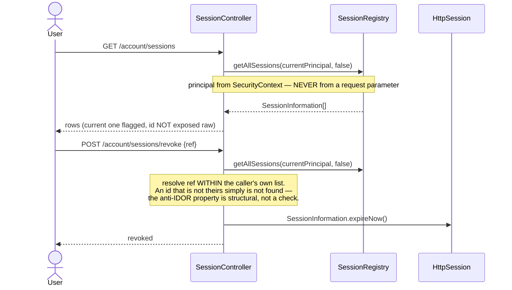

# Slice 107 — session policy: lift the cap, add visibility and revoke

**Status:** 🟡 **Part 1 (policy) BUILT — awaiting build + gate. Part 2 (active-sessions screen) DESIGNED, not started.**
Trigger: three education specs failing with `"This session has been expired…"` and a `302` where `200` was
expected. Root cause was not the specs — it was `maximumSessions(1)`.
Decision (user, 2026-08-07): **"follow what banks and Google do"** — allow multiple devices, control through
visibility and revocation rather than a cap.

---

## 1. Document

### What was wrong

```java
.sessionFixation(fixation -> fixation.none())
.maximumSessions(1)
```

**Two independent defects in four lines.**

**(a) A cap of one session per user.** Wrong for this product: the same account legitimately runs on a till,
a back-office PC and a phone. And *both* resolutions of the cap are bad —

| Mode | What happens | Why it is bad |
|---|---|---|
| `maxSessionsPreventsLogin(false)` *(Spring default)* | newest login wins, oldest expired | user silently kicked off another device mid-work |
| `maxSessionsPreventsLogin(true)` | new login refused | a **crashed browser locks the user out of their own account** until the stale session times out |

It also buys very little: an attacker holding valid credentials just logs in and boots the real user off.
A cap is not an access control — it is an inconvenience that lands on the legitimate user.

**(b) Session-fixation protection was disabled.** `sessionFixation.none()` means the session id is **not
rotated on login**, so an id planted in a victim's browser *before* they authenticate remains valid *after*.
This is the attack `changeSessionId` (the Spring default) exists to prevent. Plausibly it was switched off
while fighting the cap — collateral damage from (a).

### How it surfaced

Not as a security report — as **test noise that looked like application bugs**:

| Spec | Symptom | Actually |
|---|---|---|
| `dashboard.cy.js` | expected 200, got **302** | dead session redirected to `/login` |
| `exams.cy.js` | `JSON.parse` on `"This sessi…"` | body was `This session has been expired…` |
| `fees-to-gl.cy.js` | same `JSON.parse` failure | same |

`cy.session`'s cache is **per spec file**, so each education spec re-logged-in as the same account and the
concurrency control left one of the two sessions dead. The victim does not fail cleanly — it returns a
redirect or a plain-text sentence where JSON was expected, which is why this read as three unrelated bugs.

> **The lesson worth keeping:** a security policy that is wrong for the product does not announce itself as a
> security finding. It shows up as flaky tests in unrelated features. Three specs were nearly "fixed"
> individually before the common cause was found.

---

## 1b. Standards this slice is built to

- **Least surprise over least work** — the fix is the policy, not `try/catch` around every consumer.
- **[[feedback_design_patterns_standards]]** — the named pattern is **session registry + explicit
  revocation** (what Google's "Your devices" and bank "active sessions" screens implement), not a cap.
- **Anti-IDOR (multi-tenant standard)** — a revoke endpoint MUST only ever act on the caller's *own*
  sessions. Revoking by an id supplied by the client is precisely how one user terminates another's session.
- **[[feedback_cypress_gate_per_slice]]** — Part 2 ships with `active-sessions.cy.js`.

---

## 2. Part 1 — the policy (BUILT)

```java
.sessionManagement(session -> session
    .invalidSessionUrl("/invalidSession.html")
    .sessionFixation(fixation -> fixation.changeSessionId())   // was: none()  ← fixation protection restored
    .maximumSessions(-1)                                       // was: 1       ← unlimited
    .sessionRegistry(sessionRegistry())
)
```

### The trap that shaped this: `-1`, not deleting the block

The obvious edit is to delete `.maximumSessions(...)` entirely. **That would have silently broken the
"users online" badge.** `.maximumSessions(...).sessionRegistry(...)` is what installs
`RegisterSessionAuthenticationStrategy` — the thing that *populates* the registry. Drop the pair and
`SessionRegistry` stays empty: `UserService.getLoggedInUserCount()` would return 0 forever, and the future
active-sessions screen would have no data source.

`maximumSessions(-1)` means **unlimited**, so registration is preserved while the limit is lifted.

### A comment that became false

`UserService` justified counting principals with *"maximumSessions(1) means one session per user anyway"*.
That premise is now wrong. Counting principals is still **correct** — but for the opposite reason: with
several devices per user, counting *sessions* would inflate the badge. Comment rewritten; the behaviour is
unchanged.

Also deleted: a commented-out duplicate of the old capped block sitting directly below the live one. Two
session blocks — one capped, one not — leaves a reader no way to tell which is intended.

### Test-side companion (already landed)

`cy.session(..., { cacheAcrossSpecs: true })` keeps one server session per account for a whole run instead of
one per spec file. **Verified**: the four previously-failing education specs now run green together —
25 tests, 0 failures, zero session errors. Worth keeping even after the cap is gone: fewer logins is simply
faster and less stateful.

---

## 3. Part 2 — active sessions + revoke (DESIGNED, not built)

This is the half that makes it the banks/Google model. Without it, lifting the cap is just *no policy*.

### What the user sees

**Account → Active sessions**, one row per live session:

| Device | Where | Signed in | Last seen | |
|---|---|---|---|---|
| Chrome on Windows | 203.0.113.4 | 2 hours ago | just now — **this device** | |
| Safari on iPhone | 198.51.100.9 | yesterday | 3 hours ago | **Sign out** |

Plus **Sign out everywhere else** — the single button people actually reach for after "was that me?".

### Design



**Anti-IDOR is the whole design.** The revoke endpoint never looks a session up globally. It enumerates the
*caller's* sessions and matches within that list, so another tenant's id cannot resolve — the guarantee comes
from the lookup's shape rather than from a check someone can forget. `SessionRegistry.getAllPrincipals()` is
global and must never be reachable from this path.

### Data available today

`SessionInformation` gives `sessionId`, `lastRequest`, `principal`, `expired`. It does **not** carry IP or
user-agent — those must be captured at authentication and stored alongside. Options:

| Approach | Verdict |
|---|---|
| Capture in an `AuthenticationSuccessHandler`, keep a `Map<sessionId, {ip, ua, loginAt}>` | Simple, no schema. Lost on restart — acceptable, since sessions are lost on restart too |
| New `user_session` table | Survives restart, but duplicates state the container already owns and needs its own reaping |

**Recommended: the in-memory map**, sharing the registry's lifecycle. Session metadata that outlives the
session is not useful, and a table that can drift out of sync with the registry is worse than no table.
`MySimpleUrlAuthenticationSuccessHandler` already exists and is the natural capture point.

### Sub-slices

| # | Scope | Gate |
|---|---|---|
| **107a** | `GET /account/sessions` — list the caller's own, current one flagged | `active-sessions.cy.js` |
| **107b** | `POST /account/sessions/revoke` + "sign out everywhere else" | same |
| **107c** | Screen + i18n × 6 bundles | same |

Gate must pin: a user sees **only their own** sessions · revoking one leaves the others alive · a **second
tenant's session id does not resolve** (the anti-IDOR case) · revoking the current session logs *this*
browser out · the count matches the live-users badge's principal count.

---

## 4. Open questions

1. **Is a cap wanted for LICENSING?** If "one seat = one device" is commercial, that belongs in per-org seat
   counting, not `maximumSessions` — a security primitive enforcing a billing rule fails in ways neither
   side expects. Nothing here assumes a cap; say the word and it becomes its own slice.
2. **Idle timeout** is untouched by this slice. Lifting the cap makes it more relevant: sessions now
   accumulate per user rather than being displaced. Worth confirming `server.servlet.session.timeout`.
3. **Does the JWT need the same treatment?** Session revocation ends the *monolith* session; the
   auth-service token is revoked by `revokeTokenLogoutHandler` on logout. Revoke-from-another-device must go
   through the same handler or the JWT outlives the session it belonged to.

## 5. What this slice does NOT do

- It does not add an idle timeout, device fingerprinting, or "new sign-in" email alerts. Each is a separate
  decision; this slice only removes a harmful cap and restores fixation protection.
- Part 1 changes **no behaviour a correct user would notice**, other than being able to sign in twice.
