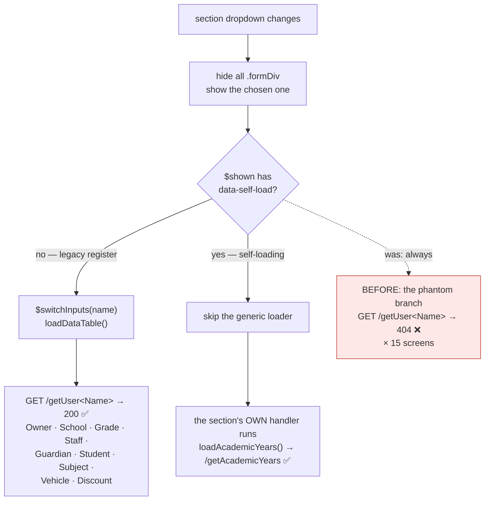

# Slice 108 — the phantom `getUser<Section>` call on self-loading screens

**Status:** 🔵 **DESIGN — written before the fix, as requested.**
Reported: `getUserAcademicYear?_=…`, `getUserExam?_=…`, `getUserMarks?_=…` all returning **404**.
Related: [107](107-session-policy-and-active-sessions.md) removed the *consequence* (a 404 logged the user
out). This removes the *cause*.

---

## 1. Document

### The domain rule that was encoded, and then outgrown

The dashboards were built around a **naming convention**: every registration screen is a `<Name>Div`
holding a `#table<Name>` grid, fed by `GET /getUser<Name>`. One generic handler in `main.js` therefore
serves every screen:

```js
$('.dropdown').change(function () {
    $('.formDiv').hide();
    var $shown = $('#' + $(this).val()).show();
    var tab = ($(this).val()).replace("Div", "");     // "AcademicYearDiv" -> "AcademicYear"
    if (tab) {
        $switchInputs(capitalize(tab));               // getAll = "AcademicYear"
        loadDataTable();                              // GET /getUser + getAll
    }
});
```

That is a **Convention over Configuration** design, and for the original CRUD registers it is exactly
right — Owner, School, Grade, Staff, Guardian, Student, Subject, Vehicle and Discount all still answer
`/getUser<Name>` with **200**, and all still depend on this handler to populate their grid. Nothing about
the convention is wrong for the screens it was written for.

### What changed underneath it

The education **Phase 1 and Phase 2** slices introduced a different *kind* of screen. Academic Year is not
a flat register: it is a year with nested terms, a pinned-current rule and a picker to keep in sync.
Marks Entry is a roster keyed by exam and paper. Timetable is a grid. None of these is one table fed by one
list endpoint, so each shipped **its own loader**, hooked to the same event:

```js
$(document).on('change', '#registrationType', function () {
    if (this.value === 'AcademicYearDiv') loadAcademicYears();   // -> GET /getAcademicYears  ✅ 200
});
```

That was the right call — and deliberately **no `/getUser<Name>` endpoint was created**, because none is
needed. But the generic handler still fires for these sections, so every one of them makes a second,
pointless request to an endpoint that has never existed.

**The convention became an assumption.** It is not enforced anywhere: nothing fails at build time, no test
covers it, and until slice 107 the 404 was swallowed by an error handler that redirected to `/login`. The
symptom presented as *"clicking Academic Year logs me out"* — an auth bug, in the wrong part of the system
entirely.

### Scope — measured, not assumed

**Every self-loading education section 404s. All 15:**

| Section | Phantom call | Section | Phantom call |
|---|---|---|---|
| `AcademicYearDiv` | `/getUserAcademicYear` | `PortalAccessDiv` | `/getUserPortalAccess` |
| `ExamDiv` | `/getUserExam` | `PromotionDiv` | `/getUserPromotion` |
| `MarksDiv` | `/getUserMarks` | `ReportCardDiv` | `/getUserReportCard` |
| `GradingDiv` | `/getUserGrading` | `StaffRegisterDiv` | `/getUserStaffRegister` |
| `BehaviourDiv` | `/getUserBehaviour` | `SubstitutionDiv` | `/getUserSubstitution` |
| `HomeworkDiv` | `/getUserHomework` | `TimetableDiv` | `/getUserTimetable` |
| `LeaveDiv` | `/getUserLeave` | `MeetingsDiv` | `/getUserMeetings` |
| `NoticesDiv` | `/getUserNotices` | | |

**Not affected, and why it matters that we checked:**

- **The 9 legacy education registers** answer 200 and *must keep* calling `loadDataTable()`. Any fix that
  disables the generic handler broadly would blank those grids — this is the real risk in this slice.
- **Other modules are clean.** Welfare and agriculture have no self-loading sections. Business has one
  (`CustomerDiv` → `loadAccountGroups()`), but that is a *legacy* section with a working
  `/getUserCustomer`; the extra loader runs *alongside* a functioning grid, not instead of it. Newer
  business screens (Price Rules, Quotes, Stores, Configuration) are opened by `showX()` functions that
  never touch the dropdown, so they never trigger the phantom call. **This is education-only.**

### Why fix it now that it is harmless

Slice 107 made the 404 non-fatal — it no longer ends the session. It is still worth removing:

1. **It shows the user an error.** `handleAjaxFailure` now surfaces *"loadDataTable: Not Found (404)"* on
   screens that are working perfectly. A visible error on a healthy screen trains people to ignore errors.
2. **It is a wasted round trip** on every one of 15 screens, every time they are opened.
3. **It pollutes diagnostics.** A permanent 404 in the network tab and access log is noise that the next
   person has to rule out — as we just did, at length.

---

## 1b. Standards this slice is built to

- **[[feedback_design_patterns_standards]]** — the named pattern is **Convention over Configuration with an
  explicit opt-out**. The convention stays (it is correct and carries 9 screens); screens that do not fit it
  say so declaratively.
- **Locality of behaviour** — the opt-out is declared **on the section itself**, not in a registry in
  another file. A new screen opts out where it is defined. This is the whole point: a distant list is
  something to forget, and forgetting is precisely how this drifted.
- **[[feedback_no_duplicate_functions_dry]]** — one change in `main.js`, not a per-module fork of the handler.
- **Do not break what works** — the 9 legacy registers must be untouched. The gate pins this explicitly.

---

## 2. Design

### The mechanism

```html
<!-- educationDashboard.html -->
<div id="AcademicYearDiv" class="formDiv" data-self-load="true" …>
```

```js
// main.js
if (tab && !$shown.data('selfLoad')) {
    $switchInputs(capitalize(tab));
    loadDataTable();
}
```

`$shown` is already in hand on line 618 — no extra lookup.

### Why a data attribute, not the alternatives

| Option | Verdict |
|---|---|
| Registry array in `main.js` | Rejected. A list in a distant file that every new screen must be added to — the same class of coupling that produced this bug |
| Probe for `#table<Name>` before loading | Rejected. `AcademicYearDiv` **does** contain a `#tableAcademicYear`; the element exists, the *endpoint* does not. It cannot discriminate |
| Try the call, ignore a 404 | Rejected. Keeps the wasted request and normalises 404s as expected traffic |
| **`data-self-load` on the div** ✅ | The screen declares its own contract, next to its markup. Nothing to keep in sync |

### Flow



### `$switchInputs` — the subtlety that decides whether this is safe

Skipping the branch also skips `$switchInputs`, which sets the globals `tableV` / `getAll` / `buttonV` /
`deleteV` and calls `resetForm()`. **This is intended**: those globals exist to drive the generic
CRUD/DataTable machinery, and a self-loading screen does not use it. Leaving them pointing at the previously
selected register is exactly what the old code did on every non-matching screen anyway.

**But it must be verified, not assumed.** The risk is the *reverse* transition: open a self-loading screen,
then a legacy one — the legacy one calls `$switchInputs` itself, so it re-points the globals. The gate pins
this ordering explicitly (test 3), because a stale `tableV` would send the next screen's row-click handler
to the wrong table.

---

## 3. Implement

1. `data-self-load="true"` on the 15 section divs in `educationDashboard.html`.
2. One guard in `main.js` (line ~623).
3. No server change. No schema change. No new endpoint — the point is that these screens correctly need none.

## 4. Test — `cypress/e2e/education/section-load.cy.js`

| # | Pins |
|---|---|
| 1 | Opening Academic Year fires **no** `/getUser*` request (`cy.intercept` + assert not called) |
| 2 | …and the screen still populates — its own `/getAcademicYears` is called and the table renders |
| 3 | **Legacy still works**: Academic Year → then Owner → `/getUserOwner` IS called and the grid fills (the `$switchInputs` ordering risk) |
| 4 | Exam and Marks behave as Academic Year (the other two reported) |
| 5 | No error toast/banner appears on any of the 15 |

Test 3 is the one that would catch this fix being wrong.

## 5. Open question

The 9 legacy registers still rely on an **implicit** naming convention with nothing enforcing it. A tenth
register added tomorrow with a mismatched endpoint name fails the same silent way. Worth a follow-up guard
test that walks every non-`data-self-load` section and asserts its `/getUser<Name>` answers 200 — cheap, and
it would have caught this class of bug at the point it was introduced. Not in this slice; recorded here so
the decision is deliberate.
