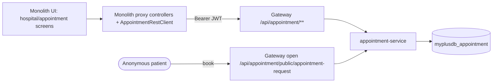
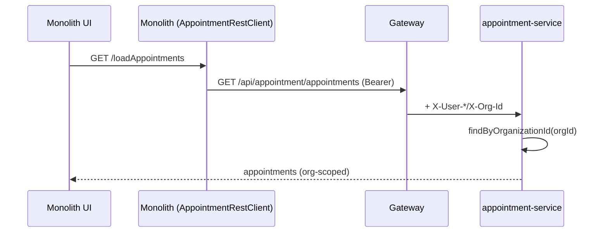

# Slice 17 — appointment-service (P3 of myplusdb removal)

**Status: ✅ DONE.** appointment-service built (P3a) + enriched to legacy booking (P3b-1); monolith
cut over to proxies and the old hospital/appointment JPA deleted (P3b). Geo = static client-side
(Decision G). Commits: `f2f0371` (P3a), `6d5f057` (P3b-1), `6c11bc0` (P3b).
Branch: `feature/monolith-myplusdb-removal`. Umbrella: `docs/monolith-myplusdb-removal.md`.

## 1. Document — what & why

Migrate the monolith's hospital/appointment domain (the last big `myplusdb` chunk) into a new
**`appointment-service`** microservice, org-scoped + JWT like the other domain services. The monolith
keeps the UI and proxies through the gateway. This removes `Hospital/Doctor/Appointment/Patient` from
`myplusdb` and unblocks P4 (drop the `User` residual that `AppointmentDashboardController` reads) and
P5 (kill the monolith datasource).

## 2. Design

### Data model (→ `myplusdb_appointment`, org-scoped)
Port the monolith entities, add `organization_id` (multi-tenant standard) and replace the legacy
`user_id`/`geo_id` BigInteger columns with clean fields. Hibernate `Long` ids.

```mermaid
erDiagram
    HOSPITAL ||--o{ DOCTOR : has
    HOSPITAL ||--o{ APPOINTMENT : has
    DOCTOR   ||--o{ APPOINTMENT : for
    PATIENT  ||--o{ APPOINTMENT : books
    HOSPITAL { long id PK; long organization_id; string name; string email; string phone; string logo_url; string country; string state; string city }
    DOCTOR   { long id PK; long organization_id; long hospital_id FK; string name; string speciality; string fee }
    PATIENT  { long id PK; long organization_id; string name; string phone; string email }
    APPOINTMENT { long id PK; long organization_id; long hospital_id FK; long doctor_id FK; long patient_id FK; string appointment_type; string fee; string date_time; int patients_to_visit; int patients_appointed; int patients_visited }
```
- **Org-scoping:** every entity carries `organization_id`; reads use `findByOrganizationId...` (the
  `AuthenticatedUser.organizationId` from the `X-Org-Id` header, per `ARCHITECTURE-MULTITENANCY.md`).
- **Geo:** country/state/city become **flat string fields** on Hospital (the monolith's geo lookups
  were dropdown helpers). Country/state/city option lists move to **static client-side data** in the
  UI — no `GeoLocation` table. (Decision G — confirm, vs a small reference table.)

### Endpoints (gateway `/api/appointment/**`, full paths, no StripPrefix — like campaign)
| Monolith route (today) | appointment-service |
|------------------------|---------------------|
| `/registerHospital`, hospital CRUD | `POST/GET/DELETE /api/appointment/hospitals` |
| `/registerDoctor`, `/loadDoctorsByHospital`, `/loadDoctorDetails` | `/api/appointment/doctors` (+ `?hospitalId=`) |
| `/appointmentReq` (book), `/loadAppointments` | `/api/appointment/appointments` |
| patients | `/api/appointment/patients` |
| `/appointmentReq` **public** booking (anonymous) | `/api/appointment/public/appointment-request` (open route, like demo) |

All org-scoped (JWT) **except** the public booking request, which is anonymous (gateway open route +
`permitAll`) — patients book without logging in.

### Service responsibilities
Standard slice: controller → service (ModelMapper DTO↔entity, org stamping) → repo. `GlobalExceptionHandler`,
`ApiResponse` envelope, Flyway `V1__baseline.sql` (fresh schema, no baseline-on-migrate needed — new DB).

### Monolith side
- New `AppointmentRestClient` (facade over `GatewayClient`, prefix `/api/appointment`) — like
  `EducationRestClient`.
- `HospitalController`/`DoctorController`/`AppointmentController`/`AppointmentDashboardController`
  become **thin proxies** (no JPA). `AppointmentDashboardController` stops reading `User` directly
  (uses the principal/JWT) → unblocks P4.
- Delete monolith `Hospital/Doctor/Appointment/Patient` entities + repos + `Hospital/Doctor/Appointment`
  services. Keep the Thymeleaf templates (UI).

### Infra
- `variables.tf` services map + `ecs.tf` DB-name map: `appointment-service` → `myplusdb_appointment`.
- Gateway route `/api/appointment/**` (JwtAuthenticationFilter, **no** StripPrefix) + open
  `/api/appointment/public/`.
- `docker-compose.yml`: add `appointment-service` (build, expose 8091, DB, eureka/config, INTERNAL_SECRET).
- service port 8091 (next free).

## 3. Architecture & UML





## 4. Implement — checklist
- [ ] Scaffold `appointment-service` (pom from service-parent, app class, security, config-server yml)
- [ ] Entities + repos (org-scoped) + DTOs + ModelMapper
- [ ] Services (org stamping) + controllers (hospital/doctor/appointment/patient + public booking)
- [ ] Flyway `V1__baseline.sql`; `application.yml` (DB myplusdb_appointment, flyway, mail if booking emails)
- [ ] Gateway: route `/api/appointment/**` (no StripPrefix) + open `/api/appointment/public/`
- [ ] Terraform: services map + DB-name map + ECR repo (for-each covers it)
- [ ] docker-compose: appointment-service entry (+ mem_limit/JAVA_TOOL_OPTIONS)
- [ ] Monolith: `AppointmentRestClient`; proxy the 4 controllers; delete the 4 entities/repos/services;
      `AppointmentDashboardController` off `User`
- [ ] Both compile

## 5. Test
- appointment-service boots + Flyway creates `myplusdb_appointment`; org-scoped CRUD via gateway.
- Monolith hospital/appointment screens work through the proxy (data from the service, not `myplusdb`).
- Public booking works anonymously.
- Cypress: a new `appointment.cy.js` (register hospital → doctor → book → dashboard), headed.
- Regression: existing specs green; monolith no longer queries `myplusdb` for these.

## Decisions at the gate
- **Decision G — Geo:** static client-side country/state/city lists (recommended, simplest) vs a small
  reference table in appointment-service.
- **Org model:** hospitals/doctors/appointments scoped to the logged-in org (a clinic = an org). Public
  patient booking targets a specific hospital id (no org context) — confirm that's the intended flow.
