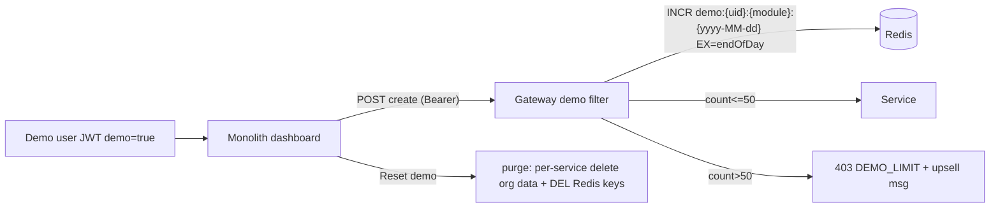

# Slice 19 — Demo accounts + 50-entry quota (free-trial gate)

**Status: ✅ DONE & VERIFIED (2026-06-12).** SaaS free-trial gate ([[feedback-saas-standards]]).
Memory: [[project-demo-quota]]. Commits a7aa140 (A/B) · bc125ee (demo-credentials UI) · be6e143 (banner/upsell)
· bc7e08c (login offering + DemoModelAdvice) · 918dfa5 (creds reveal) · 3582816 (10 demo users + safe landing)
· ab5ec79 (DEMO_ROLE privileges) · d9d15b9 (header-in-body fix) · 4d81c91 (landing demo section)
· a4896a9/a3e8684 (navbar user/logout + session page) · 44aa5cf/c6b14e9/b857ffd (Reset demo + purge).

## Built (final shape)
- **auth-service**: `User.demo`→JWT `demo` claim + `DEMO_PRIVILEGE`; 10 per-microservice demo accounts
  `demo.<domain>@myplus.com` / `Demo@2025!` on a super-privileged `DEMO_ROLE` (so privilege-gated
  dashboards work), self-healing in SetupDataLoader (dev seed flag).
- **gateway**: `JwtAuthenticationFilter` Redis counter `demo:{uid}:{module}:{date}` (TTL→midnight),
  >50 POST/module → `403 {code:DEMO_LIMIT}`; reads-via-POST + non-demo bypass; fail-open.
  `DemoResetController POST /demo/reset` clears a demo user's counters.
- **monolith**: demo banner (`sec:authorize('DEMO_PRIVILEGE')`) + "Reset demo" + Register CTA; navbar
  user chip + Logout; `GatewayClient`→`DemoLimitException`→`DemoLimitAdvice` surfaces the upsell modal
  (`js/demo.js`); login + landing self-serve demo (pick module → show creds → launch → /login prefill).
  `POST /demo/reset` clears counters and (demo principal only) calls the module purge.
- **purge (Reset demo deletes data)**: appointment-service `DELETE /api/appointment/demo/purge` deletes
  the caller's org data, **`@PreAuthorize("hasAuthority('DEMO_PRIVILEGE')")`** (real tenants → 403) +
  monolith routes it only for demo principals (`PURGE_PATHS` by userType). **Only appointment wired**;
  other demo modules reset the counter only — add their `…/demo/purge` endpoint + a `PURGE_PATHS` line.

## Verified
- API: 50 creates pass, 51st → DEMO_LIMIT + message; TTL→midnight; non-demo bypass; purge **50→0**;
  non-demo purge **blocked (403)**.
- Cypress (headed, all green): `demo.cy.js` (login reveal + banner + upsell), `demo-reset.cy.js`
  (Reset demo → purge + table empty), plus account/appointment regression (8/8).

----
### Original design below
**Status (original): DESIGN — decisions made.**

## 1. What & why
A **demo user per module** (business/education/welfare/agriculture/appointment) can create up to **50
entries per module**; the 51st create is blocked with an upsell: *"Register at maxtheservice.com to use
the full features."* The count **auto-resets daily** and a **"Reset demo"** button purges the demo
user's entries + counter on demand.

## 2. Decisions (made)
- **Enforcement:** API-gateway write-counter (counts create POSTs per demo-user+module). One place,
  covers all services.
- **Counting:** creates only (POST), **50 per module** (independent per module).
- **Reset:** daily auto-reset (time-windowed counter) **+** on-demand "Reset demo" button.
- **Store:** **Redis** (TTL keys; distributed, survives gateway restarts).

## 3. Architecture

### Demo identity
- auth-service `User.demo` (new bool col, ddl-auto) → JWT claim `demo`. Seeded demo users per module
  (`demo.<module>@myplus.com` / `Demo@2025!`, `userType=<MODULE>`, `demo=true`) via SetupDataLoader
  (self-healing, dev seed flag). userType routes each to its own dashboard (already generic).

### Gateway counter (Redis, reactive)
- key `demo:{userId}:{module}:{yyyy-MM-dd}`; `INCR` + set TTL to end-of-day on first hit.
- module = 2nd path segment (`/api/<module>/...`). Count **POST** only; skip reads via a small denylist
  (`/get`, `/load`, `/list`, `/search`, `/report`, `/find`). If post-increment value > 50 → short-circuit
  403 JSON `{success:false,code:"DEMO_LIMIT",message:"You've reached the 50-entry demo limit. Register at
  maxtheservice.com to unlock the full features."}`.
- Non-demo users bypass entirely.

### Reset ("Reset demo")
- Monolith `POST /demo/reset` → for the logged-in demo user: call each module service's
  `DELETE /api/<module>/demo/purge` (org-scoped truncate of the caller's org) + gateway
  `POST /internal/demo/reset` (DEL the Redis day-keys for that user). Demo data isolated in the user's
  auto-created primary org, so purge = delete all rows for that org.

### UI
- Dashboards surface a `DEMO_LIMIT` 403 (the proxy relays `code/message`); show the upsell + a
  "Register" CTA to maxtheservice.com. A demo banner + "Reset demo" button on each dashboard.

## 4. Phases
- **A. Infra + gateway:** Redis (docker-compose + gateway `data-redis-reactive` + config) + the demo
  counter filter (enforce + daily TTL).
- **B. auth-service:** `demo` claim + per-module demo users (self-healing).
- **C. Reset:** per-service `DELETE /api/<module>/demo/purge`; gateway reset endpoint; monolith
  `/demo/reset` + dashboard button.
- **D. UI:** relay `DEMO_LIMIT` + upsell CTA + demo banner.

## 5. Test
- Cypress/API: as a demo user, 50 creates pass, 51st → 403 DEMO_LIMIT + message; "Reset demo" clears →
  creates allowed again; next-day key resets (simulate by deleting the key). Non-demo unaffected.
