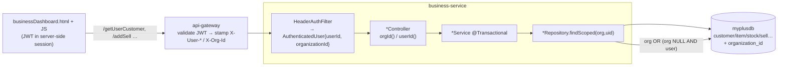
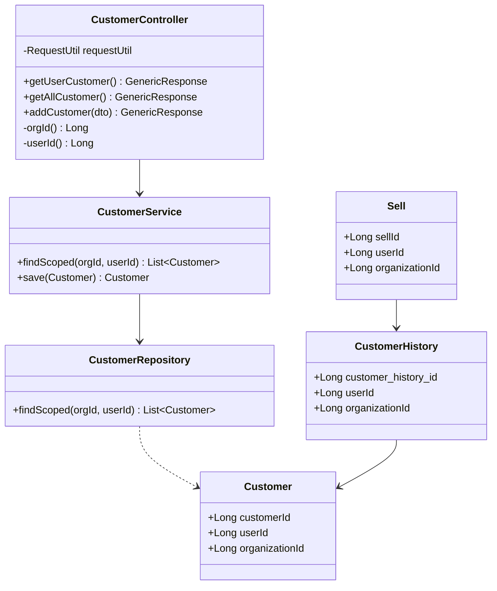
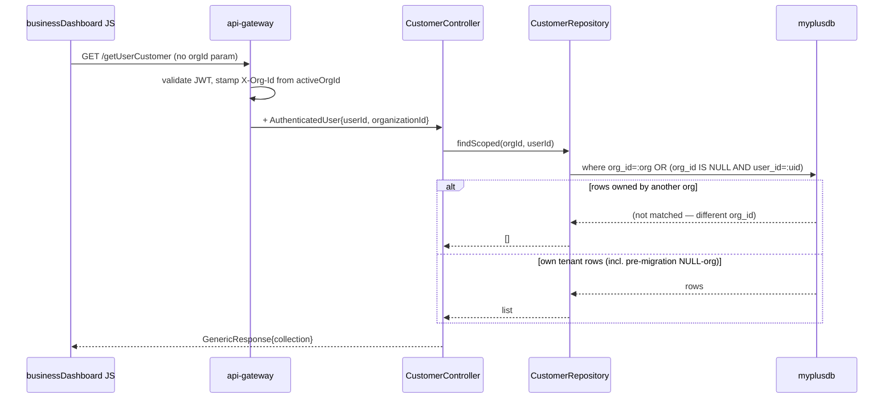

# Slice 21 — Business-service org-scoping (multi-tenant)

Status: **IN PROGRESS** 🔨 — Customer→CustomerHistory→Sell DONE+VERIFIED (85/85); Item/ItemType/
ItemUnit/Stock DONE+VERIFIED (102/102). Purchase/Vender/Company implemented (awaiting build + Cypress).
Migration #2 (drop old global `name` unique on item_type) DONE 2026-06-13. **All 10 domains now coded** —
this completes slice 21 once Purchase/Vender/Company verify; then slice 22 (invoice numbering). Follows
[`../ARCHITECTURE-MULTITENANCY.md`](../ARCHITECTURE-MULTITENANCY.md) and the 9 education registration
slices (01–09). Prerequisite for **slice 22 — sell invoice numbering**.

## Document — what & why

business-service is still **`userId`-scoped only**: reads filter by `user_id` (Spring Data
Query-By-Example), and every `getAll*` endpoint calls bare `findAll()` — a **cross-tenant data leak**
(any logged-in user can read every other tenant's customers/items/sales). It carries **no
`organization_id`** on any entity.

This slice brings business-service to the same multi-tenant standard education already meets, so that:
- a business owner + their staff (different `userId`s, same `organizationId`) **share one company's
  data** — which `userId`-only scoping cannot express;
- `getAll*` stops leaking across tenants;
- **invoice numbering (slice 22) can be a per-organization series** — the correct model for a POS
  product (one invoice book per business, not one per cashier). Doing this first avoids issuing
  user-scoped invoice numbers we'd later have to renumber.

## Design

### Data model — entities gaining `organization_id`

| Entity | Table | Role | Org-scope? |
|--------|-------|------|------------|
| `Customer` | `customer` | master | ✅ |
| `CustomerHistory` | `customer_history` | **sale header** (invoice lives here in slice 22) | ✅ |
| `Sell` | `sell` | sale line items | ✅ |
| `Item` | `item` | catalog | ✅ |
| `ItemType` | `item_type` | lookup | ✅ |
| `ItemUnit` | `item_unit` | lookup | ✅ |
| `Stock` | `stock` | inventory | ✅ |
| `Purchase` | `purchase` | procurement | ✅ |
| `Vender` | `vender` | suppliers | ✅ |
| `Company` | `company` | business profile | ✅ |
| `Stock_back` | — | backup/dead table | ⛔ verify-then-skip |

Each gains:
```java
@Column(name = "organization_id")
private Long organizationId;          // tenant scope (from gateway X-Org-Id)
// existing user_id retained as AUDIT (who created it)
```
No global unique constraints exist on these tables → **no destructive migration** (same as slices
01–09). `ddl-auto: update` adds the nullable column.

### Migration (no cross-service DB coupling)
Per the standard §6: new writes always stamp `organization_id`; reads use a **scoped query with
NULL-fallback** so the owner keeps seeing pre-migration rows, and the NULL set drains as rows are
re-saved:
```java
@Query("select c from Customer c where c.organizationId = :orgId "
     + "or (c.organizationId is null and c.userId = :userId)")
List<Customer> findScoped(Long orgId, Long userId);
```
One `findScoped` (plus any scoped lookups a domain needs, e.g. by-item for Stock) per repository,
**replacing** both the Example-by-`userId` reads and the `findAll()` used by `getAll*`.

### Controller change (mirror education)
Each controller gets the two helpers and routes every read through them:
```java
private Long userId() { AuthenticatedUser u = requestUtil.getCurrentUser(); return u==null?null:u.getUserId(); }
private Long orgId()  { AuthenticatedUser u = requestUtil.getCurrentUser(); return u==null?null:u.getOrganizationId(); }
```
- reads (`/getUser*`, option-list `/getUser*s`) → `findScoped(orgId(), userId())`
- `getAll*` → **was** `findAll()` (leak) → `findScoped(orgId(), userId())`
- writes (`/add*`) → stamp `organizationId` (tenant) **and** `userId` (audit); dup-checks scoped within tenant
- `addSell` keeps the slice-4c4d428 `@Transactional` atomicity; it stamps org on the Customer +
  CustomerHistory + Sell rows it writes

### Endpoint scope-change matrix (contract unchanged for the monolith — same paths, same `GenericResponse`)

| Domain | Reads → `findScoped` | `getAll*` leak fixed | write stamps org |
|--------|----------------------|----------------------|------------------|
| Customer | `/getUserCustomer`, `/getUserCustomers` | `/getAllCustomer` | `/addCustomer` |
| Item | `/getUserItem`, `/getUserItems`, `/getItem` | `/getAllItem` | `/addItem` |
| ItemType | `/getUserItemType(s)` | `/getAllItemType` | `/addItemType` |
| ItemUnit | `/getUserItemUnit(s)` | `/getAllItemUnit` | `/addItemUnit` |
| Stock | `/getUserStock(s)`, `/getStock`, `/getBatchesByItem`, `/getStockByBatch` | `/getAllStock` | `/addStock` |
| Purchase | `/getUserPurchase` | `/getAllPurchase` | `/addPurchase` |
| Vender | `/getUserVender(s)` | `/getAllVender` | `/addVender` |
| Company | `/getUserCompany`, `/getUserCompanies` | `/getAllCompany` | `/addCompany` |
| Sell | `/getUserSell`, `/loadSR`, `/saleReturn`, `/revertSell` | `/getAllSell` | `/addSell`, `/addSelling` |

`delete*` stay by-id but should additionally **verify the row belongs to the active org** before
deleting (defense-in-depth against IDOR on delete).

### Security / anti-abuse
- Tenant id is **never** taken from the client — always `orgId()` derived from the token-stamped
  `X-Org-Id` header (standard §3). Closes the IDOR/cross-tenant read that `getAll*` currently has.
- `delete*` re-checks org ownership.
- `user_id` retained purely as audit ("who created/sold").

### UI contract
No monolith UI change — endpoint paths and `GenericResponse` shape are unchanged. The dashboards
(`businessDashboard.html` + business JS) keep calling the same flat endpoints. (Invoice-number
display is slice 22.)

## Architecture & UML

### Architecture (flowchart)


### Class diagram (representative: Customer + Sell path)


### Sequence diagram (read with NULL-fallback + cross-tenant denial)


## Implement (checklist — per domain, finish one before the next; sell path first)
- [x] **Customer**: entity `organizationId`; `CustomerRepo.findScoped`; `getUserCustomer(s)` + `getAllCustomer` scoped; `addCustomer` stamps org + tenant-scoped dup-check; `saveUpdateCustomer` stamps org; `deleteCustomer` org-check (anti-IDOR)
- [x] **CustomerHistory**: entity `organizationId`; stamped in `saveUpdateCustomerHistory` (within `addSell` @Transactional)
- [x] **Sell**: entity `organizationId`; `SellRepo.findScoped` (+ date queries made org-aware); `getUserSell`/`getAllSell`/`loadSR` scoped; `addSell` (via `SellService.addSell`) + `addSelling` + `revertSell` stamp org; `deleteSell` + `saleReturn` org-check; `BusinessDashboardController` sell figures org-scoped
- [x] **Item**: entity org column; `ItemRepo.findScoped`; `getUserItem(s)` + `getAllItem` scoped; `getItem` anti-IDOR; `addItem` scoped dup-check + stamps org; `deleteItem` org-check
- [x] **ItemType**: entity org column + per-tenant `unique(organization_id, name)` (old global `name` unique → migration #2); `findScoped`; reads + `getAllItemType` scoped; `addItemType` scoped dup + stamps org; `deleteItemType` org-check
- [x] **ItemUnit**: entity org column + per-tenant `unique(organization_id, name)` (old global `name` unique, incl. column-level, dropped → migration #2); `findScoped`; reads + `getAllItemUnit` scoped; `addItemUnit` scoped dup + stamps org; `deleteItemUnit` org-check
- [x] **Stock**: entity org column; `StockRepo.getItemBatchScoped`/`findByBatchScoped`; StockController item-list endpoints (`getUserStock(s)`/`getAllStock`/`addStock`/`deleteStock`, which operate on Item) scoped via `itemService.findScoped` + org-check; `getStock`/`getStockByBatch`/`getBatchesByItem` tenant-scoped; `StockService.updateStock` (purchase + sell paths) stamps org
- [x] **Purchase**: entity org column; `PurchaseRepo.findScoped`; `getUserPurchase`/`getAllPurchase` scoped; `PurchaseService.addPurchase` stamps org; `deletePurchase` org-check
- [x] **Vender**: entity org column; `VenderRepo.findScoped`; reads + `getAllVender` scoped; `addVender` scoped dup + stamps org; `deleteVender` org-check
- [x] **Company**: entity org column; `CompanyRepo.findScoped` (inherited by `ICompanyService`); reads + `getAllCompany` scoped; `addCompany` scoped dup + stamps org; `deleteCompany` org-check
- [ ] verify `Stock_back` is dead; skip or remove (deferred — appears unused)
- [ ] business-service compiles & boots (Hibernate adds `organization_id` columns) — **awaiting build**

## Test
**Cases**
- Happy: owner adds customer/item/stock/sell → rows persisted with `organization_id = activeOrg`,
  `user_id = actor`; reads return them.
- Tenant isolation: a second org's user calls `getAllCustomer`/`getUserSell` → does **not** see org-1 rows.
- Shared tenant: a staff user in the same org sees the owner's rows (different `userId`, same org).
- Migration fallback: a pre-existing NULL-org row stays visible to its original creator, and gets
  `organization_id` stamped on its next save.
- Delete: deleting another org's row by id is rejected (org-check).

**Cypress (headed, Chrome)** — existing specs must stay green, then add isolation assertions:
- `cypress/e2e/business/customer.cy.js`, `item.cy.js`, `itemtype.cy.js`, `itemunit.cy.js`,
  `stock.cy.js`, `purchase.cy.js`, `vender.cy.js`, `company.cy.js`, `sell.cy.js`, `flow.cy.js`,
  `negative.cy.js`
- new tenant-isolation spec asserting `getAll*` no longer leaks across orgs.

---
### Follow-on — Slice 22: sell invoice numbering (org-scoped)
Once the above lands: add `invoice_no` (String) + `invoice_seq` (Long) to `CustomerHistory`, unique
`(organization_id, invoice_seq)`, allocate `MAX(seq)+1` **per organization** inside the existing
`addSell` `@Transactional`, retry-once on unique violation, format `INV-{org}-{000123}` (final format
TBD with user), and return the number in the `addSell` response for the receipt/UI.
