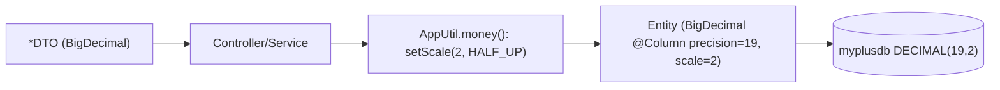

# Slice 23 — BigDecimal money migration (business-service)

Status: **DONE + VERIFIED** ✅ (2026-06-13). Tech-debt tracker item #1 (🔴). Build ✓, migration #3 ✓,
headed Cypress sell/flow/purchase/stock 85/85 ✓ (incl. slice-22 invoice + slice-21 Purchase, no
regression). Cleanup noted: `stock` has legacy orphan money columns (`bpurchase_rate`/`bsell_rate`
decimal(38,2), `batch_purchase_discount`/`batch_sale_discount` float) unused by the current entity.

## Document — what & why
All monetary values in business-service are stored and computed as `Float`/`Double`
(`Sell.sellRate/discount/totalAmount/netAmount/srp`, `Purchase.totalAmount/netAmount`,
`CustomerHistory.paidAmount/dueAmount`, `Customer.dueAmount`, `Stock.bpurchaseRate/bsellRate/
bsellDiscount/bpurchaseDiscount`). Binary floating point cannot represent decimal currency exactly →
rounding drift accumulates across cart totals, due balances, sale-return math, and reports. For a
POS/finance product this is a correctness defect. Migrate money to **`BigDecimal`** with a fixed scale
and an explicit rounding mode.

Quantities (`Sell.quantity`, `Stock.stock`) are **out of scope** for this slice (kept as `Float`) to
bound the blast radius; they can become `BigDecimal(scale=3)` in a follow-up. Where money = rate ×
quantity, the `Float` quantity is converted to `BigDecimal` at the multiplication site.

## Design

### Money type contract
- Type: `java.math.BigDecimal`, JPA `@Column(precision = 19, scale = 2)`.
- Rounding: `RoundingMode.HALF_UP`, scale 2, applied after each multiply/divide via a helper
  `AppUtil.money(BigDecimal)` → `v.setScale(2, HALF_UP)`.
- Null handling: keep nullable; use `BigDecimal.ZERO` as the additive identity in accumulations.

### Fields to convert (business-service entities)
| Entity | Fields |
|--------|--------|
| `Sell` | sellRate, discount, totalAmount, netAmount, srp |
| `Purchase` | totalAmount, netAmount (+ any rate fields in use) |
| `CustomerHistory` | paidAmount, dueAmount |
| `Customer` | dueAmount |
| `Stock` | bpurchaseRate, bsellRate, bsellDiscount, bpurchaseDiscount (money), **not** `stock` (qty) |

Matching DTO fields (`SellDTO`, `PurchaseDTO`, `StockDTO`, `CustomerDTO`, `CustomerHistoryDTO`) change
to `BigDecimal` too, so ModelMapper maps cleanly and JSON stays numeric.

### Arithmetic sites to rewrite (Float → BigDecimal)
- `SellService.addSell` / `createReport` — totals, discount %, net = total − discount.
- `StockService.updateStock(Sell)` / `updateStock(PurchaseDTO)` — `stock.balance` math mixes qty (Float)
  and is fine, but rate fields become BigDecimal; the available-stock check stays on qty.
- `CustomerService.saveUpdateCustomer` — due-amount accumulation (`+`, sign flip) → `BigDecimal.add` /
  `negate` / `compareTo(ZERO)`.
- Sale-return / revert deltas in `SellController` (`netAmount`/`totalAmount`/`quantity` subtraction).
- `BusinessDashboardController` revenue sums → `BigDecimal` reduce.

### DB migration (non-additive — `ddl-auto` will NOT alter column types)
Per env, after the service boots once on the new entities, run (DB `myplusdb`):
```sql
ALTER TABLE sell             MODIFY sell_rate DECIMAL(19,2), MODIFY discount DECIMAL(19,2),
                             MODIFY total_amount DECIMAL(19,2), MODIFY net_amount DECIMAL(19,2),
                             MODIFY sell_return_profit DECIMAL(19,2);
ALTER TABLE purchase         MODIFY total_amount DECIMAL(19,2), MODIFY net_amount DECIMAL(19,2);
ALTER TABLE customer_history MODIFY paid_amount DECIMAL(19,2), MODIFY due_amount DECIMAL(19,2);
ALTER TABLE customer         MODIFY due_amount DECIMAL(19,2);
ALTER TABLE stock            MODIFY bpurchase_rate DECIMAL(19,2), MODIFY bsell_rate DECIMAL(19,2),
                             MODIFY bsell_discount DECIMAL(19,2), MODIFY bpurchase_discount DECIMAL(19,2);
```
MySQL converts existing FLOAT values to DECIMAL in place (verify a backup first). Logged as
migration #3 in `migrations.md`. Prod runs on `ddl-auto: validate`, so the ALTER must precede deploy.

### Contract / UI impact
Endpoints and `GenericResponse` shape unchanged; JSON numbers stay numbers (BigDecimal serialises as a
number). No monolith JS change expected — values were already numeric strings/floats client-side.

## Architecture & UML


## Implement (checklist)
- [ ] `AppUtil.money(BigDecimal)` helper (scale 2, HALF_UP) + `ZERO` constants
- [ ] entity money fields → `BigDecimal` (Sell, Purchase, CustomerHistory, Customer, Stock)
- [ ] DTO money fields → `BigDecimal`
- [ ] rewrite arithmetic in SellService, StockService, CustomerService, SellController, BusinessDashboardController
- [ ] migration #3 SQL in `migrations.md`
- [ ] build business-service; run column migration; restart
- [ ] headed Cypress: sell/flow/purchase/stock green; spot-check totals/dues exact to 2 dp

## Test
- A sale of 3 × 33.33 nets exactly 99.99 (no 99.99000001 drift).
- Due accumulation across two credit sales sums exactly; sign-flip on overpayment correct.
- Sale return subtracts to exact balances.
- Reports show 2-dp values; dashboard revenue sum exact.
