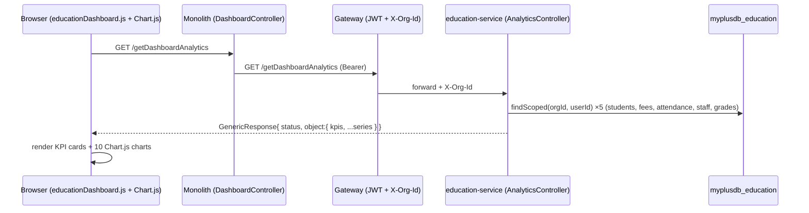
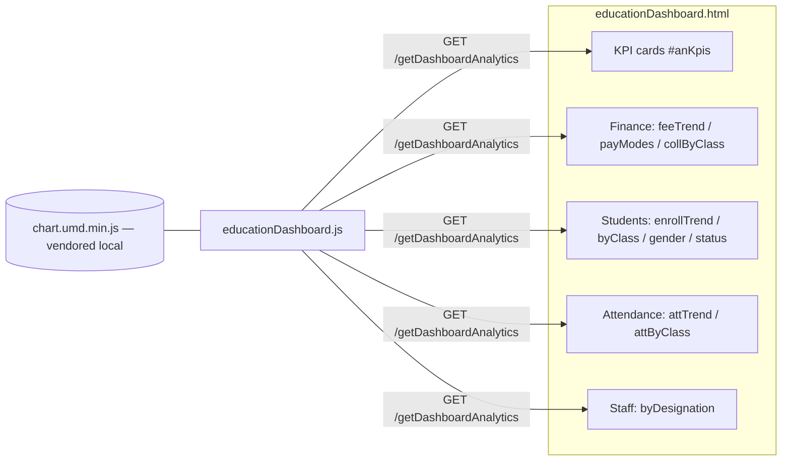

# Slice 25 — Education owner analytics dashboard (education-service + UI)

Status: **IMPLEMENTED** (user consented: full slice + new backend endpoint; all four lenses).
Built **fresh**, org-scoped. Rich, interactive charts so an owner can read their school as a
business (finance), an operation (attendance), and an organisation (students, staff).

## Document — what & why

The old `DashboardDiv` showed four cards, only one of which was live (Students `fresh/all`);
Attendance, Collection and Expense were hardcoded `0/0`. There were **no charts**.

Owners want to *understand* the school from several angles (see `project_org_analytics_goal`):
- **Business / finance** — how much is collected vs owed, the monthly trend, where it comes from.
- **Performance / operations** — attendance over time and by class.
- **Organisation** — enrolment growth, class sizes, gender/status mix, staffing.

This slice delivers a single owner dashboard covering all four lenses with **one** org-scoped call.

## Design

### Data source (no schema change)
All figures are aggregated **in-memory** from the existing org-scoped lists
(`findScoped(orgId, userId)`) — datasets are per-school and small, so this avoids bespoke SQL and
stays DB-agnostic. Fields used:

| Lens | Source | Fields |
|------|--------|--------|
| Finance | `FeeCollection` | `fee_paid (fp)`, `due_amount (da)`, `other_dues (od)`, `due_balance (db)`, `payment_date (pd)`, `received_in (ri)`, `enroll_no (en)` |
| Students | `Student` | `enrollDate`, `gender`, `status`, `gradeId`, `enrollNo` |
| Attendance | `Attendance` | `attDate`, `status` (present = `present`/`p`), `gn` (grade name) |
| Staff | `Staff` | `designation` |
| Classes | `Grade` | `id`, `name`, `section` (label map for the above) |

### Flow



### Response shape (`object`)

```
kpis: { totalStudents, freshStudents, activeStudents, totalStaff, totalSchools,
        totalGuardians, collectedThisMonth, collectedTotal, outstanding,
        collectionRate, attendanceRate, studentTeacherRatio }
enrollTrend:        { labels[12], data[12] }              // students by enrol month
feeTrend:           { labels[12], collected[12], due[12] }// by payment month
attendanceTrend:    { labels, data }                      // daily present % (last ≤30 days w/ records)
studentsByClass:    { labels, data }
collectionByClass:  { labels, data }                      // fp summed, en→student→grade
attendanceByClass:  { labels, data }                      // present %
genderSplit:        { labels, data }
studentStatus:      { labels, data }
paymentModes:       { labels, data }                      // fp summed by received_in
staffByDesignation: { labels, data }
```

### Components



## Implement

**education-service**
- `controller/AnalyticsController.java` — `GET /getDashboardAnalytics`, org-scoped, in-memory
  aggregation; returns `GenericResponse("SUCCESS", object)`. Robust to nulls; `safeCount` guards
  the count queries.

**monolith**
- `DashboardController` += proxy `GET /getDashboardAnalytics` → `educationClient.get(...)`
  (legacy `/getDashboardData` kept for back-compat).

**UI**
- `educationDashboard.html`: `DashboardDiv` replaced with analytics layout (KPI grid + four titled
  sections of chart panels); scoped `<style>` added; `js/lib/chart.umd.min.js` (Chart.js 4.4.3,
  vendored locally for offline/prod) loaded before the dashboard script.
- `js/education/educationDashboard.js`: rewritten — fetch analytics, render KPI cards, draw 10
  charts (bar/line/doughnut), "No data yet" overlay per empty panel, Refresh button, chart
  instances destroyed/recreated on refresh.

## Test

- Cypress `cypress/e2e/education/dashboard.cy.js`:
  - page renders the analytics layout (`#DashboardDiv`, "School Analytics");
  - legacy `/getDashboardData` still returns counts;
  - `/getDashboardAnalytics` returns `kpis` + chart series, 12-point trend windows;
  - KPI cards render and Chart.js is loaded with canvases present.
- Run headed Chrome: `npx cypress run --browser chrome --headed --spec cypress/e2e/education/dashboard.cy.js`

## Build / run note

Requires a **rebuild + restart of the education-service** (new endpoint) and the **monolith**
(new proxy). The user runs all builds/restarts.

## Deferred / future

- Period selector (this term / year / custom range) — currently fixed windows.
- Teacher KPI scoring & expense/income (needs an expense source) — see `project_org_analytics_goal`.
- True YoY deltas on KPI cards (the "vs last month/year" badges).
