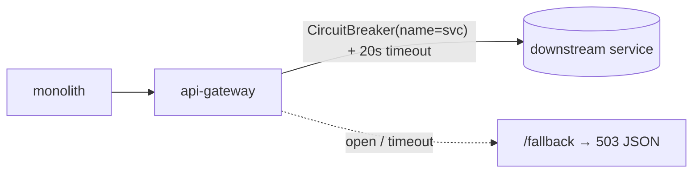

# Slice 27 — API-gateway resilience (timeouts + circuit breaker)

Status: **DONE + VERIFIED** ✅ (2026-06-14, Cypress green through the gateway). Tech-debt #14 (🟠). Rate
limiting split to a follow-up (see end). NOTE: right after a business-service restart with a flaky DB
window, the breaker can open on slow calls → transient fallback ERRORs; let the service warm up before
running the suite (self-recovers once the DB settles).

## Document — what & why
The gateway has no timeouts and no circuit breaking: a single slow/hung downstream service can tie up
gateway threads and cascade to every route. Add **response/connect timeouts** + a **per-route circuit
breaker** (Resilience4j, in-JVM — no external infra) with a fast fallback.

## Design
### Timeouts (global)
`spring.cloud.gateway.httpclient.connect-timeout: 5000` (ms), `response-timeout: 20s`. A downstream that
doesn't respond in 20s fails fast instead of holding the connection.

### Circuit breaker (per route, Resilience4j)
Add `spring-cloud-starter-circuitbreaker-reactor-resilience4j`. Each route gets a **`CircuitBreaker`
filter with its own name** (per-service isolation — one failing service must not trip the others) and a
shared `fallbackUri: forward:/fallback`. A `FallbackController` returns a JSON 503
(`{status:"ERROR", message:"<svc> temporarily unavailable"}`) so the monolith degrades gracefully.

Resilience4j defaults (config): sliding-window 20, failure-rate 50%, wait-in-open 10s,
slow-call-duration 18s. Per-service names: `auth-service`, `business-service`, … (route id).

> Per-route names matter: a shared circuit breaker would open for *all* routes when one service fails —
> worse than none. So the breaker is added per route, not via `default-filters`.

### Rate limiting (shipped DISABLED by default — needs per-tenant keying)
`RateLimitGlobalFilter`: in-memory per-user fixed-window limiter keyed on the caller's bearer token
(falls back to client IP), 429 above `gateway.ratelimit.requests-per-second` (default 100), togglable
via `gateway.ratelimit.enabled`. **Default `enabled:false`** — enabling it 429-broke the Cypress suite
because (as the deferral note below predicted) every gateway request comes from the single monolith
client, so the bearer/IP key collapses to one shared bucket that a normal dashboard fan-out exceeds in
a second. Correct fix for a multi-client deploy: key on the `X-User-Id` the JWT filter stamps
(post-routing) with a tuned limit, or swap to the Redis `RequestRateLimiter` (dep present) for a
multi-instance gateway. Left in place, opt-in, for that future hardening.

Also fixed an unrelated gateway `/actuator/health` 503: `management.health.redis.enabled:false` (the
Redis health indicator was DOWN because local `start-all` runs no Redis; Redis is only needed by the
opt-in Redis limiter / demo-quota compose).

### Original deferral note: rate limiting
All gateway traffic comes from the **monolith** (one source IP), so IP-keyed limiting is a single bucket.
Correct per-tenant limiting must key on the `X-User-Id` the `JwtAuthenticationFilter` stamps — i.e. the
limiter must run **after** that per-route filter (a `GlobalFilter` ordered after routing-filters, or a
post-JWT route filter). Redis (already a gateway dep, in compose) gives distributed counters but isn't
guaranteed in local `start-all` dev. → **Follow-up slice**: in-memory (or Redis-when-present) limiter
keyed by user, generous default, `429` on exceed, togglable.

## Architecture

## Implement (checklist)
- [x] pom: `spring-cloud-starter-circuitbreaker-reactor-resilience4j`
- [x] `application.yml`: `httpclient` timeouts (connect 5s, response 20s); per-route `CircuitBreaker`
  filter (own name each, shared `forward:/fallback`); `resilience4j` defaults (timelimiter raised 1s→20s)
- [x] `FallbackController` (`/fallback`) → 503 JSON (flat GenericResponse shape)
- [ ] build gateway; headed Cypress (services up → breakers closed → no behaviour change) — **awaiting build**
- [ ] (follow-up) per-user rate limiting

## Test
- All existing business/education flows green (breakers closed when services healthy).
- Manual: stop a downstream service → its route returns the `/fallback` 503, **other routes still work**
  (per-route isolation); a hung service times out at 20s instead of hanging.
