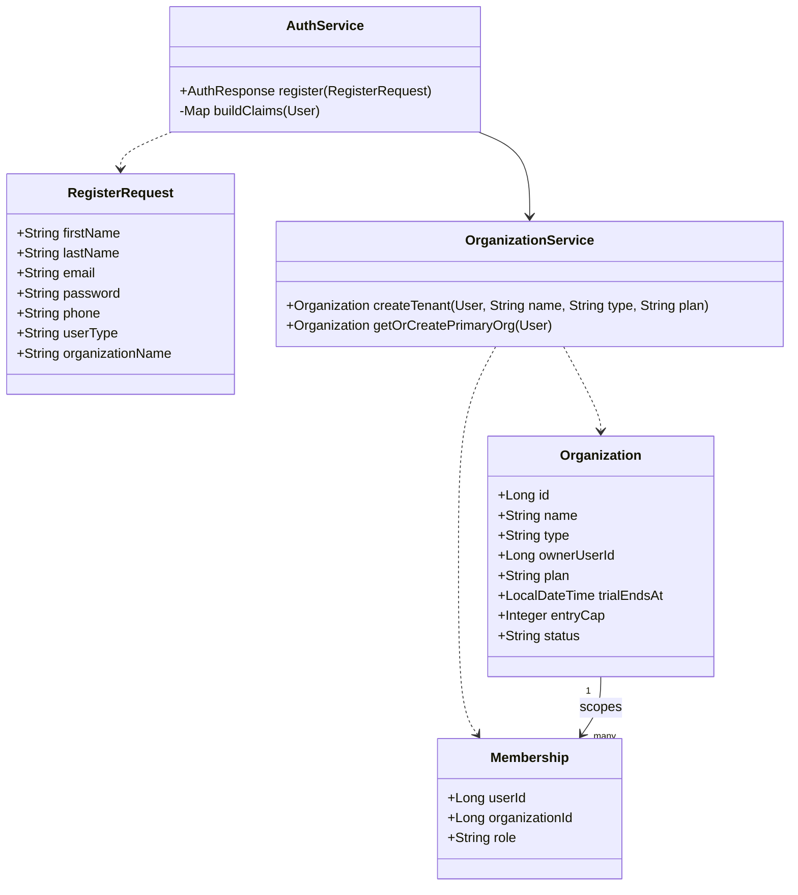
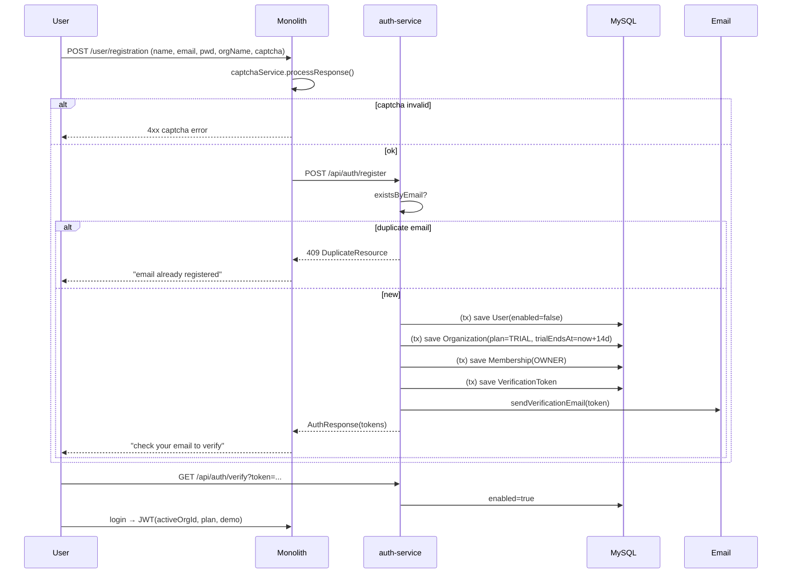

# Slice 32 — Self-service SaaS signup & tenant provisioning

**Status: 🚧 IN PROGRESS.** All Implement items DONE & rebuilt; **Cypress signup spec + verification still
pending**. Bring account creation to SaaS standard
([[feedback-saas-standards]], [[feedback-build-fresh-not-port]]). Memory: [[project-jwt-auth-integration]]
(register/org bootstrap), [[project-demo-quota]] (demo gate), [[project-prod-hardening]] (seed gating).
Implements on `chore/tech-debt-plan` (no per-item branches).

---

## 1. Document — what & why

Account creation today is split across **three entangled paths**, only one of which is real SaaS:

| Path | Where | Problem |
|------|-------|---------|
| Demo accounts (10, `demo=true`) | `auth-service/SetupDataLoader` | Fine as a *try-before-signup* sandbox, but seeded unconditionally on the dev flag |
| **Client account** (`beconrisegrammarschool@gmail.com`) | `auth-service/SetupDataLoader` lines 159–173 | A **real customer hardcoded in code**: runs in **prod** (not gated by `seedAdmin`), ships a **known password**, and onboarding a client needs a redeploy |
| Self-service signup | `/user/registration` → `AuthService.register()` | Works, but the **tenant (Organization) is created lazily on first login** (`buildClaims → getOrCreatePrimaryOrg`), the org name is auto-generated (`"X's organization"`), and trial/demo limits are a per-user **boolean** rather than a tenant entitlement |

**Goal:** make **self-service signup the single way a real tenant comes into existence**, provision the
tenant atomically at registration, let the owner name their organization, and model trial/plan limits as
a **tenant-level entitlement** instead of a hardcoded `demo` boolean. Shrink `SetupDataLoader` back to
platform bootstrap only (role/privilege catalog + a prod-gated platform admin + non-prod demo tenants).

**User value:** a prospect signs up → gets their **own isolated trial tenant** in one step (verify email →
log in → use it); an operator onboards a paying client **without a code change**; production never ships a
hardcoded customer or a known password.

---

## 2. Design

### 2.1 Data model (auth-service)

Additive columns only — no destructive migration. ddl-auto adds them; Flyway forward migration authored
per [[project-prod-hardening]] (slice 30 pattern).

**`Organization`** (existing — add entitlement fields):

| Column | Type | Notes |
|--------|------|-------|
| `plan` | varchar | `TRIAL` (self-signup default) · `FREE` · `PRO` · `DEMO` (shared sandbox tenants). Replaces the per-user demo boolean as the source of truth. |
| `trial_ends_at` | datetime null | Set on self-signup to `now + 14 days`; **trial is time-boxed, not entry-capped**. After expiry the tenant is read-only / prompted to upgrade. Null for non-trial plans. |
| `entry_cap` | int null | Per-module write cap. **DEMO → 50** (shared sandbox); **TRIAL → null (unlimited during the 14 days)**; FREE/PRO → null. Gateway reads this instead of hardcoding 50. |

`User.demo` stays **for back-compat** during the transition, but is **derived** from the owner org's plan
(`demo = plan ∈ {DEMO}`). The trial is enforced by **`trial_ends_at`**, not a cap; only DEMO sandbox tenants
keep the 50/module limit. The JWT keeps the `demo` claim *and* gains `plan` + `trialEndsAt` claims so the
gateway can move from "is demo" to "what's the limit" without a breaking change.

### 2.2 Endpoint contract

`POST /api/auth/register` (auth-service) — extend `RegisterRequest`:

```jsonc
{ "firstName": "...", "lastName": "...", "email": "...", "password": "...",
  "phone": "...", "userType": "EDUCATION",
  "organizationName": "Beacon Rise Grammar School"   // NEW, @NotBlank
}
```

Response unchanged (`AuthResponse` with tokens). Behaviour change: the **org + OWNER membership are
created inside the `register()` transaction** (not lazily at login), `plan=TRIAL`, `trial_ends_at=now+14d`,
`entry_cap=null` (unlimited during the trial). Monolith `/user/registration` form gains an **Organization name** field, passed through
`AuthServerClient.register(...)`.

New (operator onboarding, replaces the hardcoded client): `POST /api/auth/admin/provision-tenant` —
`@PreAuthorize` SUPER/ADMIN — creates an owner user (random password + forced reset email) + org with a
chosen plan. This is how a paying client is onboarded with **no redeploy**.

CSRF: `/api/auth/**` is unauthenticated at the gateway (per [[project-password-reset-delegated]]); register
stays public + captcha-gated (already wired via `RegistrationCaptchaController` / `ICaptchaService`).

### 2.3 Service responsibilities

- `AuthService.register()` — within one `@Transactional`: create disabled `User`, create `Organization`
  (`plan=TRIAL`), create `OWNER` `Membership`, issue verification token + email. Atomic: all-or-nothing.
- `OrganizationService` — gains `createTenant(owner, name, type, plan)`; `getOrCreatePrimaryOrg()` stays as
  a **safety net** for legacy users with no org but is no longer the primary creation path.
- `SetupDataLoader` — **remove** the hardcoded client block; **gate demo tenants to non-prod** (already on
  `seedAdmin`, but split a dedicated `app.seed-demo` flag so prod can keep an admin without demo users);
  keep role/privilege catalog + prod-gated platform admin.

### 2.4 UI contract (monolith)

- Registration page: add **Organization name** input (required); show plan = "14-day free trial".
- The `demo` banner / 50-cap upsell ([[project-demo-quota]]) now reads the `plan`/`entry_cap` claim, so a
  trial tenant shows "X of 50 used — upgrade", and a PRO tenant shows nothing.

### 2.5 Security / anti-abuse

- Email verification gate already blocks login until `enabled=true` — **confirm** unverified login is
  rejected (regression test).
- Captcha on register (existing). Add signup **rate-limit** at the gateway (follow-up to slice 27's
  Resilience4j — currently deferred; note here, don't block this slice on it).
- No known passwords in prod: platform admin password from env (`app.admin-password`), demo tenants
  non-prod only, **zero** customer rows in the seeder.

---

## 3. Architecture & UML

### Architecture (flowchart)

```mermaid
flowchart LR
    B[Browser / register form] -- POST /user/registration (+orgName, captcha) --> M[Monolith RegistrationController]
    M -- AuthServerClient.register --> GW[Gateway]
    GW -- /api/auth/register --> A[auth-service AuthController]
    A --> S[AuthService.register @Transactional]
    S -->|save disabled| U[(users)]
    S -->|createTenant plan=TRIAL| O[(organizations)]
    S -->|OWNER| MB[(memberships)]
    S -->|token| V[(verification_token)]
    S -. sendVerificationEmail .-> SMTP[(Gmail SMTP)]
    subgraph Operator onboarding (no redeploy)
      ADM[SUPER/ADMIN] -- POST /api/auth/admin/provision-tenant --> A
    end
```

### Class diagram



### Sequence diagram



---

## 4. Implement (checklist — pending approval)

- [x] **Fix prod leak first (standalone, low-risk):** removed the hardcoded `beconrisegrammarschool` block
      from `SetupDataLoader`; added a dedicated `app.seed-demo` flag (`APP_SEED_DEMO`) so demo users gate
      independently of the prod admin; surfaced both `app.seed-admin`/`app.seed-demo` in `application.yml`.
      Existing beaconrise DB row left intact (no longer re-seeded) — formal migration deferred to the
      provision-tenant item below. *(awaiting auth-service rebuild)*
- [x] `Organization`: added `plan` (default `FREE`), `trialEndsAt`, `entryCap`. Flyway forward migration
      `V2__slice32_org_plan.sql` (idempotent information_schema guards, slice-30 pattern; `plan DEFAULT 'FREE'`
      + backfill of pre-existing rows). ddl-auto adds the cols in dev; migration is correct on fresh/prod.
      *(awaiting auth-service rebuild)*
- [x] `RegisterRequest`: added `organizationName`, now **tightened to `@NotBlank`** (the monolith form sends
      it). `createTenant` still falls back to an auto name if ever blank (defense-in-depth). *(awaiting rebuild)*
- [x] `OrganizationService.createTenant(owner, name, type, plan)` — creates org + OWNER membership and
      applies the plan policy (TRIAL → `trialEndsAt = now + app.trial-days` (14), uncapped; DEMO → cap 50;
      FREE/PRO → uncapped, no expiry). Added `findById(id)` for claim enrichment. *(awaiting rebuild)*
- [x] `AuthService.register()`: creates the tenant **in the same transaction** as the user (atomic
      user+org+OWNER), `plan=TRIAL`. `buildClaims` refactored to carry the active `Organization` and emit
      `plan` + `trialEndsAt` claims (alongside `activeOrgId`/`demo`); `getOrCreatePrimaryOrg()` kept as the
      legacy login safety net. *(awaiting rebuild)*
- [x] Monolith: **Organization name** field added to `registration.html` (live form) + `registrationCaptcha.html`
      (legacy parity), with `#organizationNameError` span; `UserDto.organizationName` (`@NotNull @Size`);
      both `RegistrationController` + `RegistrationCaptchaController` pass it; `AuthServerClient.register(...)`
      gained the param. i18n `label.user.organizationName` + `Size.userDto.organizationName` (en/es). Auth-service
      `RegisterRequest.organizationName` tightened to `@NotBlank`. *(awaiting monolith + auth-service rebuild)*
- [x] Gateway `JwtAuthenticationFilter`: enforces by `plan`/`entryCap`/`trialEndsAt`. Effective per-module
      cap = explicit `entryCap` (DEMO tenants) else the legacy `demo` flag → `demo.max-entries` (kept so
      already-issued tokens + seeded demo users stay capped — non-breaking). Active TRIAL/FREE/PRO are
      uncapped; an **expired TRIAL blocks writes** (reads still flow). Added `entryCap` to the JWT claims.
      Both 403s carry the `DEMO_LIMIT` code so the monolith's existing upsell relay fires (trial body adds
      `reason:TRIAL_EXPIRED` + its own message). *(awaiting gateway + auth-service rebuild)*
- [x] `POST /api/auth/admin/provision-tenant` (SUPER/ADMIN) — onboard a client without a redeploy.
      `ProvisionTenantRequest` (firstName/lastName/email/phone/userType/organizationName/plan; plan
      default `PRO`). `AuthService.provisionTenant`: dup-email guard → create enabled owner with a
      **throwaway password** → `createTenant(plan)` → **password-reset email** so the owner sets their own
      credential (no operator-known password). `@PreAuthorize("hasAnyAuthority('SUPER_PRIVILEGE','ADMIN_PRIVILEGE')")`;
      auth route has no gateway JWT filter so the Bearer reaches auth-service, which authorizes it. *(rebuilt)*
- [x] Onboard the existing client (beaconrise) through provisioning, not the seeder — **N/A by design**:
      the seeder block is gone but the existing `beconrisegrammarschool@gmail.com` **row remains** and already
      works as a tenant (org auto-created `FREE` on login). No provisioning call possible (dup email). If a
      paid plan is wanted, set its org `plan=PRO` directly (one-row update); future clients use the endpoint.
- [x] **Email-verification gate fix** (found while verifying the login path): `AuthService.login()` checked
      lock + password + 2FA but **never `isEnabled()`** — the credential check is manual (not via
      `DaoAuthenticationProvider`), so a registered-but-unverified user could log in. Added an `isEnabled()`
      guard **after** the password match (no info leak). Only affects unverified self-signups; seeded/admin/
      provisioned owners are all `enabled=true`. *(awaiting auth-service rebuild)*

## 5. Test

- **Happy path (Cypress, headed):** register with org name → "verify email" message; verify token →
  login → JWT carries `activeOrgId` + `plan=TRIAL`; dashboard scoped to the new org; org row + OWNER
  membership exist.
- **Validation:** missing `organizationName` → 400; duplicate email → 409 "already registered"; weak
  password (<8) → 400.
- **Verification gate:** login before verifying → rejected (regression).
- **Trial expiry:** trial tenant has **unlimited** entries before `trial_ends_at`; after expiry → upgrade
  prompt / read-only (simulate by back-dating `trial_ends_at`). DEMO sandbox tenants still hit the 50/module
  cap → `DEMO_LIMIT`/upsell (reuses [[project-demo-quota]] path, now plan-driven); PRO/FREE uncapped.
- **Prod safety (manual/assert):** with `seed-demo=false` + `seed-admin=true`, boot seeds **no** demo
  users and **no** customer rows; admin password comes from env.
- **Operator onboarding:** `provision-tenant` as SUPER creates owner + org; as a normal user → 403.
- Spec: **`cypress/e2e/auth/signup.cy.js` (written)** — org-name field present; happy-path POST asserts the
  intercepted `{message:"success"}`; server-side rejects (missing org name, duplicate email) via `cy.request`;
  verification gate (register → login must stay on `/login`). Run headed; assumes captcha OFF for the test
  profile. **Not yet run/verified live** (user runs Cypress). welfare/agri still have no specs (compile-gated).
