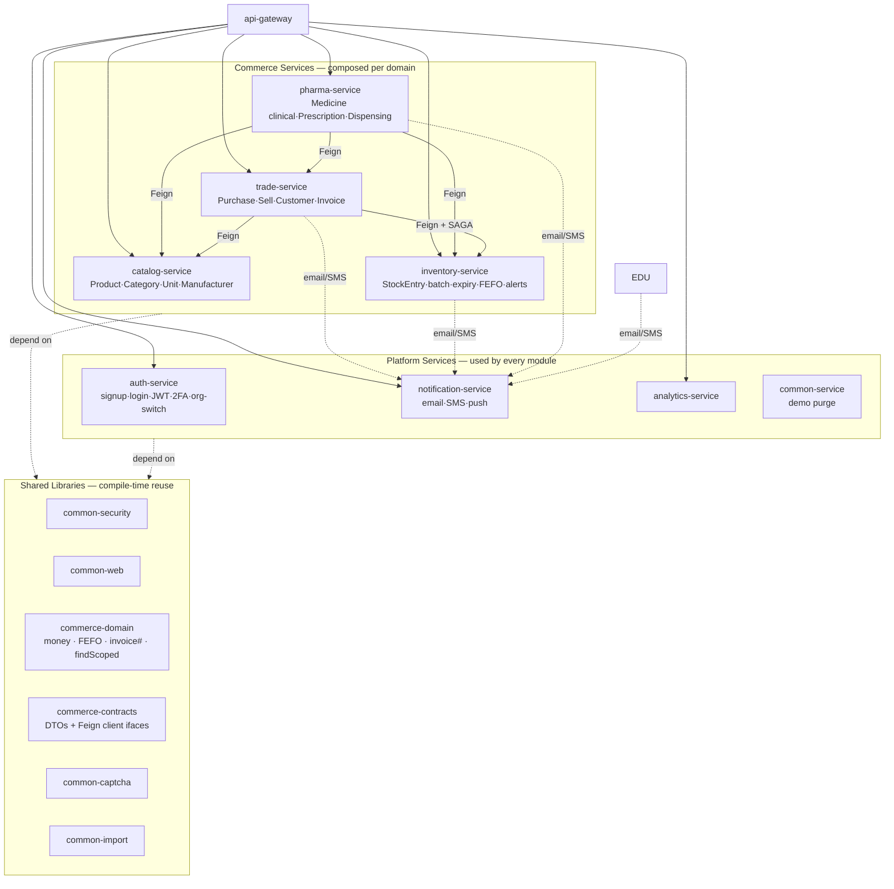
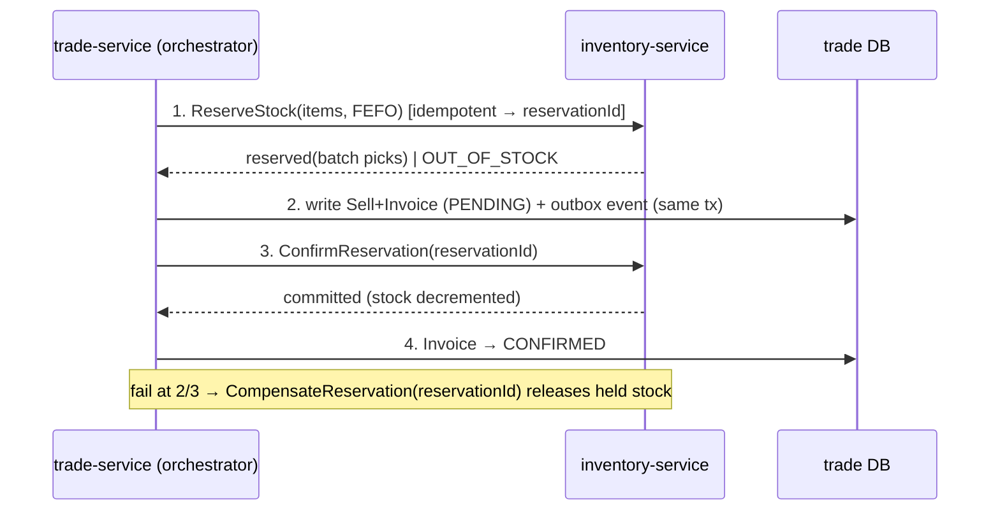

# Slice 33 — Platform Decomposition (SOLID / DRY service split + sell↔stock saga)

Status: **DESIGN — APPROVED, IMPLEMENTING** 🟡 (started 2026-06-20, branch `feature/decomposition`).
Governing architecture doc for breaking the codebase into independently-runnable, plug-and-play
services + shared libraries, so new domains (pharmacy first) reuse code **and** logic instead of
re-implementing it. Builds on [`ARCHITECTURE-MULTITENANCY`](../ARCHITECTURE-MULTITENANCY.md).

> User goals (verbatim intent): SOLID, don't reinvent the wheel, break into small pieces that run
> individually for plug-and-play, develop pharmacy with less effort by reuse, and use **sagas** (or any
> mechanism) for atomicity across services.

---

## Document — what & why

A whole-codebase analysis found the same capabilities **built multiple times**. Decomposing into
microservices has so far *multiplied* duplication rather than removed it. This slice defines the target
architecture and the migration that makes each capability live in exactly one place.

### Audit findings — duplication that exists today

**Vertical (commerce) duplication — same aggregate built 3×:**

| Concept | `business-service` | `inventory-service` | `pharma-service` | Winner (system of record) |
|---|---|---|---|---|
| Product / Item | `Item` | `Product` (sku, reorder, cost/sell, taxRate) | `Medicine` (= Product + clinical) | `Product` (base) + `Medicine` as **extension** |
| Stock + batch/expiry | `Stock` (1 row/item) | `StockEntry` (**multi-batch**, warehouse, lot) ✅ | `PharmacyStock` | **`StockEntry`** |
| Supplier | `Vender` | `Supplier` (contact, taxId, terms) ✅ | `String supplier` ⚠️ | **`Supplier`** |
| Sell / Purchase / Customer / Invoice | mature: BigDecimal, org-scoped, per-org invoice #, dues ✅ | — | — | **`business-service`** → `trade-service` |

**Horizontal (use-case) duplication — same cross-cutting concern built N×:**

| Use case | Lives in | Duplication | Verdict |
|---|---|---|---|
| Signup / login / JWT / org-switch / tenant provision | `auth-service` (+ monolith delegates) | mostly **already one service** ✅ | keep; finish monolith cleanup |
| Email / SMTP | `auth-service`, `education-service`, `campaign-service`, monolith | **3–4×** ❌ | **new `notification-service`** |
| SMS / push | education `sendPA`, future appointment reminders | fragmented | fold into `notification-service` |
| 2FA / OTP | `auth-service.TwoFactorService` **and** monolith `com.security.google2fa.*` | **2×** ❌ | consolidate into `auth-service` |
| Captcha / reCAPTCHA | monolith only (`CaptchaService`, `ReCaptchaAttemptService`, …) | stuck in monolith | **library** `common-captcha` (or fold into auth) |
| Alerts | education `AlertController` (notify) vs inventory `AlertController` (low-stock) | name-collision, two meanings | keep domain triggers local; **deliver** via `notification-service` |
| Demo quota / purge | `common-service.DemoPurgeController` + `campaign-service` | already centralized ✅ | keep |
| CSV import | `education-service` only | not yet duplicated | **library** `common-import` (not a service) |
| `ApiResponse` / `PageResponse` / exceptions | inventory, pharma, analytics, marketplace | **4× identical** ❌ | **library** `common-web` |

---

## Design — target architecture

Two reuse mechanisms, used deliberately (this is the core rule):

- **Shared library (JAR)** = reuse of *code/logic* at compile time. For cross-cutting + **stateless** logic.
- **Capability service** = reuse of a *capability + its data* at runtime. For things that own data,
  a lifecycle, or an external integration (mail server, SMS gateway, reCAPTCHA endpoint).
- **Saga** = atomicity across the one boundary that must cross services (sell ↔ stock).

### Decision rule (apply to every "should this be a service?" question)

```
Owns data + lifecycle + external integration?  → SERVICE   (auth, notification, catalog, inventory, trade, pharma)
Stateless logic / parsing / validation?        → LIBRARY   (commerce-domain, common-captcha, common-import, common-web)
Cross-cutting request filter?                  → AUTOCONFIG LIBRARY (common-security — already done)
```

So: *signup → service (already `auth-service`)*; *CSV import → library*. Same DRY goal, different tool.

### Component map



### The sell↔stock saga (the only cross-service transaction)

`trade-service` records the sale; `inventory-service` owns the stock. "Make a sale" therefore crosses two
DBs. Use an **orchestration saga: reserve → confirm, with the outbox pattern + idempotency keys.**



- **Reserve/confirm** holds stock without losing it until the invoice is safely written.
- **Outbox**: saga step + event written in the *same* local tx → a relay publishes → no lost messages, no XA/2PC.
- **Idempotency** (reservationId) makes retries safe. Returns = the inverse saga (restock + credit note).
- This is the **only** saga. Catalog reads, pharma clinical data, prescriptions, analytics = plain calls.

### Why pharmacy then costs little

| Pharmacy need | Source | Effort |
|---|---|---|
| Drug master (name/code/manufacturer) | `catalog-service` | reuse |
| Stock, batch, expiry, FEFO, low-stock alerts | `inventory-service` | reuse |
| Purchase, sell, invoice, receivables, sell↔stock saga | `trade-service` | reuse |
| Money / FEFO / invoice logic | `commerce-domain` JAR | reuse |
| Signup / login | `auth-service` | reuse |
| Rx-ready SMS, near-expiry emails | `notification-service` | reuse |
| **Salt, schedule/narcotics, Rx-required, interactions** | `pharma-service` | **build** |
| **Prescription, dispensing, partial fill, controlled-substance register, MRP rule** | `pharma-service` (+ `commerce-domain` rule) | **build (small)** |

---

## Implement — phased strangler migration (each phase leaves the system runnable)

> User builds/restarts; assistant writes code and requests a build checkpoint after each phase.

- [x] **Phase 1 — `common-web` library.** Extracted the 4× identical `ApiResponse`/`PageResponse`/
  `GlobalExceptionHandler`/`ResourceNotFoundException`/`ValidationException`/`DuplicateResourceException`
  into `common-web` (opt-in via `CommonWebAutoConfiguration`, `@ConditionalOnMissingBean`). Wired as a
  direct dependency into inventory/pharma/analytics/marketplace (NOT `service-parent`, so `business`/
  `education`/etc. which use `GenericResponse` are untouched); rewrote 22 files' imports to
  `com.myplus.common.web.*`; deleted the 24 duplicated local files. Verified 18 bodies byte-identical
  pre-deletion + no same-package usages + zero residual references. *Pure DRY, zero runtime risk.*
  Phase 1a build (common-web alone) ✓ green; Phase 1b build (4 services) ✓ **BUILD SUCCESS** (2026-06-20). **DONE.**
- [x] **Phase 2 — `commerce-domain` library (pure primitives).** Created `commerce-domain` with
  `InvoiceNumbers.format()` (the `INV-%06d` formatter, slice 22), `Money` (null-safe 2dp-HALF_UP BigDecimal
  math), and `TenantSpecifications.scoped/ownScoped` (the org NULL-fallback contract as a reusable JPA
  `Specification` for new entities). `business-service` adopts `InvoiceNumbers.format()` as proof-of-use
  (behavior-identical one-line swap). *Audit reframed the original scope:* `findScoped` is per-entity JPQL
  (offered as a Specification, not a copy-move); there is no existing central money helper (introduced, not
  extracted); **`AppUtil`/`RequestUtil` are copied 4× but all 4 have DIVERGED** → reconciling them is
  deferred to **Phase 2b** (own slice, per-service diff, after commerce services exist — welfare/agri have
  no Cypress so it needs care). Build ✓ **BUILD SUCCESS** (2026-06-20). **DONE.**
- [ ] **Phase 2b — `common-core` util reconciliation (deferred).** Merge the 4 diverged `AppUtil`/`RequestUtil`
  copies into a shared `common-core`; diff every behavioral difference for review first.
- [x] **Phase 3 — `commerce-contracts` library.** **Decision (no prior inter-service pattern existed):
  `@HttpExchange` + load-balanced `RestClient`** — Spring's current direction, not maintenance-mode Feign;
  interfaces live here = clean DIP boundary. **Scope: contracts now, client beans in Phase 6.** Shipped the
  stable saga DTOs (`StockReservationRequest`/`Line`, `StockReservationResponse`/`StockPick`,
  `ReservationStatus`, `ProductRef`) + interface signatures `InventoryClient` (reserve/confirm/release) and
  `CatalogClient` (getProduct). No proxy beans yet (wired where trade/pharma call out, Phase 6). Quantity is
  `BigDecimal` in contracts (avoid float drift); org/actor propagate as headers, never in body. Build ✓
  **BUILD SUCCESS** (2026-06-20). **DONE.**
- [x] **Phase 4 — pick the stock winner (decision + gap analysis).** See the dedicated section below.
  **Decision: `inventory-service.StockEntry` is the single stock system-of-record.** No code change to
  running services in this phase — it ratifies the target and lists the gaps StockEntry must absorb in
  Phase 5/6. `business-service.Stock` + `pharma.PharmacyStock` are **frozen for deletion** (deleted once
  trade/pharma read inventory, Phases 6–7).
- [ ] **Phase 4.5 — org-scope inventory-service (prerequisite for system-of-record).** Bring inventory to
  the multi-tenant standard before it owns everyone's stock. **Foundation:** new reusable
  `common-security.CurrentUser` accessor (kills the future diverged-`RequestUtil` problem). **Template (this
  step): Product** end-to-end — entity gains `organizationId`/`userId`/`userType`; `ProductRepository` every
  read scoped (`org OR (org IS NULL AND user)`); `ProductService` reads scoped, writes stamp tenant, `getEntity`
  scoped (anti-IDOR); kept unscoped `findLowStockProducts`/`findOutOfStockProducts` for the `@Scheduled`
  cross-tenant `AlertService`. Flyway `V2__org_scoping.sql` (idempotent guarded adds for products/categories/
  suppliers/warehouses/stock_entries). **Rollout DONE:** Category, Supplier, Warehouse, StockEntry all
  org-scoped (entity + repo `findScoped`/`findByIdScoped` + service scoped reads, stamped writes, anti-IDOR
  `getEntity`); `StockService` writes (addStock/adjust/transfer) now resolve Product/Warehouse via
  `findByIdScoped` (anti-IDOR) and stamp StockEntry; `getSummary` uses `countScoped`/`findLowStockScoped`/
  `findOutOfStockScoped`/`findAllScoped` (leak closed). `@Scheduled` `AlertService` keeps the unscoped
  cross-tenant `findLowStock/OutOfStockProducts`. **Deferred follow-up (audit records, lower risk):**
  `StockAdjustment`/`StockTransfer`/`StockAlert` entities don't yet carry `organization_id` (the Product they
  touch is already scoped, so no cross-tenant mutation; only the movement-log rows lack a tenant tag). —
  **awaiting build** (`mvn -pl inventory-service -am clean install -DskipTests`).
- [ ] **Phase 5 — `catalog-service`.** Carve Product/Category/Unit/Manufacturer out (low coupling).
- [ ] **Phase 6 — `trade-service`.** Refactor `business-service` → trade; delegate stock to inventory via the
  reserve/confirm **saga + outbox**.
- [ ] **Phase 7 — rebase `pharma-service`.** Keep only Medicine clinical + Prescription/Dispensing; delete its
  `PharmacyStock`/supplier duplicates; compose catalog+inventory+trade.
- [ ] **Phase 8 — `notification-service`.** Single email/SMS/push service; migrate auth/education/campaign
  senders to call it; delete duplicate `EmailService`s.
- [ ] **Phase 9 — auth consolidation.** Move 2FA out of monolith `com.security.google2fa.*`; extract
  `common-captcha`; every dashboard calls `auth-service` for signup.

## Phase 4 decision — stock system-of-record (field-level)

**Winner: `inventory-service.StockEntry`** — it is the only one of the three with the right *structure*:
real multi-batch (one row per batch, not one-row-per-item like `business.Stock`), a `Product` FK, plus
`warehouse` and `lotNo`. `pharma.PharmacyStock` is structurally inferior (supplier as a free-text String)
and adds nothing reusable → delete in Phase 7.

But StockEntry is the best *shape*, not yet feature-complete. Gaps it MUST absorb before it can replace
`business.Stock` (these are why we don't just delete business.Stock today):

| Capability | `business.Stock` | `inventory.StockEntry` | Action for Phase 5/6 |
|---|---|---|---|
| Multi-batch grain | ❌ one row/item (`item_id` unique) | ✅ one row/batch | keep StockEntry's grain |
| Product link | item id (loose) | ✅ `Product` FK | keep |
| Warehouse / lot | ❌ | ✅ | keep (bonus) |
| Batch no / expiry | ✅ `batchNo`,`bexpDate` | ✅ `batchNo`,`expiryDate` | keep |
| **Mfg date** | ✅ `bmfgDate` | ❌ | **add** `mfgDate` (pharmacy needs it) |
| Purchase price | ✅ `bpurchaseRate` | ✅ `purchasePrice` | keep |
| **Sale rate** | ✅ `bsellRate` | ❌ | **add** `saleRate` |
| **Per-batch discounts (+types)** | ✅ 4 fields | ❌ | **add** (or move to pricing later) |
| **Org-scoping (multi-tenant)** | ✅ `organizationId`,`userId`,`userType` | ❌ **none** | **add** `organizationId`+audit; apply `TenantSpecifications` (Phase 2) |

> ⚠️ Key risk surfaced: **inventory-service is NOT multi-tenant today** — neither `StockEntry` nor `Product`
> carries `organization_id`. Promoting it to system-of-record REQUIRES bringing it to the
> [`ARCHITECTURE-MULTITENANCY`](../ARCHITECTURE-MULTITENANCY.md) standard first (org_id + findScoped). This is
> folded into Phase 5 (catalog) and the inventory hardening that precedes the Phase 6 saga — it is not a
> trivial "flip a switch." Migration adds nullable `organization_id` (ddl-auto/Flyway), no destructive change.

**Freeze (not yet delete):** `business.Stock` and `pharma.PharmacyStock` stay until trade (Phase 6) and
pharma (Phase 7) read inventory; deleting earlier would break the running services.

## Test
- Per phase: build the touched modules (user) + existing Cypress suites for affected domains (headed, Chrome).
- Saga (Phase 6): integration test reserve→confirm happy path + compensation on injected failure
  (Testcontainers, per slice 29 pattern).
- No phase merges until its build is green and prior domain specs still pass.
```
