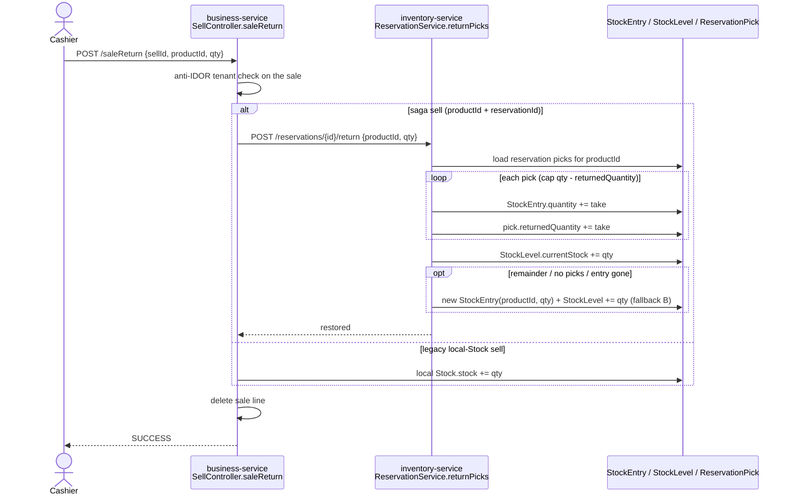
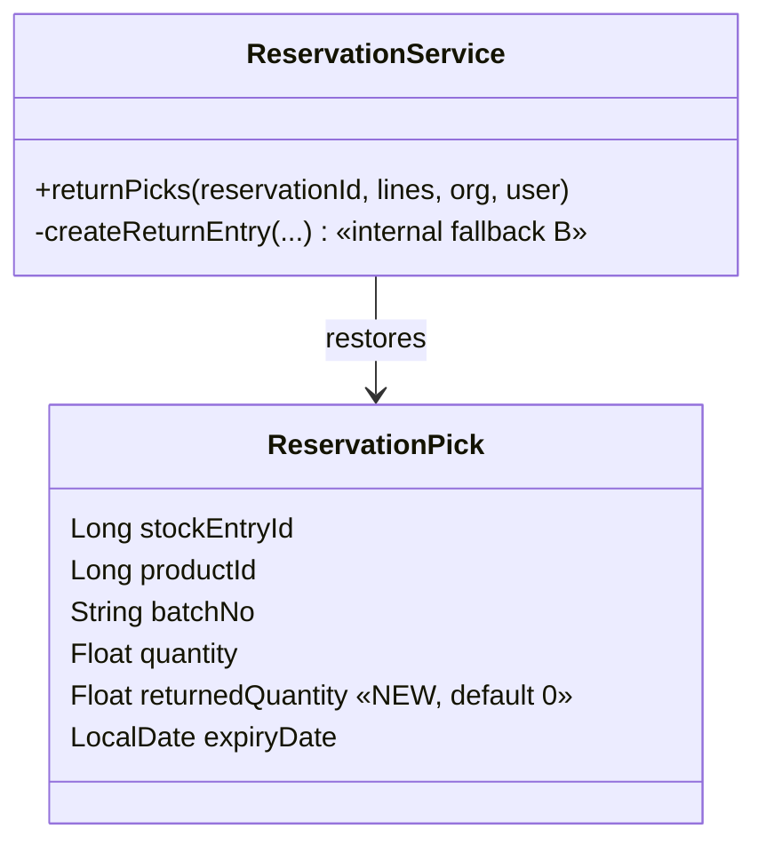

# Slice 34 — G2: Returns → inventory (inverse saga)

Part of the **commerce gaps** sequence (see `docs/commerce-backend-audit.md`). Order: **G1 (done)** → **G2 (this slice)** → G3 tax → G5 payment.

- **G1 (done, commit `492601d`):** FEFO never allocates expired stock — `findForFefo` excludes `expiryDate < today`; `ReservationServiceTest` covers it.
- **G2 (this slice):** make sale returns saga-aware so inventory is restored, not just the local `Stock` table.

---

## Problem (verified in code)

`SellController.saleReturn` (business-service) restores **only** the legacy local `Stock` row, then deletes the sale:

```java
Optional<Stock> stockOpt = stockService.findById(dto.getSellSId());
if (stockOpt.isPresent()) {
    Stock stock = stockOpt.get();
    stock.setStock(stock.getStock() + dto.getQuantity());   // local Stock only
    stockService.save(stock);
}
sellService.deleteById(dto.getSellId());
```

A **saga sell** went `reserve → confirm` (`SagaSellService`), and `confirm` decremented inventory-service
`StockEntry` (per `ReservationPick`) **and** `StockLevel`. The return touches none of that, so every return on a
saga sell leaves inventory **permanently under-counted** — stock drift that compounds over time.

---

## Decision (chosen approach)

**Primary — restore to the original batch(es) via the reservation's picks.** Walk the sale's recorded
`ReservationPick`s for the returned product and add the returned qty back to each **exact `StockEntry`**, then bump
`StockLevel`. The returned units carry their real expiry → FEFO stays correct and we keep full lot traceability
(the return reverses the confirm exactly).

**Fallback — restock by product.** When there is no reservation/picks (legacy / non-saga sells) or the original
`StockEntry` no longer exists, create a fresh `StockEntry(productId, qty)` and bump `StockLevel`. Inventory is made
whole even without lot lineage.

**Deferred (pharma vertical, not G2):** in many jurisdictions dispensed medicine legally cannot return to sellable
stock — it is quarantined/destroyed. That is a per-product/policy `restockable` flag: `restockable=false →` route the
returned qty to a **quarantine batch** instead of sellable stock. The restock path below is built with a clean seam
for that flag, but the flag itself ships with pharma.

---

## Design

### Where pick state lives → reservation-aware return endpoint

Picks (`stockEntryId, productId, batchNo, quantity, expiryDate`) live in **inventory-service** on `Reservation`.
Trade does not know `stockEntryId`s. So the restore is driven by inventory, keyed on the sale's `reservationId`
(already stored on `CustomerHistory.reservationId`).

New inventory endpoint: `POST /reservations/{reservationId}/return` with body `{ lines: [{ productId, qty }] }`.
Inventory walks that reservation's picks for each product and restores them (capped — see below).

A separate **restock-by-product** path serves the fallback: `POST /stock/restock` with `[{ productId, qty }]`.

### Partial / repeated returns — cap per pick

Returns are per Sell line + partial qty, so the same reservation can be returned against more than once. To stop a
batch being over-restored (pick of 30 → return 20, then 20 again = 40 > 30), add an additive
`ReservationPick.returnedQuantity` (default 0). Each return adds back at most `pick.quantity - pick.returnedQuantity`
per pick, distributing the requested qty across that product's picks in pick order. Any remainder that exceeds the
total ever picked (should not happen) falls through to the restock-by-product fallback so inventory is still made whole.

### Contract (commerce-contracts) — as built

```text
StockReturnLine(productId, qty)
StockReturnRequest(List<StockReturnLine> lines)          // reservationId travels in the URL path, not the body
StockReturnResponse(reservationId, restoredQuantity, message)
InventoryClient.returnStock(reservationId, request)      -> POST /reservations/{id}/return
```
> The original design proposed a separate `InventoryClient.restock(List<StockRestockLine>)` → `POST /stock/restock`
> for fallback B. **Not built** — fallback B is **internal** to `ReservationService.returnPicks` (`createReturnEntry`),
> since legacy/non-saga sells return via the trade local-`Stock` branch and never reach inventory. `returnStock` is
> the single G2 inventory entry point; there is no `/stock/restock`, `StockService.restock`, or `StockRestockLine`.

### Trade-side branch (SellController.saleReturn)

```text
existingSell = findById(sellId)                 // anti-IDOR tenant check (unchanged)
if (sell.productId != null && reservationId != null):     // saga sell
    inventoryClient.returnStock(reservationId, {productId, qty})   // A; inventory falls back to B internally
else:                                                      // legacy local-Stock sell
    stock.setStock(+qty); stockService.save(stock)        // unchanged
deleteById(sellId)
```

---

## Flow





---

## Files to change

| Module | File | Change |
|---|---|---|
| commerce-contracts | `dto/StockReturnLine`, `dto/StockReturnRequest`, `dto/StockReturnResponse` | new DTOs |
| commerce-contracts | `client/InventoryClient` | `returnStock(reservationId, request)` |
| inventory-service | `entity/ReservationPick` | additive `returnedQuantity` (default 0) |
| inventory-service | `service/ReservationService` | `returnPicks(...)` — walk picks, cap, restore + level bump, **internal** fallback (`createReturnEntry`) |
| inventory-service | `controller/ReservationController` | `POST /reservations/{id}/return` (CurrentUser org/user) |
| business-service | `controller/SellController.saleReturn` | branch saga (→ `returnStock`) vs legacy (local Stock) |
| business-service | `config/TradeClientsConfig` | `InventoryClient` lb proxy already bound (no change) |

_(No `StockService.restock` / `/stock/restock` / `StockRestockLine` — fallback is internal to `returnPicks`.)_

All inventory writes org-scoped + stamped (mirror `importStock`/`addStock`); the return endpoint is anti-IDOR via the
reservation's own org/user scope.

---

## Tests — as built

- **inventory `ReservationServiceTest`** (Testcontainers, disabledWithoutDocker) — the 3 G2 tests:
  - `returnPicks` restores the exact StockEntry batch + bumps StockLevel (reverses confirm exactly).
  - repeated partial returns do **not** over-restore the original batch (per-pick `returnedQuantity` cap honoured).
  - no-reservation / missing-entry → internal fallback (fresh batch) still makes the level whole.
- **Cypress (headed)** `business/commerce-gaps.cy.js` — "the return dialog builder is wired and opens" (the partial-qty
  Sale Return dialog), plus the sells-list Return action.

> Not built: a separate `StockServiceTest` (no `StockService.restock` exists) and a business-service
> `SaleReturnSagaTest` — the saga-vs-legacy `saleReturn` branch is thin delegation covered by the inventory
> `returnPicks` tests + the Cypress dialog test.

Command: `cd microservices/inventory-service && mvn test -Dtest=ReservationServiceTest`

---

## Status

- [x] Design (this doc, reconciled to as-built)
- [x] Contract DTOs (`StockReturnLine/Request/Response`) + `InventoryClient.returnStock`
- [x] inventory: `ReservationPick.returnedQuantity` + `ReservationService.returnPicks` (A + internal fallback B) + `POST /reservations/{id}/return`
- [x] trade: `SellController.saleReturn` saga-vs-legacy branch (client bound via `TradeClientsConfig`)
- [x] Tests — `ReservationServiceTest` 3 G2 cases (restore-exact-batch, per-pick cap, fallback)
- [x] **Build + verify** — user confirmed G1+G2 build green; Cypress `commerce-gaps.cy.js` return-dialog green (2026-06-23)

**G2 DONE.**

---

## Standards compliance (vs `SAAS-BUILD-STANDARDS.md`)

| Standard | G2 status | Evidence |
|---|---|---|
| **Multi-tenancy / anti-IDOR** | ✅ | `returnPicks` loads the reservation via `findByReservationIdScoped(reservationId, orgId, userId)` — a cross-org reservation returns null and never mutates another tenant's batches; restocked `StockEntry`/`StockLevel` writes stamp `organizationId`+`userId`; trade `saleReturn` also `inMyTenant`-checks the sale (two layers). |
| **Compose, don't duplicate / reuse-first** | ✅ | Reuses the existing reservation + saga (`ReservationPick`, `confirm`) and trade `saleReturn`; no new product/stock model. |
| **Decomposition / bounded contexts** | ✅ | Stock truth stays in inventory-service; trade calls it via `InventoryClient` (contract in commerce-contracts). |
| **Design patterns** | ✅ | Inverse-saga (compensating action); DTOs at the boundary (`StockReturn*`); `@Transactional` restore; FEFO integrity preserved (restores exact batch + real expiry; per-pick `returnedQuantity` cap). |
| **Slice cadence (Doc→Design→Impl→Test→Cypress)** | ✅ | This doc (Mermaid sequence + class diagram per DESIGN-STANDARD) → impl across the modules above → `ReservationServiceTest` (`mvn`) → headed Cypress. |
| **Cypress gate (headed)** | ✅ | `business/commerce-gaps.cy.js` return-dialog green (2026-06-23). |
| **Money = BigDecimal** | ✅ (n/a) | G2 moves stock quantities (Float, consistent with inventory); the money refund is BigDecimal in G5. |
| **Bean Validation (slice 26)** | ✅ | `saleReturn` rejects `returnQty <= 0` and `returnQty > soldQty` (FAILED + message) before any restock — closes the over-return loophole. |

**Verdict: G2 fully meets the documented standards.**

> **Internal fallback (B):** fallback restock is internal to `ReservationService.returnPicks` (no public
> `/stock/restock`) — legacy/non-saga sells return via the trade local-`Stock` branch and never reach inventory.
> `returnStock` is the single G2 inventory entry point.
>
> **Evolved since (G5, slice 37):** `SellController.saleReturn` now ALSO records a money **refund**
> (`PaymentService.refund`, proportional to returned qty) so the payment ledger matches the restored stock — see
> `slices/37-…`. G2 itself only restores stock.
>
> **Over-return guard (added):** `saleReturn` now rejects `returnQty <= 0` or `> soldQty` before restocking, so the
> fallback can't inflate `StockLevel` beyond what left. The pharma `restockable=false → quarantine batch` flag
> layers on `createReturnEntry` later.
