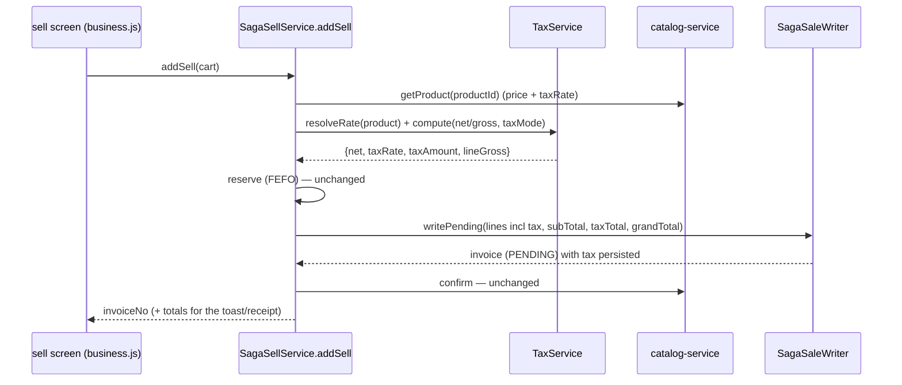
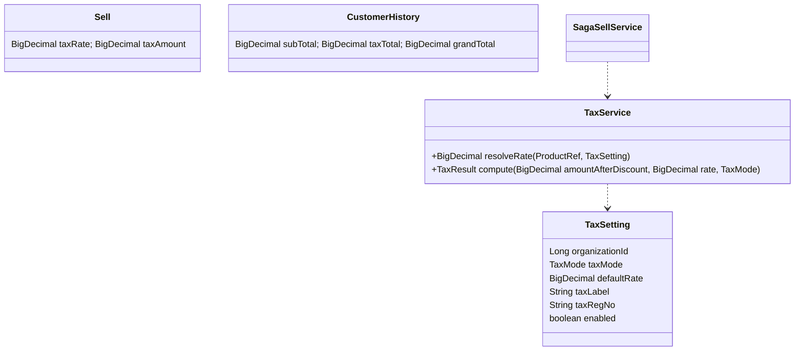

# Slice 35 — G3: Tax engine (apply tax to the sale + invoice)

Part of the **commerce gaps** sequence → Phase 1 shared core (see `commerce-verticals-blueprint.md`). Order:
G1 ✅ → G2 ✅ → **G3 (this slice)** → G5 payments → receipts → day-close.

Tax is **legally required** on retail + pharmacy receipts (and later e-commerce checkout), so it lifts all three
verticals at once. Today `Product.taxRate` (and `ProductRef.taxRate`) is stored but **never applied** — the saga
prices from catalog and ignores tax.

## Decision (chosen model)

**Configurable, single-rate per product.**
- Per-org **`taxMode`**: `EXCLUSIVE` (tax added on top of the price) or `INCLUSIVE` (price already includes tax → back it out).
- One **rate per product**, resolved: `product.taxRate` → **org default rate** (Category-level rate is a 🔭 future
  fallback — `Category` has no `taxRate` today).
- Schema is additive and designed to extend to **multi-component** tax (CGST/SGST, HSN) later without rework.

### Math (per line, after discount; BigDecimal, scale 2, HALF_UP)

```
let rate = resolveRate(product)          // %, e.g. 17.00
EXCLUSIVE:  net = lineAmountAfterDiscount
            tax = round(net * rate/100)
            lineGross = net + tax
INCLUSIVE:  gross = lineAmountAfterDiscount      // price already includes tax
            net   = round(gross / (1 + rate/100))
            tax   = gross - net
Invoice:    subTotal = Σ net ; taxTotal = Σ tax ; grandTotal = Σ lineGross  (= subTotal + taxTotal)
```

> Note on existing fields: `Sell.netAmount` is **profit** (legacy) and `Sell.totalAmount` is qty×rate — G3 does
> **not** repurpose them. Tax gets its **own** explicit fields so nothing legacy breaks.

## Schema (additive)

| Entity | New fields | Notes |
|---|---|---|
| `Sell` (business) | `taxRate` (DECIMAL 19,2), `taxAmount` (DECIMAL 19,2) | per-line applied rate + tax |
| `CustomerHistory` (business) | `subTotal`, `taxTotal`, `grandTotal` (DECIMAL 19,2) | invoice money summary for receipt + tax report |
| **`TaxSetting`** (business, NEW, org-scoped) | `organizationId`, `userId`, `taxMode` (EXCLUSIVE/INCLUSIVE), `defaultRate` (DECIMAL 19,2), `taxLabel` (e.g. "VAT"/"GST"/"Sales Tax"), `taxRegNo` (printed on receipt), `enabled` | one row per org; mirrors education `FeeSetting` pattern |

All org-scoped (`findScoped` NULL-fallback), additive columns (dev `ddl-auto` adds; Flyway forward-mig per slice 30
for `validate`). New `TaxSetting` unique on `(organization_id)`.

## Flow





## Files to change

| Module | File | Change |
|---|---|---|
| business | `entity/TaxSetting` (+ `TaxMode` enum), repo, service, controller | org tax config CRUD (`/getTaxSetting`, `/saveTaxSetting`) |
| business | `service/TaxService` | `resolveRate` + `compute` (EXCLUSIVE/INCLUSIVE) — pure, unit-tested |
| business | `service/SagaSellService` | compute tax per line; pass tax into `SagaLine`; total subTotal/taxTotal/grandTotal |
| business | `service/SagaLine` | + `taxRate`, `taxAmount`, `lineGross` |
| business | `service/SagaSaleWriter` | persist `Sell.taxRate/taxAmount` + `CustomerHistory.subTotal/taxTotal/grandTotal` |
| business | `entity/Sell`, `entity/CustomerHistory`, DTOs | additive tax fields |
| business | `controller/SellController` getUserSell | expose tax fields in the read JSON |
| UI | `businessDashboard.html` + `business.js` | **sell screen**: show tax per line + tax total + grand total live; **Tax Settings** panel (mode/rate/label/regNo); **receipt** shows tax breakdown + label + regNo |
| UI | sells table | optional Tax column |
| business | analytics/report | **tax collected** report (period, by rate) — or extend sale report |

## Tests (`mvn test`)

- **`TaxServiceTest`** (pure, always-runs): EXCLUSIVE adds on top; INCLUSIVE backs out (e.g. 117.00 @17% → net 100.00, tax 17.00); rounding HALF_UP scale 2; rate resolution product→org-default; `enabled=false` → zero tax.
- **business saga test**: `addSell` persists per-line `taxAmount` and invoice `taxTotal`/`grandTotal` (extend `@SpringBootTest` saga test).
- **Cypress** (headed): make a sale with tax on → invoice/receipt shows tax line + grand total.

## Out of scope (later)
- Multi-component tax (CGST/SGST/IGST), HSN codes, tax-by-category — additive on this schema.
- Tax on **purchase** (input tax credit) — separate slice.
- Refund tax handling joins with **G5** (refund money) — note the seam.

## Status
- [x] Decision (configurable single-rate, EXCLUSIVE/INCLUSIVE)
- [x] Design (this doc)
- [x] `TaxSetting` + `TaxMode` + `TaxSettingRepo` + `TaxService` (+ `TaxResult`, `TaxSettingDTO`)
- [x] `TaxServiceTest` (pure: exclusive/inclusive/rounding/rate-resolution/disabled — always runs)
- [x] Saga wiring: `SagaLine` tax fields, `SagaSellService` computes per line, `SagaSaleWriter` persists line tax + invoice subTotal/taxTotal/grandTotal
- [x] Entity + DTO tax fields (`Sell`, `CustomerHistory`, `SellDTO`, `CustomerHistoryDTO`) — surfaced via ModelMapper in `getUserSell`
- [x] `TaxSettingController` (`/getTaxSetting`,`/saveTaxSetting`) + monolith proxy
- [x] Updated `SagaSellServiceTest` for the new `TaxService` dependency
- [x] UI: **Tax Settings** panel (owner-only nav + form + load/save JS); **Tax column** on the sells list
- [ ] **Build + verify (user runs)**

### Migration
New `tax_setting` table + additive columns (`sell.tax_rate/tax_amount`, `customer_history.sub_total/tax_total/grand_total`).
Dev `ddl-auto` adds them automatically. When business-service flips to Flyway `validate` (slice-30 follow-up), add a
forward migration creating the table + columns.

### Deferred (correctly scoped to later slices)
- **Tax on the receipt** → the dedicated **receipts (thermal/A4)** Phase-1 slice (today's only printer is a
  client-specific legacy one gated to `userId==37`; a general template is built there).
- **Settlement**: paid/due vs `grandTotal` (EXCLUSIVE tax increases what's owed) is finalised in **G5 (payments)** —
  G3 captures & displays tax; G5 makes tender settle the grand total.
- **Live pre-submit tax estimate** on the sell cart (authoritative tax is computed server-side; list + receipt show it).
- Tax report (sales tax collected by period/rate) — fold into the reporting suite.
