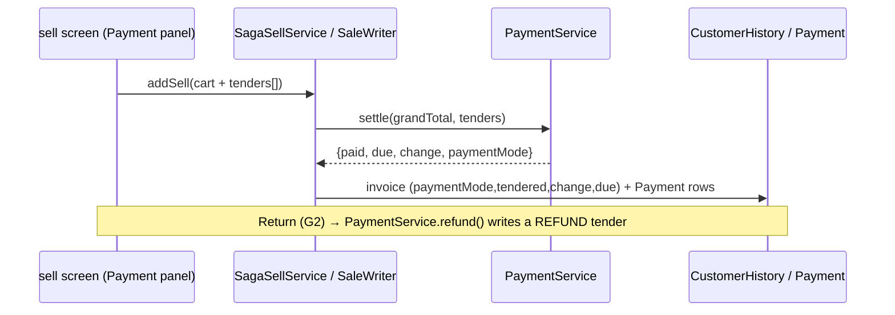

# Slice 37 — G5: Payments / tender (record how a sale is paid + settle the grand total)

Phase 1 shared core (see `commerce-verticals-blueprint.md`). Order: G1 ✅ → G2 ✅ → G3 ✅ → **G5 (this slice)** →
receipts → day-close. Built **vertical-aware** on the slice-36 single dashboard (POS "Payment", pharmacy "Payment",
store "Payment/Checkout").

Today nothing records *how* a sale was paid. `CustomerHistory` has `paidAmount`/`dueAmount`; `receivedAmount`/
`changeAmount` are transient (not persisted). There is no payment method (cash/card/credit/wallet), no tender record,
and returns (G2) restore **stock** but never record a money **refund**.

## What this adds

1. **Payment method on the sale** — record the tender(s): `CASH`, `CARD`, `CREDIT` (on account → due), `WALLET`,
   `BANK_TRANSFER`.
2. **Settle against the G3 grand total** — `paid = Σ non-credit tenders`; `due = grandTotal − paid`; cash `change =
   received − amountDue`. This finalises the G3 seam (tax increases what's owed).
3. **Refund on return** — a return (G2) records a refund tender (negative/`REFUND`) so the money side matches the
   restored stock.

## Decision needed (tender model) — see question on submission

- **A. Split-capable** — a `Payment` child entity (one invoice → many tenders), so part-cash + part-card works;
  `CustomerHistory.paymentMode` holds the summary (`CASH`/`CARD`/…/`SPLIT`). Industry-standard POS, additive.
- **B. Single method** — just `CustomerHistory.paymentMode` + `tenderedAmount`/`changeAmount`. Simplest; no split.

(The design below assumes **A**; if **B** is chosen, drop the `Payment` table and keep the summary fields only.)

## Schema (additive)

| Entity | New fields | Notes |
|---|---|---|
| `CustomerHistory` | `paymentMode` (CASH/CARD/CREDIT/WALLET/BANK_TRANSFER/SPLIT/REFUND), `tenderedAmount`, `changeAmount` (DECIMAL 19,2) | summary on the invoice; `due` already exists |
| **`Payment`** (NEW, A only) | `id`, `customerHistoryId` (FK), `method`, `amount` (DECIMAL 19,2), `reference` (card/txn no), `organizationId`, `userId`, `dated` | one row per tender; refunds are `REFUND`/negative |

Org-scoped, additive columns (`ddl-auto: update` adds them in dev; Flyway forward-mig when business flips to `validate`).

## Settlement (BigDecimal, scale 2)

```
amountDue   = invoice.grandTotal            (G3; falls back to Σ line totals for legacy/no-tax)
paid        = Σ tenders where method != CREDIT
due         = max(0, amountDue − paid)
change      = method==CASH ? max(0, tendered − amountDue) : 0
paymentMode = (1 tender) ? that method : SPLIT
```
Customer running balance (`Customer.dueAmount`) reconciles via the existing `recomputeDue`.

## Flow



## Files

| Module | File | Change |
|---|---|---|
| business | `entity/PaymentMethod` (enum), `entity/Payment` (A), repo | tender model |
| business | `service/PaymentService` | `settle(grandTotal, tenders)` (pure) + persist; `refund(invoice, amount)` |
| business | `service/SagaSellService` + `SagaSaleWriter` | accept tenders, settle, persist payment summary + rows |
| business | `dto/CustomerHistoryDTO`, `SellController.saleReturn` | tenders in; refund on return |
| business | `entity/CustomerHistory` (+ DTO) | paymentMode/tendered/change fields |
| UI | `businessDashboard.html` + `business.js` | **Payment panel** at checkout: method buttons (Cash/Card/Credit/…), amount tendered, live change/due; split rows (A); shown via vertical profile wording |
| UI | sells list | Payment column (mode) |

## Tests (`mvn test`)
- **`PaymentServiceTest`** (pure): single CASH change; CREDIT → full due; SPLIT cash+card → paid sum, due 0;
  refund → negative tender; settle against grandTotal incl. tax.
- saga test: tenders persisted + invoice paymentMode/due correct.
- Cypress (headed): cash sale shows change; credit sale shows due; (A) split tender.

## Vertical-aware (slice 36)
Payment panel labels via the profile (`Sale`→`Dispense`/`Order` already mapped; add `Payment`/`Tender` terms as
needed). E-commerce later swaps offline tender for an online PSP (blueprint Phase 3) — same `Payment` model,
method `WALLET`/gateway.

## Out of scope (later)
- Online payment gateway/PSP (e-commerce, Phase 3). Insurance/co-pay (pharmacy). Tax on the receipt (receipts slice).

## Status
- [x] Design (this doc)
- [x] Decision: **A — split-capable** (Payment table)
- [x] `PaymentMethod` + `Payment` + `PaymentRepo` + `PaymentService` (settle/record/refund) + `TenderDTO`/`SettleResult`
- [x] `PaymentServiceTest` (pure: cash/overpay/credit/split/partial/none/unknown — always runs)
- [x] Saga wiring (`SagaSaleWriter` settles against G3 grandTotal, persists tenders; backward-compatible when no tenders) + `CustomerHistory`/DTO fields
- [x] Refund on return (`SellController.saleReturn` → `PaymentService.refund`, proportional to returned qty)
- [x] UI: checkout **Payment Method** selector → `tenders` on addSell (monolith `CustomerHistoryDTO`/`TenderDTO` round-trip) + **Payment column** on the sells list
- [ ] Build + verify (user runs)

### Notes
- **UI is single-tender for now** (method + amount received → one tender). The backend is fully split-capable
  (multiple `Payment` rows); a split-tender UI (add-row) is a small follow-up.
- Settlement runs **only on the saga path** (saga enabled) and **only when tenders are sent** — legacy/no-tender
  sales keep their existing paid/due, so nothing regresses.
- Migration: new `payment` table + `customer_history` columns — `ddl-auto: update` adds them; Flyway forward-mig when
  business flips to `validate`.
