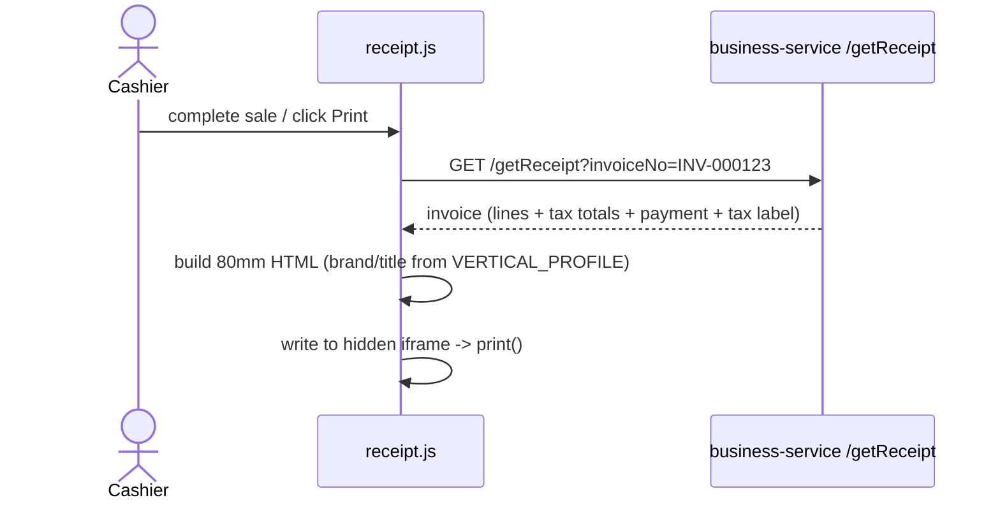

# Slice 38 — Receipts (printable, vertical-aware) [G6]

Phase 1 shared core (see `commerce-verticals-blueprint.md`): G1✅ G2✅ G3✅ G5✅ → **receipts (this slice)** →
POS day-close. A real receipt finally surfaces **G3 tax** + **G5 payment** on a printable document, on the single
dashboard (slice 36), white-labelled per vertical.

## Problem
The only printer was a **client-specific legacy** one (`businessInvoicePrint.js`, gated to `userId==37`,
"Haider Garments"). There was no general receipt, and tax/tendered/change/grand-total were never shown.

## Design
- **One data source** — `GET /getReceipt?invoiceNo=` (business-service) returns the authoritative invoice: lines
  (with per-line tax + item name, saga **and** legacy), the G3 `subTotal/taxTotal/grandTotal`, the G5
  `paymentMode/tenderedAmount/changeAmount`, and the tax `label`/`regNo` from `TaxSetting`. Tenant-scoped +
  role-aware (anti-IDOR), by the per-org invoice number.
- **Renderer** — `receipt.js`: fetches `/getReceipt`, builds an 80mm thermal HTML receipt and prints via a
  **hidden iframe** (no popup blocked; works right after an AJAX sale). Header brand + title come from the active
  vertical profile (`window.VERTICAL_PROFILE`): POS "SALES RECEIPT", Pharmacy "DISPENSE RECEIPT", Store "ORDER
  RECEIPT".
- **Triggers** — auto-print after a new sale (`addSell` success in `main.js`); **Print** button per row on the sells
  list (uses the row's invoice number).

## Files
| Module | File | Change |
|---|---|---|
| business | `CustomerHistoryRepo` | `findByOrganizationIdAndInvoiceNo` |
| business | `SellController` | `GET /getReceipt` (+ inject `TaxService`, `CustomerHistoryRepo`) |
| business | `CustomerHistoryDTO` | transient `taxLabel`, `taxRegNo` |
| monolith | `controller/business/SellController` | `/getReceipt` proxy |
| monolith | `static/js/business/receipt.js` (new) | fetch + render + iframe print |
| monolith | `module-theme.js` | `receiptTitle` per vertical; expose `window.VERTICAL_PROFILE` |
| monolith | `business.js` | per-row **Print** button (in the Actions cell) |
| monolith | `main.js` | auto-print after `addSell` |
| monolith | `businessDashboard.html` | load `receipt.js` |

## Tests
- Cypress (headed): complete a sale → receipt iframe prints; reprint from the list; pharmacy login → "DISPENSE
  RECEIPT" wording. (`/getReceipt` composes already-unit-tested tax (G3) + payment (G5) values.)

## Out of scope (later)
- A4 / configurable paper size + org logo/address on the header (needs an org-profile store).
- Email/PDF receipt; retire the legacy `businessInvoicePrint.js` after parity is confirmed.

## Status
- [x] Design (this doc)
- [x] `/getReceipt` endpoint + repo finder + DTO fields + monolith proxy
- [x] `receipt.js` renderer (thermal, iframe print, vertical brand/title)
- [x] Print button (list) + auto-print after sale
- [x] Build + verify + **Cypress green** (headed Chrome): commerce-gaps.cy.js 8/8, vertical-profile.cy.js 2/2 (2026-06-23)
