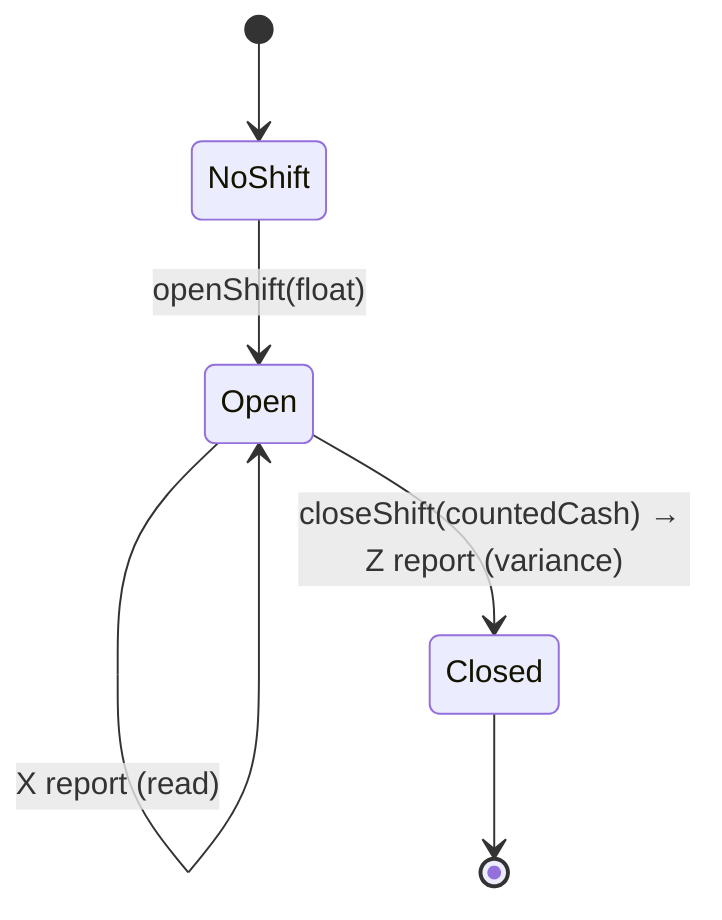

# Slice 39 — POS day-close: cashier shift + cash drawer + X/Z report

Phase 1 shared core (see `commerce-verticals-blueprint.md`): G1✅ G2✅ G3✅ G5✅ receipts✅ → **day-close (this
slice)**. The last piece that makes the POS a real till: a cashier **opens a shift** with a cash float, sells during
it, records cash in/out, then reads an **X report** (mid-shift) or **closes** with a **Z report** (counted vs
expected cash → variance). Vertical-aware on the single dashboard (slice 36). **Park/void is a separate slice (40).**

## Model (business-service, org-scoped)

| Entity | Fields |
|---|---|
| **`CashierShift`** | `id`, `organizationId`, `userId` (cashier), `openingFloat`, `openedAt`, `closedAt`, `status` (OPEN/CLOSED), `countedCash`, `expectedCash`, `variance`, `notes` |
| **`CashMovement`** | `id`, `organizationId`, `userId`, `shiftId`, `type` (PAY_IN/PAY_OUT/DROP), `amount`, `reason`, `dated` |
| `CustomerHistory` | **+ `shiftId`** — the sale is stamped with the cashier's open shift (null if none open) |

One **OPEN** shift per cashier at a time. New columns are additive (`ddl-auto: update`).

## Report (X = read, Z = close)

```
sales      = COUNT + Σ grandTotal + Σ taxTotal   (CustomerHistory where shiftId = shift)
byMethod   = Σ Payment.amount grouped by method  (CASH/CARD/CREDIT/WALLET/BANK_TRANSFER/REFUND)
payIns     = Σ CashMovement PAY_IN ; payOuts = Σ PAY_OUT ; drops = Σ DROP
expectedCash = openingFloat + byMethod[CASH] + byMethod[REFUND] (neg) + payIns − payOuts − drops
variance     = countedCash − expectedCash         (Z only)
```
Card/wallet/bank tenders don't affect drawer cash. X report is non-finalising; Z sets `status=CLOSED`,
`closedAt`, `countedCash`, `expectedCash`, `variance`.

## Flow



## API (business-service + monolith proxy)
- `POST /openShift` `{openingFloat}` → the open shift
- `GET /currentShift` → the cashier's open shift (or none)
- `POST /cashMovement` `{type, amount, reason}` → adds a drawer movement (needs an open shift)
- `GET /shiftReport` → **X**: live totals for the open shift
- `POST /closeShift` `{countedCash, notes}` → **Z**: closes + returns the final report

`SagaSaleWriter` stamps `ch.shiftId` from the cashier's open shift (lookup by org+user); sales still allowed with no
open shift (`shiftId` null) — opening a shift is encouraged, not enforced (configurable later).

## UI (single dashboard, vertical-aware)
- New **Cashier / Till** nav (owner+cashier): Open Shift (float) · Cash In/Out · **X Report** · **Close (Z)**.
- Shift status banner (open since / expected cash). Z shows counted-vs-expected variance.
- Labels via the vertical profile (POS "Cash Drawer", pharmacy "Till", etc.).

## Tests
- **`ShiftServiceTest`** (pure where possible): expectedCash math (float + cash sales − payouts/drops + refunds);
  variance; one-open-shift guard.
- **Cypress (headed, slow-mo):** open shift → currentShift reflects it → cash movement → X report totals →
  close → Z variance. API-level asserts (robust to empty DB).

## Status
- [x] Design (this doc)
- [x] Entities (`CashierShift`/`CashMovement` + `ShiftStatus`/`MovementType`) + repos + `ShiftService` + `ShiftServiceTest`
- [x] `ShiftController` + monolith proxies; `SagaSaleWriter` stamps `shiftId`; `CustomerHistory.shiftId`; aggregation queries
- [x] UI: **Till** nav + Cash Drawer panel (`till.js`) — open/cash-in-out/X/Z
- [x] Build + restart + **Cypress green** (headed Chrome, slow-mo): day-close.cy.js 3/3; commerce-gaps 8/8 + vertical-profile 2/2 no regression (2026-06-23)
