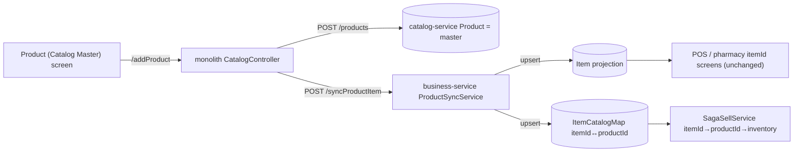

# Slice 53 — Product-master sync (Item→Product convergence, low-risk path)

**Decision (2026-06-26):** instead of the high-risk full picker/stock rewire (M2→M4), converge by making the
catalog **`Product` the authoritative master** and auto-projecting a bridged business **`Item`** whenever a Product
is registered/edited. Every vertical reads one master; the deeply itemId-wired sell/purchase/stock screens keep
working **untouched** (they read the projected Item; the saga already maps itemId→productId). Retiring Item /
local-Stock stays deferred. Reuses the existing `ItemCatalogMap` bridge — only adds the **reverse** direction.

## Direction added
Today the bridge runs **Item→Product** (`CatalogMigrationService`). This adds **Product→Item**:

Register once as a Product → it appears in the POS picker (as the projected Item) and **sells through the shared
saga + inventory** — the same path POS/storefront/pharmacy already use.

## Changes
- **business-service**
  - `ItemCatalogMapRepo.findByProductId(productId, org)` (reverse lookup, org-scoped, idempotency).
  - `ProductSyncService.syncFromProduct(dto, org, user)` — upsert the projected `Item` (iname/icode/idesc/unit/
    category) + `ItemCatalogMap` (stockMigrated=true: product-native, stock lives in inventory, no local Stock to
    seed). Idempotent on (org, productId).
  - `ItemController POST /syncProductItem` → returns the itemId.
- **monolith** `CatalogController.addProduct` — after creating the Product, calls `/syncProductItem` (best-effort:
  a sync failure logs but doesn't fail the registration). Adds `BusinessRestClient`.

## Tests
- `ProductSyncServiceTest` (Testcontainers): first sync creates Item+map; re-sync updates the Item, no dup map.
- Cypress `product-master-sync.cy.js` (headed): register a Product → the projected **Item appears in the POS list**
  → stock it → **sell it via the saga** (on-hand 10→9). One registration, sells in POS through the shared core.

## Status
- [x] Design (this doc)
- [x] business-service: `ItemCatalogMapRepo.findByProductId`, `ProductSyncDTO`, `ProductSyncService`,
      `ItemController POST /syncProductItem` + `ProductSyncServiceTest` (Mockito, always-runs)
- [x] monolith: `CatalogController.addProduct` projects the Item (best-effort) via `BusinessRestClient`
- [x] Cypress `product-master-sync.cy.js` authored (Product → projected Item in POS → sells via saga, on-hand 10→9)
- [x] **Cypress green (headed, 2026-06-26): product-master-sync 2/2 + catalog-product 2/2 + catalog-product-stock 2/2 regression.**

## Deferred (unchanged from slice 42)
- M3 retire local `Stock` (inventory-only), M4 retire `Item`/`ItemCatalogMap`, M5 pharmacy on Product. The master
  is now Product with auto-projection, so these become cleanups rather than blockers.
