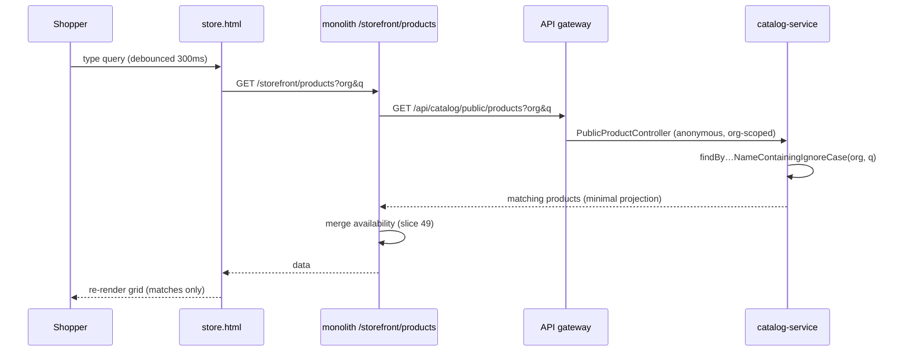

# Slice 60 — Storefront product search

The storefront grid lists every product; there's no way to find one in a large catalog. This adds a **name search**
(case-insensitive contains) to the public browse — the achievable half of the blueprint's E1 "needs media + search".
No auth/upload/email infra.

## Design (sequence)

## Changes
- **catalog-service** — `ProductRepository.findByOrganizationIdAndIsActiveTrueAndNameContainingIgnoreCaseOrderByNameAsc`;
  `PublicProductController GET /products` accepts an optional `q` (blank → full list, as before).
- **monolith** — `StorefrontController.products` forwards `q` to the catalog public endpoint (availability merge unchanged).
- **store.html** — a search box above the grid; typing re-fetches `/storefront/products?org=&q=` and re-renders
  (debounced).

## Tests
- Cypress `storefront-search.cy.js` (headed): seed two products → `q=<one name>` returns only that one; empty `q`
  returns both; the store page's search box filters the grid.

## Status
- [x] Design (this doc)
- [x] catalog repo search method + `PublicProductController` q; monolith `StorefrontController` q passthrough;
      store.html search box (debounced `loadStoreProducts`)
- [x] Cypress `storefront-search.cy.js` authored
- [x] **Cypress green (headed, 2026-06-26): storefront-search 2/2 + storefront 4/4 regression.**
- Note: catalog + monolith only; no contract/inventory/business/migration change.

## Deferred
- Category/price filters, sort options, pagination; product media/SEO (E2). This slice is name search only.
