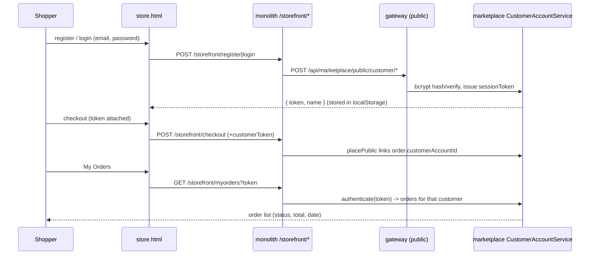

# Slice 61 — Storefront customer accounts (E4, self-contained)

Shoppers can **register / log in** at a store and see **their order history** — without the staff auth-service (whose
signup creates an org/tenant, wrong for a shopper). A lightweight, **store-scoped** customer identity lives in
marketplace-service: BCrypt password, an opaque session token, orders linked to the account.

## Model
- `StorefrontCustomer` (id, organizationId = the store, email, passwordHash [BCrypt], name, sessionToken, createdAt);
  unique `(organizationId, email)` — the same email can shop at different stores.
- `Order.customerAccountId` (nullable) — set when a logged-in shopper checks out.

## Flow

## API (marketplace, all under the existing public allow-list)
- `POST /public/customer/register {organizationId,email,password,name}` → `{token,name,email}` (dup → 400).
- `POST /public/customer/login {organizationId,email,password}` → `{token,name,email}` (bad creds → 401-style).
- `GET /public/customer/orders?token=` → the customer's orders (newest first); invalid token → not authorized.
- `placePublic` accepts an optional `customerToken`; a valid one stamps `order.customerAccountId`.
- monolith proxies: `/storefront/register`, `/storefront/login`, `/storefront/myorders`.

## UI (store.html)
- An account panel: register/login (email, password, name); on success store `{token,name}` in localStorage, show
  "Hi <name>" + a **My Orders** list; checkout sends the token when logged in.

## Tests
- `CustomerAccountServiceTest` (Testcontainers): register hashes (not plaintext) + dup rejected; login verifies,
  wrong password rejected; token authenticates; orders are scoped to the account.
- Cypress `storefront-account.cy.js` (headed): register → login → checkout (linked) → My Orders shows the order;
  wrong password fails.

## Status
- [x] Design (this doc)
- [x] `StorefrontCustomer` + repo + `CustomerAccountService` (BCrypt + token) + `PublicCustomerController`;
      `Order.customerAccountId` + `OrderDTO.customerToken` + `placePublic` link + `OrderService.listForCustomer`;
      monolith `/storefront/register|login|myorders` proxies; store.html account panel; `CustomerAccountServiceTest`
- [x] Cypress `storefront-account.cy.js` authored
- [x] **Cypress green (headed, 2026-06-26): storefront-account 2/2 + storefront-track 2/2 + storefront-saga 3/3 regression.**
- Note: marketplace + monolith only. `ddl-auto: update` creates `storefront_customer` + `orders.customer_account_id`
  (no manual migration). Gateway/SecurityConfig already permit `/public/**`.

## Security notes / deferred
- BCrypt for passwords; opaque random session token (single active session per customer). Deferred: token hashing
  at rest, multi-session, email verification, password reset, rate-limiting. ddl-auto creates the new table/column
  (no manual migration).
