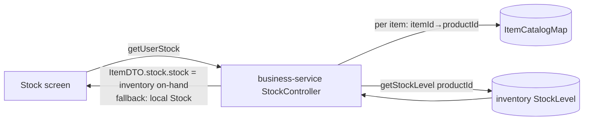

# Slice 62 — M3.1: Stock screen reads inventory on-hand

First strangler step of M3 (retire local `Stock` → inventory as the single source). **Additive, low-risk:** the
Stock *list* (`getUserStock`) now shows each item's **inventory** on-hand (what the saga actually sells), not the
local `Stock` quantity — mirroring what single `getStock` already does (slice 33 U4). Nothing is removed yet; local
`Stock` still backs writes. Sets up M3.2–M3.4.

## Changes
- **inventory-service** `GET /stock/levels` → `Map<productId, currentStock>` for the whole tenant in one query
  (`StockService.getAllLevels`); `InventoryClient.getStockLevels()`.
- **business-service** `getUserStock`: **batch** — one `getStockLevels()` call + one `ItemCatalogMap` query build a
  productId→on-hand and itemId→productId map *before* the loop; each `ItemDTO.stock.stock` is set from inventory
  (create a `StockDTO` if the item has no local Stock row). Best-effort fallback to local.
  > First attempt did a `getStockLevel` HTTP call **per item** → for a large catalog it timed out and tripped the
  > gateway circuit-breaker ("Service temporarily unavailable"). Cypress caught it; fixed by batching to one call.

## Tests
- Cypress `business/stock-inventory-read.cy.js` (headed): register a product (master-sync projects the Item), stock it
  in inventory to N, then `getUserStock` reports that item's on-hand = N (sourced from inventory).

## Status
- [x] Design (this doc)
- [x] inventory `/stock/levels` batch + `getUserStock` batched enrichment + Cypress `stock-inventory-read.cy.js`
- [x] **Cypress green (headed, 2026-06-27): stock-inventory-read 1/1 + stock 19/19 + saga-sell 3/3.**
      (Fixed `stock.cy.js`'s on-hand assertion which read the StockDTO object instead of `.stock`.)

## Deferred (later M3 steps)
- M3.2 purchase stock-in → inventory only; M3.3 stop writing local `Stock`; M3.4 delete the `Stock` entity.
- Batch on-hand lookup (one call for the whole list) instead of per-item `getStockLevel`.
