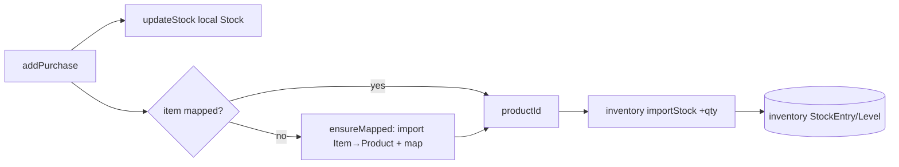

# Slice 63 — M3.2: purchase stock-in is authoritative in inventory

Second strangler step of M3. A POS purchase already dual-writes local `Stock` + inventory, but the inventory push
was **skipped for unmapped items** (legacy items never bulk-migrated). M3.2 makes the purchase **auto-map** the item
to a catalog product on demand, so **every** purchase reaches inventory — inventory becomes the authoritative
stock-in record. Local `Stock` is still written (removed in M3.3); the Stock screen already reads inventory (M3.1).

## Changes
- **business-service** `CatalogMigrationService.ensureMapped(itemId, org, user)` — return the item's productId,
  importing it to catalog + recording the `ItemCatalogMap` on demand (idempotent). `PurchaseService.pushPurchaseToInventory`
  now calls `ensureMapped` (instead of only pushing already-mapped items), so an unmapped item's purchase still lands
  in inventory. Best-effort: a catalog/inventory failure never fails the purchase.

## Tests
- `CatalogMigrationServiceTest` (Mockito): mapped → returns existing productId (no import); unmapped → imports + maps.
- Cypress `business/purchase-inventory.cy.js` (headed): create a **legacy (unmapped) Item**, purchase qty 6 →
  inventory on-hand 6, and the item is now **sellable via the saga** (addSell 2 → on-hand 4) — proving the purchase
  auto-mapped it and stocked inventory.

## Status
- [x] Design (this doc)
- [x] `ensureMapped` (REQUIRES_NEW) + `pushPurchaseToInventory` auto-map + `CatalogMigrationServiceTest` + Cypress `purchase-inventory.cy.js`
- [x] **Cypress green (headed, 2026-06-27): purchase-inventory 1/1 + purchase 19/19 + saga-sell 3/3 + stock-inventory-read 1/1.**
- **Diagnosis note:** first run failed at `updateStock` (`ModelMapper source cannot be null`) — the test sent FLAT
  fields, but the purchase form binds NESTED `stock.*` (PurchaseDTO.stock). Fixed the test. Also made `ensureMapped`
  `REQUIRES_NEW` so a catalog failure can't mark the purchase tx rollback-only (honors the best-effort guarantee).
  (Existing purchase.cy.js masked this by asserting only HTTP 200, not body status.)

## Deferred (later M3 steps)
- M3.3 stop writing local `Stock`; M3.4 delete the `Stock` entity. (After M3.2, inventory holds every purchase, so
  removing local Stock no longer loses data.)
