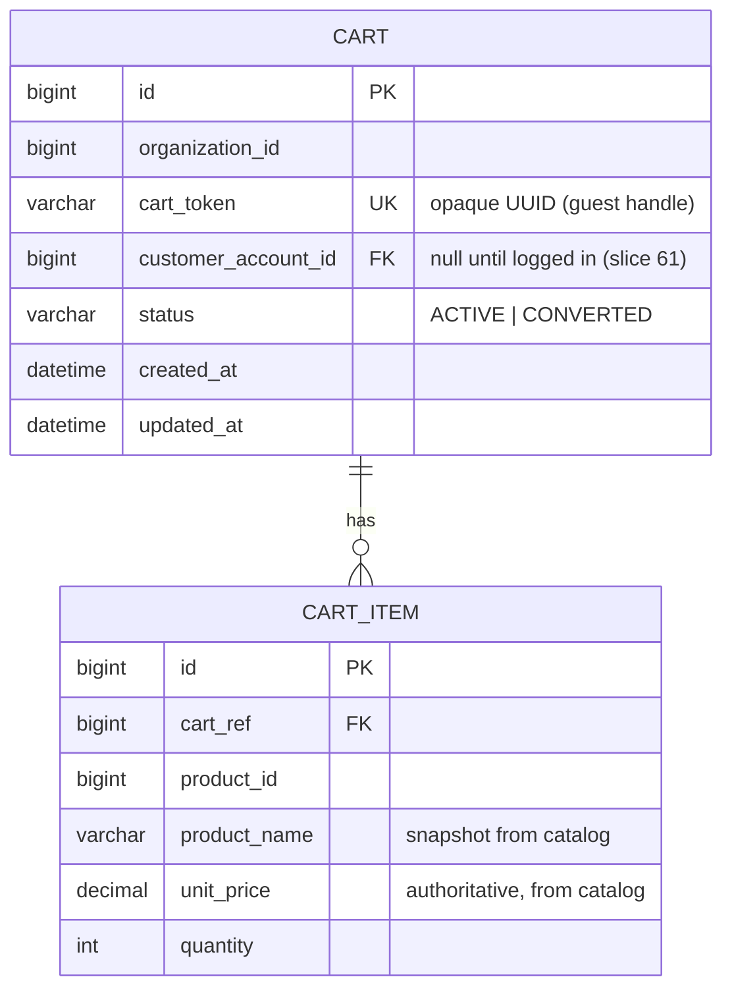

# Slice 68 — E-commerce Cart (E3): persistent server-side cart

**Goal (blueprint E3):** *Cart — add/update/remove, persisted for guest + account.* Today the storefront cart is a
client-side JS object (`cart = {}`) lost on reload and invisible to the server. This slice makes the cart a
**persistent, server-owned** resource: it survives reloads, follows a shopper across devices once they log in, and
prices items **authoritatively from catalog** (no trust in client-sent prices).

Scope boundary: this is the **cart**, not checkout. Address/shipping/tax-at-checkout is **E5** (next slice). On
checkout the cart is handed to the existing `placePublic` order flow and marked `CONVERTED`.

## Reuse-first
- **CatalogClient.getProduct(id) → ProductRef** (name, sellingPrice, taxRate) for authoritative line pricing — the
  same contract POS/pharmacy use. New `CatalogClient` bean in `MarketplaceClientsConfig` (load-balanced, like the
  existing `InventoryClient`).
- **Guest token** mirrors the slice-61 `StorefrontCustomer.sessionToken` pattern (opaque UUID in `localStorage`).
- **`/api/marketplace/public/**`** is already gateway-allow-listed (JwtAuthenticationFilter) and the service permits
  `/public/**` — so `/public/cart/**` needs **no** gateway/security change.
- **Flyway discipline (now `validate` in dev):** new tables ship as marketplace **V3** migration; entities match.

## Data model



One **ACTIVE** cart per `(org, cart_token)`. A cart links to an account (`customer_account_id`) when the shopper is
logged in; a guest cart **merges** into the account cart on login.

## Add-to-cart flow (authoritative pricing)

```mermaid
sequenceDiagram
    participant B as Storefront (store.html)
    participant M as Monolith /storefront/cart/*
    participant G as Gateway
    participant MP as marketplace-service CartService
    participant C as catalog-service

    B->>M: POST /storefront/cart/add {org, cartToken?, customerToken?, productId, qty}
    M->>G: POST /api/marketplace/public/cart/add
    G->>MP: /public/cart/add (no JWT; public)
    MP->>MP: getOrCreate(cartToken, customerToken, org)
    MP->>C: CatalogClient.getProduct(productId)  (runAs store org)
    C-->>MP: ProductRef{name, sellingPrice}
    MP->>MP: upsert line (name+price snapshot), bump qty
    MP-->>B: CartDTO {cartToken, items[], subtotal}
    B->>B: localStorage sfCart_<org> = cartToken; render
```

## Endpoints (marketplace `PublicCartController`, under `/public/cart`)
| Method | Path | Body / params | Returns |
|---|---|---|---|
| POST | `/public/cart/add` | `{organizationId, cartToken?, customerToken?, productId, quantity?}` | CartDTO |
| POST | `/public/cart/update` | `{organizationId, cartToken, productId, quantity}` (qty≤0 removes) | CartDTO |
| POST | `/public/cart/remove` | `{organizationId, cartToken, productId}` | CartDTO |
| GET | `/public/cart` | `?organizationId=&cartToken=&customerToken=` | CartDTO |

Monolith proxies each at `/storefront/cart/{add,update,remove}` + `GET /storefront/cart`.

CartDTO: `{ cartToken, customerLinked, items:[{productId, name, unitPrice, quantity, lineTotal}], subtotal, count }`.

## Checkout hand-off (minimal, full checkout = E5)
`OrderDTO` gains an optional `cartToken`. After a successful `placePublic`, `CartService.markConverted(cartToken)`
(best-effort) empties/closes the cart so a placed order can't be re-ordered from a stale cart. Order items continue
to come from the request for now (server-sourced checkout + address/shipping/tax is E5).

## Org-scoping & safety
- Every cart op is `(org, cart_token)`-scoped; a token from another org never resolves.
- Prices/names are resolved **server-side** from catalog — client-sent prices are ignored for the cart.
- Stock is **not** held by the cart (reservation happens at checkout via the existing E7 saga); the cart caps qty to
  available only as a UX hint client-side.

## Tests
- **CartServiceTest** (pure Mockito, always runs): add creates+prices a line; add again increments; update sets/zeroes
  (removes); remove deletes; guest cart **merges** into the account cart on login; unknown product rejected.
- **Cypress `storefront-cart.cy.js`** (headed): add items → reload page → cart persists (server-backed); change qty;
  remove; checkout empties the cart.

## Status
- [x] Design (this doc)
- [x] marketplace: Cart/CartItem + CartRepository + CartService + PublicCartController + CatalogClient bean + **V3
      migration** (full-chain applied clean on a throwaway DB; types match validate)
- [x] OrderDTO.cartToken + placePublic markConverted
- [x] monolith StorefrontController proxies (`/storefront/cart` + add/update/remove) + store.html server-backed cart
- [x] CartServiceTest (pure Mockito, 7 cases) authored
- [ ] **Awaiting build + headed Cypress** (`storefront-cart.cy.js`): rebuild marketplace-service (V3 creates
      cart/cart_item) + monolith (controller + store.html), then run the gate.
