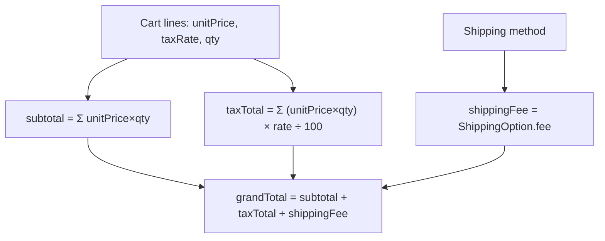

# Slice 69 — E-commerce Checkout (E5): server-authoritative totals

**Goal (blueprint E5):** *Checkout — address, shipping method, tax, totals → order via the saga.* Today checkout posts
the client's items + total to `placePublic`, which trusts them. This slice makes checkout **server-authoritative**: the
order is sourced from the **server cart** (slice 68), tax is computed from each product's rate, shipping is a
server-priced method, and the grand total is computed server-side. A **quote** endpoint powers live totals before the
shopper commits.

## Reuse-first & boundaries
- **Cart (slice 68)** is the source of truth for line items + prices — the client no longer sends items/total.
- **Tax** mirrors the G3 EXCLUSIVE math (`tax = net × rate ÷ 100`, scale 2, HALF_UP) using each line's product
  `taxRate` (snapshotted on the cart line at add-time). *Boundary:* the per-org INCLUSIVE/disabled `TaxSetting` policy
  lives in business-service and is **not** shared cross-service yet — storefront tax is EXCLUSIVE-on-top. Parity is a
  follow-up.
- **Order placement** still goes through the existing `placePublic` reserve→charge→confirm saga (slice 49) — Checkout
  builds a *trustworthy* OrderDTO and delegates, so the saga, cart-close, and account-link all keep working.
- **Shipping** is a small server-priced `ShippingOption` (PICKUP=0, STANDARD, EXPRESS). *Boundary:* per-store carrier
  config / tracking is **E9**.

## Totals math



## Checkout flow

```mermaid
sequenceDiagram
    participant B as Storefront (store.html)
    participant M as Monolith /storefront/checkout*
    participant MP as marketplace CheckoutService
    participant CART as CartService
    participant ORD as OrderService (saga)

    B->>M: GET /storefront/checkout/quote {cartToken, shippingMethod}
    M->>MP: GET /public/checkout/quote
    MP->>CART: load active cart
    MP-->>B: {lines, subtotal, taxTotal, shippingFee, total}
    Note over B: shopper sees the breakdown; picks shipping
    B->>M: POST /storefront/checkout {cartToken, shippingMethod, name, contact, address, paymentMode, cardToken, customerToken}
    M->>MP: POST /public/checkout
    MP->>CART: load active cart (authoritative items + prices)
    MP->>MP: compute subtotal/tax/shipping/total; validate address (unless PICKUP)
    MP->>ORD: placePublic(server-built OrderDTO)  (reserve→charge→confirm, cart→CONVERTED)
    ORD-->>B: order {id, total, breakdown}
```

## Changes
- **marketplace**:
  - `CartItem.taxRate` snapshot (set from `ProductRef.taxRate` at add) → cart is self-describing for tax.
  - `ShippingOption` (PICKUP/STANDARD/EXPRESS, server fees) + `CheckoutService` (`quote` + `place`).
  - `CheckoutQuote` / `CheckoutRequest` DTOs; `PublicCheckoutController` (`GET /public/checkout/quote`,
    `POST /public/checkout`).
  - `Order` gains `sub_total`, `tax_total`, `shipping_fee`, `shipping_method`; `OrderDTO` mirrors them; `placePublic`
    persists them (set by CheckoutService).
  - **V4 migration**: `cart_item.tax_rate` + the four `orders` columns (idempotent; dev validates).
- **monolith**: `GET /storefront/checkout/quote` proxy; repoint `POST /storefront/checkout` → `/public/checkout`.
- **store.html**: shipping-method selector + a live totals breakdown (subtotal/tax/shipping/total via quote); place
  posts only the cart token + shipping + contact (no items/prices).

## Validation & safety
- Items, prices, tax, shipping fee, and grand total are all **server-computed** — client values are ignored.
- Empty cart → rejected. Non-PICKUP without an address → rejected. Unknown shipping method → rejected.
- The charge uses the **server** grand total (a tampered client total can't underpay).

## Tests
- **CheckoutServiceTest** (pure Mockito): quote computes subtotal+tax+shipping; EXCLUSIVE tax per line; PICKUP=0 fee +
  no address required; STANDARD requires address; empty cart rejected; place builds the OrderDTO from the cart and
  delegates to placePublic.
- **Cypress `storefront-checkout.cy.js`** (headed): add to cart → quote shows subtotal+tax+shipping+total → place →
  order created with the server total; tampered client total can't change what's charged.

## Status
- [x] Design (this doc)
- [x] marketplace: CartItem.taxRate + ShippingOption + CheckoutService + CheckoutDTO + PublicCheckoutController + Order
      columns + placePublic persistence + **V4 migration** (full chain applied clean on a throwaway DB; types match)
- [x] monolith `/storefront/checkout/quote` proxy + repointed `/storefront/checkout`; store.html shipping selector +
      live totals breakdown + cart-sourced place
- [x] CheckoutServiceTest (pure Mockito, 5 cases) authored
- [ ] **Awaiting build + headed Cypress** (`storefront-checkout.cy.js`): rebuild marketplace (V4) + monolith, then run.
