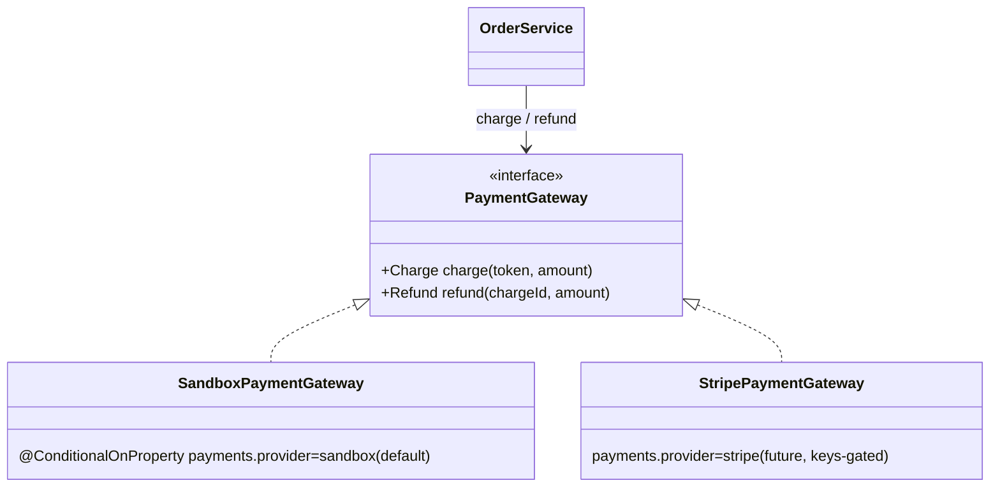

# Slice 70 — Payments: PSP abstraction + refunds (E6, sandbox-complete / Stripe-ready)

**Goal (blueprint E6):** *Online payment (gateway: card/wallet, webhook) + refunds.* Today `PaymentGateway` is a single
sandbox class that only `charge`s. This slice turns payments into a **provider-pluggable abstraction** and adds
**refunds** end-to-end (the money side that E10 returns will call). Real Stripe is wired as a **config-gated extension
point** — it needs the operator's API keys (like the AWS deploy bootstrap), so it's documented, not shipped untested.

## Reuse-first & boundaries
- Keep the existing reserve→charge→confirm saga (slice 49) and the sandbox charge behaviour (`"fail"` declines).
- **Refund** is additive and works fully in sandbox, so E10 (returns) can issue money-side refunds now.
- **Boundary — real Stripe:** a `StripePaymentGateway` (PaymentIntent + webhook) is selected by
  `payments.provider=stripe` + keys; sandbox is the default (`matchIfMissing`). Shipping an untested Stripe impl is
  deferred to when keys exist — same posture as AWS deploy.

## Design



## Refund flow

```mermaid
sequenceDiagram
    participant A as Back-office (monolith /refundOrder)
    participant G as Gateway (JWT)
    participant MP as marketplace OrderService
    participant PG as PaymentGateway (sandbox)

    A->>G: POST /refundOrder {id, amount?}
    G->>MP: POST /orders/{id}/refund  (org-scoped via CurrentUser)
    MP->>MP: load order (scoped); guard: card-paid + not over-refunded
    MP->>PG: refund(paymentRef, amount ?? remaining)
    PG-->>MP: {success, refundId}
    MP->>MP: refundedAmount += amount; status = REFUNDED | PARTIALLY_REFUNDED; timeline event
    MP-->>A: order {paymentStatus, refundedAmount, refundRef}
```

## Changes
- **marketplace**:
  - `PaymentGateway` → **interface** (`charge` + `refund`, with `Charge`/`Refund` records); `SandboxPaymentGateway`
    implements it (`@ConditionalOnProperty(name="payments.provider", havingValue="sandbox", matchIfMissing=true)`).
  - `Order`: `refund_ref`, `refunded_amount`; `paymentStatus` gains `REFUNDED` / `PARTIALLY_REFUNDED` (varchar, no enum).
  - `OrderService.refund(id, amount, org, user)` — guards (only card-paid orders with a `paymentRef`; cap at the
    remaining refundable), calls the gateway, updates status + amount, records a timeline event.
  - `OrderController POST /orders/{id}/refund` (back-office, org-scoped); `OrderDTO` mirrors the refund fields.
  - **V5 migration**: `orders.refund_ref` + `refunded_amount` (idempotent guarded adds).
- **monolith**: `OrderController` `/refundOrder` proxy → `/orders/{id}/refund` (JWT-forwarding client). Relays the
  marketplace's `{success,message}` on an expected business 4xx (e.g. COD/over-refund) and logs it quietly — not as a
  server ERROR with a stack trace.

## Validation & safety
- Only **card-paid** orders with a `paymentRef` can be refunded (COD is settled in cash offline → rejected with a
  clear message). Refund amount is capped at `total − alreadyRefunded`; full refund when amount omitted.
- Org-scoped (anti-IDOR via `findByIdScoped`).

## Tests
- **OrderServiceTest** (Testcontainers, +cases): full refund → `REFUNDED` + `refundedAmount = total`; partial →
  `PARTIALLY_REFUNDED`; second refund capped at remaining; COD order → rejected.
- **Cypress `order-refund.cy.js`** (user runs): place a CARD storefront order → `/getOrders` finds it → `/refundOrder`
  → order shows `REFUNDED` with the refunded amount.

## Status
- [x] Design (this doc)
- [x] marketplace: PaymentGateway interface + SandboxPaymentGateway (@ConditionalOnProperty) + Order refund fields +
      OrderService.refund + OrderController `/orders/{id}/refund` + OrderDTO + **V5 migration** (full chain clean)
- [x] monolith `/refundOrder` proxy
- [x] OrderServiceTest refund cases (3) + order-refund.cy.js authored
- [ ] **Awaiting build + (user-run) Cypress** `order-refund.cy.js`: rebuild marketplace (V5) + monolith, then run.
