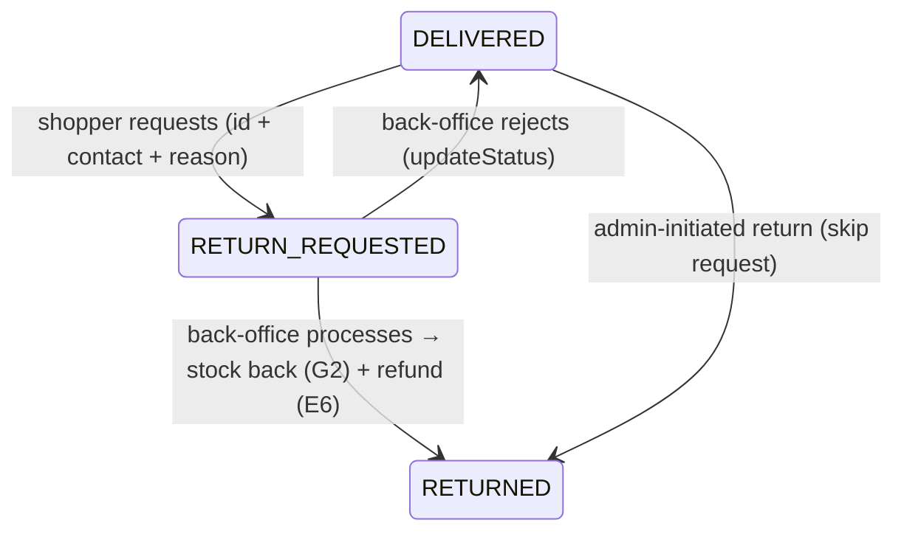

# Slice 71 — Returns / RMA (E10): customer request → back-office process → stock + refund

**Goal (blueprint E10):** *Returns/RMA → inventory (reuse G2 inverse saga); extend C9.* A delivered order can be
**returned**: the shopper requests it, the back-office processes it, and processing **returns the stock** (the same G2
inverse saga that cancel uses, slice 51) **and refunds** the money (the E6 capability, slice 70) in one action.

## Reuse-first
- **Stock return** = the existing `returnStockQuietly` / `inventoryClient.returnStock` (G2 inverse saga) already used
  by cancel.
- **Refund** = the slice-70 gateway refund, factored into a shared `doRefund` so cancel/return/explicit-refund share it.
- **Customer auth** = the slice-56 tracking pattern (order id + contact match) — no account needed to request a return.

## Lifecycle



## Flow

```mermaid
sequenceDiagram
    participant B as Shopper (store.html track)
    participant M as Monolith
    participant MP as marketplace OrderService
    participant INV as inventory (G2)
    participant PG as PaymentGateway

    B->>M: POST /storefront/return {ref, contact, reason}
    M->>MP: POST /public/order/return
    MP->>MP: verify id+contact; DELIVERED → RETURN_REQUESTED + reason
    Note over MP: back-office reviews
    M->>MP: POST /orders/{id}/return (authed)
    MP->>INV: returnStock(reservationId, lines)  (G2 inverse saga)
    MP->>PG: refund(paymentRef, remaining)  (best-effort; COD = no money refund)
    MP->>MP: status = RETURNED; timeline event
```

## Changes
- **marketplace**:
  - `FulfilmentStatus`: add `RETURN_REQUESTED`, `RETURNED`.
  - `Order.returnReason`; `OrderDTO.returnReason`.
  - `OrderService`:
    - `requestReturn(ref, contact, reason)` (public) — id+contact verified; only a `DELIVERED` order → `RETURN_REQUESTED`.
    - `processReturn(id, org, user)` (back-office) — from `RETURN_REQUESTED`/`DELIVERED`: return stock (G2) + refund
      (best-effort; card only) → `RETURNED`. Refactor slice-70 refund into shared `doRefund`/`isCardRefundable`.
  - `PublicOrderController POST /public/order/return`; `OrderController POST /orders/{id}/return`.
  - **V6 migration**: `orders.return_reason` (idempotent guarded add).
- **monolith**: `StorefrontController` `/storefront/return` (public) + ecommerce `OrderController` `/processReturn`;
  store.html shows a **Request a return** action on a delivered tracked order.

## Validation & safety
- Only a `DELIVERED` order can be return-requested; contact must match (no order-existence leak).
- Processing is org-scoped (anti-IDOR). Stock returns only for orders that held a reservation; refund only for
  card-paid orders (COD = goods back, cash settled offline). A refund failure doesn't block the stock return (logged).

## Tests
- **OrderServiceTest** (Testcontainers, +cases): request return on a delivered order → `RETURN_REQUESTED`; process →
  `RETURNED` + stock returned (verify `inventoryClient.returnStock`) + card order refunded; non-delivered request
  rejected.
- **Cypress `order-return.cy.js`** (user-run): deliver a card order → request return → process → `RETURNED`, stock
  back, `REFUNDED`.

## Status
- [x] Design (this doc)
- [x] marketplace: RETURN_REQUESTED/RETURNED statuses + Order.returnReason + requestReturn/processReturn + shared
      doRefund/isCardRefundable refactor + PublicOrderController/OrderController endpoints + **V6** (return_reason) +
      **V7** (`MODIFY fulfilment_status` enum to add RETURN_REQUESTED/RETURNED — Hibernate maps the enum to a native
      MySQL enum, so a new value needs an ALTER…MODIFY or inserts fail "Data truncated"; chain verified clean +
      insert works)
- [x] monolith `/storefront/return` (public) + `/processReturn` (back-office, message-relay) proxies + store.html
      "Request a return" on a delivered tracked order
- [x] OrderServiceTest (3 cases) + order-return.cy.js authored
- [ ] **Awaiting build + (user-run) Cypress** `order-return.cy.js`: rebuild marketplace (V6) + monolith, then run.
