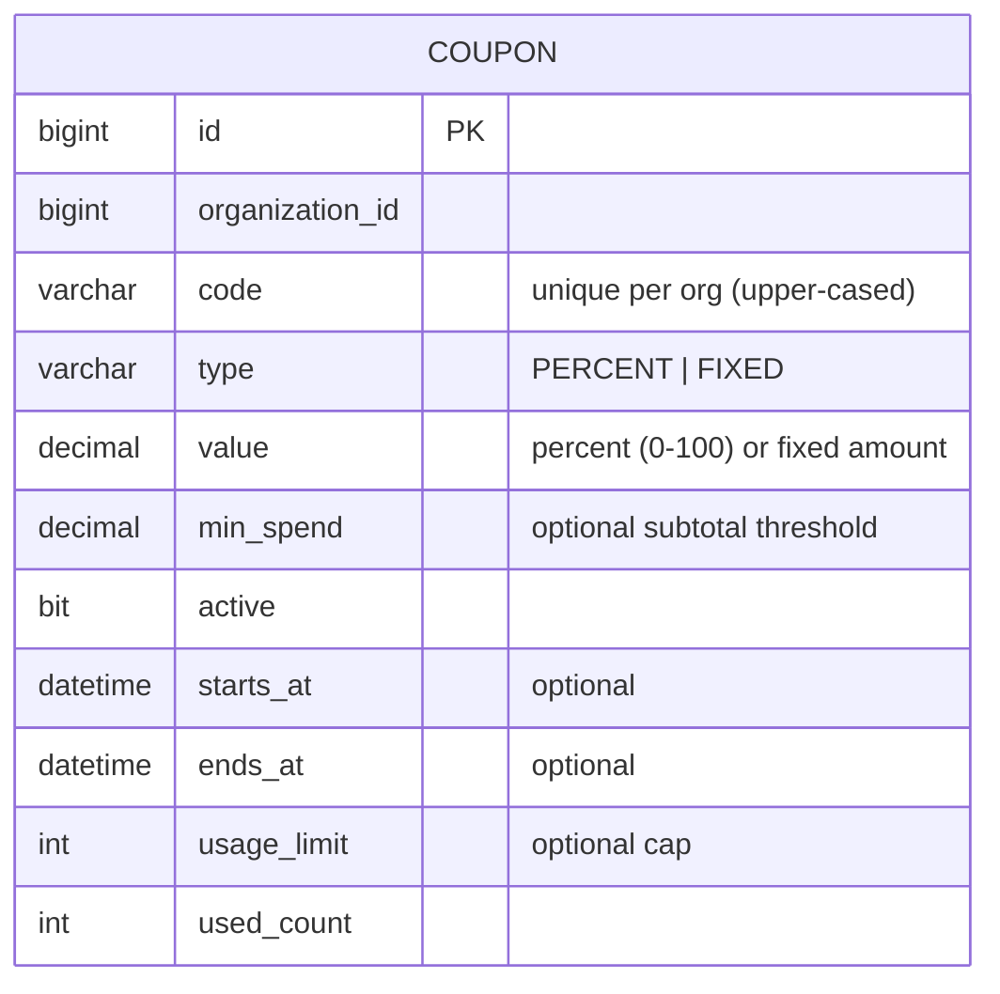
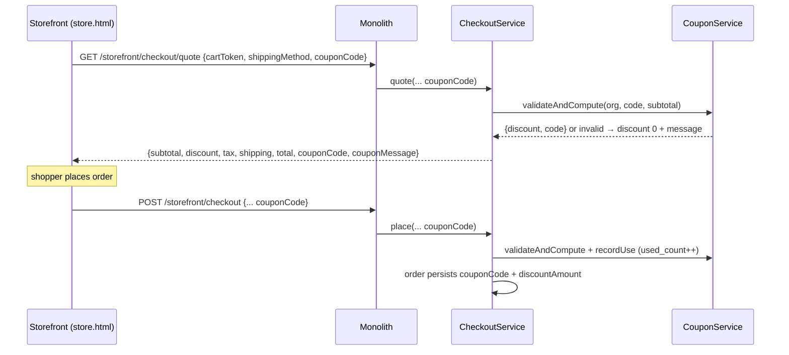

# Slice 72 — Coupons / promotions (E13): promo code → checkout discount

**Goal (blueprint E13):** *Promotions/coupons/cart rules.* A store creates promo codes; a shopper applies one at
checkout and sees the discount in the server-computed totals. Builds directly on the slice-69 checkout quote.

## Reuse-first & boundaries
- **Checkout quote (slice 69)** is extended with an optional `couponCode` → the discount is computed server-side and
  shown as a line in the breakdown; `place` re-validates + records it on the order and increments usage.
- **Discount math (this slice):** PERCENT or FIXED off the **subtotal** (capped at subtotal). `total = subtotal +
  tax + shipping − discount`. *Boundary:* tax is computed on the full line amounts (tax-on-discounted-base proration
  is a follow-up); stacking multiple coupons / BOGO / category rules are follow-ups (single code per order here).
- **Admin** coupon create/list is an **API + monolith proxy** this slice (a back-office screen is E14 admin).

## Data model

## Apply flow

## Validation rules
A coupon is valid when: it exists for the store (`code` match, case-insensitive), `active`, now within
`starts_at`/`ends_at` (if set), `subtotal ≥ min_spend` (if set), and `used_count < usage_limit` (if set). Invalid →
the quote returns `discount = 0` + a `couponMessage` (so the UI can show "code expired / min spend not met"); `place`
with an invalid code proceeds **without** the discount rather than failing the order.

## Changes
- **marketplace**:
  - `Coupon` entity + `CouponRepository` (org-scoped, unique `(org, code)`); `CouponService`
    (`create`, `list`, `validateAndCompute(org, code, subtotal) → CouponResult`, `recordUse`).
  - `CouponController` (back-office, org-scoped: `POST /coupons`, `GET /coupons`).
  - `CheckoutService.quote/place` take `couponCode`; `CheckoutDTO.Quote` adds `discount`, `couponCode`,
    `couponMessage`; `Request` adds `couponCode`. `Order` adds `coupon_code`, `discount_amount`; persisted in
    `placePublic` (via OrderDTO).
  - **V8 migration**: `coupon` table + `orders.coupon_code` / `discount_amount` (idempotent).
- **monolith**: `/addCoupon` + `/getCoupons` proxies (JWT-forwarding); store.html coupon input on checkout that
  re-quotes and passes `couponCode` through to place.

## Tests
- **CouponServiceTest** (pure Mockito): PERCENT + FIXED discount; min-spend gate; expiry/active gate; usage-limit gate;
  unknown code → no discount.
- **CheckoutServiceTest** (+cases): quote with a valid PERCENT code reduces the total; invalid code → discount 0.
- **Cypress `storefront-coupon.cy.js`** (user-run): create a coupon (admin API) → cart → quote with the code shows the
  discount + reduced total → place records the coupon + discount.

## Status
- [x] Design (this doc)
- [x] marketplace: Coupon + CouponRepository + CouponService (create/list/validateAndCompute/recordUse) +
      CouponController + CheckoutService coupon integration (quote+place) + Order coupon fields + **V8** (chain clean)
- [x] monolith `/addCoupon` + `/getCoupons` proxies + store.html promo-code input + discount line; **also forward
      `couponCode` through the slice-69 `/storefront/checkout/quote` proxy** (it was dropping the param → discount 0 at
      the Cypress gate; monolith-only fix)
- [x] CouponServiceTest (7) + CheckoutServiceTest coupon cases (3) + storefront-coupon.cy.js authored
- [ ] **Awaiting build + (user-run) Cypress** `storefront-coupon.cy.js`: rebuild marketplace (V8) + monolith, then run.
