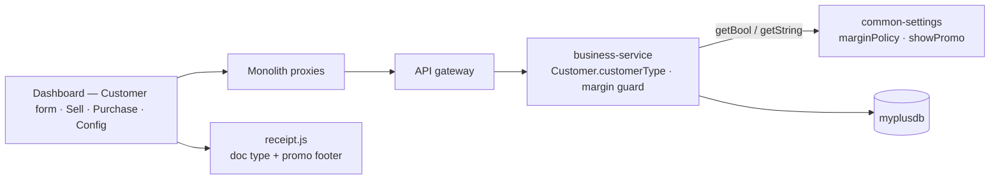
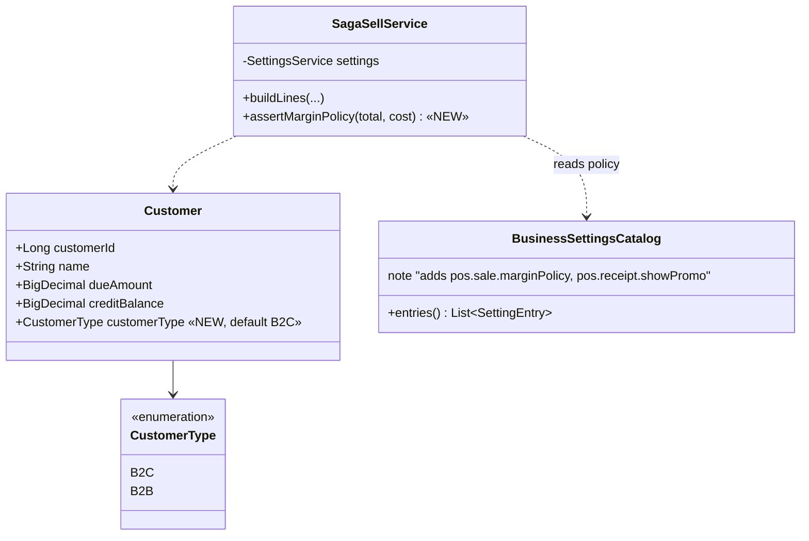
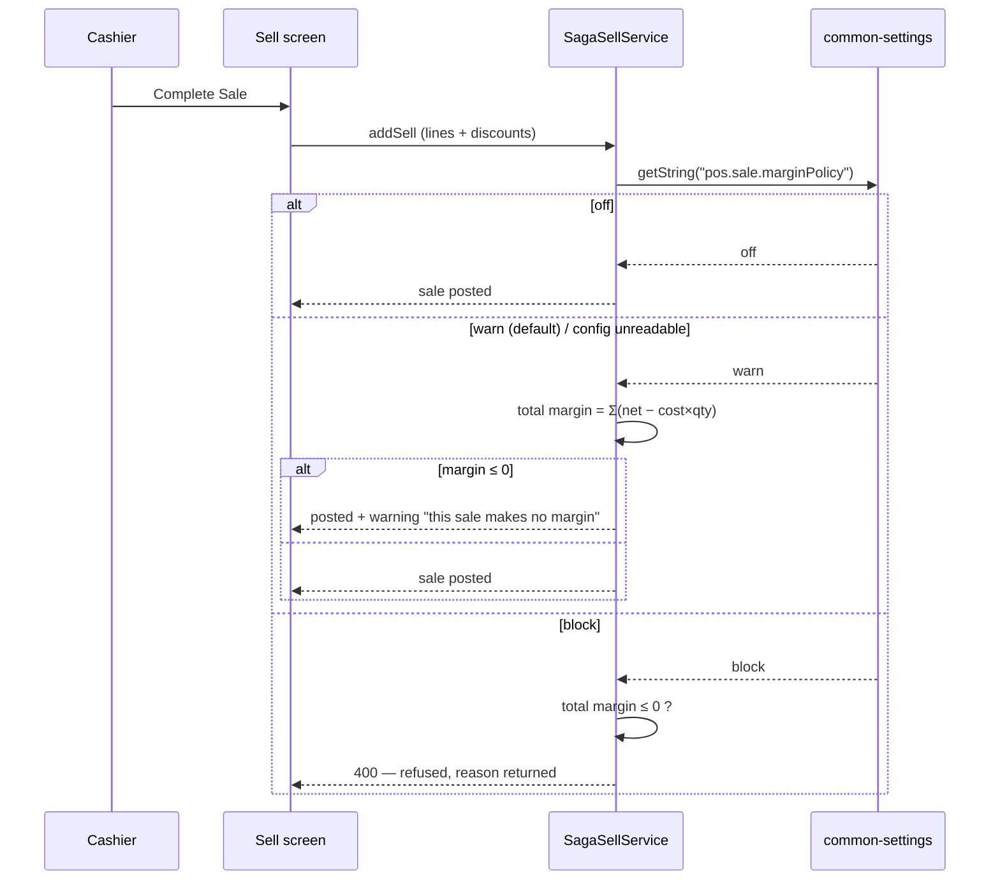

# Slice B2B-P0 — the customer channel flag (+ three quick wins)

**Status:** DESIGN → implementing.
**Branch:** `feature/b2b-b2c`
**Parent:** [`b2b-b2c-rollout-plan.md`](../b2b-b2c-rollout-plan.md) Phase 0 ·
[`b2b-shared-library-review.md`](../b2b-shared-library-review.md)
**Context: all seven modules are LIVE.** Additive only; every default preserves today's behaviour.

---

## 1. Document

### Problem
B2B and B2C behaviour (price source, credit, terms, document type) has no switch to hang off. Every later
phase — pricing, credit limits, invoices — needs to know *which kind of customer this sale is for*.

`Customer.customerType` exists in the entity **commented out**:
```java
// private CustomerType customerType;
```
Someone started this and backed it out. This slice finishes it.

### Value
- The flag every later B2B phase keys off, shipped safely while modules are live.
- Three customer-visible wins that need nothing else: margin guard at submit (**#3**), vendor dues on the
  purchase screen (**#8**), and the promo footer (**#13**).

### Non-goals
No pricing, no credit limit, no invoice/statement changes, no UI mode switch. The flag lands; behaviour
comes in P1/P2. **But per standard C1 — "a toggle that changes nothing is worse than no toggle" — the flag
is not shipped inert:** it drives the receipt/document type immediately (receipt for B2C, invoice header
for B2B), which is the smallest honest behaviour that proves the wiring end to end.

---

## 2. Design

### D1 — `customerType` on the customer, defaulting to B2C
Enum `B2C | B2B` (String-mapped). **Additive nullable column**, back-filled to `B2C`, so every existing
row in seven live databases keeps behaving exactly as today.

> Not on the JWT, not on the user. Per [`b2b-b2c-rollout-plan.md`](../b2b-b2c-rollout-plan.md) §3b: the
> operator is neither B2B nor B2C; the **buyer** is. Resolved per transaction.

### D2 — `@Enumerated(STRING)` needs a real enum column
Storing an enum as a MySQL `enum` means every future value needs `ALTER … MODIFY` (a known trap in this
codebase — `ddl-auto` will not do it and fails with *"Data truncated"*). **Use `VARCHAR(16)`** so adding
`GOVT` or `NGO` later is a code change, not a migration.

### D3 — Three quick wins, each behind a setting

| # | Behaviour | Setting | Default |
|---|---|---|---|
| **3** | Re-check margin at **Complete Sale** (today it only fires per line at entry, so a whole-invoice discount can still land at ≤0 margin) | `pos.sale.marginPolicy` = `off\|warn\|block` | **`warn`** — matches today's per-line dialog |
| **8** | Vendor previous dues on the purchase screen (mirrors the sell screen, which already has it) | — always on, read-only | n/a |
| **13** | *"Powered by MaxTheService"* footer on receipts/statements | `pos.receipt.showPromo` | **`false`**, trials seeded `true` |

Per **C3**, the margin policy is a safety flag: it defaults to `warn` and an unreadable config also yields
`warn` — never `off`.

### Endpoint contract
No new endpoints. `customerType` is an additive field on the existing customer DTO (add/update/list).
Settings ride the existing `/getConfig` + `/saveConfig`.

### Security
`customerType` is tenant-scoped like every other customer field — the anti-IDOR `findByIdScoped` guard
already covers it. No new authority; changing a customer's type is a normal customer edit.

---

## 3. Architecture & UML

### Architecture


### Class diagram


### Sequence — margin guard at submit


---

## 4. Implement

- [x] `CustomerType` enum in business-service — four named types, channel **derived** (`WALK_IN`/`VIP` = B2C, `RETAILER`/`WHOLESALE` = B2B) rather than a bare two-value enum, so there is one field to set and no second column that can disagree
- [x] `Customer.customerType`, `@Enumerated(STRING)`, `VARCHAR(16)`
- [x] **Flyway V29** — additive nullable column + backfill `WALK_IN` + index `(organization_id, customer_type)`, every step `information_schema`-guarded (D1/D3/D7)
- [x] `CustomerDTO` + the customer form (four-option select, default Walk-in) + the `customerType` list column — `editRecord()` refills the form from the rendered row, so without the column every edit reset the type
- [x] `orDefault` wired at save: a new customer never persists NULL (old rows backfilled, new rows must match), and an edit that omits the field keeps the stored value instead of demoting a trade account
- [x] `BusinessSettingsCatalog` — `pos.sale.marginPolicy` (SELECT off/warn/block, default **warn**), `pos.receipt.showPromo` (BOOL, default **false**)
- [x] `SagaSellService.assertMarginPolicy` — whole-invoice, before any reservation; uncosted lines excluded from **both** sides; `warn` returns through the warnings channel onto the addSell message, `block` throws
- [x] Purchase screen: vendor previous-dues block (#8), fed by `data-due` on the vendor options — no second round trip
- [x] `receipt.js`: promo footer (#13) gated on `showPromo === true`, wired through `CustomerHistoryDTO` + `SellController`
- [ ] Document type (receipt vs invoice) from `customerType` — **deferred to Phase 3** with the rest of the document work; nothing in Phase 0 reads the channel yet
- [x] i18n: 7 new keys into **all six** bundles (1,250 keys each, aligned)
- [x] Unit tests: `MarginPolicyTest` (10) + `CustomerTypeTest` — pure logic, run on every `mvn test`
- [x] Cypress gate: `cypress/e2e/business/b2b-customer-type.cy.js` — **PASSED headed 2026-08-01** (C2 both halves: catalog default **and** changed behaviour)
- [ ] Migration test (D2) — Testcontainers V29 replay, pending with the service's other migration tests

## 5. Test

| # | Case | Expect |
|---|---|---|
| 1 | Existing customers after migration | all `B2C`; screens unchanged |
| 2 | `marginPolicy` absent/unreadable | behaves as **warn** (C3 fail-ON) |
| 3 | `warn` + zero-margin sale | posts, with a warning |
| 4 | `block` + zero-margin sale | refused, reason given |
| 5 | `off` | posts silently |
| 6 | `showPromo=false` (default) | no promo line on the receipt |
| 7 | `showPromo=true` | promo line present |
| 8 | Purchase screen | vendor dues shown, read-only |
| 9 | Both settings in `/getConfig` with right defaults | C2 half 1 |
| 10 | Cross-tenant | customer type not editable across orgs |

Gate: `cypress/e2e/business/b2b-customer-type.cy.js` (headed, you run it).

---

## 6. Live-module safety

| Risk | Mitigation |
|---|---|
| Seven populated DBs | Additive nullable column + backfill; **no rename, no drop** |
| A live shop sees new behaviour | Every default = today's behaviour; `showPromo` **off** |
| Margin guard blocks real sales | Defaults to **warn**, never `block` |
| Migration re-run | `information_schema`-guarded (D7) |
| Rollback | Drop the setting rows; the column is inert if unread |
