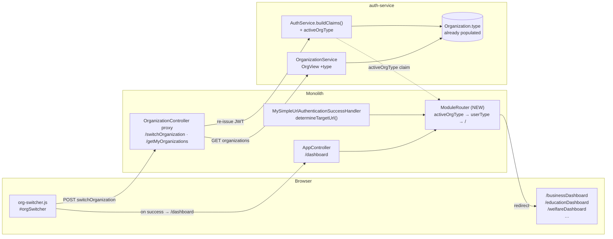
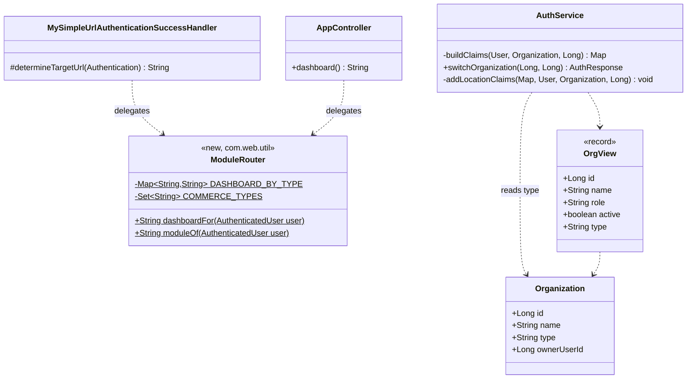
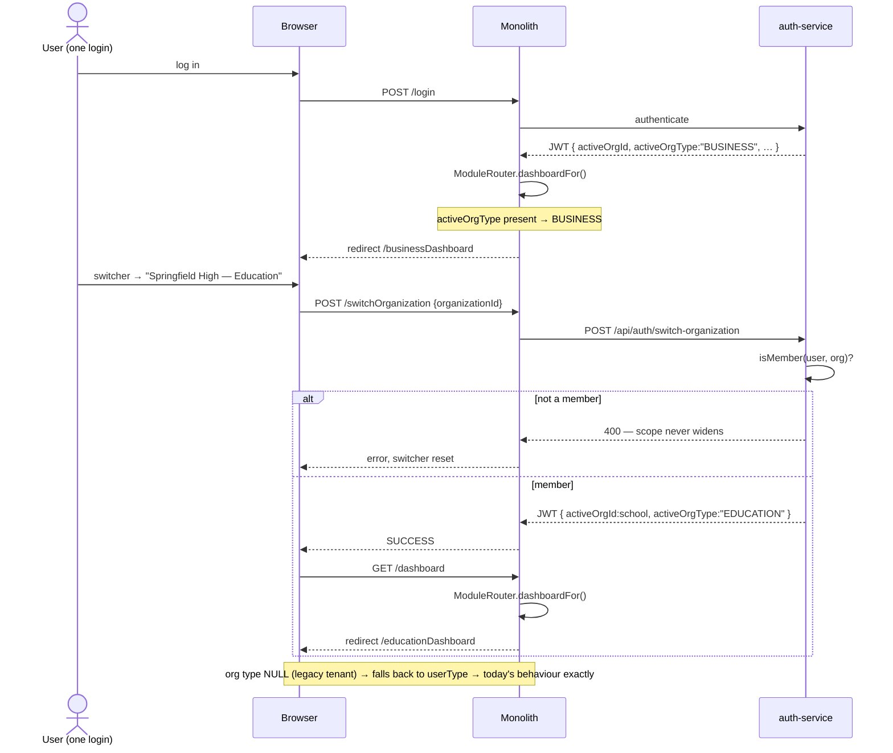

# B2B Phase 0.5 — one login reaches every module (route on the ACTIVE ORG's type)

**Status:** ✅ **DONE — Cypress-green 2026-08-01.**
Gate: `cypress/e2e/business/org-type-routing.cy.js` · unit: `ModuleRouterTest`
Programme: [`b2b-b2c-rollout-plan.md`](../b2b-b2c-rollout-plan.md) · Previous: [`b2b-P0-customer-type.md`](b2b-P0-customer-type.md)

---

## 1. Document

### The problem

A customer who runs **a school and a shop** needs two logins today. Not because we decided to charge them
twice, but because of one line:

```java
// MySimpleUrlAuthenticationSuccessHandler.determineTargetUrl
String dash = "/" + user.getUserType().toLowerCase() + "Dashboard";
```

Routing keys off **`User.userType`** — a single string on the *person*. A person has one type, so a login
reaches one module, forever.

Meanwhile the platform already models the thing that should decide this. `Organization.type` exists
(`Organization.java:26`), is populated at signup (`OrganizationService.createTenant`) and on the legacy path
(`getOrCreatePrimaryOrg` copies `user.getUserType()`), and a user can already belong to several organizations
with a working switcher (`org-switcher.js`, `POST /api/auth/switch-organization`, membership-validated).

So the pieces are all there and they simply aren't connected:

| Piece | State |
|---|---|
| `Organization.type` | ✅ exists, populated |
| Multi-org membership + switcher | ✅ works, re-issues the JWT |
| `activeOrgId` claim → `X-Org-Id` | ✅ works |
| **`activeOrgType` claim** | ❌ **`buildClaims` never emits it** |
| **Routing reads the org's type** | ❌ reads the *user's* type |
| **Switcher lands on the right module** | ❌ `window.location.reload()` — reloads whatever page you were on |
| `OrgView` carries the type | ❌ `record OrgView(id, name, role, active)` — no type |

### What "one login reaches every module" means here

The user picks their organization; the platform takes them to the module that organization *is*. Switch to
the school → the education dashboard. Switch to the shop → the commerce dashboard. One account, one password.

**This is deliberately not** "one screen shows school and shop together". That is a genuinely different (and
much larger) feature. Here, the active organization stays the single tenant scope for every read and write —
which is exactly what makes this small and safe.

### Why now

The rollout plan puts this before Phase 1 because credit limits, pricing and statements are all per-tenant
features. Shipping them while a multi-module customer needs two accounts means configuring each one twice.

---

## 2. Design

### 2a. Data model

**No schema change. No migration.** `Organization.type` already exists and is already populated. This slice
adds a JWT claim derived from it and changes two routing decisions.

That is the whole point of doing it now: it is additive, reversible, and touches no tenant data.

### 2b. The claim

`AuthService.buildClaims(User, Organization activeOrg, Long preferredLocationId)` gains one line beside the
`activeOrgId` it already emits:

```java
claims.put("activeOrgType", activeOrg != null ? activeOrg.getType() : null);
```

Vocabulary is the **existing** one, shared with `userType`: `BUSINESS` · `PHARMA` · `MARKETPLACE` ·
`EDUCATION` · `WELFARE` · `AGRICULTURE` · `APPOINTMENT`. No new enum — inventing a second vocabulary for the
same concept is how the two drift apart.

Because `switchOrganization` already calls `buildClaims`, **switching orgs re-issues a token carrying the new
type for free.** No new endpoint.

> **Design refinement (found while reading the code, before implementation).** The claim alone is not enough
> for the monolith. Its Spring Security principal (`com.persistence.model.User`, a transient POJO — not an
> entity) is built from the login **response** in `AuthServerAuthenticationProvider`, not by decoding the JWT.
> And `OrganizationController.switchOrganization` swaps the stored tokens **without touching the principal**,
> so after a switch the principal still describes the old org. Therefore the field must travel the same road
> `userType` already travels — `AuthResponse` → `AuthServerLoginResponse` → `User` — and the switch handler
> must refresh it on the principal in place. Added as R1b/R1c/R8 below. Decoding the JWT inside the monolith
> was the alternative and was rejected: it would add a second, divergent way to learn who the caller is.

### 2c. Resolution order (the one rule this slice adds)

```
effectiveModule = activeOrgType  (if present and known)
                → userType       (fallback — every org predating this, and any org with a NULL type)
                → landing page   (neither resolves)
```

`Organization.type` is **nullable** and older rows may hold NULL, so the fallback is not defensive
programming — it is the correctness condition for every existing tenant. A user whose org has no type keeps
landing exactly where they land today.

### 2d. What changes

| # | Where | Change |
|---|---|---|
| R1 | `AuthService.buildClaims` | emit `activeOrgType` |
| R1b | auth-service `AuthResponse` + monolith `AuthServerLoginResponse` | carry `activeOrgType` beside `userType` |
| R1c | monolith `User` principal + `AuthServerAuthenticationProvider` | hold + populate `activeOrgType` at login |
| R8 | monolith `OrganizationController.switchOrganization` | refresh the principal's `activeOrgType` after a successful switch — otherwise routing uses the pre-switch org |
| R2 | `OrganizationService.OrgView` | add `type` so the switcher can label and group orgs |
| R3 | monolith — a new `ModuleRouter` (`com.web.util`) | ONE implementation of 2c + the type→dashboard map |
| R4 | `MySimpleUrlAuthenticationSuccessHandler.determineTargetUrl` | delegate to `ModuleRouter` |
| R5 | `AppController.dashboard()` | delegate to `ModuleRouter` — the same switch is currently written twice |
| R6 | `org-switcher.js` | on success, `window.location = serverContext + 'dashboard'` instead of `.reload()` |
| R7 | `org-switcher.js` | show each org's module beside its name, so "Springfield High" vs "Springfield Store" is legible |

**R3 is the point of the slice, not incidental.** The type→dashboard mapping exists in two places today
(`AppController.dashboard()` and `determineTargetUrl`) and they **already disagree**: `AppController` has no
`APPOINTMENT` case and returns `redirect:/` for it, while `determineTargetUrl` lists `/appointmentDashboard`
in `KNOWN_DASHBOARDS` and routes there. So an appointment user lands on their dashboard at login but is
bounced to the landing page if they ever hit `/dashboard`. One router, one map, per DRY.

### 2e. Endpoint contract

Nothing new. Two existing responses gain a field:

```
GET  /api/auth/organizations   → data[]: { id, name, role, active, type }     (+type)
POST /api/auth/switch-organization → unchanged; token now carries activeOrgType
```

Monolith proxies (`getMyOrganizations`, `switchOrganization`) pass through untouched.

### 2f. Security

Unchanged, and worth stating explicitly because this slice moves an authorization-adjacent input:

- **`activeOrgType` is descriptive, never permissive.** It picks a *screen*. Every read and write is still
  gated by `activeOrgId` scoping and privilege checks. Landing on `/educationDashboard` grants nothing — a
  user without education privileges sees a dashboard whose sections refuse to load, exactly as today.
- **Membership is still validated server-side** in `switchOrganization` before any token is re-issued. A
  client cannot switch into an org it does not belong to, and this slice does not touch that path.
- The claim is minted from the DB row, never accepted from the client.

### 2g. The subtlety worth flagging before approval

`AuthService.addLocationClaims` filters a user's store/branch grants by module:

```java
String module = moduleFor(user.getUserType());   // "EDUCATION" or "BUSINESS"
```

It reads **`userType`**, and the comment explains why the filter exists: *"a school id and a store id are both
just numbers, so mixing modules here would hand an education user 'access' to a same-numbered store."*

Once a BUSINESS-typed user can be active in an EDUCATION org, `userType` and the active org's module can
disagree — and this filter would then select the wrong module's grants.

**Done** — switched to the same resolution order (`activeOrgType` → `userType`), so grants are filtered by
the module the user is *actually working in*. The safety property is unchanged; only *where we learn the
module* moved. **Doing this slice without it would have introduced the exact bug that comment prevents.**

> **Scope correction found during implementation.** It was not one call site, it was **six**. A sweep of
> `AuthService` for module resolution turned up four more that read a *person's* type while having the org
> in scope: `createOrgUser` (grants for a new member of the caller's org), `assignLocations`, `listOrgUsers`
> (per member row), and `myLocations` (the store switcher's own list). All six now resolve through
> `moduleForOrg(org, userType)` / `moduleOf(userId, orgId)`.
>
> Fixing only the two named in the design would have been worse than fixing none: `myLocations` feeds the
> switcher while `addLocationClaims` mints the token, so a split would have offered the user a store their
> own token then refused. The org-blind `moduleOf(Long)` helper was **deleted** once unused — leaving it is
> how this bug class comes back. `listOrgUsers` also dropped from one org lookup per member row to one.

### 2h. UI contract

- The switcher `<option>` reads `Name — Module` (e.g. `Springfield High — Education`), built with `.text()`,
  never HTML injection — the existing code is already careful here and stays so.
- Module labels come from the i18n bundles (`ui.module.business`, `ui.module.education`, …) in **all six**
  languages.
- Switching shows the normal page load; no new spinner or modal.

---

## 3. Architecture & UML

### Architecture



### Class diagram



### Sequence — a shopkeeper who also runs a school



---

## 4. Implement

- [x] R1 `AuthService.buildClaims` — emit `activeOrgType`
- [x] R1b `AuthResponse` + `AuthServerLoginResponse` — carry `activeOrgType` (the monolith DTO is a hand-written POJO, so explicit accessors)
- [x] R1c monolith `User` principal + `AuthServerAuthenticationProvider` — hold + populate it
- [x] R8 monolith `switchOrganization` — refresh the principal after a successful switch
- [x] R2 `OrgView` record + `listForUser` — carry `type`
- [x] R3 **`ModuleRouter`** (`com.web.util`) — resolution order + the single type→dashboard map
- [x] R4 `determineTargetUrl` → delegate (its now-dead `AppUtil` field removed)
- [x] R5 `AppController.dashboard()` → delegate (**fixes the APPOINTMENT inconsistency** — verified `/appointmentDashboard` really is served, by `AppointmentDashboardController`)
- [x] R6 `org-switcher.js` → `/dashboard` instead of `.reload()`
- [x] R7 `org-switcher.js` → module label per option
- [x] **2g** — all **six** module-resolution sites made org-aware (see the scope correction above)
- [x] i18n **`ui.js.module.*`** × 7 × all six bundles (1,257 aligned). NOT `ui.module.*`: only the `ui.js.` prefix is shipped to the browser by `LocaleInterceptor`, so those keys would never have resolved and every org would have silently shown a bare name
- [x] Unit tests: `ModuleRouterTest` (pure logic, runs on `mvn test`)
- [x] Cypress gate **PASSED headed 2026-08-01**
- [x] Seeded fixture `multi.module@myplus.com` — one login in the commerce org AND the education org (no live customer runs two modules, so the two-org hop had to be seeded; this also closes the gap `org-switcher.cy.js` flagged in its own scope note)

---

## 5. Test

**Unit — `ModuleRouterTest`** (no Spring; the resolution order is pure logic and must never regress):
- org type wins over user type
- NULL org type falls back to user type
- unknown/garbage org type falls back to user type, never a 404 route
- both NULL → landing page
- all three commerce types (`BUSINESS`/`PHARMA`/`MARKETPLACE`) → the one shared `/businessDashboard`
- `APPOINTMENT` → `/appointmentDashboard` from **both** entry points (the bug R5 fixes)
- every value in the map points at a dashboard that exists

**Cypress — `org-type-routing.cy.js`** (headed, you run it):
1. Single-org user logs in → lands on their module's dashboard. *Unchanged behaviour — the regression guard.*
2. `GET /getMyOrganizations` → every org carries a `type`.
3. Two-org user (commerce + education) switches to the school → ends on `/educationDashboard`, and a
   known education element renders.
4. Switch back → `/businessDashboard`.
5. `/dashboard` and post-login routing agree for the same user (pins R5).
6. Anti-IDOR: `POST /switchOrganization` with an org the user does not belong to → refused, active org
   unchanged. *Existing protection; asserted because this slice moves code near it.*

**Fixture note (learned the hard way in P0):** every fixture response gets asserted, and list payloads are read
from `collection` — `GenericResponse` has no `data` field.

---

## 6. Open questions (answer before implementation)

1. **Is a two-org customer real today?** If a live customer already has a school *and* a shop under one
   account, that org pair is the fixture. If not, the Cypress test provisions one.
2. **`type` on the switcher when there is only one org** — show it (context) or hide it (noise)? Proposed:
   show, consistent with why the switcher renders for a single org today.
3. **Should switching org also reset the active store?** A location grant belongs to an org, so the existing
   claim logic already re-derives it; flagging in case the intended UX is "remember my last store per org".
