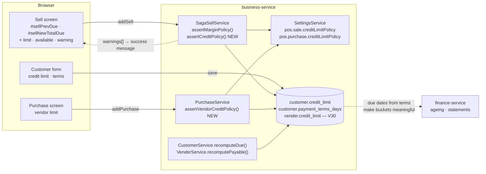
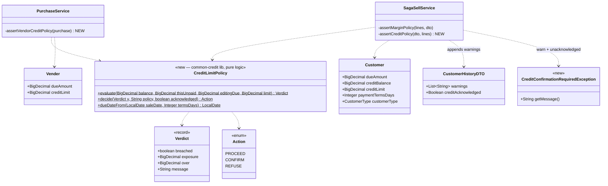
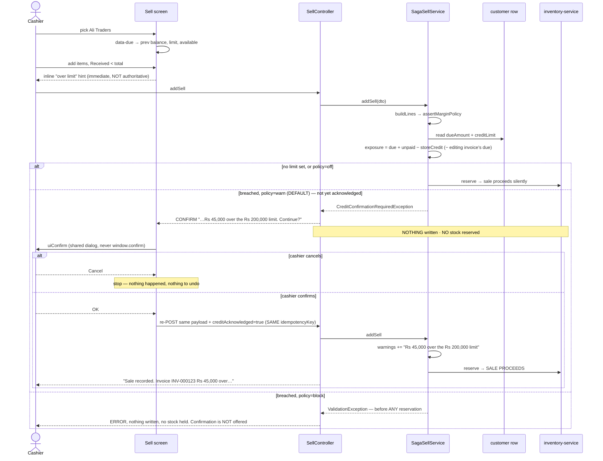

# B2B Phase 1 — credit limit & payment terms (= OMS **B4**, customer requirement **#9**)

**Status:** ✅ **DONE — Cypress-green 2026-08-02.**
Gate: `cypress/e2e/business/credit-limit.cy.js` · unit: `CreditLimitPolicyTest` (in `common-credit`)
Programme: [`b2b-b2c-rollout-plan.md`](../b2b-b2c-rollout-plan.md) · Previous: [`b2b-P05-org-type-routing.md`](b2b-P05-org-type-routing.md)
Requirement: [`customer-requirements-plan.md`](../customer-requirements-plan.md) #9 · OMS Track B item **B4**

---

## 1. Document

### The problem

A shop sells to Ali Traders on account. Today the system will happily let that balance grow to any number.
`Customer.dueAmount` records what is owed; **nothing anywhere records what the shop is willing to be owed.**
The cashier finds out there was a problem when the owner reads the ageing report a month later.

This is customer requirement **#9**, and your decision on it was explicit: **warn, don't block.** The cashier
sees *"Ali Traders would be Rs 45,000 over their Rs 200,000 limit"* and may still proceed — a shopkeeper
standing in front of a customer needs the information, not a locked till. A stricter org can harden it to
`block`; a shop that never sets a limit sees nothing change at all.

### Why this is cheap here

The balance already exists and is already maintained:

| Piece | State |
|---|---|
| `Customer.dueAmount` running balance | ✅ maintained by `recomputeDue` |
| `Vender.dueAmount` running payable | ✅ maintained by `recomputePayable` |
| Balance reaches the sell screen | ✅ `data-due` on the customer option → `window.selectedCustomerDue` |
| "Previous balance / New total due" preview | ✅ `#sellPrevDue`, `#sellNewTotalDue`, `refreshAccountDuePreview()` |
| Invoice `dueDate` | ✅ exists, entered by hand |
| Ageing + statements | ✅ finance-service, live |
| **A limit to compare against** | ❌ **no field anywhere** |
| **A check at sale time** | ❌ none |
| **Payment terms (Net 30/60)** | ❌ free-text on inventory `Supplier` only; not on customers, not enforced |

**No finance-service call is needed.** The exposure figure is local (`Customer.dueAmount`), which keeps this
off the checkout hot path entirely — the same reason the P0 margin check costs nothing.

### Scope

Customer side is the requirement's core. **Supplier side is included** — confirmed — because #9 says
*"dues limit (customer/supplier)"* and `Vender.dueAmount` already exists: one more nullable column and one
more guard, not a second feature.

> ### v2 decision — `warn` means **take confirmation**, not "tell them afterwards"
>
> Design v1 read `warn` as the margin guard does: record the sale, append a note to the success message. The
> confirmed behaviour is stronger — **ask the cashier first and only proceed if they say yes.**
>
> This is the right reading of the requirement, and of its sibling: #3 is literally worded *"Consent when
> profit ≤ 0"*. A message that appears *after* the money has changed hands is not consent — the sale is
> already recorded, the stock already moved, and undoing it means a void. Consent has to be asked while the
> decision is still reversible.
>
> **Consequence for the design:** the breach must be detected and answered *before* anything is written. That
> makes it a two-step protocol rather than a flag on the response (§2c-bis).

---

## 2. Design

### 2a. Data model — business-service, Flyway **V30**

| Table | Column | Type | Meaning |
|---|---|---|---|
| `customer` | `credit_limit` | `DECIMAL(19,2)` NULL | Most the shop will let this customer owe. **NULL = no limit** |
| `customer` | `payment_terms_days` | `INT` NULL | Net terms. NULL = no terms (due date entered by hand, as today) |
| `vender` | `credit_limit` | `DECIMAL(19,2)` NULL | Most the shop is willing to owe this supplier |

Additive, nullable, **no backfill**, every step `information_schema`-guarded (D1/D3/D7). NULL is the whole
back-compat story: no limit means no check, so every existing customer and supplier behaves exactly as today
until someone deliberately sets a number.

No index: these are read via the customer/vendor row already being loaded, never filtered on.

### 2b. Settings (`common-settings`, per-org, owner-configurable)

| Key | Type | Default | Effect |
|---|---|---|---|
| `pos.sale.creditLimitPolicy` | SELECT `off\|warn\|block` | **`warn`** | Selling past a customer's limit |
| `pos.purchase.creditLimitPolicy` | SELECT `off\|warn\|block` | **`warn`** | Buying past a supplier's limit |

| Value | Behaviour |
|---|---|
| `off` | No check. |
| **`warn`** (default) | **Ask, then obey the answer.** Nothing is written until the operator confirms; cancelling writes nothing at all. The recorded sale still carries the overage note so the decision is visible afterwards. |
| `block` | Refused outright. No confirmation is offered — an operator cannot consent past it. |

**Both default to `warn`, and that is safe precisely because the check is inert without a limit.** A policy of
`warn` on a customer whose `credit_limit` is NULL does nothing at all. The default only becomes visible for a
customer the owner has deliberately given a limit — at which point warning is obviously what they wanted.
Same three-value vocabulary as `pos.sale.marginPolicy`, so the Configuration screen reads consistently.

### 2c. The check

```
exposure  = customer.dueAmount                  (what they already owe)
          + thisSaleUnpaid                      (grandTotal − paid − storeCreditApplied)
          − dueOfTheInvoiceBeingEdited          (edit only — see 2g)

breach    = limit != null && exposure > limit
```

Enforced in **`SagaSellService.assertCreditPolicy(dto, lines)`**, called immediately after
`assertMarginPolicy` — **before any stock reservation**, which is what makes both `block` *and* the
un-acknowledged `warn` path costless: they return with nothing written and no stock held.

- `block` → `ValidationException` (the existing `ERROR` envelope).
- `warn` + not acknowledged → **`CreditConfirmationRequiredException`** → `SellController` answers
  `GenericResponse("CONFIRM", message)`. A distinct status, because `ERROR` would be a lie: nothing failed.
- `warn` + acknowledged → proceeds, and appends to `CustomerHistoryDTO.warnings` (the channel P0 built, which
  `SellController` already folds into the success message) so the accepted overage is visible afterwards.

Purchase side mirrors it in `PurchaseService`, comparing `Vender.dueAmount` + this bill's unpaid portion.

### 2c-bis. The confirmation protocol (server-authoritative)

```
1. POST /addSell  (no acknowledgement)
2. server: breach && policy=warn && !creditAcknowledged
       →  GenericResponse("CONFIRM", "Ali Traders would be Rs 45,000 over their Rs 200,000 limit. Continue?")
          NOTHING WRITTEN — no customer row touched, no invoice, NO STOCK RESERVED
3. client: uiConfirm(message)          ← the SHARED dialog, never window.confirm
       →  cancelled  : stop. Nothing happened, nothing to undo.
       →  confirmed  : re-POST the SAME payload + creditAcknowledged=true (SAME idempotencyKey)
4. server: proceeds, and still appends the overage note to the success message
```

**Why the server decides rather than the client asking first.** The client already knows the balance and the
limit (`data-due`, and `data-credit-limit` added here), so it *could* prompt without asking the server. But
its numbers are as old as the page: another till may have sold to the same customer since the dropdown
loaded. Letting a stale client decide whether consent is even needed is how a limit silently stops applying.
The client's copy drives the *live hint* while typing; the server decides whether a confirmation is required.

**Why re-POSTing with the same `idempotencyKey` is correct.** The CONFIRM path writes nothing, so there is no
first invoice for the retry to duplicate. Re-using the key is what keeps SF-3's protection intact for the
*real* risk here — a double-click on the confirmation dialog.

**Why not a flag the client sets pre-emptively.** `creditAcknowledged=true` on a first submit is honoured:
that is a client saying "the operator already consented", which under `warn` is exactly what an operator
clicking OK means. It is not a privilege escalation — `warn` permits proceeding by definition. Under `block`
the flag is ignored entirely.

### 2d. Payment terms → due date

`Customer.paymentTermsDays` fills in the due date the cashier types by hand today:

- Client: on customer select, when the sale leaves a balance, prefill `#dueDateTemp` with
  `today + paymentTermsDays`. **Still editable** — terms are a default, not a cage.
- Server: if a sale leaves a balance and no `dueDate` was submitted, derive it from the customer's terms.
  Absent terms, behaviour is unchanged (the field stays required as it is now).

This is what makes the *existing* ageing report meaningful for trade accounts — buckets are only as good as
the due dates feeding them.

### 2e. UI contract

**Customer form** — two fields beside the existing profile inputs:
`Credit limit` (blank = no limit, with that hint shown) · `Payment terms (days)` (blank = none).

**Vendor form** — `Credit limit`, same semantics.

**Sell screen** — the account row already shows *Previous balance* and *New total due*. Two additions in the
same row, shown only for a customer who has a limit:
- `Credit limit` and `Available` (limit − exposure), `Available` turning red when negative.
- An inline warning beside them the moment the projected total crosses: *"Rs 45,000 over the Rs 200,000
  limit."* Client-side for immediacy — **the server check is the authority**, since the client can be stale.
- On a `CONFIRM` response, the **shared** `uiConfirm({tone:'danger'})` from `/js/common/confirm-dialog.js`.
  Never `window.confirm`, and never a per-page modal — one dialog for the whole app (DRY). Its OK button
  carries `data-ui-confirm="ok"`, which is the hook the Cypress gate clicks.

**Purchase screen** — the same pair beside `#purchaseVendorDues`, which P0 added.

### 2f. Security

- The limit is read from the tenant-scoped customer/vendor row; a client never submits its own limit for the
  check. A tampered client can suppress the *warning*, not the server's verdict.
- `block` is enforced server-side only. The client-side hint exists for speed, never for enforcement.
- Setting a limit is an owner/admin action, gated by the existing `@PreAuthorize` on customer/vendor writes.
- No new endpoint, so no new surface.

### 2g. The two subtle cases (both must be in the tests)

1. **Editing an existing sale double-counts.** `Customer.dueAmount` already includes the invoice being
   edited, so a naive `dueAmount + newUnpaid` counts that invoice twice and warns on a sale that is actually
   shrinking. The edit path must subtract the invoice's current due before projecting. This is the same class
   of bug as the `netAmount`/cost double-subtraction noted in `SagaSellService.buildLines`.
2. **Store credit reduces exposure.** `storeCreditApplied` settles part of the sale, so it must come off
   `thisSaleUnpaid` — otherwise redeeming credit could trip a limit warning while *reducing* what is owed.

A third, deliberately **not** handled: concurrent sales to the same customer on two tills can each pass the
check and jointly exceed the limit. Locking the customer row on every sale would put a write lock on the
checkout path to prevent a soft warning. Called out here so it is a known limit of a `warn` feature, not a
surprise. It matters only under `block`, and is worth revisiting if an org chooses it.

---

## 3. Architecture & UML

### Architecture



### Class diagram



`CreditLimitPolicy` is a **pure helper, not a service** — no repository, no settings lookup, no clock. That
is what makes the arithmetic (including the two subtle cases in 2g) testable without Spring, which is where
the real risk lives. The callers own the I/O; the helper owns the maths.

> **v3 correction — it lives in `common-credit`, not business-service.** v2 put it in business-service. That
> contradicted `b2b-shared-library-review.md`, which called for the rules to be shared; and the review in turn
> proposed minting `commerce-credit-policy` when **`common-credit` already exists and already is that
> library** — its header states *"no credit data is shared across services — only the rules … are"*, and it
> already carries the `CreditStore` SPI as the precedent for keeping tenant data local. Pharmacy, marketplace
> and education all sell on account through their own tables; duplicating this arithmetic per service is how
> three subtly different answers to "is this customer over their limit" appear.
>
> **No SPI is needed here** (unlike `CreditService`): the caller already holds the balance and the limit on
> the row it just loaded, so the policy takes numbers in and returns a verdict. Adding a store interface for
> data the caller already has would be ceremony, not decoupling.
>
> The two concepts share the library deliberately: `CreditService` = credit the customer **has**;
> `CreditLimitPolicy` = credit the customer **may take**. Same shape, opposite direction of money.

### Sequence — selling past the limit



---

## 4. Implement

- [x] **Flyway V30** — `customer.credit_limit`, `customer.payment_terms_days`, `vender.credit_limit` (additive, nullable, guarded)
- [x] `Customer` + `CustomerDTO`, `Vender` + `VenderDTO` — new fields
- [x] **`CreditLimitPolicy`** in **`common-credit`** — pure helper (`evaluate`, `decide`, `dueDateFrom`); business-service already depends on the lib
- [x] `business-service` pom — confirm the `common-credit` dependency is present (it is, for store credit)
- [x] `BusinessSettingsCatalog` — the two policy keys, both default `warn`
- [x] `SagaSellService.assertCreditPolicy` — after `assertMarginPolicy`, before reservation
- [x] `CreditConfirmationRequiredException` + `SellController` (BOTH addSell and updateSell) → `GenericResponse("CONFIRM", …)`
- [x] `CustomerHistoryDTO.creditAcknowledged` (in only; ignored on the way out)
- [x] Client: on `CONFIRM` → shared `uiConfirm` → re-POST with the flag and the **same** idempotencyKey
- [x] Purchase client: the same two-step, in the generic `callAjax` so every form gets it
- [x] Edit path — subtract the edited invoice's own due (2g.1)
- [x] Store credit — falls out naturally: a STORE_CREDIT tender counts as paid, so it reduces `unpaid`
- [x] `PurchaseService` — vendor-side guard (+ `PurchaseController` CONFIRM/block)
- [ ] Server-side `dueDate` from terms — **NOT DONE, see below** when a balance is left and none submitted
- [x] Customer form + vendor form fields; `data-credit-limit` on the customer option
- [x] Sell screen: limit · available (hidden together when the customer has no limit)
- [ ] Purchase screen limit display — **NOT DONE**; the guard works, the inline hint is not shown
- [x] i18n — 10 keys × six bundles, 1,310 aligned; `ui.js.*` for the two `t()` reads for anything `t()` reads (only that prefix ships to the browser), `ui.*` for markup, **all six** bundles
- [x] Unit tests `CreditLimitPolicyTest` — 20 cases — pure logic, runs on `mvn test`
- [x] Cypress gate **PASSED headed 2026-08-02**

---

## 5. Test

**Unit — `CreditLimitPolicyTest`** (in `common-credit`, where the risk actually is — runs on `mvn test`):
- no limit (NULL) → never breached, whatever the balance
- exactly at the limit → **not** breached; one paisa over → breached
- a fully-paid sale never breaches, even for a customer already over
- store credit reduces exposure (2g.2)
- editing an invoice does not double-count it (2g.1) — and *reducing* an over-limit invoice does not warn
- negative/zero limit, null balance, null unpaid → no NPE, no false breach
- `dueDateFrom`: terms 30 → +30 days; null terms → null (caller keeps today's manual behaviour)

**Cypress — `credit-limit.cy.js`** (headed, you run it):
1. Catalog serves both keys, both defaulting to `warn`.
2. A customer with **no limit**: sell on credit → SUCCESS, no warning. *The regression guard — this is every existing customer.*
3. Limit 1,000, already owes 800, sell 500 on credit → **`CONFIRM`**, and **nothing is written**: no new
   invoice in the list, and stock unchanged (re-read both — a CONFIRM that quietly reserved stock would be
   the worst possible outcome of this design).
4. Re-POST with `creditAcknowledged=true` → SUCCESS, one invoice, message names the overage.
5. Re-POST twice with the same idempotencyKey → still exactly ONE invoice (SF-3 holds across the confirm).
6. Same breach under `block` → `ERROR`, nothing written, stock unchanged, and `creditAcknowledged=true`
   does **not** get past it.
7. Same under `off` → straight through, silent.
8. Paying in full for an over-limit customer → no confirmation.
9. Terms 30 → the invoice's due date is 30 days out.
10. Vendor limit → purchase asks for confirmation, and proceeds once acknowledged.
11. Edit an over-limit invoice downward → no confirmation (2g.1 — the bug this would otherwise ship with).
12. **UI path:** breach → the shared dialog appears; clicking `[data-ui-confirm="ok"]` records the sale;
    cancelling records nothing.

**Fixtures:** every fixture response asserted; lists read from `collection` (`GenericResponse` has no `data`);
vendors need `companyId` + a `@ValidMobileNumber` mobile — all four lessons from the P0 gate.

---

## 6. Questions

**Resolved (2026-08-01):**
1. ~~Supplier side in or out?~~ **In** — customer *and* supplier.
2. ~~What does `warn` do?~~ **Take confirmation** before anything is written (§2c-bis).

**Still open — neither blocks this slice:**
3. **Should the #3 margin guard move to the same confirmation flow?** It currently records the sale and
   notes it afterwards. Requirement #3 is worded *"Consent when profit ≤ 0"*, and after this slice the two
   sibling guards behave differently — one asks, one tells. The machinery here (`CONFIRM` status, the shared
   dialog, the acknowledgement flag) is reusable as-is, so it would be a small follow-up. **Flagging rather
   than doing it: P0 shipped and is gated, and changing its behaviour silently would be a scope grab.**
4. **Should `block` need a supervisor override?** Your #9 note says no override is needed for `warn`, and
   only `block` would want one. Not designed here.
5. **Terms on the vendor too** (Net 30 *from* a supplier)? Not designed — say if wanted.


---

## 7. Implementation notes (2026-08-01)

**A live bug from P0, found and fixed here.** The customer table's `<th data-field="customerType">` added in
Phase 0 had **no matching cell** in the row renderer — 11 headers against 10 cells. DataTables requires the
two to match exactly, so the customer list was misaligned (and would throw *"Requested unknown parameter"*).
The P0 gate asserted the header existed but never asserted a row RENDERED, so it passed. Fixed by emitting
`customerType`, `creditLimit` and `paymentTermsDays` cells; both tables now verified header-count ==
cell-count (customer 13/13, vendor 12/12).

**Deferred, deliberately, rather than half-built:**
- **Due date from payment terms.** The column is stored and returned, but nothing yet derives an invoice due
  date from it. Doing it properly means touching the settle path in `SagaSaleWriter`, which owns
  `dueAmount`/`dueDate` — worth its own change rather than being smuggled into this one.
- **Purchase-screen limit hint.** The supplier guard works end to end (CONFIRM → acknowledge → recorded);
  only the inline "limit / available" display is missing, which is cosmetic.
- **Purchase EDIT double-count.** `assertVendorCreditPolicy` is add-only. An edit re-prices an existing bill
  and would need the same subtraction the sell edit does. Noted in the code, not half-done.
