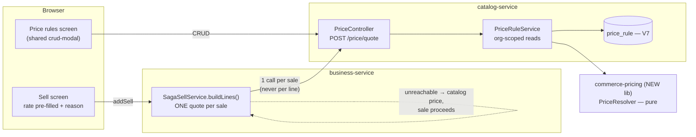
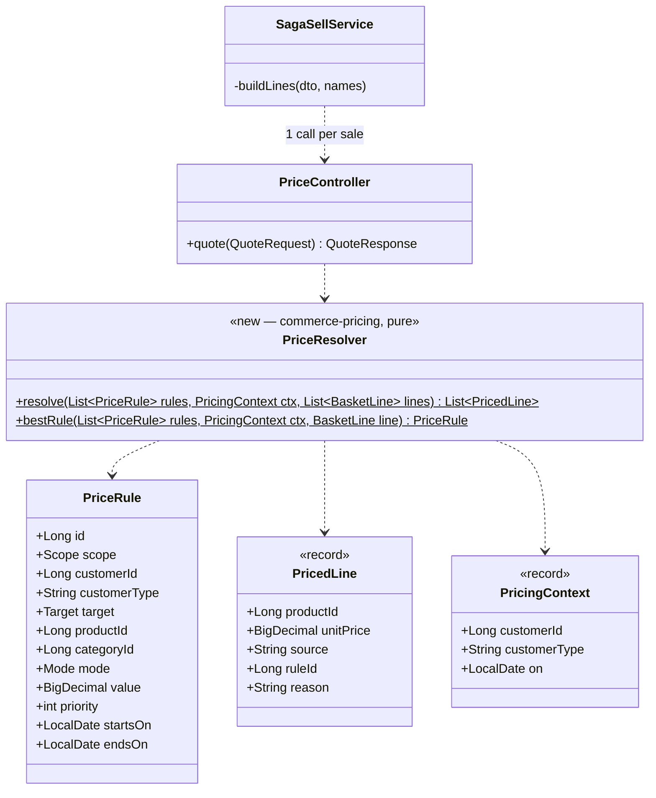

# B2B Phase 2 — contract & tiered pricing (= OMS **B1**, customer requirement **#10**)

**Status:** ✅ **DONE (backend) — Cypress-green 2026-08-02; business-service unit suite green 2026-08-03
after the fix below.** Two UI pieces remain, listed in §4.
Gate: `cypress/e2e/business/pricing.cy.js` · unit: `PriceResolverTest` (in `commerce-pricing`)

> ### ⚠️ Follow-up found 2026-08-03 — this slice's green was Cypress-ONLY
>
> `SagaSaleWriter.writePending` gained a 6th parameter (`List<StockPick> picks`) in `0e268b8b`, and
> `SagaSellServiceTest` still stubbed the 5-argument form at three call sites. **business-service's unit
> suite therefore did not compile from that commit until 2026-08-03** — so it had not run across Phases 0–2.
> Found when a full reactor build (which compiles tests) was run from the education thread; fixed by adding
> the sixth matcher. No production code was wrong: the signature was right, the stub was stale.
>
> **The rule this breaks is already written down:** *when a slice changes a CONTRACT, add every spec that
> asserted the old one to that slice's regression list.* A signature change is a contract change. `mvn test`
> for the owning service belongs in the gate alongside Cypress — Cypress cannot see a test that never
> compiled.
>
> **Still open:** the restored stubs match `any()` picks, so they assert nothing about what actually flows
> into `writePending`. If P2 intended specific picks, that is an untested path.

Programme: [`b2b-b2c-rollout-plan.md`](../b2b-b2c-rollout-plan.md) · Previous: [`b2b-P1-credit-limit.md`](b2b-P1-credit-limit.md)
Requirement: [`customer-requirements-plan.md`](../customer-requirements-plan.md) #10 · OMS Track B item **B1**

---

## 1. Document

### The problem

A wholesaler pays less than a walk-in. Today the system has no way to know that. There is exactly one price
per product — `Product.sellingPrice` — and the only way to charge a trade customer their agreed rate is for
the cashier to **type it in**, per line, from memory or a printed list.

That is requirement **#10** ("customer/product-wise discount"), and it is the last thing standing between the
B2B work so far and an actual trade account. Phases 0–1 gave a customer a *type* and a *credit limit*; this
gives them a *price*.

The cost of the manual workaround is not theoretical:
- every cashier must know every negotiated rate, and they will not
- a keyed rate is unauditable — nothing records *why* this customer paid 92
- the P0 margin guard fires on typos that were meant to be discounts, and vice versa

### What exists

| Piece | State |
|---|---|
| One catalog price per product | ✅ `Product.sellingPrice` → `ProductRef.sellingPrice` |
| Per-line manual rate + discount | ✅ `soldRate`, `resolveDiscount` in `buildLines` |
| **Customer type to price against** | ✅ **Phase 0** — `WALK_IN` / `RETAILER` / `WHOLESALE` / `VIP` |
| Tax resolved without a per-line call | ✅ the pattern to copy — `taxCodeId` → `ProductRef.taxRate` |
| **Any notion of a second price** | ❌ nothing: no `PriceList`, `ContractPrice`, `TieredPrice` |
| **A reason recorded for a price** | ❌ `discountType` is free text |

Phase 0's `customerType` was built as the key everything else would hang off. This is the phase that uses it.

---

## 2. Design

### 2a. The rule model — three kinds, one resolution order

```
1. CONTRACT   customer  × product   → fixed price      "Ali Traders buys Panadol at 92"
2. CONTRACT   customer  × category  → discount %       "Ali Traders gets 8% off all antibiotics"
3. TIER       customerType × product|category → discount %   "all WHOLESALE get 12% off"
4. (fallback) catalog price                             today's behaviour, unchanged
```

Most specific wins, and **the first match stops the search** — rules never stack. Stacking is how a 10% and a
5% rule silently become 14.5% and nobody can explain the invoice. One rule applies; the receipt names it.

### 2b. Where it lives — a new `commerce-pricing` library + tables on catalog-service

Per [`b2b-shared-library-review.md`](../b2b-shared-library-review.md) and the rollout plan: **rules shared,
data local**, the same shape `common-credit` has.

> **I checked first, because Phase 1 taught me to.** There, the review proposed minting
> `commerce-credit-policy` and the right answer was that `common-credit` already existed. Here I swept
> `commerce-domain` (Money, InvoiceNumbers, TenantSpecifications — generic primitives, not domain policy),
> `commerce-contracts` (DTOs + clients) and every `common-*` lib: **there is no pricing home.** A new library
> is justified; it was not last time.

- **`commerce-pricing`** (new lib): the resolver — pure, no repository, no HTTP. Takes the rules and a basket,
  returns a priced basket with a *reason* per line.
- **catalog-service** owns the tables and the endpoint, because a price is a property of the catalog, not of
  one channel. POS, storefront and pharmacy then get identical answers by construction.

### 2c. Data model — catalog-service, Flyway **V7**

| Table | Columns |
|---|---|
| `price_rule` | `id`, `organization_id`, `scope` (`CUSTOMER`\|`TYPE`), `customer_id` NULL, `customer_type` NULL, `target` (`PRODUCT`\|`CATEGORY`), `product_id` NULL, `category_id` NULL, `mode` (`FIXED`\|`PERCENT`), `value DECIMAL(19,2)`, `priority INT`, `active`, `starts_on` NULL, `ends_on` NULL, audit cols |

One table, not three — the three "kinds" in 2a are the same shape with different keys, and splitting them
would triple the join work to answer one question. Indexed `(organization_id, active, scope, product_id)` and
`(organization_id, active, scope, category_id)`.

Nullable dates: a rule with no dates is always live, which is the common case and must not require typing two
dates to express.

### 2d. The hot path — resolved ONCE per sale, never per line

**This is the constraint the design is built around.** `buildLines` already calls `catalogClient.getProduct`
per line; adding a price call per line would double the per-line network cost of every sale.

```
POST /api/catalog/price/quote
  { customerId, customerType, lines:[{productId, quantity}] }
→ { lines:[{productId, unitPrice, source:"CONTRACT|TIER|CATALOG", ruleId, reason}] }
```

One call per sale, before the line loop. If catalog is unreachable the sale **falls back to catalog price and
proceeds** — a pricing outage must never stop a shop selling; it degrades to exactly today's behaviour.

### 2e. What the cashier sees

- The rate box is **pre-filled** from the quote and shows its reason beside it (*"Wholesale −12%"*), rather
  than the cashier recalling a number.
- It stays **editable** — an owner standing at the till can still override, and the override is recorded as
  such, which is strictly more auditable than today where every price is an unexplained keystroke.
- A "Price rules" screen under the existing Configuration area, using the shared crud-modal so it looks like
  every other screen.

### 2f. Security

- Rules are org-scoped and read through `findScoped`; a quote for another tenant's customer returns catalog
  price, never their rate.
- The quote endpoint **never trusts a client-sent price**. It takes ids and quantities and returns prices —
  `buildLines` already derives `netAmount` server-side rather than trusting the client, and this keeps that.
- Managing rules is owner/admin, gated by the existing `@PreAuthorize` pattern.

### 2g. The subtle cases

1. **A contract price must not silently break the margin guard.** A rule priced below cost will trip P0's
   `assertMarginPolicy` on every sale to that customer. Correct — but the message must say the price came
   from a *rule*, or the shopkeeper will hunt for a cashier error that does not exist.
2. **An expired rule must fall back, not fail.** `ends_on` in the past → the line prices at catalog, silently.
3. **Returns and edits must reprice consistently.** `updateSell` re-runs `buildLines`; it has to re-quote, or
   editing an invoice would silently reprice a trade customer at catalog.
4. **Store credit, tax and the credit limit all sit downstream** and need no change — they consume the
   resolved line total. Phase 1's exposure maths keeps working because it reads `netAmount`.

---

## 3. Architecture & UML

### Architecture



### Class diagram



`PriceResolver` is pure — rules in, priced lines out. No repository, no clock (the date is in the context), no
settings. The precedence logic in 2a is exactly the part that will be argued about and must be unit-testable
without Spring, which is the same reasoning that made `CreditLimitPolicy` pure in Phase 1.

### Sequence — a wholesale sale

```mermaid
sequenceDiagram
  actor C as Cashier
  participant UI as Sell screen
  participant SS as SagaSellService
  participant CAT as catalog-service
  participant R as PriceResolver

  C->>UI: pick Ali Traders (WHOLESALE), add 10 × Panadol
  UI->>SS: addSell
  SS->>CAT: POST /price/quote {customerId, customerType, lines}
  CAT->>R: resolve(rules, ctx, lines)
  R-->>CAT: [{unitPrice 92, source CONTRACT, reason "Ali Traders contract"}]
  CAT-->>SS: priced lines
  Note over SS: ONE call — not one per line
  SS->>SS: buildLines uses the resolved rate as catalogPrice
  SS->>SS: assertMarginPolicy · assertCreditPolicy (Phase 0/1, unchanged)
  SS-->>C: sale recorded; receipt shows the rate AND its reason

  alt catalog unreachable
    CAT--xSS: timeout
    SS->>SS: fall back to Product.sellingPrice
    Note over SS: a pricing outage must never stop a shop selling
  end
```

---

## 4. Implement

- [x] **`commerce-pricing`** lib (new module, registered in the reactor) — `PriceResolver`, `PriceRule`, `PricedLine`, `PricingContext` (pure)
- [x] catalog-service **Flyway V7** — `price_rule` + the two scoped indexes (additive, guarded)
- [x] catalog-service — entity, org-scoped repository (+ anti-IDOR by-id), `PriceRuleService` with creation-time validation, CRUD endpoints (ADMIN-gated)
- [x] catalog-service — `POST /api/catalog/price-rules/quote` (gateway already routes `/api/catalog/**`)
- [x] `commerce-contracts` — `PriceQuote`/`PriceQuoteLine` + `CatalogClient.quote` (extended the EXISTING client rather than adding a second one) (the anti-corruption boundary, as with catalog/inventory)
- [x] `SagaSellService.buildLines` — one quote per sale; any failure falls back to catalog price
- [x] `updateSell` — re-quotes for free (it calls `buildLines`)
- [x] Margin-guard message names a rule-sourced price (2g.1)
- [ ] Sell screen — pre-filled rate + reason — **NOT DONE** (server resolves and persists it; the live on-screen hint is not wired)
- [x] Monolith proxy (`/priceRules`, `/savePriceRule`, `/deletePriceRule`)
- [ ] Price-rules SCREEN — **NOT DONE**; rules are managed through the API only
- [x] i18n — 4 keys × six bundles (1,314 aligned) — `ui.*` for markup, **`ui.js.*`** for anything `t()` reads, all six bundles
- [x] Unit tests `PriceResolverTest` — 25 cases — precedence, dates, no-stacking, fallbacks
- [x] Cypress gate **PASSED headed 2026-08-02**

---

## 5. Test

**Unit — `PriceResolverTest`** (the precedence table is the risk):
- customer×product beats customer×category beats type beats catalog
- rules never stack — two applicable rules yield ONE, the most specific
- equal specificity → higher `priority` wins; still equal → lowest `id`, so it is deterministic
- `starts_on`/`ends_on` boundaries inclusive; expired/future → falls through to catalog
- inactive rule ignored; empty rule list → every line at catalog price
- `FIXED` 0 is a real price (a giveaway), not "no rule"
- `PERCENT` > 100 or negative rejected rather than producing a negative price

**Cypress — `pricing.cy.js`** (headed, you run it):
1. No rules anywhere → every sale prices exactly as today. *The regression guard.*
2. A `WHOLESALE` tier rule → a wholesale customer's line pre-fills discounted; a `WALK_IN` does not.
3. A customer contract price beats the tier rule for that customer.
4. The receipt/line records the **reason**, not just the number.
5. An expired rule → catalog price, no error.
6. Editing the invoice re-quotes (2g.3) rather than silently repricing to catalog.
7. Cross-tenant: another org's rule never applies (anti-IDOR).
8. Below-cost contract price + `marginPolicy=warn` → the warning names the rule (2g.1).

---

## 6. Open questions

1. **Scope check — is `WHOLESALE`-tier pricing enough for the first cut**, with customer-specific contracts
   after? The design carries both because they are one table; if you want it smaller, tier-only is the half
   to keep, since it needs no per-customer data entry.
2. **Should a manual override be blocked for trade customers?** Today anyone can retype a rate. An owner
   might want a contract price to be final. Not designed — it needs a privilege.
3. **Storefront (Q4 in the rollout plan) still open:** does a logged-in trade buyer see their contract price
   online? The resolver is channel-agnostic, so this is a wiring decision, not a redesign.


---

## 7. Implementation notes (2026-08-02)

**Added beyond the design: `sell.price_reason` (business-service V31).** The design said the receipt should
record the reason, but persisting it was not in the checklist — and without it the slice would have rebuilt
the very problem it exists to solve. A resolved price with no stored reason is still a number nobody can
explain later. The reason is snapshotted as the **human string**, not the rule id, deliberately: a rule can be
edited or deleted, and an invoice must still explain itself years afterwards. Same reasoning as the
`catalog_price` and `cost_price` snapshots beside it.

**Contract types reused rather than duplicated.** The design implied catalog-service would own quote DTOs.
It uses `commerce-contracts`' `PriceQuote`/`PriceQuoteLine` on both sides instead, so the client and the
endpoint cannot drift into two shapes of the same message; and the quote was added to the EXISTING
`CatalogClient` rather than a second `PricingClient`, since the base URL and tenancy headers are already
correct there.

**The quote costs two queries, not two per line** — one batch product read (`findAllByIdScoped`, which
already existed) plus one read of the tenant's active rules, then pure in-memory resolution. It is also
skipped entirely for a walk-in with no customer id and no type, since no rule could match.

**Still open:** the sell screen's live "reason" hint and the Price Rules management screen. The backend is
complete and gated; both are UI-only and are listed above rather than quietly dropped.


---

# P2-UI — the Price Rules screen (completes requirement #10)

**Status:** 🟡 IN PROGRESS (started 2026-08-04)

## 1. Why this exists, stated plainly

Phase 2 was gated on the backend and marked green. The rule engine works, the CRUD API exists
(`ADMIN_PRIVILEGE`, org-scoped) — **but there is no screen, so an owner cannot author a rule without an API
client.** Requirement #10 was therefore marked SHIPPED while being unusable by the customer it was for.

The deferral WAS written down, in this doc and the rollout plan. That is the lesson: **a note in a doc is not
a plan.** Nothing carried it into a numbered slice with a gate, so once P2 went green the work became
invisible. It violates the standing rule to finish one domain end-to-end before starting the next.

**Checked at the same time (2026-08-04):** Phase 1 does NOT have this problem — `creditLimit` and
`paymentTermsDays` are editable inputs on both the customer and vendor forms. Its outstanding items
(due-date-from-terms, purchase-screen limit hint) are genuine enhancements, not unreachable features. **P2 is
the only requirement that shipped without a way to use it.**

## 1b. Standards this slice is built to

| Dimension | What applies |
|---|---|
| **Business/domain** | Pricing is the owner's commercial policy — "Ali Traders buys Panadol at 92", "every WHOLESALE customer gets 12% off antibiotics". Authoring it must not require a developer. |
| **The rule that matters** | **Rules NEVER stack.** Exactly one wins per line. An owner creating a second, overlapping rule must be able to see which one will actually apply, or they will conclude the system is ignoring them. The screen therefore shows precedence, not just a list. |
| **SaaS multi-tenancy** | The API is already org-scoped and `ADMIN_PRIVILEGE`-gated; the screen adds no rules of its own and therefore cannot weaken them. The monolith proxy passes the caller's identity through, exactly as every other proxied write does. |
| **Microservice boundaries** | Rules are catalog-service data — the screen talks to the existing endpoints through the monolith proxy. No new service, no new table, no duplicated validation. |
| **Design patterns** | **Adapter** (monolith proxy over the catalog API) · the precedence display reuses the SAME ordering the resolver applies, rather than re-describing it in JavaScript where it would drift. |
| **SOLID / DRY** | Validation stays server-side in `commerce-pricing` (percent bounds, dates). The screen surfaces errors rather than re-implementing the rules. |
| **Live-modules rule** | Purely additive: a new screen and three proxy routes. Existing pricing behaviour is untouched — an org with no rules keeps catalog prices. |
| **Testing standard** | Cypress gate that closes the loop the backend gate could not: **create a rule in the UI, then sell and assert the sale used it** and the line's `priceReason` names it. |

## 2. Scope

| | |
|---|---|
| **Proxy** | ✅ **already complete** — `GET /priceRules`, `POST /savePriceRule` (create AND update), `POST /deletePriceRule`. I first reported these as missing; that came from a truncated grep. **Nothing to build here.** |
| **Screen** | list · create · edit · delete, on the owner-gated pricing area |
| **Precedence** | show which rule wins, using the resolver's own order: customer×product > customer×category > tier×product > tier×category > catalog; ties by `priority`, then lowest id |
| **Also** | the sell-screen price-reason hint — which turned out not to be a hint but a defect fix (§4). **Approved and built 2026-08-04, see §6.** |

**Vocabulary the screen must speak** (from `PriceRule`): scope `CUSTOMER` or `TYPE` · target `PRODUCT` or
`CATEGORY` · mode `FIXED` (a price) or `PERCENT` (a discount) · optional `startsOn`/`endsOn` · `priority` ·
`active`.


## 3. What was built (2026-08-04)

| Piece | File | Note |
|---|---|---|
| Screen | `businessDashboard.html` → `#PriceRuleDiv` | table + inline editor, the same shape as the Tax Codes master on `TaxSettingDiv`. `ROLE_OWNER`, matching `#snavSettings` — its only entry point. |
| Nav | `#navPriceRules` under Settings | given an id because no existing spec navigates the sidebar; the gate needed a stable hook. |
| Logic | `business.js` → `showPriceRules` … `deletePriceRule` | ~230 lines. No new endpoint — the P2 proxy was already complete. |
| i18n | 51 keys × 6 bundles = 306 lines | bundles stay aligned at 1,332 `ui.*` keys each. |
| Gate | `cypress/e2e/business/price-rules-screen.cy.js` | 8 tests. |

### Decisions worth recording

**Precedence is mirrored, never re-derived.** `renderPriceRules` sorts by specificity DESC, then `priority`
DESC, then id ASC — read off `PriceResolver.bestRule()`, with a comment in each file pointing at the other.
Specificity is `CUSTOMER +2, PRODUCT +1`, so the four ranks are customer×product, customer×category,
tier×product, tier×category. The screen therefore cannot disagree with the till about which rule wins.

**"Overridden by #n" is deliberately narrow.** It is shown only when two LIVE rules share the *exact* same
buyer and the *exact* same item — the collision that is decidable from the rule list alone. Whether a
customer×product rule shadows a tier×category one depends on the customer and product on the line, so
claiming it in a static table would be inventing an answer. An inactive or expired rule is never labelled
overridden: it is not losing a race, it simply cannot apply.

**Dates.** The API takes `LocalDate`, so the form posts ISO. The visible box stays `dd-MM-yyyy` and mirrors
into a hidden field via `data-dp-iso` — the documented pattern in `date-picker.js`, not a second calendar.

**A first-paint race, found and fixed before shipping.** The table names a customer by reading the picker it
was loaded into. Firing the lookups and the rule load in parallel meant the first paint could read an empty
picker and print `#12` instead of `Ali Traders`, correcting itself only on the next save. `showPriceRules`
now chains: lookups, *then* render.

## 4. 🔴 Found while building this: contract prices are computed but not charged on the POS path

**This is a defect in P2, not in the screen.** Recording it here because the screen is what surfaced it.

`SagaSellService.buildLines()` line ~426:

```java
BigDecimal soldRate = (s.getSellRate() != null && s.getSellRate().compareTo(BigDecimal.ZERO) > 0)
        ? s.getSellRate() : catalogPrice;
```

The submitted rate wins. And the sell screen always submits one — `business.js:1756` fills `#sellSellRate`
from the **catalog** selling price the moment a product is picked, and `business.js:184` ships it as
`line.sellRate`. The barcode path (`business.js:279`) does the same.

So on a real sale through the UI: the basket is quoted, a rule matches, `priceReason` is set on the line —
and then the customer is charged the catalog price anyway. The receipt can say *"Contract price −12%"* next
to the undiscounted amount.

**Why the P2 gate went green.** `pricing.cy.js:69` submits `sales: [{ productId, quantity: 1 }]` — with no
`sellRate`. That is the one path where the fallback branch is taken and the contract price survives. The gate
proved the *engine*; nothing proved the *screen*, because there was no screen.

**Why I have not fixed it.** The obvious server-side fix — let the rule beat the submitted rate — is wrong:
the server cannot tell a cashier's deliberate override (850 on a 1000 item) from the browser's prefill, and
that override is a feature `price-override.cy.js` exists to protect. The correct fix is client-side: the sell
screen asks for a quote when the customer and line are known and puts the contract price *into* the rate box,
where the cashier can see it and still override it. The server's precedence then stays exactly as it is.

That needs: a `POST /priceQuote` proxy → catalog `/price-rules/quote`, and a debounced call from the cart so
it stays off the hot path (the line is added at catalog price immediately; the quote updates the row when it
arrives).

**It changes what live tenants charge**, which is why it is a separate, confirmed slice and not a quiet
addition to this one.

## 5. Status

🟢 **P2-UI COMPLETE — both gates Cypress-green 2026-08-04.**

| Gate | Result |
|---|---|
| `price-rules-screen.cy.js` | 8/8 — the screen. Caught two real defects on the way (§7). |
| `contract-price-charged.cy.js` | 6/6 — the contract price is the price charged. |

**Requirement #10 is DONE**: 🟡 *engine only, unusable* → 🟢 *authorable AND charged*. The engine
shipped in P2; P2-UI made it reachable by the owner it was built for, and made it reach the customer.


## 6. The fix (approved 2026-08-04)

### Why the fix is client-side

The tempting fix — let a matched rule beat the submitted rate in `SagaSellService` — is wrong. The server
receives one number in one field and cannot tell a cashier's deliberate 850-on-a-1000-item from this screen's
prefill. Making the rule win would silently kill the manual override that `price-override.cy.js` exists to
protect. **Server precedence is correct and is untouched.** The till asks what the buyer pays and puts *that*
in the rate box — visible, explicable, and still overridable by the person standing at the counter.

### What changed

| Piece | File | Note |
|---|---|---|
| Quote proxy | `CatalogController.priceQuote` → catalog `POST /price-rules/quote` | Adapter, like every other catalog route. Open to any authenticated user, matching the catalog endpoint — every till needs it on every sale, it answers only for the caller's tenant, and it returns prices the cashier is about to charge anyway. On failure it returns an empty quote = "charge catalog" = today's behaviour, the same fallback `SagaSellService` takes. |
| Quote on pick | `business.js` → `quoteSellFormPrice` | Fires alongside the `productSellable` call already made on pick, so it adds **no round trip to the critical path**. The catalog price is written synchronously first, so the line is usable immediately. |
| Re-price on customer change | `business.js` → `requoteSellCart` | ONE call for the whole cart, never one per line. Covers "scan first, ask who is buying second" — an ordinary counter habit that otherwise still charged catalog. |
| Reason on screen | `#sellPriceReason` | A price the cashier cannot explain to the customer is the problem the rules exist to avoid. |
| Line maths | `business.js` → `sellLineMath` | **Extracted** from `calculateNetSell`, which now calls it. Re-pricing a cart line has to recompute its total, and a second copy of that arithmetic would drift from the form's. Rounding order preserved exactly. |
| Gate | `cypress/e2e/business/contract-price-charged.cy.js` | 6 tests. |

### The override rule, stated once

`window._sellAutoRate` (form) and `line.autoRate` (cart) record the rate **this code** put there. A re-price
only ever replaces a rate that still equals its `autoRate`. The moment the cashier types, `autoRate` no longer
matches — or is `null` for a line added with a typed rate — and nothing will move that price again. This is
the client-side twin of the server rule it must not contradict.

### Known edge, accepted

The client quotes at pick time; the server re-quotes at submit and records `priceReason` from its own quote.
If a rule is edited or deleted in between, the customer is charged the price they were quoted at the counter
while the recorded reason reflects the later state. That is ordinary retail behaviour — the quoted price wins
— and the alternative (re-pricing at submit, behind the cashier's back) is worse. The margin and credit
guards all work off the submitted rate, so they stay consistent either way.

### Vocabulary note

`customerType` now rides on the sell customer `<option>` as `data-customer-type`. A TIER rule matches on it
and the server quotes with **both** id and type; sending only the id would let the till and the rules disagree
about the price for tier-scoped rules.


## 7. The gate caught a real defect: a customer type that does not exist

The first headed run failed five of eight tests on
`Failed to convert ... to type CustomerType for value [RETAIL]`.

`CustomerType` has exactly **four** values — `WALK_IN`, `RETAILER`, `WHOLESALE`, `VIP`. There is no `RETAIL`.
The add-customer form had it right all along. Three other places did not:

| Where | Consequence |
|---|---|
| the gate's own fixture | the visible failure — a 400 from business-service |
| **the new `#prCustomerType` picker** | offered `RETAIL`, which no customer can ever be, so a tier rule scoped to it would have **silently never fired** — precisely the failure this screen was built to expose. And it omitted `VIP`, so an owner could not give a VIP a tier price, though VIP exists *specifically* to grant a better price |
| **`report-filters.js` (pre-existing, 3e-1)** | the shared channel filter offered the same wrong list: a channel matching no row, ever, and no way to filter VIP sales at all |

**Where the bad list came from.** I built the picker by copying the option list out of `report-filters.js`
instead of reading it off the enum. The bug was already there; copying it is what spread it. **Read a
constrained list off its source of truth, never off another list that happens to be nearby.**

**Why 3e-1 went green with a broken filter.** `report-grouping.cy.js` asserts the channel select has options
and counts them. It never selects one and checks that rows come back. A filter that matches nothing satisfies
every assertion in that test.

**Fixed.** All four values, everywhere, with the labels the add-customer form already uses. The list and its
label lookup now live **once**, as `CUSTOMER_TYPE_LABELS` / `customerTypeLabel()` in `main.js`, because both a
module file (`business.js`) and a common one (`report-filters.js`) need it — the DRY rule for shared helpers.
The Price Rules table now shows "Retailer (trade)" rather than the raw constant. `SaleReportFilterTest`'s
sample data used `"RETAIL"` too; it is a plain string compare so nothing failed, but it read as though RETAIL
were real, and is now `"RETAILER"`.

**Still open:** nothing pins these option lists to the enum. The enum's own javadoc anticipates `GOVT`, `NGO`,
`EXPORT`, and adding one would silently leave both pickers stale. A guard test was offered and not taken this
round; worth revisiting when a fifth value is actually added.
