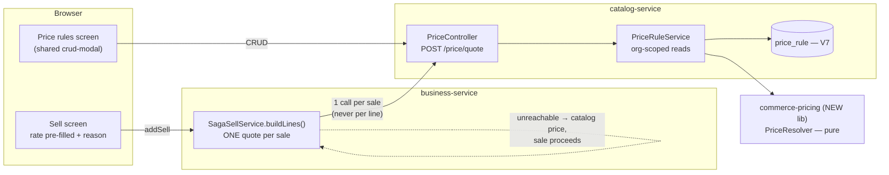
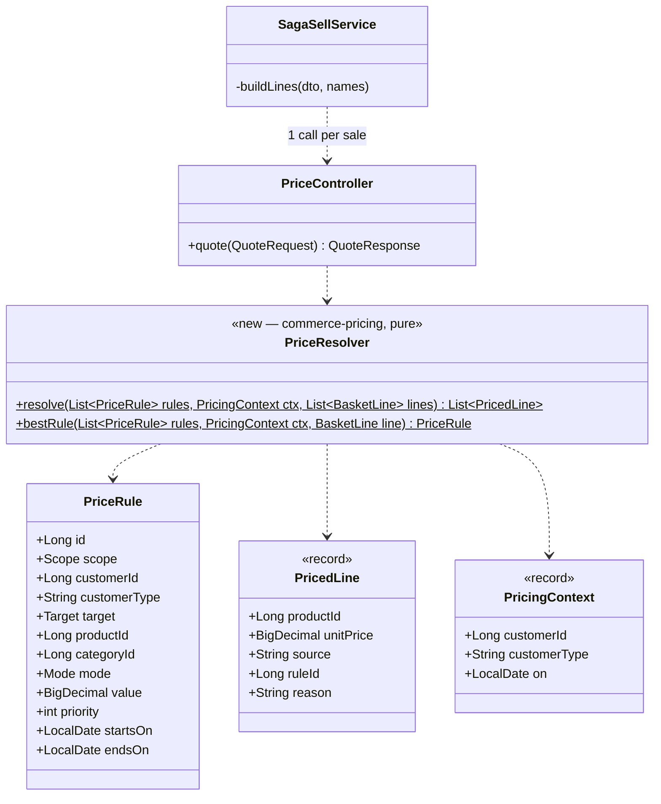

# B2B Phase 2 — contract & tiered pricing (= OMS **B1**, customer requirement **#10**)

**Status:** ✅ **DONE (backend) — Cypress-green 2026-08-02.** Two UI pieces remain, listed in §4.
Gate: `cypress/e2e/business/pricing.cy.js` · unit: `PriceResolverTest` (in `commerce-pricing`)
Programme: [`b2b-b2c-rollout-plan.md`](../b2b-b2c-rollout-plan.md) · Previous: [`b2b-P1-credit-limit.md`](b2b-P1-credit-limit.md)
Requirement: [`customer-requirements-plan.md`](../customer-requirements-plan.md) #10 · OMS Track B item **B1**

---

## 1. Document

### The problem

A wholesaler pays less than a walk-in. Today the system has no way to know that. There is exactly one price
per product — `Product.sellingPrice` — and the only way to charge a trade customer their agreed rate is for
the cashier to **type it in**, per line, from memory or a printed list.

That is requirement **#10** ("customer/product-wise discount"), and it is the last thing standing between the
B2B work so far and an actual trade account. Phases 0–1 gave a customer a *type* and a *credit limit*; this
gives them a *price*.

The cost of the manual workaround is not theoretical:
- every cashier must know every negotiated rate, and they will not
- a keyed rate is unauditable — nothing records *why* this customer paid 92
- the P0 margin guard fires on typos that were meant to be discounts, and vice versa

### What exists

| Piece | State |
|---|---|
| One catalog price per product | ✅ `Product.sellingPrice` → `ProductRef.sellingPrice` |
| Per-line manual rate + discount | ✅ `soldRate`, `resolveDiscount` in `buildLines` |
| **Customer type to price against** | ✅ **Phase 0** — `WALK_IN` / `RETAILER` / `WHOLESALE` / `VIP` |
| Tax resolved without a per-line call | ✅ the pattern to copy — `taxCodeId` → `ProductRef.taxRate` |
| **Any notion of a second price** | ❌ nothing: no `PriceList`, `ContractPrice`, `TieredPrice` |
| **A reason recorded for a price** | ❌ `discountType` is free text |

Phase 0's `customerType` was built as the key everything else would hang off. This is the phase that uses it.

---

## 2. Design

### 2a. The rule model — three kinds, one resolution order

```
1. CONTRACT   customer  × product   → fixed price      "Ali Traders buys Panadol at 92"
2. CONTRACT   customer  × category  → discount %       "Ali Traders gets 8% off all antibiotics"
3. TIER       customerType × product|category → discount %   "all WHOLESALE get 12% off"
4. (fallback) catalog price                             today's behaviour, unchanged
```

Most specific wins, and **the first match stops the search** — rules never stack. Stacking is how a 10% and a
5% rule silently become 14.5% and nobody can explain the invoice. One rule applies; the receipt names it.

### 2b. Where it lives — a new `commerce-pricing` library + tables on catalog-service

Per [`b2b-shared-library-review.md`](../b2b-shared-library-review.md) and the rollout plan: **rules shared,
data local**, the same shape `common-credit` has.

> **I checked first, because Phase 1 taught me to.** There, the review proposed minting
> `commerce-credit-policy` and the right answer was that `common-credit` already existed. Here I swept
> `commerce-domain` (Money, InvoiceNumbers, TenantSpecifications — generic primitives, not domain policy),
> `commerce-contracts` (DTOs + clients) and every `common-*` lib: **there is no pricing home.** A new library
> is justified; it was not last time.

- **`commerce-pricing`** (new lib): the resolver — pure, no repository, no HTTP. Takes the rules and a basket,
  returns a priced basket with a *reason* per line.
- **catalog-service** owns the tables and the endpoint, because a price is a property of the catalog, not of
  one channel. POS, storefront and pharmacy then get identical answers by construction.

### 2c. Data model — catalog-service, Flyway **V7**

| Table | Columns |
|---|---|
| `price_rule` | `id`, `organization_id`, `scope` (`CUSTOMER`\|`TYPE`), `customer_id` NULL, `customer_type` NULL, `target` (`PRODUCT`\|`CATEGORY`), `product_id` NULL, `category_id` NULL, `mode` (`FIXED`\|`PERCENT`), `value DECIMAL(19,2)`, `priority INT`, `active`, `starts_on` NULL, `ends_on` NULL, audit cols |

One table, not three — the three "kinds" in 2a are the same shape with different keys, and splitting them
would triple the join work to answer one question. Indexed `(organization_id, active, scope, product_id)` and
`(organization_id, active, scope, category_id)`.

Nullable dates: a rule with no dates is always live, which is the common case and must not require typing two
dates to express.

### 2d. The hot path — resolved ONCE per sale, never per line

**This is the constraint the design is built around.** `buildLines` already calls `catalogClient.getProduct`
per line; adding a price call per line would double the per-line network cost of every sale.

```
POST /api/catalog/price/quote
  { customerId, customerType, lines:[{productId, quantity}] }
→ { lines:[{productId, unitPrice, source:"CONTRACT|TIER|CATALOG", ruleId, reason}] }
```

One call per sale, before the line loop. If catalog is unreachable the sale **falls back to catalog price and
proceeds** — a pricing outage must never stop a shop selling; it degrades to exactly today's behaviour.

### 2e. What the cashier sees

- The rate box is **pre-filled** from the quote and shows its reason beside it (*"Wholesale −12%"*), rather
  than the cashier recalling a number.
- It stays **editable** — an owner standing at the till can still override, and the override is recorded as
  such, which is strictly more auditable than today where every price is an unexplained keystroke.
- A "Price rules" screen under the existing Configuration area, using the shared crud-modal so it looks like
  every other screen.

### 2f. Security

- Rules are org-scoped and read through `findScoped`; a quote for another tenant's customer returns catalog
  price, never their rate.
- The quote endpoint **never trusts a client-sent price**. It takes ids and quantities and returns prices —
  `buildLines` already derives `netAmount` server-side rather than trusting the client, and this keeps that.
- Managing rules is owner/admin, gated by the existing `@PreAuthorize` pattern.

### 2g. The subtle cases

1. **A contract price must not silently break the margin guard.** A rule priced below cost will trip P0's
   `assertMarginPolicy` on every sale to that customer. Correct — but the message must say the price came
   from a *rule*, or the shopkeeper will hunt for a cashier error that does not exist.
2. **An expired rule must fall back, not fail.** `ends_on` in the past → the line prices at catalog, silently.
3. **Returns and edits must reprice consistently.** `updateSell` re-runs `buildLines`; it has to re-quote, or
   editing an invoice would silently reprice a trade customer at catalog.
4. **Store credit, tax and the credit limit all sit downstream** and need no change — they consume the
   resolved line total. Phase 1's exposure maths keeps working because it reads `netAmount`.

---

## 3. Architecture & UML

### Architecture



### Class diagram



`PriceResolver` is pure — rules in, priced lines out. No repository, no clock (the date is in the context), no
settings. The precedence logic in 2a is exactly the part that will be argued about and must be unit-testable
without Spring, which is the same reasoning that made `CreditLimitPolicy` pure in Phase 1.

### Sequence — a wholesale sale

```mermaid
sequenceDiagram
  actor C as Cashier
  participant UI as Sell screen
  participant SS as SagaSellService
  participant CAT as catalog-service
  participant R as PriceResolver

  C->>UI: pick Ali Traders (WHOLESALE), add 10 × Panadol
  UI->>SS: addSell
  SS->>CAT: POST /price/quote {customerId, customerType, lines}
  CAT->>R: resolve(rules, ctx, lines)
  R-->>CAT: [{unitPrice 92, source CONTRACT, reason "Ali Traders contract"}]
  CAT-->>SS: priced lines
  Note over SS: ONE call — not one per line
  SS->>SS: buildLines uses the resolved rate as catalogPrice
  SS->>SS: assertMarginPolicy · assertCreditPolicy (Phase 0/1, unchanged)
  SS-->>C: sale recorded; receipt shows the rate AND its reason

  alt catalog unreachable
    CAT--xSS: timeout
    SS->>SS: fall back to Product.sellingPrice
    Note over SS: a pricing outage must never stop a shop selling
  end
```

---

## 4. Implement

- [x] **`commerce-pricing`** lib (new module, registered in the reactor) — `PriceResolver`, `PriceRule`, `PricedLine`, `PricingContext` (pure)
- [x] catalog-service **Flyway V7** — `price_rule` + the two scoped indexes (additive, guarded)
- [x] catalog-service — entity, org-scoped repository (+ anti-IDOR by-id), `PriceRuleService` with creation-time validation, CRUD endpoints (ADMIN-gated)
- [x] catalog-service — `POST /api/catalog/price-rules/quote` (gateway already routes `/api/catalog/**`)
- [x] `commerce-contracts` — `PriceQuote`/`PriceQuoteLine` + `CatalogClient.quote` (extended the EXISTING client rather than adding a second one) (the anti-corruption boundary, as with catalog/inventory)
- [x] `SagaSellService.buildLines` — one quote per sale; any failure falls back to catalog price
- [x] `updateSell` — re-quotes for free (it calls `buildLines`)
- [x] Margin-guard message names a rule-sourced price (2g.1)
- [ ] Sell screen — pre-filled rate + reason — **NOT DONE** (server resolves and persists it; the live on-screen hint is not wired)
- [x] Monolith proxy (`/priceRules`, `/savePriceRule`, `/deletePriceRule`)
- [ ] Price-rules SCREEN — **NOT DONE**; rules are managed through the API only
- [x] i18n — 4 keys × six bundles (1,314 aligned) — `ui.*` for markup, **`ui.js.*`** for anything `t()` reads, all six bundles
- [x] Unit tests `PriceResolverTest` — 25 cases — precedence, dates, no-stacking, fallbacks
- [x] Cypress gate **PASSED headed 2026-08-02**

---

## 5. Test

**Unit — `PriceResolverTest`** (the precedence table is the risk):
- customer×product beats customer×category beats type beats catalog
- rules never stack — two applicable rules yield ONE, the most specific
- equal specificity → higher `priority` wins; still equal → lowest `id`, so it is deterministic
- `starts_on`/`ends_on` boundaries inclusive; expired/future → falls through to catalog
- inactive rule ignored; empty rule list → every line at catalog price
- `FIXED` 0 is a real price (a giveaway), not "no rule"
- `PERCENT` > 100 or negative rejected rather than producing a negative price

**Cypress — `pricing.cy.js`** (headed, you run it):
1. No rules anywhere → every sale prices exactly as today. *The regression guard.*
2. A `WHOLESALE` tier rule → a wholesale customer's line pre-fills discounted; a `WALK_IN` does not.
3. A customer contract price beats the tier rule for that customer.
4. The receipt/line records the **reason**, not just the number.
5. An expired rule → catalog price, no error.
6. Editing the invoice re-quotes (2g.3) rather than silently repricing to catalog.
7. Cross-tenant: another org's rule never applies (anti-IDOR).
8. Below-cost contract price + `marginPolicy=warn` → the warning names the rule (2g.1).

---

## 6. Open questions

1. **Scope check — is `WHOLESALE`-tier pricing enough for the first cut**, with customer-specific contracts
   after? The design carries both because they are one table; if you want it smaller, tier-only is the half
   to keep, since it needs no per-customer data entry.
2. **Should a manual override be blocked for trade customers?** Today anyone can retype a rate. An owner
   might want a contract price to be final. Not designed — it needs a privilege.
3. **Storefront (Q4 in the rollout plan) still open:** does a logged-in trade buyer see their contract price
   online? The resolver is channel-agnostic, so this is a wiring decision, not a redesign.


---

## 7. Implementation notes (2026-08-02)

**Added beyond the design: `sell.price_reason` (business-service V31).** The design said the receipt should
record the reason, but persisting it was not in the checklist — and without it the slice would have rebuilt
the very problem it exists to solve. A resolved price with no stored reason is still a number nobody can
explain later. The reason is snapshotted as the **human string**, not the rule id, deliberately: a rule can be
edited or deleted, and an invoice must still explain itself years afterwards. Same reasoning as the
`catalog_price` and `cost_price` snapshots beside it.

**Contract types reused rather than duplicated.** The design implied catalog-service would own quote DTOs.
It uses `commerce-contracts`' `PriceQuote`/`PriceQuoteLine` on both sides instead, so the client and the
endpoint cannot drift into two shapes of the same message; and the quote was added to the EXISTING
`CatalogClient` rather than a second `PricingClient`, since the base URL and tenancy headers are already
correct there.

**The quote costs two queries, not two per line** — one batch product read (`findAllByIdScoped`, which
already existed) plus one read of the tenant's active rules, then pure in-memory resolution. It is also
skipped entirely for a walk-in with no customer id and no type, since no rule could match.

**Still open:** the sell screen's live "reason" hint and the Price Rules management screen. The backend is
complete and gated; both are UI-only and are listed above rather than quietly dropped.
