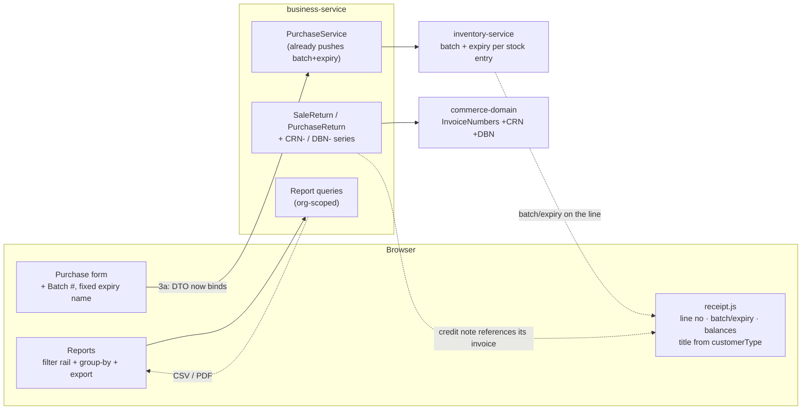
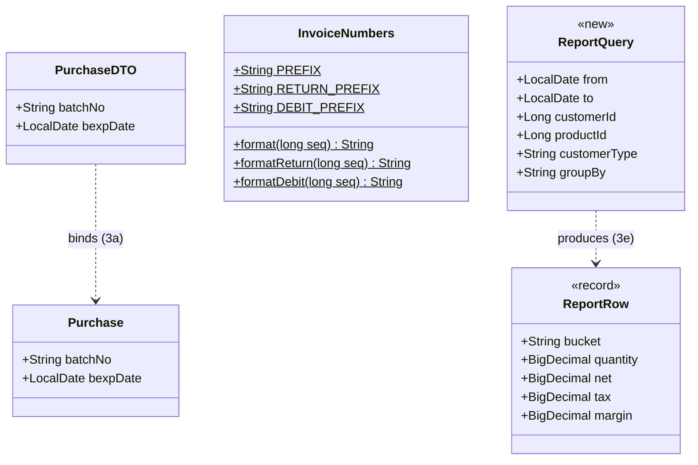

# B2B Phase 3 — documents & reports (customer requirements **#2, #4, #1, #5, #6**)

**Status:** 🟡 IN PROGRESS — **3a + 3b-1 + 3b-2 + 3c + 3d DONE & Cypress-green**; **3e** is the last sub-slice (+ candidate **3f**, below).
Gates: `purchase-batch-expiry.cy.js` (3a/3b-1) · `receipt-detail.cy.js` (3b-2) · `return-documents.cy.js` (3c) · `statement-download.cy.js` (3d) — all green
Gate: `cypress/e2e/business/purchase-batch-expiry.cy.js`
Programme: [`b2b-b2c-rollout-plan.md`](../b2b-b2c-rollout-plan.md) · Previous: [`b2b-P2-pricing.md`](b2b-P2-pricing.md)
Requirements: [`customer-requirements-plan.md`](../customer-requirements-plan.md) #2 · #4 · #1 · #5 · #6

---

## 1. Document

### What this phase is

Phases 0–2 gave a customer an identity, a credit limit and a price. This phase is about the **paper** — what
the shop hands over, and what the owner reads afterwards. Five of the twelve customer requirements live here,
and unlike the earlier phases they serve **both channels equally**: a B2C shop wants the same receipt detail
and the same reports.

| # | Requirement | Real state in the code (verified, not assumed) |
|---|---|---|
| **#2** | Batch # on purchase | The whole chain already works: `Purchase` entity, `PurchaseService`'s inventory push, and the live `PurchaseDTO.stock` (a `StockDTO` carrying `batchNo` + `bexpDate`) that the form's `stock.*` fields bind through. **The only real gap is that there is no batch INPUT on the form**, and its table column was commented out. |
| **#4** | Receipt: batch, expiry, prev. balance, line no. | `receipt.js` renders item/qty/rate/amount only. Needs #2 first for batch/expiry to exist. |
| **#1** | Return invoices — own number series | `InvoiceNumbers` formats one series (`INV-`). Returns reuse the sale's number, so a credit note is indistinguishable from the invoice it reverses. |
| **#5** | Statement download | Statements render on screen; `jspdf` **is** vendored (`/js/jspdf.debug.js`) and already used by `businessInvoicePrint.js`. |
| **#6** | Multi-dimensional reports | One report (`SRDiv` / Sale Detail). No filter rail, no group-by, no export. |

**#2 is far smaller than its "M" estimate.** The whole chain already exists — entity, service, inventory
push. It is a DTO binding and two form fields. Discovering that is why the estimate was worth re-checking
rather than trusted.

### Why the order is #2 → #4 → #1 → #5 → #6

#2 **gates** #4: a receipt cannot print a batch the purchase never captured. The rest are independent, so
they are ordered cheapest-first, which also front-loads the two the customer sees daily.

---

## 1b. Standards this phase is built to

Stated explicitly rather than left implicit, so a reviewer can check the work against a named rule instead of
taste.

| Dimension | What applies here | Where it shows up |
|---|---|---|
| **Business / domain** | Batch-lot + expiry is the basis of **pharmaceutical traceability**: a recall is executed BY batch, and dispensing is **FEFO** by expiry. Not a form field — a regulatory capability. | 3a; `inventory-service` already keys stock entries on batch+expiry |
| **Accounting standard** | A return is a **credit note** (customer) or **debit note** (supplier) — a distinct document in its own series that **references the document it reverses**. Reusing the invoice number makes reconciliation impossible. | 3c (`CRN-` / `DBN-`) |
| **Fiscal / commercial** | *Receipt* and *invoice* are different documents to a business buyer: an invoice is the instrument they book and pay against. | 3b-1 |
| **SaaS multi-tenancy** | Every read org-scoped with the NULL-fallback; anti-IDOR `findByIdScoped` on by-id access; nothing here widens scope. | all sub-slices |
| **Live-modules rule** | Additive only; every default preserves today's behaviour. 3a needs **no migration** (columns exist); 3b-1 is safe because V29 back-filled every customer to `WALK_IN`. | 3a, 3b-1 |
| **Microservice boundaries** | Document *content* stays in the owning service; `commerce-domain` holds only the pure **numbering** rules, exactly as it does for `INV-` today. No new service — none of this owns data + lifecycle + external integration. | 3c |
| **Design patterns** | **Value Object** (`InvoiceNumbers`, pure formatting) · **Specification/Query Object** (3e `ReportQuery`) · **Template Method** via one shared filter+export component rather than a bespoke screen per report · **Anti-Corruption Layer** (`commerce-contracts`) unchanged | 3c, 3e |
| **SOLID / DRY** | 3e builds ONE filter+export component every future report inherits; the alternative — a bespoke report screen each time — is the duplication this codebase has repeatedly paid for. | 3e |
| **Testing standard** | Pure logic unit-tested without Spring and run on every `mvn test`; one headed Cypress gate per sub-slice; each gate asserts the **regression** (today's behaviour) before the new behaviour. | all |

---

## 2. Design — five sub-slices, each with its own gate

Delivered and gated one at a time (slice cadence), not as one large drop. Each is independently useful; if
you stop after 3b the shop still gained a working batch/expiry receipt.

### 3a — #2 batch & expiry captured on purchase *(the enabler)*

- Purchase form: a **Batch #** input posting to `name="stock.batchNo"`, consistent with every sibling field
  on that form. `StockDTO.batchNo` already exists and ModelMapper flattens it onto `Purchase.batchNo`.
- Purchase table: un-comment the Batch column (`businessDashboard.html:1034`) **and emit the matching cell**.
- **No migration, and no DTO change.**

> ### ⚠️ Correction (2026-08-02) — a bug I claimed that does not exist
>
> An earlier revision of this doc stated that the expiry input posts to `name="stock.bexpDate"`, "a nested
> path whose `Stock` class was deleted in slice 88", and therefore that **every expiry typed on the purchase
> form was being silently discarded**. **That is wrong.** The `Stock` *entity* was deleted; `StockDTO` and
> `PurchaseDTO.stock` were not. The nested binding works, and `finance-reports.cy.js` proves it — it posts
> `stock.bpurchaseRate` and asserts the resulting amounts.
>
> I had changed the form to `name="bexpDate"` and un-commented two DTO fields on that false premise. Both are
> **reverted**: the working path is left alone, and the new batch input follows the same `stock.*` convention.
> Recorded rather than quietly deleted, because a claimed-and-withdrawn bug is exactly the kind of thing a
> later reader would otherwise re-introduce.

### 3a-2 — ~~`tablePurchase` column alignment~~ **WITHDRAWN: there was no misalignment**

I reported `tablePurchase` as 17 headers to 13 cells and "fixed" it by restoring four discount cells. **Both
the diagnosis and the fix were wrong, and the fix broke the table.** Reverted.

**What is actually true:** the four discount `<th>`s — `purchaseDiscountTypeDD`, `purchaseDiscount`,
`sellDiscountTypeDD`, `sellDiscount` — are **commented out** in `businessDashboard.html`, deliberately, at
the same time their cells were removed. Header and cell already agreed. The table renders **14 headers to 14
cells** with the new Batch column, and rendered 13 to 13 before it.

**Why I got it wrong twice:** I counted `<th data-field=...>` with a regex over the raw template text, which
matches inside `<!-- ... -->`. The cell side was counted with comments stripped. Counting one side with
comments and the other without manufactured a four-column gap that does not exist — and then "restoring" the
cells created a real 18-vs-14 mismatch where there had been none.

**The rule this leaves behind:** never diagnose column alignment from source text. Assert it in the
**browser**, where a commented-out header simply is not a column — which is what the gate now does
(`thead th` count vs a row's `td` count). That assertion is worth copying into the other table specs; it is
the check that would have caught the real `tableCustomer` gap in Phase 0 without any counting at all.

### 3b-1 — receipt vs INVOICE, from `customerType` *(no dependencies — ships with 3a)*

Split out of 3b and moved forward. It was deferred from Phase 0 with the rest of the document work, but it
has **no dependency on 3a** — unlike the rest of the receipt, which needs batch/expiry to exist — and it is
the single most visible B2B signal a trade customer receives. Filing it with the document work left it
unbuilt across three phases for no technical reason.

- `receipt.js` titles the document **INVOICE** for a trade account (`CustomerType.isB2B()`) and **RECEIPT**
  otherwise, replacing the fixed `VERTICAL_PROFILE.receiptTitle`.
- **Unconditional, no setting.** Every existing customer back-filled to `WALK_IN` in V29, so the title only
  changes for an account the owner *deliberately* marked `RETAILER`/`WHOLESALE` — which is precisely the
  intent of having marked them. A tenant that has not opted in sees no change, which is the live-modules
  guarantee honoured, not bypassed.

### 3b-2 — #4 richer receipt *(needs 3a)*

`receipt.js` gains, each shown only when it has a value, so a B2C corner shop's receipt does not grow noise:
- **line number** — a plain counter; makes a disputed line referable over the phone
- **batch / expiry** per line
- **previous balance / new balance** — for an account customer
*(the document title moved out to 3b-1 above, since it has no dependency on 3a.)*

#### The finding that shapes this: `StockPick` is returned and thrown away

`StockReservationResponse` already carries `List<StockPick>` — `{itemId, batchNo, quantity, expiryDate}` —
and its own javadoc says it exists *"so the sale (and any pharmacy controlled-substance register) records
exact batch traceability"*. **Nothing consumes it.** Not `SagaSellService`, not `SagaSaleWriter`, not the
pharmacy dispense path. Every sale already knows exactly which batches left the shelf, and discards it at the
end of the method.

So this is not "add batch to the receipt" — it is **stop discarding the traceability the saga already
produces**. Which also means 3a (batch IN) and this (batch OUT) together close the loop a recall needs.

#### Data model — business-service **V32**

| Table | Why |
|---|---|
| `sell_batch` (`id`, `sell_id`, `organization_id`, `product_id`, `batch_no`, `expiry_date`, `quantity`) | A **child table, not columns on `sell`**: FEFO legitimately splits one line across several batches, so a single `sell.batch_no` would be lossy exactly when traceability matters most — a part-shipped line during a recall. |
| `customer_history.balance_after` | The customer's running balance **at the moment of this sale**. Snapshotted, because `Customer.dueAmount` is *current* — using it to print a two-year-old invoice's balance would show today's figure on yesterday's document. "Previous balance" is then derived: `balance_after − this invoice's unpaid`. One column, not two. |

Additive, nullable, no back-fill: an existing invoice reprints exactly as it does today (no batch rows, no
balance line).

#### Design notes

- **Pattern:** the picks are a *domain event already emitted* by the reservation; persisting them is an
  **audit/snapshot** concern, so they are written on the same transaction as the sale rather than fetched
  from inventory at print time. A receipt must never depend on another service being up.
- Rendering stays conditional — no batch rows, no batch column; no account customer, no balance lines.

### 3c — #1 return documents get their own series — **DONE, green 2026-08-03**

#### What the survey found (2026-08-03), which is not what the outline assumed

| | Customer side | Supplier side |
|---|---|---|
| Record of the return | `SaleReturn` exists (SF-11 "credit-note stub"): qty, reason, refund, who, store | **none at all** — `purchaseReturn` adjusts stock + payable and leaves no document |
| Its own number | **none.** `sale_return.invoice_no` holds the number of the invoice it REVERSES | n/a |
| GL reference | `SALE_RETURN` posted with `ref` = the **original invoice number** | `PURCHASE_RETURN` posted with `ref` = the **original bill number** |

So the customer side is half-built and mis-numbered, and the supplier side has no document. A credit note is
currently indistinguishable from the invoice it cancels — which is the accounting defect #1 names.

#### Standards this sub-slice is built to

| Dimension | What applies |
|---|---|
| **Accounting standard** | A return is a **credit note** (customer) or **debit note** (supplier): a distinct document, in its own series, that REFERENCES what it reverses. Reusing the reversed document's number is the defect. |
| **Business/domain** | Reconciliation. A supplier matching your debit note against their credit note needs a number that is yours and unambiguous. |
| **SaaS multi-tenancy** | Sequences are per-org (`MAX+1` scoped by `organization_id`), and `UNIQUE(organization_id, seq)` is the concurrency guarantee — identical to `invoice_seq` since slice 22. |
| **Live-modules rule** | Additive; existing returns keep NULL note numbers and display as today. **No back-fill** — that would fabricate documents never issued. |
| **Microservice boundaries** | Numbering is pure formatting, so it stays a **Value Object** in `commerce-domain`; allocation stays in the owning service. No new service — this owns no data or lifecycle of its own. |
| **Design patterns** | **Value Object** (`InvoiceNumbers`) · the document row is an **audit/snapshot** record written on the same transaction as the return. |
| **SOLID / DRY** | One formatter for every document number in every vertical; `isReturnDocument()` means callers never re-implement prefix matching. |
| **Testing standard** | Pure-logic `InvoiceNumbersTest` on `mvn test` (asserts sequence 42 yields three DIFFERENT documents) + a headed Cypress gate. |

#### Design

| Piece | Decision |
|---|---|
| **Numbering** | `commerce-domain.InvoiceNumbers` gains `creditNote(seq)` -> `CRN-000123` and `debitNote(seq)` -> `DBN-000123`. Same **Value Object**, same width, pure formatting; allocation stays in the service exactly as `INV-` works today. One place renders every document number for every vertical. |
| **Allocation** | `MAX(seq)+1` per org inside the return's transaction, guarded by `UNIQUE(organization_id, seq)` — the identical pattern `invoiceSeq` has used since slice 22. Not a new mechanism. |
| **The reference** | `sale_return.invoice_no` KEEPS pointing at the reversed invoice. That is the accounting requirement: a credit note is its own document that **references** what it reverses. The new columns carry the note's own identity. |
| **Supplier side** | New `purchase_return` table mirroring `sale_return`, because there is nothing to extend. |
| **GL ref** | `SALE_RETURN` posts with `ref` = the **`CRN-` number**, not the invoice. The ledger line then names the credit note, and the invoice stays reachable via `sale_return.invoice_no`. |

**Live-modules rule:** additive. Existing returns keep NULL note numbers and display exactly as they do
today; only returns taken after this get a number. **No back-fill** — inventing `CRN-` numbers for historical
returns would fabricate documents that were never issued.

> ### CORRECTION (2026-08-03) — a GL gap I reported that does NOT exist
>
> An earlier revision of this section claimed **"a purchase return posts nothing to the GL"** and flagged it
> as books-drifting. **That is wrong.** `PurchaseService.purchaseReturn` enqueues a `PURCHASE_RETURN` event
> (Cr Inventory + Cr input tax, Dr AP + Dr Cash) and records an audit event. I had grepped
> `PurchaseController.java`, found no `glOutbox` there, and asserted the defect — the posting lives one layer
> down in the service.
>
> The correction matters because the proposed remedy was a **back-fill**, which on a false premise would have
> posted a SECOND `PURCHASE_RETURN` for every return already in the ledger — duplicating credits to Inventory
> and debits to AP across every live tenant, including closed periods. Recorded rather than deleted so the
> "missing postings" theory is not revived.
>
> **What is actually wrong is narrower, and is exactly what requirement #1 says:** both returns post to the
> ledger under the number of the document they REVERSE. 3c changes what each line is *called*, never an
> amount.

### 3d — #5 statement download — **DONE, green 2026-08-04**

#### What the survey found (2026-08-03)

`FinanceReportService.customerStatement` / `vendorStatement` **already exist** (slice F2): documents +
payments with a running balance via a shared `StatementBuilder`, org-scoped with an anti-IDOR check. So #5 is
**not** "build a statement" — it is **"let the customer have it"**. The gap is the download.

#### Design — the download

| Piece | Decision |
|---|---|
| **Format** | **CSV**. Opens in Excel/Sheets, which is what a customer actually reconciles in, and needs no new dependency. A PDF renderer is a library decision and a separate conversation. |
| **Where** | `GET /customerStatement.csv?customerId=` and `/vendorStatement.csv?venderId=` beside the existing JSON endpoints — same service, same anti-IDOR check, same org scope. Not a new service: this owns no data. |
| **Reuse** | A small `CsvWriter` (headers + rows + RFC-4180 quoting) rather than string-joining in the controller — **3e needs exactly this** for every report it exports, so it is written once here as the component 3e inherits. |
| **Content** | Exactly the lines the JSON statement returns. The download must never disagree with the screen. |

**Live-modules rule:** purely additive — two new read-only endpoints and a button. No schema change, no write
path touched, no existing response altered.

> ### FINDING — returns do not appear on statements, and invoices are retro-edited. NOT changed here.
>
> `StatementLine.type` is only `BILL | PAYMENT`; a credit note never appears. And `saleReturn` **rewrites the
> invoice header in place** (`setSubTotal` / `setTaxTotal` / `setGrandTotal` / `setPaidAmount`, then saves).
>
> So an invoice issued at 500 reads 300 after a return. The running balance is arithmetically right, but the
> **document trail is not**: the customer's copy says 500, your statement says 300, and no credit note line
> explains the gap. The accounting rule is that you never retro-edit an issued invoice — you issue a credit
> note, which 3c has just made a real document.
>
> **Why it is not fixed inside 3d:** restating the bill line and adding credit lines changes what every
> statement SHOWS, and the arithmetic is subtle — the credit note's value (returned goods gross) and the cash
> refunded differ whenever the invoice was on credit, so a careless version double-counts and misstates
> balances. That deserves its own design, its own gate, and your decision — not a silent change riding along
> with a download button. Sized as a candidate slice **3f**.

#### Standards this sub-slice is built to

| Dimension | What applies |
|---|---|
| **Business/domain** | A statement of account is the document a customer reconciles against. It is only useful if they can take it away — hence download, in a format they can open. |
| **SaaS multi-tenancy** | Reuses the existing org scope + anti-IDOR customer/vendor lookup. A CSV route must never become a way to read another tenant's ledger. |
| **Microservice boundaries** | Stays in `business-service`, which owns the data. `CsvWriter` is a **library-style utility**, not a service — it owns no data, lifecycle or integration. |
| **Design patterns** | **Builder** (`StatementBuilder`, already there) · the CSV endpoint is an **adapter** over the same service method the JSON endpoint calls, so the two can never diverge. |
| **SOLID / DRY** | The CSV route calls the SAME `customerStatement(...)`, never a parallel query. `CsvWriter` is written for 3e to inherit rather than being report-specific. |
| **Live-modules rule** | Additive read-only endpoints; no write path, no schema, no existing response touched. |
| **Testing standard** | Pure-logic `CsvWriterTest` on `mvn test` (quoting, commas, embedded quotes, nulls) + a headed Cypress gate asserting the download matches the JSON. |

### 3e — #6 filterable, exportable reports

Per your clarification, *"multi-dimensional"* means **filter + choose columns/grouping + export**, not a pivot
engine. So:
- a shared **filter rail** (date range, customer, vendor, product, category, customer type)
- a **group-by** selector (day / month / customer / product / category / user)
- the same **export** used by 3d
- built as one shared component so every future report inherits it, rather than a bespoke screen per report

### Security (all sub-slices)

Nothing here widens access: every report and document reads through the existing org-scoped queries, and
export is a rendering of what the screen already shows. The one thing to keep honest is that a **return
document must not be creatable for another tenant's invoice** — the existing `findByIdScoped` pattern covers
it, and 3c's gate asserts it.

---

## 3. Architecture & UML

### Architecture



### Class diagram



### Sequence — 3a, the enabler

```mermaid
sequenceDiagram
  actor U as Shopkeeper
  participant F as Purchase form
  participant PC as PurchaseController
  participant PS as PurchaseService
  participant INV as inventory-service

  U->>F: enter batch B-2231, expiry 2027-06-30
  Note over F: today the expiry posts to name="stock.bexpDate"<br/>a path whose class was DELETED — silently dropped
  F->>PC: addPurchase (batchNo, bexpDate)
  PC->>PS: doAddPurchase
  Note over PS: entity + inventory push ALREADY handle both;<br/>only the DTO binding was missing
  PS->>INV: stock-in with batch + expiry
  INV-->>PS: stored per batch (FEFO already keys on it)
  PS-->>U: purchase saved, batch visible in the list
```

---

## 4. Implement

**3a — #2 batch/expiry (no migration)**
- [x] `PurchaseDTO` — `batchNo`, `bexpDate` now bind
- [x] Purchase form — Batch # input; expiry `name` fixed
- [x] Purchase table — Batch column + its cell at position 7
- [x] Cypress `purchase-batch-expiry.cy.js` — **PASSED headed 2026-08-03**

**3b-1 — receipt vs invoice title (no migration, no dependency)**
- [x] `receipt.js` — title from `customerType`
- [x] i18n — 4 keys × six bundles
- [x] Covered by the 3a gate (one spec, both changes) — **green**

**3b-2 — #4 richer receipt** *(DONE, green 2026-08-03)*
- [x] **Flyway V32** — `sell_batch` child table (+ both indexes) and `customer_history.balance_after`
- [x] `SellBatch` entity + `SellBatchRepo` (by-invoice read, and a **by-batch recall read**, org-scoped)
- [x] `SagaSaleWriter` — persists the FEFO picks it had been discarding; **best-effort**, never fails a sale
- [x] `applyInvoice` 6-arg + a 5-arg overload so the EDIT path is unchanged (an edit re-prices, it does not re-pick)
- [x] `customer_history.balance_after` snapshotted straight after `recomputeDue`
- [x] `/getReceipt` — all batches for the invoice in ONE query, grouped in memory; wrapped so traceability can never stop a receipt printing
- [x] `SellDTO.batches` + `CustomerHistoryDTO.balanceAfter`
- [x] `receipt.js` — line numbers, batch/expiry sub-line, previous + new balance (each conditional)
- [x] i18n — 4 keys x six bundles (1,391 aligned)
- [x] Cypress `receipt-detail.cy.js` — **PASSED headed 2026-08-03**

**3c — #1 return series** · **3d — #5 download** · **3e — #6 reports**
- [ ] each designed above; each gets its own checklist and gate when it starts

---

## 5. Test

**3a (first gate):**
1. A purchase with batch + expiry stores both — *and the expiry is no longer silently dropped*, which is the
   regression this fixes.
2. The batch reaches inventory as a distinct stock entry (FEFO already keys on batch/expiry).
3. The purchase list shows the batch, and the table stays aligned (header count == cell count).
4. A purchase with no batch still saves — pharmacy needs batches, a hardware shop does not.

Later sub-slices carry their own cases; #4's depend on 3a being green first.

---

## 6. Open questions

1. **Should a batch be mandatory for pharmacy tenants?** It would be a natural `common-settings` flag
   (`inv.purchase.requireBatch`, default off) rather than a hard rule — but not designed until asked.
2. **#6 grouping dimensions** — the list in 3e is my proposal. If the owner's real question is "which booker
   sold what", supplier/booker should join the group-by list.
3. **Statement format** — is there a bank/accountant format to match, or is a clean CSV enough?


---

## 7. Implementation notes (3a + 3b-1, 2026-08-02)

**A pre-existing misalignment found in `tablePurchase`, NOT fixed here.** Counting headers against row cells
by hand: **17 headers, 13 cells** *before* this slice. Four headers have no cell —
`purchaseDiscountTypeDD`, `purchaseDiscount`, `sellDiscountTypeDD`, `sellDiscount` — left behind by an
earlier fix whose own comment says the orphaned discount *cells* were removed. So every column after
position 7 has been rendering under the wrong heading.

I added the Batch column **with** its cell (position 7, matching the header) rather than widening the gap,
but I did **not** delete the four orphan headers: removing visible columns changes the screen for every
existing tenant and is a decision, not a side effect of a batch-number slice. It wants its own change.
Recorded here rather than left as a surprise.

**Two live bugs closed by 3a**, both of which had been silently discarding data:
1. the expiry input posted to `name="stock.bexpDate"` — a nested path whose `Stock` class was deleted in
   slice 88, so **every expiry typed on the purchase form since then went nowhere**;
2. `PurchaseDTO.batchNo`/`bexpDate` were commented out, so even a correctly-named field could not bind.
The entity, the service and the inventory push were all already correct — which is why #2 dropped from an
"M" estimate to XS once verified rather than trusted.


---

## 8. What the 3a gate cost, and the rule it leaves behind (2026-08-03)

The production change was small and never in doubt. **Five red runs came from my diagnosis, not the code**,
and all five trace to one habit: reading source text instead of the rendered DOM.

1. **Claimed `Stock` was deleted** so the expiry input bound to nothing. Wrong — the *entity* went, `StockDTO`
   and `PurchaseDTO.stock` stayed, and `finance-reports.cy.js` already proved the nested path works. Reverted.
2. **Counted 17 headers vs 13 cells** by regex over the template — matching four `<th>`s that are inside an
   HTML comment. "Fixing" that broke a table which had been correctly aligned. Reverted.
3. **Chased a stale asset through three rebuilds** on a bare "13 vs 14", having verified nothing about which
   column was missing.
4. The real cause: DataTables' empty-table placeholder is **a `<tr>` with one cell**, so `tbody tr` was
   non-empty while the grid held no data, and the assertion compared 14 headers to 1 placeholder cell.

**Rules worth carrying:**
- **Never diagnose column alignment from source.** A commented-out `<th>` is not a column. Assert in the
  browser: `thead th` count vs a row's `td` count.
- **Wait for a loaded row, not any row** — `tbody tr:first td` with **more than one** cell.
- **Make an ambiguous assertion self-describing on the FIRST red run**, not the fourth. Printing the two
  column lists turned four rounds of guessing into one decisive answer.


---

## 9. 3b-2 post-mortem: four red runs, two real causes (2026-08-03)

Recorded because both causes are the kind that recur, and because the diagnostic that ended it should have
been the first move, not the fourth.

**Cause 1 — a real bug: `ch` is a DETACHED entity.** `CustomerHistoryService.saveUpdateCustomerHistory`
builds it with `ObjectMapperUtils.map`, and `applyInvoice`'s `customerHistoryService.save(ch)` returns a
managed copy the caller **discards**. So `ch.setBalanceAfter(...)` *after* that save was invisible to JPA and
stored nothing, silently. Fixed with an explicit re-save; the comment says why so it is not "tidied" away.
Anything else that sets a field on `ch` late in `applyInvoice` has the same trap.

**Cause 2 — my patch went into the wrong method.** `SellController` has TWO endpoints that build
`List<SellDTO> sales` from `lines`: `getSellInvoice` and `getReceipt`. A `replace(anchor, ..., 1)` took the
first match, so the batch query and `setBalanceAfter` landed in `getSellInvoice` while the receipt uses
`getReceipt`. The log showed sales writing `sell_batch` rows while the receipt never issued a
`select ... from sell_batch` — which is what finally located it.

**Rules worth carrying:**
- **A single-replace anchor is unsafe in a controller with duplicated payload assembly.** Verify which method
  the anchor matched before building.
- **Best-effort catches need a compensating log, and it must be checked FIRST on a red run.** The catches
  here are correct for production (traceability must never fail a sale) but they are exactly what made this
  silent.
- **When writes look right and reads look wrong, get the SQL.** One log showing the insert happening and the
  select never happening beat four rounds of inference.


---

## 10. 3c as built (2026-08-03)

| | Before | After |
|---|---|---|
| Customer return | `SaleReturn` stub stamped with the invoice it reverses | own `CRN-000007`; `invoice_no` kept as the **reference** |
| Supplier return | **no document at all** | `purchase_return` row with `DBN-000007` |
| `SALE_RETURN` GL ref | the original invoice number | the **credit note** |
| `PURCHASE_RETURN` GL ref | the original bill number | the **debit note** (falls back to the bill if the document write fails, so no ledger line is unreferenced) |

- `commerce-domain.InvoiceNumbers` gained `creditNote()`, `debitNote()`, `isReturnDocument()` — still a pure
  **Value Object**; allocation stayed in the services. `InvoiceNumbersTest` runs on `mvn test`.
- Both sequences: `MAX+1` per org inside the return's transaction, `UNIQUE(organization_id, seq)` as the
  concurrency guarantee — the mechanism `invoice_seq` has used since slice 22, not a new one.
- **No amounts changed anywhere.** Only what each document and ledger line is called.
- **No returns register screen.** `/getSaleReturns` exists but nothing renders it. A register is a REPORT and
  belongs to 3e's shared filter/export component; building a bespoke screen here is the duplication 3e exists
  to prevent. The operator instead gets the number in the response ("Sale returned. Credit note CRN-000007"),
  which the existing dialog already displays.

**Open, deliberately:** if the debit-note write fails, the GL line falls back to the bill number. Visible in
the log as `Debit-note write failed`, never silent — but it does mean a rare failure yields a ledger line
named after the bill rather than the note.


---

## 11. 3d as built (green 2026-08-04)

- `GET /customerStatement.csv` and `GET /vendorStatement.csv` — **adapters over the same service methods**
  the JSON endpoints call, so the file a customer reconciles against cannot disagree with the screen. The
  gate asserts this directly: one CSV row per JSON line, identical closing balance.
- `CsvWriter` (+ `CsvWriterTest` on `mvn test`) — written generic **for 3e to inherit**, not statement-shaped.
  Handles RFC-4180 quoting and neutralises **spreadsheet formula injection** (`= + - @`), because this file
  is handed to customers and must not execute anything when they open it.
- Download button in the statement dialog; `ui.js.download` across six bundles (1,442 aligned).
- **No migration**; two read-only endpoints, a proxy passthrough, a button.

**Route naming:** the CSV was first shipped as `/venderStatement.csv` and renamed to `/vendorStatement.csv`
so it sits beside its JSON sibling `/vendorStatement`. The query parameter stays `venderId`, matching the
existing endpoint and `VenderDTO`. The wider `vender`/`vendor` inconsistency in this codebase is left alone —
changing a parameter with existing callers is a deliberate slice, not a drive-by.

---

## 12. Candidate slice 3f — statements omit credit notes, and invoices are retro-edited

Found during 3d's survey, **not** fixed:

- `StatementLine.type` is only `BILL | PAYMENT` — a credit note never appears on a statement.
- `saleReturn` **rewrites the invoice header in place** (`setSubTotal` / `setTaxTotal` / `setGrandTotal` /
  `setPaidAmount`, then saves).

So an invoice issued at 500 reads 300 after a return. The running balance is arithmetically right; the
**document trail is not** — the customer's copy says 500, the statement says 300, and nothing explains the
gap. The accounting rule is that an issued invoice is never retro-edited; a credit note is issued instead,
which 3c has now made a real document.

**Why it needs its own slice:** the credit note's value (returned goods gross) and the cash refunded differ
whenever the invoice was on credit, so a careless restatement double-counts and misstates balances. It
changes what every statement shows, for every tenant. Design, gate and an explicit decision required.
