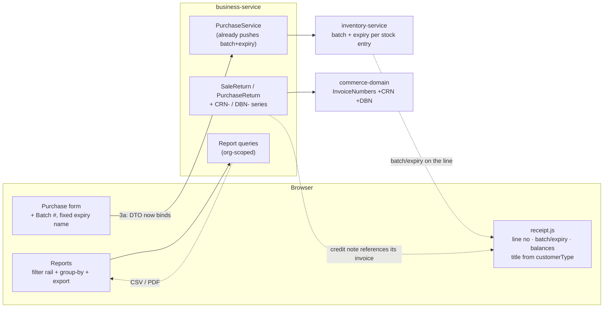
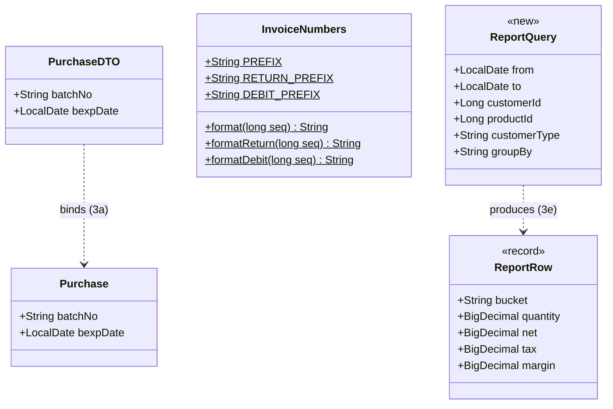

# B2B Phase 3 — documents & reports (customer requirements **#2, #4, #1, #5, #6**)

**Status:** 🟡 IN PROGRESS — **3a + 3b-1 implemented, awaiting their headed gate**; 3b-2/3c/3d/3e designed only.
Gate: `cypress/e2e/business/purchase-batch-expiry.cy.js`
Programme: [`b2b-b2c-rollout-plan.md`](../b2b-b2c-rollout-plan.md) · Previous: [`b2b-P2-pricing.md`](b2b-P2-pricing.md)
Requirements: [`customer-requirements-plan.md`](../customer-requirements-plan.md) #2 · #4 · #1 · #5 · #6

---

## 1. Document

### What this phase is

Phases 0–2 gave a customer an identity, a credit limit and a price. This phase is about the **paper** — what
the shop hands over, and what the owner reads afterwards. Five of the twelve customer requirements live here,
and unlike the earlier phases they serve **both channels equally**: a B2C shop wants the same receipt detail
and the same reports.

| # | Requirement | Real state in the code (verified, not assumed) |
|---|---|---|
| **#2** | Batch # on purchase | The whole chain already works: `Purchase` entity, `PurchaseService`'s inventory push, and the live `PurchaseDTO.stock` (a `StockDTO` carrying `batchNo` + `bexpDate`) that the form's `stock.*` fields bind through. **The only real gap is that there is no batch INPUT on the form**, and its table column was commented out. |
| **#4** | Receipt: batch, expiry, prev. balance, line no. | `receipt.js` renders item/qty/rate/amount only. Needs #2 first for batch/expiry to exist. |
| **#1** | Return invoices — own number series | `InvoiceNumbers` formats one series (`INV-`). Returns reuse the sale's number, so a credit note is indistinguishable from the invoice it reverses. |
| **#5** | Statement download | Statements render on screen; `jspdf` **is** vendored (`/js/jspdf.debug.js`) and already used by `businessInvoicePrint.js`. |
| **#6** | Multi-dimensional reports | One report (`SRDiv` / Sale Detail). No filter rail, no group-by, no export. |

**#2 is far smaller than its "M" estimate.** The whole chain already exists — entity, service, inventory
push. It is a DTO binding and two form fields. Discovering that is why the estimate was worth re-checking
rather than trusted.

### Why the order is #2 → #4 → #1 → #5 → #6

#2 **gates** #4: a receipt cannot print a batch the purchase never captured. The rest are independent, so
they are ordered cheapest-first, which also front-loads the two the customer sees daily.

---

## 1b. Standards this phase is built to

Stated explicitly rather than left implicit, so a reviewer can check the work against a named rule instead of
taste.

| Dimension | What applies here | Where it shows up |
|---|---|---|
| **Business / domain** | Batch-lot + expiry is the basis of **pharmaceutical traceability**: a recall is executed BY batch, and dispensing is **FEFO** by expiry. Not a form field — a regulatory capability. | 3a; `inventory-service` already keys stock entries on batch+expiry |
| **Accounting standard** | A return is a **credit note** (customer) or **debit note** (supplier) — a distinct document in its own series that **references the document it reverses**. Reusing the invoice number makes reconciliation impossible. | 3c (`CRN-` / `DBN-`) |
| **Fiscal / commercial** | *Receipt* and *invoice* are different documents to a business buyer: an invoice is the instrument they book and pay against. | 3b-1 |
| **SaaS multi-tenancy** | Every read org-scoped with the NULL-fallback; anti-IDOR `findByIdScoped` on by-id access; nothing here widens scope. | all sub-slices |
| **Live-modules rule** | Additive only; every default preserves today's behaviour. 3a needs **no migration** (columns exist); 3b-1 is safe because V29 back-filled every customer to `WALK_IN`. | 3a, 3b-1 |
| **Microservice boundaries** | Document *content* stays in the owning service; `commerce-domain` holds only the pure **numbering** rules, exactly as it does for `INV-` today. No new service — none of this owns data + lifecycle + external integration. | 3c |
| **Design patterns** | **Value Object** (`InvoiceNumbers`, pure formatting) · **Specification/Query Object** (3e `ReportQuery`) · **Template Method** via one shared filter+export component rather than a bespoke screen per report · **Anti-Corruption Layer** (`commerce-contracts`) unchanged | 3c, 3e |
| **SOLID / DRY** | 3e builds ONE filter+export component every future report inherits; the alternative — a bespoke report screen each time — is the duplication this codebase has repeatedly paid for. | 3e |
| **Testing standard** | Pure logic unit-tested without Spring and run on every `mvn test`; one headed Cypress gate per sub-slice; each gate asserts the **regression** (today's behaviour) before the new behaviour. | all |

---

## 2. Design — five sub-slices, each with its own gate

Delivered and gated one at a time (slice cadence), not as one large drop. Each is independently useful; if
you stop after 3b the shop still gained a working batch/expiry receipt.

### 3a — #2 batch & expiry captured on purchase *(the enabler)*

- Purchase form: a **Batch #** input posting to `name="stock.batchNo"`, consistent with every sibling field
  on that form. `StockDTO.batchNo` already exists and ModelMapper flattens it onto `Purchase.batchNo`.
- Purchase table: un-comment the Batch column (`businessDashboard.html:1034`) **and emit the matching cell**.
- **No migration, and no DTO change.**

> ### ⚠️ Correction (2026-08-02) — a bug I claimed that does not exist
>
> An earlier revision of this doc stated that the expiry input posts to `name="stock.bexpDate"`, "a nested
> path whose `Stock` class was deleted in slice 88", and therefore that **every expiry typed on the purchase
> form was being silently discarded**. **That is wrong.** The `Stock` *entity* was deleted; `StockDTO` and
> `PurchaseDTO.stock` were not. The nested binding works, and `finance-reports.cy.js` proves it — it posts
> `stock.bpurchaseRate` and asserts the resulting amounts.
>
> I had changed the form to `name="bexpDate"` and un-commented two DTO fields on that false premise. Both are
> **reverted**: the working path is left alone, and the new batch input follows the same `stock.*` convention.
> Recorded rather than quietly deleted, because a claimed-and-withdrawn bug is exactly the kind of thing a
> later reader would otherwise re-introduce.

### 3a-2 — ~~`tablePurchase` column alignment~~ **WITHDRAWN: there was no misalignment**

I reported `tablePurchase` as 17 headers to 13 cells and "fixed" it by restoring four discount cells. **Both
the diagnosis and the fix were wrong, and the fix broke the table.** Reverted.

**What is actually true:** the four discount `<th>`s — `purchaseDiscountTypeDD`, `purchaseDiscount`,
`sellDiscountTypeDD`, `sellDiscount` — are **commented out** in `businessDashboard.html`, deliberately, at
the same time their cells were removed. Header and cell already agreed. The table renders **14 headers to 14
cells** with the new Batch column, and rendered 13 to 13 before it.

**Why I got it wrong twice:** I counted `<th data-field=...>` with a regex over the raw template text, which
matches inside `<!-- ... -->`. The cell side was counted with comments stripped. Counting one side with
comments and the other without manufactured a four-column gap that does not exist — and then "restoring" the
cells created a real 18-vs-14 mismatch where there had been none.

**The rule this leaves behind:** never diagnose column alignment from source text. Assert it in the
**browser**, where a commented-out header simply is not a column — which is what the gate now does
(`thead th` count vs a row's `td` count). That assertion is worth copying into the other table specs; it is
the check that would have caught the real `tableCustomer` gap in Phase 0 without any counting at all.

### 3b-1 — receipt vs INVOICE, from `customerType` *(no dependencies — ships with 3a)*

Split out of 3b and moved forward. It was deferred from Phase 0 with the rest of the document work, but it
has **no dependency on 3a** — unlike the rest of the receipt, which needs batch/expiry to exist — and it is
the single most visible B2B signal a trade customer receives. Filing it with the document work left it
unbuilt across three phases for no technical reason.

- `receipt.js` titles the document **INVOICE** for a trade account (`CustomerType.isB2B()`) and **RECEIPT**
  otherwise, replacing the fixed `VERTICAL_PROFILE.receiptTitle`.
- **Unconditional, no setting.** Every existing customer back-filled to `WALK_IN` in V29, so the title only
  changes for an account the owner *deliberately* marked `RETAILER`/`WHOLESALE` — which is precisely the
  intent of having marked them. A tenant that has not opted in sees no change, which is the live-modules
  guarantee honoured, not bypassed.

### 3b-2 — #4 richer receipt *(needs 3a)*

`receipt.js` gains, each shown only when it has a value, so a B2C corner shop's receipt does not grow noise:
- **line number** — a plain counter; makes a disputed line referable over the phone
- **batch / expiry** per line — from the sale line's inventory batch (pharmacy needs it; retail ignores it)
- **previous balance / new balance** — for an account customer, the figures the sell screen already computes
*(the document title moved out to 3b-1 above, since it has no dependency on 3a.)*

### 3c — #1 return documents get their own series

- `InvoiceNumbers` grows `CRN-` (credit note, sale return) and `DBN-` (debit note, purchase return) beside
  the existing `INV-`. It is already the one place display formatting lives, so no new concept.
- Allocation reuses the existing per-org MAX+1-in-transaction pattern, guarded by the same unique constraint.
- The return document **references the invoice it reverses** — a credit note that does not name its invoice
  is unusable for reconciliation.

### 3d — #5 statement / invoice download

- Reuse the vendored `jspdf` already driving `businessInvoicePrint.js`; no new dependency.
- **CSV as well as PDF**, and CSV first: an accountant wants the rows, not a picture of them.
- Server builds the data; the client renders. The statement endpoints already exist and are org-scoped.

### 3e — #6 filterable, exportable reports

Per your clarification, *"multi-dimensional"* means **filter + choose columns/grouping + export**, not a pivot
engine. So:
- a shared **filter rail** (date range, customer, vendor, product, category, customer type)
- a **group-by** selector (day / month / customer / product / category / user)
- the same **export** used by 3d
- built as one shared component so every future report inherits it, rather than a bespoke screen per report

### Security (all sub-slices)

Nothing here widens access: every report and document reads through the existing org-scoped queries, and
export is a rendering of what the screen already shows. The one thing to keep honest is that a **return
document must not be creatable for another tenant's invoice** — the existing `findByIdScoped` pattern covers
it, and 3c's gate asserts it.

---

## 3. Architecture & UML

### Architecture



### Class diagram



### Sequence — 3a, the enabler

```mermaid
sequenceDiagram
  actor U as Shopkeeper
  participant F as Purchase form
  participant PC as PurchaseController
  participant PS as PurchaseService
  participant INV as inventory-service

  U->>F: enter batch B-2231, expiry 2027-06-30
  Note over F: today the expiry posts to name="stock.bexpDate"<br/>a path whose class was DELETED — silently dropped
  F->>PC: addPurchase (batchNo, bexpDate)
  PC->>PS: doAddPurchase
  Note over PS: entity + inventory push ALREADY handle both;<br/>only the DTO binding was missing
  PS->>INV: stock-in with batch + expiry
  INV-->>PS: stored per batch (FEFO already keys on it)
  PS-->>U: purchase saved, batch visible in the list
```

---

## 4. Implement

**3a — #2 batch/expiry (no migration)**
- [x] `PurchaseDTO` — `batchNo`, `bexpDate` now bind
- [x] Purchase form — Batch # input; expiry `name` fixed
- [x] Purchase table — Batch column + its cell at position 7
- [ ] Cypress `purchase-batch-expiry.cy.js` — **to write**

**3b-1 — receipt vs invoice title (no migration, no dependency)**
- [x] `receipt.js` — title from `customerType`
- [x] i18n — 4 keys × six bundles
- [ ] Covered by the 3a gate (one spec, both changes)

**3b-2 — #4 receipt** · **3c — #1 return series** · **3d — #5 download** · **3e — #6 reports**
- [ ] each designed above; each gets its own checklist and gate when it starts

---

## 5. Test

**3a (first gate):**
1. A purchase with batch + expiry stores both — *and the expiry is no longer silently dropped*, which is the
   regression this fixes.
2. The batch reaches inventory as a distinct stock entry (FEFO already keys on batch/expiry).
3. The purchase list shows the batch, and the table stays aligned (header count == cell count).
4. A purchase with no batch still saves — pharmacy needs batches, a hardware shop does not.

Later sub-slices carry their own cases; #4's depend on 3a being green first.

---

## 6. Open questions

1. **Should a batch be mandatory for pharmacy tenants?** It would be a natural `common-settings` flag
   (`inv.purchase.requireBatch`, default off) rather than a hard rule — but not designed until asked.
2. **#6 grouping dimensions** — the list in 3e is my proposal. If the owner's real question is "which booker
   sold what", supplier/booker should join the group-by list.
3. **Statement format** — is there a bank/accountant format to match, or is a clean CSV enough?


---

## 7. Implementation notes (3a + 3b-1, 2026-08-02)

**A pre-existing misalignment found in `tablePurchase`, NOT fixed here.** Counting headers against row cells
by hand: **17 headers, 13 cells** *before* this slice. Four headers have no cell —
`purchaseDiscountTypeDD`, `purchaseDiscount`, `sellDiscountTypeDD`, `sellDiscount` — left behind by an
earlier fix whose own comment says the orphaned discount *cells* were removed. So every column after
position 7 has been rendering under the wrong heading.

I added the Batch column **with** its cell (position 7, matching the header) rather than widening the gap,
but I did **not** delete the four orphan headers: removing visible columns changes the screen for every
existing tenant and is a decision, not a side effect of a batch-number slice. It wants its own change.
Recorded here rather than left as a surprise.

**Two live bugs closed by 3a**, both of which had been silently discarding data:
1. the expiry input posted to `name="stock.bexpDate"` — a nested path whose `Stock` class was deleted in
   slice 88, so **every expiry typed on the purchase form since then went nowhere**;
2. `PurchaseDTO.batchNo`/`bexpDate` were commented out, so even a correctly-named field could not bind.
The entity, the service and the inventory push were all already correct — which is why #2 dropped from an
"M" estimate to XS once verified rather than trusted.
