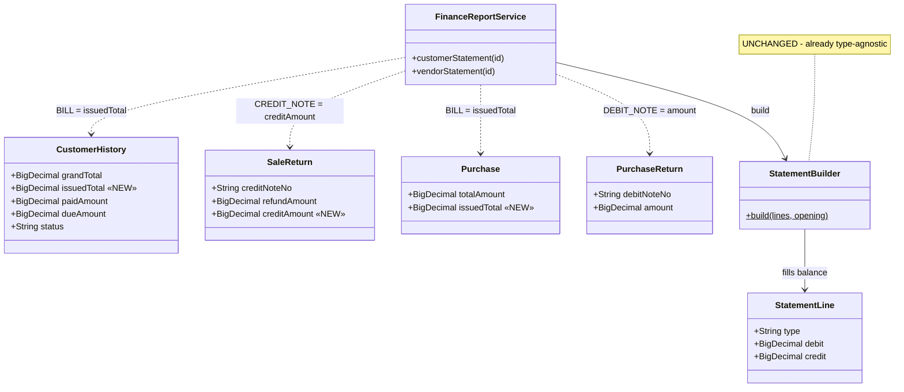
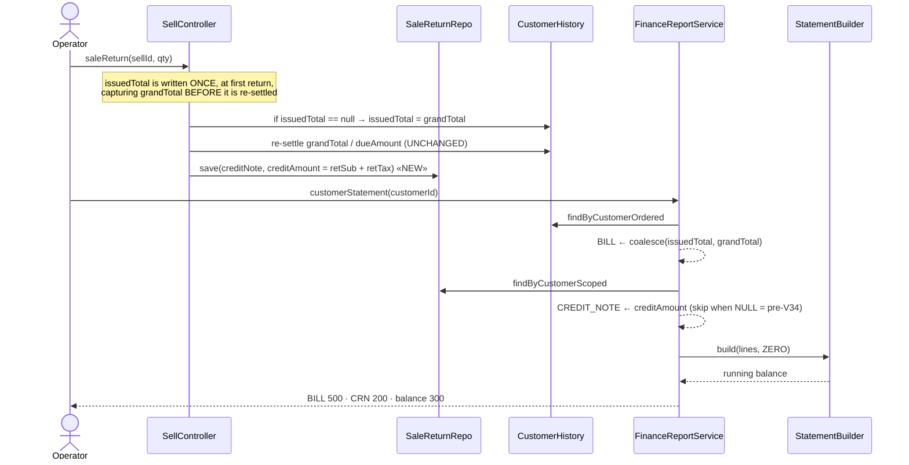

# B2B Phase 3f — credit notes on statements, and the end of retro-edited invoices

**Status:** 🟢 **DONE — `mvn test` green + Cypress gate 6/6 green, 2026-08-04.**
Gate: `cypress/e2e/business/statement-credit-notes.cy.js` · unit: `StatementTrailTest` (5, `common-subledger`).
Design approved 2026-08-04 (all three §6 questions: void line **yes**, AR **and** AP together, AR history seam
**accepted**). Both halves shipped together, as the design required — neither was ever shippable alone.
Parent: [`b2b-P3-documents-reports.md`](b2b-P3-documents-reports.md) §12 (where this was raised as a candidate)
Programme: [`b2b-b2c-rollout-plan.md`](../b2b-b2c-rollout-plan.md) · Slice cadence: Document → Design → **approval** → Implement → Test

---

## 1. Document

### What is wrong

An invoice issued at **500** with a **200** return reads as a single `BILL` line of **300** on the customer's
statement. The running balance is arithmetically right. The **document trail is wrong**: the customer's paper
copy says 500, our statement says 300, and the credit note that explains the 200 appears nowhere.

3c made credit notes real documents (`CRN-`/`DBN-` series). 3f is what makes them *visible where they matter*.

### The three findings, verified against the code

| # | Finding | Evidence |
|---|---|---|
| 1 | **The statement never reads credit notes.** It is built from exactly two sources — `customer_history` as `BILL` and finance-ledger payments as `PAYMENT`. `sale_return` is not consulted. | `FinanceReportService.java:108-114` |
| 2 | **The invoice header is retro-edited in place.** A return re-settles the header off its surviving lines: `ch.setGrandTotal(grandTotal)`. That is the same field the statement reads. | `SellController.java:1032-1034` vs `:111` |
| 3 | **The credit note's value is not persisted.** `SaleReturn` stores `quantity`, `reason`, `refundAmount` — and `refundAmount` is non-zero *only* when the return leaves the invoice overpaid. On a credit sale it is zero. There is no `creditAmount`. | `SaleReturn.java:58-64`, `SellController.java:1043` |

Finding 3 is new — it was not in the §12 candidate write-up, and it is the one that shapes the slice. **You
cannot put a credit note on a statement when its face value is nowhere in the database.**

### Why this needs a design, not a patch

**The two halves are coupled and neither ships alone.**

- Add credit-note lines while the header is still retro-edited → the return is counted twice
  (`300 − 200 = 100`). Balances become wrong for every tenant that takes returns.
- Stop retro-editing the header alone → `dueAmount`, `recomputeDue`, `Customer.dueAmount` and the dashboard's
  "customers with dues" all read a number that no longer nets.

**And history cannot be fully restated.** A *full* return **deletes the `Sell` row outright**
(`SellController.java:1017`). The line is gone and nothing records what it was worth. For AR, pre-migration
credit notes are unrecoverable. This is a fact about the data, not a scoping preference — it has to be
designed around rather than discovered mid-build.

### The AR / AP asymmetry (worth knowing before scoping)

The supplier side has the **same** defect but **better data**:

| | AR (customer / `CRN-`) | AP (vendor / `DBN-`) |
|---|---|---|
| Statement omits the note | yes — `FinanceReportService.java:108-114` | yes — `:125-129` |
| Header retro-edited | yes — `SellController.java:1032-1034` | yes — `PurchaseService.java:559-566` |
| Note's value persisted | **no** | **yes** — `PurchaseReturn.amount` = `returnedGross`, `PurchaseService.java:588` |
| History restatable | **no** (full return deletes the line) | **yes** — issued gross = `(totalAmount + taxAmount) + Σ amount` |

So AP can be restated back through its whole history and AR cannot. That is not a reason to split the slice —
a statement is a statement, and shipping one side leaves the other visibly inconsistent — but it does mean the
two sides get different *backfills*, and the doc should say so plainly rather than let it look like an oversight.

---

## 1b. Standards this slice is built to

- **[[SAAS-BUILD-STANDARDS]] §1b D4/D5** — additive migration only; every default preserves today's behaviour.
  Read before touching schema.
- **Flyway = deploy-reproducible** — schema *and* backfill ship as `V34`; a fresh deploy needs no manual step.
- **Money types** — every new column `DECIMAL(19,2)`, every new field `BigDecimal`.
- **Multi-tenancy** — new reads are `findScoped` with NULL-fallback; the statement is already anti-IDOR guarded
  (`FinanceReportService.java:106`, `:122`) and 3f must not open a second path around it.
- **Tests on build** — pure balance arithmetic gets a `mvn test` unit test, not only a Cypress gate.
  (P2's lesson: Cypress cannot see a test that never compiled.)

---

## 2. Design

### 2a. The decision: where does the issued value live?

Two models were considered. **Option B is recommended.**

#### Option A — `grandTotal` becomes immutable

`grandTotal` keeps its issued value forever; a new `creditedAmount` accumulates credit notes;
`dueAmount = paidAmount + creditedAmount − grandTotal`.

**Rejected.** `grandTotal` is read by the dashboard, the GL posting path, `recomputeDue`, and 3e's sale-report
subtotals. Changing its *meaning* changes every one of those at once — 3e would silently start reporting
gross-of-returns revenue, breaking a shipped, gated slice with no test failing to tell us. The blast radius is
the whole module.

#### Option B — add `issuedTotal`, leave `grandTotal` alone ✅

`grandTotal` keeps doing exactly what it does today (current settled value — every existing reader is
untouched). A new `customer_history.issued_total` records the invoice **as issued**. The statement — and only
the statement — reads `issuedTotal` for its `BILL` line and adds `CREDIT_NOTE` credit lines from `sale_return`.

| | today | after 3f |
|---|---|---|
| `grandTotal` | current settled value | **unchanged** |
| `dueAmount` / aging / dashboard | `paid − grandTotal` | **unchanged** |
| 3e sale report | net of returns | **unchanged** |
| statement `BILL` | `grandTotal` (netted) | `issuedTotal` (as issued) |
| statement credit lines | none | `CRN-` per return |

**Everything that is right today stays right by construction.** Only the statement changes, which is the only
thing that is wrong.

### 2b. The cutover falls out of the data — no date, no flag

A credit note appears on the statement **if and only if it has a `creditAmount`**. Only returns taken after
V34 have one. There is no configured cutover date and no feature flag to get wrong.

Check it against every case:

| Invoice issued | Return taken | `issuedTotal` | Credit lines shown | Statement balance |
|---|---|---|---|---|
| pre-V34 | pre-V34 | backfilled = current netted `grandTotal` | none (no `creditAmount`) | ✅ identical to today |
| pre-V34 | **post**-V34 | backfilled at migration = value before this return | this one | ✅ correct |
| pre-V34 | one pre, one post | backfilled = value after the pre-V34 return | the post-V34 one only | ✅ **balance correct**, trail partial |
| post-V34 | post-V34 | true issued value | all of them | ✅ correct, full trail |

The worst case is row 3: an older credit note is *missing from the trail*, never *wrong in the balance*. That
is the honest outcome, and it degrades in the safe direction. **AP has no such seam** — `purchase_return.amount`
lets V34 reconstruct issued gross exactly, so vendor statements are correct and complete from day one.

### 2c. The void trap — found while designing, must be handled

`voidSell` **zeroes** the header (`SellController.java:1187-1191`) and stamps `status = VOID`.

Under Option B, `issuedTotal` would survive at 500 while `grandTotal` went to 0 — so a naive statement would
show a `BILL` of 500 with nothing offsetting it and **overstate every voided invoice by its full value**. This
is a bug 3f would *introduce*; it does not exist today.

**Recommended:** a void emits a `VOID` credit line for the full issued amount. The trail then reads
`BILL 500 · VOID −500 · balance 0` — which is what a void *is*, and it is more honest than an invoice that
silently vanishes. (Simpler alternative: skip `status = VOID` headers entirely, matching today's invisible
behaviour. Cheaper, but a document-trail slice that hides a document is arguing against itself.)

Voids and returns cannot collide: `voidSell` already refuses an invoice with any recorded return
(`SellController.java:1140-1141`).

### 2d. Schema — `V34__statement_document_trail.sql` (additive)

```sql
-- AR: the invoice as issued. Backfill = current grandTotal (pre-V34 statements then read exactly as today).
ALTER TABLE customer_history ADD COLUMN issued_total DECIMAL(19,2) NULL;
UPDATE customer_history SET issued_total = grand_total WHERE issued_total IS NULL;

-- AR: the credit note's face value. Deliberately NOT back-filled — unrecoverable for full returns
-- (the Sell row was deleted), and a guessed value on a customer-facing document is worse than a silent one.
ALTER TABLE sale_return ADD COLUMN credit_amount DECIMAL(19,2) NULL;

-- AP: the bill as issued. Fully reconstructable, so it IS back-filled.
ALTER TABLE purchase ADD COLUMN issued_total DECIMAL(19,2) NULL;
UPDATE purchase p SET issued_total =
    COALESCE(p.total_amount,0) + COALESCE(p.tax_amount,0)
  + COALESCE((SELECT SUM(r.amount) FROM purchase_return r WHERE r.purchase_id = p.purchase_id), 0)
WHERE issued_total IS NULL;
```

`NULL` issued_total → fall back to `grandTotal` at read time, so a row that somehow escapes the backfill
still renders today's statement rather than a blank line. All three columns are `information_schema`-guarded
in the real script, following V29's pattern.

### 2e. What the statement becomes

```
Date        Document   Type          Debit   Credit   Balance
2026-08-01  INV-100    BILL         500.00               500.00
2026-08-03  CRN-7      CREDIT_NOTE           200.00      300.00
2026-08-05  RCT-22     PAYMENT               300.00        0.00
```

`StatementLine.type` is a free-text `String` and `StatementBuilder` is purely debit/credit and party-agnostic
(`StatementBuilder.java:20-29`) — so **`CREDIT_NOTE` and `VOID` need no change to `common-subledger` at all**.
The shared library was already general enough. Nothing to extend, nothing to version.

The CSV inherits this **for free**: `customerStatementCsv` calls the same service method
(`FinanceReportController.java:96`), which is exactly the guarantee 3d was built to give.

---

## 3. Architecture & UML

### Class diagram — what gains a field



### Sequence — a return, and the statement that follows



**`issuedTotal` is captured at the first return, not at sale time** — so it works for invoices that already
exist, and a sale that is never returned never pays for the feature.

---

## 4. Implement — the order, once approved

1. `V34` migration (schema + the two backfills), `information_schema`-guarded.
2. `CustomerHistory.issuedTotal`, `SaleReturn.creditAmount`, `Purchase.issuedTotal` entity fields.
3. `saleReturn`: capture `issuedTotal` before re-settling; persist `creditAmount = retSub + retTax`
   (both values are already computed there for the GL enqueue — no new arithmetic).
4. `voidSell`: capture `issuedTotal`, emit the `VOID` line's source data.
5. `PurchaseService.purchaseReturn`: capture `issuedTotal` before re-settling. (`amount` already persisted.)
6. `FinanceReportService.customerStatement` / `vendorStatement`: read issued value, add note lines.
7. i18n keys for the two new type labels × 6 bundles.

Steps 1–5 are write-path and change no read. Step 6 is the only behaviour change a user sees.

---

## 5. Test

**`mvn test` (always-run, pure):** `StatementTrailTest` over `StatementBuilder` —
`BILL 500 + CREDIT_NOTE 200 + PAYMENT 300 → 500 / 300 / 0`; a `CREDIT_NOTE` with a NULL value contributes
nothing; a `VOID` line nets its bill to zero; ordering is by date with credit notes after their bill.

**Cypress gate — `cypress/e2e/business/statement-credit-notes.cy.js`:**

| # | Pins |
|---|---|
| 1 | Sell 500 on credit → statement shows `BILL 500`, balance 500 |
| 2 | Return 200 → statement shows `BILL 500` **and** `CRN- 200`, balance **300** |
| 3 | **The invoice header still reads 500** on the statement after the return (the actual defect) |
| 4 | `Customer.dueAmount` is **still 300** — the balance did not move (the regression that matters most) |
| 5 | CSV export is line-for-line identical to the screen, credit notes included (3d's guarantee holds) |
| 6 | A voided invoice nets to **zero**, not to its full value (the §2c trap) |
| 7 | A pre-V34 return (seeded with NULL `creditAmount`) renders **exactly as today** — no phantom line |
| 8 | Vendor statement: `BILL` + `DBN-` with the correct balance |

Test 4 and test 7 are the ones that would catch this design being wrong. Test 7 needs a seeded row with a
NULL `creditAmount`, since no UI path can produce one after V34.

---

## 6. Open questions — your call before I implement

1. **Voided invoices** — `BILL 500 · VOID −500 · balance 0` (recommended, honest trail), or keep them off the
   statement entirely as today (cheaper)?
2. **Scope** — AR **and** AP in this slice (recommended: they are one screen's worth of consistency), or AR
   only, with AP as 3g?
3. **The AR history seam** — confirmed acceptable that credit notes taken *before* V34 never appear on a
   statement (balances stay correct; the trail starts from the migration)? The alternative is inventing values
   for deleted lines, which I would not recommend on a customer-facing document.

---

## 7. As built (2026-08-04) — five things that differ from the design above

**1. Gate test 7 was dropped, not silently skipped.** The design listed "a pre-V34 return renders exactly as
today". Cypress **cannot seed its precondition**: a NULL `credit_amount` row, which no endpoint produces after
V34. Rather than write a test that fakes the setup and proves nothing, that path is covered by
`StatementTrailTest#valuelessNoteIsInert` (the arithmetic) plus the repository's `credit_amount is not null`
clause (the filter). The gate ships **6 tests**, and the spec header says why it is not 7.

**2. The AP bill line changed from NET to GROSS — deliberate, and the one place a number moves.**
`vendorStatement` read `p.getTotalAmount()`, which is goods-only and **excludes input tax**, while
`Purchase.dueAmount` settles on `total + tax`. The statement therefore already disagreed with the payable it
exists to explain. Since `purchase_return.amount` is gross, a gross bill is the only choice that lets bill and
debit notes net — so the fallback is now `totalAmount + taxAmount`. **Only orgs that capture purchase tax see
any difference**, and for them the old number was wrong. `finance-reports.cy.js:91` (bill debit == 100, no tax)
stays green.

**3. The CSV keeps raw type tokens; only the screen is translated.** `statementCsv` writes `l.getType()`, so
the file says `CREDIT_NOTE` while the dialog says "Credit note". Left that way on purpose: 3d's gate asserts
**CSV == the JSON the service returns**, and translating the export would break that guarantee and make the
file locale-dependent for reconciliation. Flagged rather than changed.

**4. `common-subledger` was not touched, as predicted.** `StatementLine.type` is free text and
`StatementBuilder` is pure debit/credit, so `CREDIT_NOTE` / `DEBIT_NOTE` / `VOID` needed no library change —
and no new field was added to `StatementLine`, so the monolith proxy has nothing to drop (the P1
typed-DTO trap does not apply to this slice).

**5. Two pre-existing defects found in passing, NOT fixed.**
- `V33` already creates `idx_purchase_return_org (organization_id, vender_id)` — exactly the index V34 was
  about to add. Mine was removed; **the lesson is the P2-UI one again**: read the source of truth (the earlier
  migration) rather than assume the index you need is missing.
- **`ui.js.statement` is duplicated in all six message bundles** (two entries, different values; last wins, so
  the dash variant is dead config). Untouched — it is not this slice's to fix, but it is a live sign that the
  bundles have no duplicate-key check.


## 8. What this slice does NOT do

- It does **not** change any balance, due amount, aging bucket, or GL posting. If a balance moves, that is a bug.
- It does **not** stop the header being re-settled — Option A was rejected (§2a). `grandTotal` keeps its
  current meaning and every existing reader is untouched.
- It does **not** add a returns register screen. That belongs to 3e's shared report rail, as 3c recorded.
