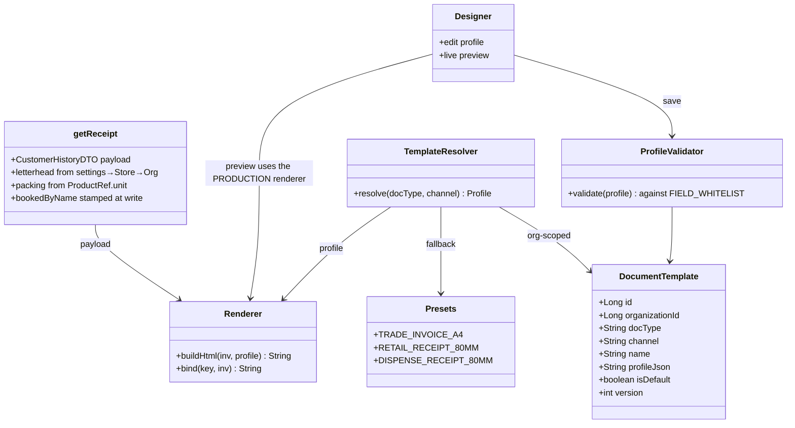

# B2B Phase 3g — printable trade invoice + owner-designable documents

**Status:** 🔨 **CODE COMPLETE — all five sub-slices written (2026-08-05). NOT yet compiled, NOT yet
Cypress-gated.** Two gate specs written and ready to run. See §8 for as-built notes and §9 for what remains.
Trigger: a real pharma-distribution invoice supplied by the customer (SHAFEEQ MEDICINE COMPANY → AYESHA
MADICARE, inv. 3973) as the target for what `getReceipt` must be able to print.
Gates (planned): `receipt-trade-invoice.cy.js` (3g-1) · `invoice-trade-fields.cy.js` (3g-2) ·
`document-template-crud.cy.js` (3g-3) · `document-designer.cy.js` (3g-4) · `invoice-legacy-retire.cy.js` (3g-5)
Programme: [`b2b-b2c-rollout-plan.md`](../b2b-b2c-rollout-plan.md) · Previous: [`b2b-P3-documents-reports.md`](b2b-P3-documents-reports.md)

---

## 1. Document

### What this slice is

Phase 3 established that a trade account gets an **INVOICE** and a retail shopper a **RECEIPT** — but only as
a *word*. 3b-1 changed the title string and nothing else, so today a wholesale customer receives the word
"INVOICE" printed on an 80mm thermal slip with four columns. The customer's sample is what that document is
actually supposed to look like: A4, thirteen columns, a letterhead, a licence block, a totals band, an
amount in words, and a running account balance in DR/CR.

This slice closes that gap **and** makes the layout the owner's property rather than ours, because the shape
of a trade invoice is not universal — it varies by country, by trade and by what the buyer's accountant will
accept.

### The sample, field by field — verified against the code, not assumed

**Group A — already on the wire; the browser receives it and discards it.** No backend work.

| Sample field | Verified state |
|---|---|
| `Code` (2629) | `getReceipt` sets `sd.setItemCode(p.getSku())` — [`SellController.java:468`](../../business-service/src/main/java/com/myplus/business_service/controller/SellController.java) — and `receipt.js` prints a line **ordinal** instead, never the code |
| `Discount`, `D%`, `Net-TP`, `Value` | `Sell.discount` is persisted and exposed on `SellDTO`; never rendered. The other three derive from it |
| `Batch No`, `Expiry` | Sent per line as `SellBatchDTO` (3b-2); rendered as a 9px sub-line, not columns |
| `Due Date` | Set at [`SellController.java:414`](../../business-service/src/main/java/com/myplus/business_service/controller/SellController.java); never rendered |
| `Address`, `Mobile No` | `CustomerDTO.address` / `.contact` — mapped and sent, never rendered |
| Customer code `(1908)` | `customerId` is on the wire |
| `Previous Balance` / `Current Balance` | Rendered (3b-2) — but with **no DR/CR marker**, which is what makes the figures readable |
| Totals band, `(3) item s.`, amount in words | Derivable from data already present |

**Group B — in the database, absent from the receipt payload.**

| Sample field | Source | Note |
|---|---|---|
| **Business name + address** (letterhead) | `Store.name/address/phone`; `Organization.name` | **The single worst defect here.** The header prints `VERTICAL_PROFILE.brand` — the literal string `"MyPlus Pharmacy"` from [`module-theme.js`](../../../src/main/resources/static/js/business/module-theme.js). *Every tenant currently prints our brand on their own invoices.* |
| `Packing` (500ML) | `ProductRef.unit` | `getReceipt` already loads the `ProductRef`; needs one DTO field and one setter. **No catalog migration.** |
| `Booked By` | `CustomerHistory.userId` | Resolving a name at print time means an auth-service call on the print path. **Stamp it at write instead** (standing rule: *stamp at write, don't derive on read*). |

**Group C — not in the data model at all.** Migration + capture UI.

`Bon.` (bonus / free quantity) · `TRADE DISCOUNT` (invoice-level — `CustomerHistory` has **no** discount
column of any kind) · `License No` + `License Expiry` · `CNIC No` · `City Name` (Customer holds one
free-text `address` and no city).

### Also in scope: retiring a per-client fork

[`businessInvoicePrint.js`](../../../src/main/resources/static/js/business/businessInvoicePrint.js) is a 148-line
jsPDF A4 printer gated on `if (userId*ONE != 37) return false;` with `"Haider Garments"` and that shop's
address and phone number hardcoded into it. It is loaded on **every** business dashboard and does nothing for
anyone else. It is the exact per-client fork this design exists to prevent, and it is also proof of demand:
a customer wanted an A4 invoice badly enough that one got hardcoded for them.

---

## 1b. Standards this slice is built to

| Dimension | What applies here | Where |
|---|---|---|
| **Commercial / fiscal** | A trade invoice is the instrument the buyer books and pays against: it must carry issuer identity, a document number, a date, line detail sufficient to dispute a line, a totals reconciliation, and the account position. A thermal slip cannot serve that purpose. | 3g-1 |
| **Pharmaceutical** | Distribution to a licensed reseller carries the buyer's **drug sale licence** on the invoice, and batch + expiry per line. Batch/expiry already exist (3a/3b-2); the licence does not. | 3g-2 |
| **Design patterns** | **Strategy** — layout selected by channel, not forked per vertical. **Declarative Document Profile** (data-driven renderer) — the layout *is* data, so the designer edits data rather than a second engine existing. **Chain of Responsibility** for template resolution. **Whitelist/Interpreter** for field binding, which is what keeps owner-authored layouts safe and translatable. | 3g-1, 3g-3 |
| **Library-by-default** | No new service. Templates own data + lifecycle but no external integration, and they belong to the service that owns the documents — a table in `business-service`. | 3g-3 |
| **SaaS multi-tenancy** | `document_template` is org-scoped with the NULL-fallback read; by-id access via `findByIdScoped` (anti-IDOR — a tenant must never open, clone or apply another tenant's template). | 3g-3 |
| **Live-modules rule** | Additive. Absent template ⇒ built-in preset ⇒ **today's exact thermal output** for every existing B2C sale. Absent new column ⇒ column renders empty, never a broken document. | all |
| **XSS-safe rendering** | Owner-authored labels and footer text are user data injected into HTML — every one passes `escHtml()`. The profile is validated **server-side** against the field whitelist on save; the client is never trusted to have done it. | 3g-3, 3g-4 |
| **Money types** | Currency `DECIMAL(19,2)`. `bonus_quantity` follows `Sell.quantity`'s `FLOAT`, because it is a quantity, not money. | 3g-2 |
| **Performance** | Template resolved once per print and cached per (org, docType); the `getReceipt` payload stays one round trip; batch loading unchanged. No per-line service call is introduced. | 3g-1, 3g-3 |
| **i18n** | Every built-in label is a message key. Owner-overridden labels are stored verbatim and are deliberately **not** translated — an owner who types "Packing" owns that string. | 3g-1, 3g-4 |
| **Flyway** | One migration, `V35`, deploy-reproducible with no manual step. | 3g-2, 3g-3 |

---

## 2. Design

### 2.1 The rule: channel picks the layout, vertical picks the words

These are two different axes and conflating them is the trap.

|  | B2C — `WALK_IN` / `RETAIL` | B2B — `RETAILER` / `WHOLESALE` |
|---|---|---|
| Layout | 80mm thermal — **unchanged** | A4 trade invoice |
| Title (BUSINESS) | `SALES RECEIPT` | `INVOICE` |
| Title (PHARMA) | `DISPENSE RECEIPT` | `INVOICE` |
| Balances | only when money is owed | always, DR/CR |

A pharmacy's walk-in patient buying one strip of tablets still gets an 80mm `DISPENSE RECEIPT`. A pharmacy's
trade account — which is precisely the sample; AYESHA MADICARE is a shop buying from a distributor — gets the
A4 `INVOICE`. If the *vertical* chose the layout, every patient would be handed an A4 sheet.

The predicate already exists: [`receipt.js:27-31`](../../../src/main/resources/static/js/business/receipt.js)
derives it from `Customer.customerType`, the same field that drives pricing (P2) and the credit limit (P1) —
so the three can never disagree about who the buyer is.

**Per-org override** (your decision): a setting can force `thermal` or `a4` regardless of channel, for the
shop that wants one format for everything.

### 2.2 The Document Profile

The layout is **data**. This is the decision that makes the designer cheap rather than a second renderer.

```json
{
  "docType": "SALE",
  "paper": "A4",
  "header": {
    "titleStyle": "boxed",
    "showLogo": true,
    "columns": [
      ["invoiceNo", "dated", "dueDate", "time"],
      ["licenseNo", "licenseExpiry", "bookedBy", "city"],
      ["customerName", "customerAddress", "customerMobile", "customerCnic"]
    ]
  },
  "lines": [
    { "key": "itemCode",   "label": "Code",     "width": 7,  "align": "left"  },
    { "key": "itemName",   "label": "Product Description", "width": 26 },
    { "key": "packing",    "label": "Packing",  "width": 8 },
    { "key": "batchNo",    "label": "Batch No", "width": 9 },
    { "key": "expiryDate", "label": "Expiry",   "width": 7 },
    { "key": "quantity",   "label": "Qty",      "width": 6,  "align": "right" },
    { "key": "bonusQty",   "label": "Bon.",     "width": 6,  "align": "right" },
    { "key": "tradePrice", "label": "TP",       "width": 7,  "align": "right" },
    { "key": "lineValue",  "label": "Value",    "width": 8,  "align": "right" },
    { "key": "discountPct","label": "D%",       "width": 5,  "align": "right" },
    { "key": "discount",   "label": "Discount", "width": 8,  "align": "right" },
    { "key": "netTradePrice", "label": "Net-TP","width": 7,  "align": "right" },
    { "key": "lineTotal",  "label": "Total",    "width": 8,  "align": "right" }
  ],
  "totals": ["itemCount", "qtyTotal", "bonusTotal", "valueTotal", "discountTotal",
             "grandTotal", "tradeDiscount", "amountInWords",
             "previousBalance", "currentBalance"],
  "footer": { "text": "", "showSignature": true, "showPromo": false }
}
```

Everything then falls out of one mechanism:

- **The sample** = the shipped `Trade invoice (A4)` preset.
- **Today's thermal slip** = the `Retail receipt (80mm)` preset — same renderer, different data.
- **Customization** = editing a profile.
- **The designer** = a UI over this JSON. Not a second rendering path.

### 2.3 The field whitelist is the safety boundary

`key` is **not** free text. Each key is bound by the renderer to a resolver function over the `getReceipt`
payload. An owner controls **presence, order, label, width and alignment**; never code, never an expression
language, never raw markup. Consequences:

- No XSS beyond ordinary label escaping, on a document that gets printed and handed to a third party.
- Layouts survive upgrades — a new field is a new whitelist entry, not a broken tenant template.
- Every built-in label stays translatable across all six locales.
- An unknown key is dropped on save with a validation error, not rendered as a blank column.

### 2.4 Template resolution — Chain of Responsibility

```
explicit templateId on the print call        (reprint an old layout / preview)
  ↓ absent
org's bound template for (docType, channel)  document_template, org-scoped
  ↓ absent
built-in preset for (docType, channel, paper override)
  ↓ absent
Retail receipt (80mm)                        ← today's behaviour, byte-for-byte
```

The last line is what makes this additive: an org that never opens the designer sees no change at all.

### 2.5 Storage — and why not `org_setting`

`org_setting.setting_value` is **`VARCHAR(500)`**
([`V26__org_setting.sql:9`](../../business-service/src/main/resources/db/migration/V26__org_setting.sql)) — a
profile does not fit. Widening it would also drag template blobs into `SettingsStore.findAll()`, which the
Configuration screen calls on every open. So:

- **`document_template`** — a table in `business-service`, holding the profiles.
- **`org_setting`** — holds only the *bindings and simple values*, which is what it is for.

| Setting key | Type | Default | Purpose |
|---|---|---|---|
| `pos.document.layoutMode` | SELECT | `auto` | `auto` (channel decides) · `thermal` · `a4` — **your per-org override** |
| `pos.document.tradeTemplateId` | INT | *(unset)* | which template a B2B sale prints |
| `pos.document.retailTemplateId` | INT | *(unset)* | which template a B2C sale prints |
| `pos.document.businessName` | TEXT | *(unset)* | letterhead line 1 — falls back to `Store.name` → `Organization.name` |
| `pos.document.addressLine1` / `2` | TEXT | *(unset)* | falls back to `Store.address` |
| `pos.document.phone` | TEXT | *(unset)* | falls back to `Store.phone` |
| `pos.document.licenseNo` | TEXT | *(unset)* | the **seller's** licence — no schema needed |
| `pos.document.licenseExpiry` | TEXT | *(unset)* | as above |
| `pos.document.footerText` | TEXT | *(unset)* | replaces the hardcoded "Thank you for your business" |
| `pos.document.amountInWords` | BOOL | `true` | see D-3 |

All ten render themselves on the existing Configuration screen — `SettingEntry` already supports
`BOOL/INT/TEXT/SELECT` and `settings-form.js` already draws each type. **Zero new UI for these.**

### 2.6 Line arithmetic (stated explicitly so the columns are unambiguous)

```
Value      = quantity × tradePrice          (before discount, before tax)
Discount   = Sell.discount                  (an amount, as stored)
D%         = Discount ÷ Value × 100
Net-TP     = (Value − Discount) ÷ quantity
Total      = Value − Discount [+ taxAmount when tax is exclusive]
```

> **Verification task for 3g-1:** confirm against `SagaSaleWriter` whether `Sell.totalAmount` and
> `Sell.netAmount` are pre- or post-discount before binding `tradePrice`/`lineValue` to either. The current
> receipt uses `totalAmount + taxAmount` for the amount column; the mapping must be established, not guessed.

### 2.7 UML



The preview arrow is deliberate: the designer must render through the same `Renderer` the printer uses, or
the preview becomes a second implementation that drifts.

---

## 3. Data model — one migration, `V35` (business-service)

| Change | Column / table | Why here |
|---|---|---|
| `sell` | `bonus_quantity FLOAT NULL` | free goods are a line property |
| `customer_history` | `trade_discount DECIMAL(19,2) NULL` | invoice-level discount; **no such column exists today** |
| `customer_history` | `booked_by_name VARCHAR(120) NULL` | stamped at write — keeps the print path off auth-service |
| `customer` | `cnic VARCHAR(20) NULL` | |
| `customer` | `city VARCHAR(80) NULL` | today there is only one free-text `address` |
| `customer` | `license_no VARCHAR(60) NULL`, `license_expiry DATE NULL` | buyer's drug sale licence (see **D-1**) |
| **new table** | `document_template` | `id · organization_id · user_id · doc_type · channel · name · profile_json TEXT · is_default · version · created_at · updated_at`, `UNIQUE(organization_id, doc_type, channel, name)` |

All nullable, no back-fill, every existing row prints exactly as it does today.
**No catalog-service migration** — `packing` is the existing `ProductRef.unit`.

---

## 4. Sub-slices

Delivered as one slice per your decision, but gated in five steps so progress is verifiable rather than
landing as a single untestable drop. **3g-1 alone already prints a document shaped like the sample** — the
Group C columns render empty until 3g-2 fills them.

| # | Contents | Migration | Gate |
|---|---|---|---|
| **3g-1** | Profile-driven renderer + 3 presets + `layoutMode` override + real letterhead + packing + every Group A field (code, batch/expiry columns, discount/D%/Net-TP/Value, due date, customer address/mobile/code, totals band, amount in words, DR/CR) | none | `receipt-trade-invoice.cy.js` |
| **3g-2** | Group C: `V35` + capture UI (bonus on the sell line, trade discount on the sale, CNIC/city/licence on the customer form, booked-by stamped in `SagaSaleWriter`) | `V35` | `invoice-trade-fields.cy.js` |
| **3g-3** | `document_template` + org-scoped CRUD + `ProfileValidator` + resolver + binding settings | `V35` | `document-template-crud.cy.js` |
| **3g-4** | Designer screen: clone a preset, drag column order, edit labels/width/align, toggle header fields and totals rows, live preview through the production renderer | none | `document-designer.cy.js` |
| **3g-5** | Retire `businessInvoicePrint.js`; remove its `<script>` from `businessDashboard.html:2157` | none | `invoice-legacy-retire.cy.js` |

Each gate asserts the **regression first** — that a `WALK_IN` sale still prints today's thermal slip — before
asserting the new behaviour.

---

## 5. Open decisions — needed before 3g-2

| # | Decision | Why it can't be guessed |
|---|---|---|
| **D-1** | On the sample, `License No` / `License Expiry` sit in the middle header column beside `Booked By` and `City Name`, while `CNIC No` sits in the customer column. **Whose licence is it — the seller's or the buyer's?** | Seller's ⇒ a settings TEXT value, no schema. Buyer's ⇒ two `customer` columns + form fields. The design above provisions **both**; confirming lets one be dropped. |
| **D-2** | Is `Bon.` (bonus) free stock that must **decrement inventory**, or a presentation-only figure? | If it moves stock it must go through the sell↔stock saga and the GL at zero revenue — that is materially more than a column. |
| **D-3** | Amount in words across six locales. | en/ur are straightforward; ar/hi/fr/es number-to-words is real work. Proposal: **ship en + ur, fall back to the numeric total elsewhere**, rather than machine-mangling a legal figure. |
| **D-4** | Does `TRADE DISCOUNT` post to the GL as a discount account, or reduce revenue? | Affects `common-subledger`, not just the print. The sample shows `0`, so this is untested territory in the books. |
| **D-5** | Should the designer be owner-only (`ROLE_OWNER`) or available to admins? | It changes what every document the business issues looks like. Recommendation: **owner-only**, consistent with the Finance screens. |

---

## 6. What this slice deliberately does not do

- **No raw HTML/Handlebars template editing.** It would put an XSS surface on a printed third-party document,
  break i18n across six locales, and leave tenant templates unupgradeable. The whitelist is the point.
- **No PDF generation.** Printing stays browser-native (`@page size: A4`), as `receipt.js` does today. `jspdf`
  is vendored and available if a *download* is wanted later — that is a separate ask.
- **No new service.** Templates own data and lifecycle but no external integration.
- **No Phase 4 work.** Quote → approval → order, customer PO and account hierarchy remain Phase 4.

---

## 8. As-built (2026-08-05) — 3g-1 and 3g-2

### The §2.6 verification task, answered — and it found a live defect

The doc said the `totalAmount` / `netAmount` mapping had to be *established, not guessed*. Established, from
`SagaSellService.buildLines` (~line 434) and `SagaSaleWriter.applyInvoice`:

| Field | Actual meaning | Sample column |
|---|---|---|
| `Sell.sellRate` | the rate the line sold at | **TP** |
| `Sell.totalAmount` | `qty × soldRate`, **before discount and tax** | **Value** |
| `Sell.discount` | absolute amount (a % is resolved before persisting) | **Discount** |
| `Sell.netAmount` | `(totalAmount − discount) + tax` on a saga row | **Total** |
| `CustomerHistory.grandTotal` | `Σ lineGross` = `Σ netAmount` | invoice total |

> ### DEFECT FOUND AND FIXED — the receipt printed the wrong line amount
>
> The previous renderer computed the line amount as `totalAmount + taxAmount`
> (`receipt.js:41`) and **never read `Sell.discount` at all**. So on any discounted line the receipt printed
> **more than the customer was charged**, and the line amounts did not sum to the TOTAL at the foot of the
> same document. It was invisible on an undiscounted sale, which is why it survived every prior gate.
>
> Fixed by deriving `Total = totalAmount − discount + taxAmount`. Deliberately derived from those three
> rather than read off `netAmount`, which is correct on a saga row but holds the sell form's *profit* figure
> (`gross − cost − discount`) on legacy rows — printing that as a line total on an old invoice would be badly
> wrong. The three fields used mean the same thing on every row.

### Deviations from the design

| # | Design said | As built | Why |
|---|---|---|---|
| 1 | `bookedBy` = the salesperson's name | the operator's **email** | `AuthenticatedUser` carries `userId`, `email`, org and location — there is **no display name** in the token. A name would need an auth-service call, which is the print-path dependency the stamp exists to avoid. The right fix is a display-name JWT claim, not a lookup while printing. |
| 2 | amount in words "en + ur" (D-3) | **English only**, both numbering systems (Indian lakh/crore + international) | An amount in words is a legally meaningful figure. A 99-entry Urdu numeral table written from memory and printed on invoices is worse than printing digits. Every non-English locale falls back to the numeric total. Needs a native-speaker-verified table, not a transliteration. |
| 3 | letterhead falls back to `Organization.name` | falls back to **`Store` only**, then the vertical brand client-side | `Organization` lives in auth-service. Same reason as #1 — no cross-service call on the print path. |
| 4 | — | added `SettingEntry.text()` + `SettingsService.getText()` | TEXT existed in the enum and `settings-form.js` already rendered it, but there was no factory or typed reader — the identical gap `intOf` closed for INT. Extended the existing port rather than adding a second mechanism. |
| 5 | — | added an `@InitBinder` on `CustomerController` | The optional `licenseExpiry` input posts `licenseExpiry=` when left blank, and the default String→LocalDate parse of an empty value is a **binding error** — which would have rejected *every customer save for every tenant*, licence user or not. Made explicit rather than trusted to framework defaults. |

### Files changed

**Renderer** — `receipt.js` rewritten as a profile-driven renderer (whitelist + resolvers, 3 presets,
resolution chain, in-table totals band, amount in words, DR/CR); exports `window.DocumentRenderer` so 3g-4's
preview uses the production `buildHtml` rather than a copy.

**business-service** — `SellController` (letterhead resolver + document settings + `packing` from the
already-loaded `ProductRef`, so no extra query) · `CustomerHistoryDTO` / `SellDTO` / `CustomerDTO` / new
`LetterheadDTO` · `Sell` / `CustomerHistory` / `Customer` entities · `SagaLine` (15th component) ·
`SagaSellService` · `SagaSaleWriter` (bonus, trade discount, booked-by stamp) · `BusinessSettingsCatalog`
(13 `pos.document.*` entries) · `V35` migration · `MarginPolicyTest` helper.

**common-settings** — `SettingEntry.text()`, `SettingsService.getText()`.

**monolith** — `businessDashboard.html` (4 customer fields, bonus, trade discount) · `business.js` (bonus on
the cart line) · `main.js` (trade discount on submit) · `com.web.dto.business.CustomerHistoryDTO` +
`SellDTO` **twins** — without these the typed proxy silently drops the inbound fields, the trap that cost
Phase 1 a run · 63 i18n keys × 6 bundles, verified key-set-identical.

---

### 3g-3 / 3g-4 / 3g-5 as-built

| # | Design said | As built | Why |
|---|---|---|---|
| 6 | bind a template per channel via `pos.document.{trade,retail}TemplateId` settings **and** an `is_default` flag | **`is_default` only** | Two mechanisms for one job, and the settings one is the worse: it asks an owner to type a numeric row id into a Configuration screen. `is_default` is set from the designer, where they are looking at the layout they mean. One mechanism, no way for the two to disagree. The settings keys were **not** added to the catalog. |
| 7 | "drag column order" | **Up / Down buttons** | Drag is unusable on touch without a library, unreachable by keyboard, and effectively untestable from Cypress. All three cost more than the polish is worth on a screen an owner visits twice a year. |
| 8 | five gate specs | **two** — `receipt-trade-invoice.cy.js`, `document-designer.cy.js` | Five specs across one feature would repeat the same seeding four times. The two written cover both halves: the printed document (incl. the discount defect, the regression, the letterhead) and the safety boundary (whitelist, normalisation, anti-IDOR). |
| 9 | — | added a test pinning the **client whitelist against the server's** | The two field lists are duplicated across the language boundary on purpose (the server cannot trust the client's copy). Duplication that *must* agree is exactly what a test should hold together — otherwise the next field added to the renderer is silently unofferable in the designer, or worse, offerable and rejected on save. |

**Renderer / designer split.** `receipt.js` exports `window.DocumentRenderer`; `document-designer.js`
(new file — module-scoped, not piled into `business.js`) calls `DocumentRenderer.buildHtml` for its live
preview and reads `FIELD_WHITELIST` for default column labels. The preview is therefore the production
renderer, not a second implementation that would drift from it.

**Not `jsonPost`.** The designer's save uses `$.ajax` directly. `jsonPost` is the *sale* submit path — it
disables `#addSell` while in flight and its success handler prints a receipt. Reusing it would have been
reuse of a name, not of a behaviour.

**`businessInvoicePrint.js` deleted** (`git rm`) with its `<script>` tag replaced by a comment recording
what it was and why it went. No caller existed — `pGarmtsInv` was referenced nowhere.

---

## 9. What remains

| Item | State |
|---|---|
| **Compile + `mvn test`** | ✅ **Built and running** — the code is live (both gate specs exercise it end-to-end). |
| **Cypress** | ✅ **`receipt-trade-invoice.cy.js` and `document-designer.cy.js` GREEN (2026-08-05)** → **3g-1 and 3g-4 are gated.** The other three specs named in §7 (`invoice-trade-fields`, `document-template-crud`, `invoice-legacy-retire`) were **never written**, so 3g-2, 3g-3 and 3g-5 remain **shipped but ungated** — see the note below. |
| Customer **edit** repopulation | unverified: whether the generic form-populate carries the 4 new customer fields back into the form on edit |
| Sale **edit** repopulation | `#sellBonus` is not repopulated when an existing invoice's cart is reloaded |
| Customer list columns | the 4 new fields are captured on the form but **not** added to the customer DataTable — deliberate, to avoid the header/cell misalignment trap that bit Phase 0 |
| Preset cloning in the designer | the form seeds from a preset for a NEW layout, but there is no explicit "clone this existing layout" button |
| **D-1 … D-5** | **settled by what shipped, except D-4.** D-1 provisions BOTH sides; D-2 ships bonus as presentation-only (no stock movement); D-3 shipped English-only with a numeric fallback elsewhere; **D-5 is settled owner-only in code** — `DocumentTemplateController` carries `@PreAuthorize(OWNER_ONLY)` on both write paths. **D-4 (does `TRADE DISCOUNT` post as a discount account or reduce revenue?) is the one genuinely open decision** — it touches `common-subledger`, and the sample invoice shows `0`, so it is untested in the books. |

### Ungated sub-slices — 3g-2, 3g-3, 3g-5

The code shipped; the specs were never written. Recorded here rather than in the programme plan, which now tracks
phases only. Ranked by risk:

1. **`document-template-crud.cy.js` (3g-3)** — the only one covering a **tenancy boundary**. `findByIdScoped` and
   `@PreAuthorize(OWNER_ONLY)` are implemented but never exercised, so the cross-tenant refusal is unproven. The
   multi-tenant standard expects that read to actually be attempted by a foreign org.
2. **`invoice-trade-fields.cy.js` (3g-2)** — `V35` plus the bonus / `trade_discount` / CNIC / licence capture and
   `booked_by_name`. A migration and new capture fields with no test.
3. **`invoice-legacy-retire.cy.js` (3g-5)** — cheapest: the deleted `businessInvoicePrint.js` leaves no dangling
   `<script>` 404.

---

## 7. Checklist

**3g-1**
- [ ] Verify `Sell.totalAmount` / `netAmount` discount semantics against `SagaSaleWriter` (§2.6)
- [ ] `SellDTO.packing`; `getReceipt` sets it from `ProductRef.unit`
- [ ] `getReceipt` emits letterhead (settings → `Store` → `Organization.name`) + seller licence
- [ ] `receipt.js` → profile-driven `buildHtml(inv, profile)`; shared helpers stay single-definition
- [ ] Three presets; `FIELD_WHITELIST` + resolvers; `escHtml` on every owner-authored string
- [ ] `pos.document.*` catalog entries in `BusinessSettingsCatalog`
- [ ] Amount in words (en/ur) · DR/CR markers · totals band
- [ ] Gate: `receipt-trade-invoice.cy.js` — B2C regression first, then A4 for a `WHOLESALE` customer

**3g-2**
- [ ] `V35` migration
- [ ] Bonus input on the sell line; `trade_discount` on the sale; CNIC/city/licence on the customer form
- [ ] `booked_by_name` stamped in `SagaSaleWriter`
- [ ] `main.js` cart line carries `bonusQty` (line ~407 assembles `customerHistory`); monolith DTO updated too
- [ ] Gate: `invoice-trade-fields.cy.js`

**3g-3**
- [ ] `DocumentTemplate` entity + repo (`findScoped` NULL-fallback, `findByIdScoped` anti-IDOR)
- [ ] `ProfileValidator` server-side against the whitelist; reject unknown keys
- [ ] `TemplateResolver` chain + per-(org,docType) cache
- [ ] `@PreAuthorize` on write paths (D-5)
- [ ] Gate: `document-template-crud.cy.js` — including cross-tenant refusal

**3g-4**
- [ ] Designer screen + drag-reorder + live preview through the production renderer
- [ ] i18n keys × 6 locales
- [ ] Gate: `document-designer.cy.js`

**3g-5**
- [ ] Delete `businessInvoicePrint.js` + its `<script>` tag
- [ ] Gate: `invoice-legacy-retire.cy.js`
