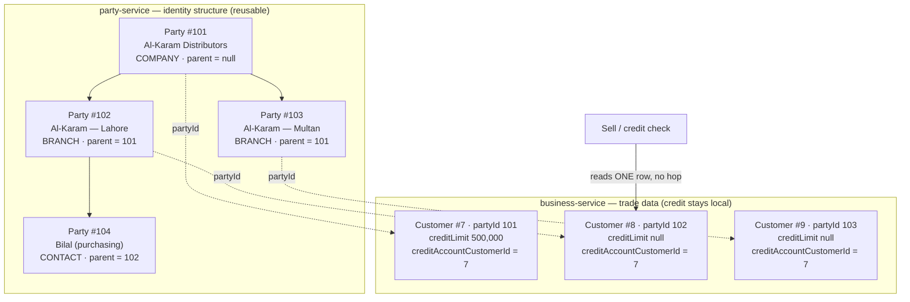

# Phase 4a — B2B account hierarchy (company → branch → contact)

**Status:** ✅ **COMPLETE & GATED — `b2b-account-hierarchy.cy.js` 8/8 green (2026-08-05).** First Phase 4 slice.
Credit semantics confirmed by the owner as **shared pool** (§4). `SharedPoolCreditTest` 8/8 on `mvn test`;
business-service schema **36**, party-service schema **3**.

> **Build note that cost a day.** `commerce-contracts` had never been `install`ed to the local repo, so any
> build of business-service without `-am` compiled against a stale contract and FAILED — leaving the previous
> jar in place and the running service serving old code. Several rounds of "fixes" were tested against a build
> that did not contain them. Always `install` the libraries, not just `package` the service.

Phase 4 is quote → approval → order. The programme plan (§6) says the account hierarchy is **both** a Phase 4
deliverable **and** a prerequisite for the still-open portal question, so it is built first regardless of how
that question is answered — the answer changes only what sits on top of it.

---

## 1. The problem

A trade buyer is not one row. "Al-Karam Distributors" has three branches, each with a purchasing contact, and
today each of those is an unrelated `Customer` row. Consequences:

- **Credit is per row.** Three branches of one company each get their own limit; nobody can see or cap the
  group's total exposure. A company at its limit keeps buying through its other branches.
- **Statements are per row.** A head office asking "what do we owe you?" gets three statements that don't add up
  to anything, because nothing records that they belong together.
- **Orders can't be routed.** A Phase 4 order placed by a contact has no company to approve it against.

## 2. Where the hierarchy lives — the real decision

Two candidates, and they pull in opposite directions.

`Party` (party-service) is the shared identity master; its own contract says it owns **only** common identity,
never domain data. `Customer` (business-service) owns the trade data: `creditLimit`, `paymentTermsDays`,
`dueAmount`, `creditBalance`, `customerType`.

| | A — hierarchy on `Customer` | B — hierarchy on `Party` |
|---|---|---|
| Credit roll-up | in-service, one transaction | cross-service call **on the sell path** |
| Reuse by other verticals | none — business-service only | Education sponsor, Welfare corporate donor get it free |
| Rests on `partyId` bridging | no | yes — and §7 calls that bridging **best-effort** |
| Fits the service's stated contract | duplicates identity structure | ✅ identity structure is exactly Party's job |

Neither wins outright: B is the architecturally correct home, but §7 explicitly warns that an account hierarchy
built on best-effort `party_id` "needs a backfill and a reconciliation view before it can be trusted for credit
decisions", and the performance standard forbids putting a service hop on the sell hot path.

### Proposal — B for structure, stamped for credit

Put the hierarchy where it belongs (**`Party.parentPartyId`**, reusable by every vertical), and **stamp the
credit roll-up target onto `Customer` when the hierarchy is edited** — not resolved per sale.

This is the same rule the Product last-rates slice established: *write it onto the row at the moment the source
changes; never derive it on the read path.* The sell path already loads the `Customer`; it must not gain a
party-service round trip to answer "whose limit applies?".

**`Customer.creditAccountCustomerId`** — the row whose limit and balance govern this account. Self for a
standalone customer or a company; the company's row for a branch **and for a contact under that branch**.
Stamped when the hierarchy changes, so the credit check stays a single local read.

### The re-stamp rule

On a hierarchy edit, **only the moved subtree changes account**: the customer and its descendants are stamped
onto the *parent's own account head*, and the group it left is not touched (its remaining members already point
at the right head).

Three bugs found in review, all silent, all now covered by the gate:

- `PartyClient.setAccountParent` declared `@RequestParam` without `required = false`. A Spring HTTP interface
  treats those as REQUIRED and throws `"Missing request parameter value 'parentId'"` **client-side, before
  sending** — so the detach path (null parent) could never reach party-service. Both controllers already
  declared their side optional; only the client contract did not.

- Re-stamping the group the customer **left** looked symmetrical but was wrong for the common case. A standalone
  customer's "previous account" is *itself*, so its first attach walked its own childless subtree, found itself
  as the head, and stamped the attach straight back out. The row count still came back non-zero, so it read as
  success.
- Deriving the account from the **root of the moved subtree** is right for a detach and wrong for an attach: a
  contact moved under a branch became the branch's own dependant, splitting one credit pool in two at depth 3.
  The account is now passed in explicitly.

### Why not skip Party and do A

Because the verticals table in the plan already schedules corporate sponsors (Education) and corporate donors
(Welfare). Building company→branch→contact inside business-service means building it twice more later, which is
exactly the "cross-cutting capability → its own service" rule the standards call out.

## 3. Model

**party-service**
| Field | Notes |
|---|---|
| `Party.parentPartyId` | nullable self-reference; null = root |
| `Party.accountLevel` | `COMPANY` \| `BRANCH` \| `CONTACT` \| `INDIVIDUAL` (default, every existing row) |

Invariants, enforced server-side:
- A party's parent must be in the **same organization** (anti-IDOR; a foreign parent is a tenancy hole).
- **No cycles** — walking parents must terminate. Reject on write; do not rely on read-time defence.
- Depth is capped at 3 (`COMPANY → BRANCH → CONTACT`). Deeper is a modelling error, not a feature.
- `INDIVIDUAL` may not have a parent — asking for that level *with* a parent is contradictory and is rejected.
- An `INDIVIDUAL` **parent is auto-promoted to `COMPANY`** on its first child. Attaching a child IS the act of
  making a row a group head; refusing forced a hidden two-step (promote the parent, then attach) that the UI
  gives no way to perform, since its level dropdown sets the CHILD's level. Caught by the gate.

**business-service**
| Field | Notes |
|---|---|
| `Customer.creditAccountCustomerId` | stamped; self by default, so every existing row is correct with a backfill of `id → id` |

## 4. Credit semantics — the decision this slice must make

Roll-up needs a rule, and the two options are materially different:

- **Shared pool** — the company sets one limit; every branch draws on it; exposure is Σ(branch dues) vs the
  company limit. Matches how distributors actually extend credit.
- **Per-branch sub-limits** — the company caps the total *and* each branch has its own ceiling. More faithful to
  large accounts, materially more work (a second limit field, two checks, two warning messages).

**DECIDED: shared pool** (owner, 2026-08-05). Sub-limits can be added later as an extra ceiling without changing
the roll-up.

**`common-credit` needed no change.** `CreditLimitPolicy.evaluate(balance, unpaid, editingDue, limit)` is pure
arithmetic and was already correct; shared pool only changes what the CALLER feeds it — the credit account's
limit instead of the billed row's, and the pooled Σ(due) instead of one row's. The shared library staying
untouched is the evidence it was factored right.

## 5. What this slice does NOT do

- No `SalesQuote`, no approval chain, no customer PO — those are 4b/4c, built on this.
- No trade portal. The portal-vs-counter question (§6) stays open; this slice is deliberately neutral to it.
- No statement consolidation. A group statement is a natural follow-on but is its own slice with its own gate.

## 6. Carried in from 3g

**D-4 — does `TRADE DISCOUNT` post to the GL as a discount account, or reduce revenue?** Still open, touches
`common-subledger`. Not a blocker for this slice; it must be answered before 4b posts order-level discounts.

## 7. Risks

- **`partyId` bridging is best-effort.** A customer with a null `partyId` cannot join a hierarchy. The slice
  needs a reconciliation view listing unbridged trade customers, or the feature silently omits them.
- **Cycle-by-edit.** Re-parenting an existing tree is where cycles get introduced; the write guard must run on
  edit, not just create.
- **Backfill is trivial but mandatory** — `creditAccountCustomerId = customerId` for every existing row, or the
  first credit check after deploy reads null and either blocks every sale or waves them all through.

## 8. Checklist

- [x] Confirm §4 credit semantics — **shared pool**
- [x] `Party.parentPartyId` + `accountLevel` + Flyway `V3`; same-org / cycle / depth / INDIVIDUAL guards in
      `PartyService.setAccountParent` — the single write path (the generic update deliberately ignores both
      fields, so no edit can route around the guards)
- [x] `Customer.creditAccountCustomerId` + Flyway `V36` **incl. the `id → id` backfill**, plus a self-stamp on
      customer creation (a new row with a null account would make the pooled SUM match nothing)
- [x] Re-stamp on hierarchy edit — `CustomerAccountService.setAccountParent` re-stamps **both** subtrees, so a
      branch moved between companies fixes the account it LEFT as well as the one it joined
- [x] Shared-pool check — `SagaSellService.assertCreditPolicy` reads the credit account's limit and the pooled
      Σ(due); `common-credit` unchanged (see §4)
- [x] Account-groups panel on the Customer screen (owner/admin-gated), + the unbridged-customer list
- [x] i18n × 6 locales
- [x] `SharedPoolCreditTest` — pure logic, runs on `mvn test`
- [x] **Compile + `mvn test`** (party-service, business-service, commerce-contracts, monolith)
- [x] **Gate: `b2b-account-hierarchy.cy.js` — 8/8 GREEN 2026-08-05** — pooling under one limit; detach; self-parent, cycle and
      cross-tenant parent all refused; a standalone customer unaffected; the panel renders.
      Runs as `owner.pharma@myplus.com` (ROLE_OWNER, uncapped — the spec seeds ~12 customers, past the demo
      accounts' 50-write cap). The anti-IDOR case uses a REAL row in `owner.business`'s org rather than an
      invented id, so a broken scope check cannot pass it by rejecting an unknown id.

## 8a. Follow-up applied 2026-08-06 — transaction boundary

`setAccountParent` was `@Transactional` while making TWO party-service HTTP calls, so it held a pooled DB
connection across the network — the exact anti-pattern `PartyBridgeService` documents avoiding ("a slow/down
party-service can't hold a DB connection"). With 15 services sharing one MySQL at 8 connections each, a slow
party-service would have drained the pool for every tenant.

Fixed by removing the boundary from the method and putting it on `CustomerRepo.updateCreditAccount` instead
(`@Modifying` + `@Transactional`), which is the narrowest place that still works. Note the trap avoided:
annotating the private `restampSubtree` would have done NOTHING — self-invocation bypasses the proxy, the same
way it did on `stampSelfAsCreditAccount`.

Accepted cost, documented on the method: if the re-stamp fails after party-service accepted the move, the
hierarchy updates but the credit account does not — degrading to the pre-4a behaviour (each customer on its own
limit) rather than to a WRONG limit, and corrected by re-running the move. Gate re-run **8/8 green**.

## 9. Not done in this slice

- **Group statement.** A head office still gets one statement per row. Natural follow-on, own gate.
- **Sub-limits per branch.** Deferred by the §4 decision; layers on as an extra ceiling.
- **Hierarchy for the other verticals.** The structure is on `Party`, so Education sponsors and Welfare
  corporate donors can reuse it — but neither is wired up here.
