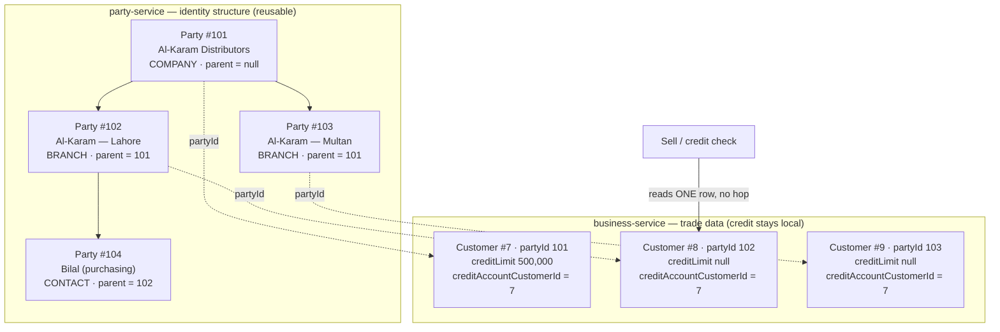

# Phase 4a — B2B account hierarchy (company → branch → contact)

**Status:** 📝 DESIGN — not implemented, not gated. Opened 2026-08-05 as the first Phase 4 slice.

Phase 4 is quote → approval → order. The programme plan (§6) says the account hierarchy is **both** a Phase 4
deliverable **and** a prerequisite for the still-open portal question, so it is built first regardless of how
that question is answered — the answer changes only what sits on top of it.

---

## 1. The problem

A trade buyer is not one row. "Al-Karam Distributors" has three branches, each with a purchasing contact, and
today each of those is an unrelated `Customer` row. Consequences:

- **Credit is per row.** Three branches of one company each get their own limit; nobody can see or cap the
  group's total exposure. A company at its limit keeps buying through its other branches.
- **Statements are per row.** A head office asking "what do we owe you?" gets three statements that don't add up
  to anything, because nothing records that they belong together.
- **Orders can't be routed.** A Phase 4 order placed by a contact has no company to approve it against.

## 2. Where the hierarchy lives — the real decision

Two candidates, and they pull in opposite directions.

`Party` (party-service) is the shared identity master; its own contract says it owns **only** common identity,
never domain data. `Customer` (business-service) owns the trade data: `creditLimit`, `paymentTermsDays`,
`dueAmount`, `creditBalance`, `customerType`.

| | A — hierarchy on `Customer` | B — hierarchy on `Party` |
|---|---|---|
| Credit roll-up | in-service, one transaction | cross-service call **on the sell path** |
| Reuse by other verticals | none — business-service only | Education sponsor, Welfare corporate donor get it free |
| Rests on `partyId` bridging | no | yes — and §7 calls that bridging **best-effort** |
| Fits the service's stated contract | duplicates identity structure | ✅ identity structure is exactly Party's job |

Neither wins outright: B is the architecturally correct home, but §7 explicitly warns that an account hierarchy
built on best-effort `party_id` "needs a backfill and a reconciliation view before it can be trusted for credit
decisions", and the performance standard forbids putting a service hop on the sell hot path.

### Proposal — B for structure, stamped for credit

Put the hierarchy where it belongs (**`Party.parentPartyId`**, reusable by every vertical), and **stamp the
credit roll-up target onto `Customer` when the hierarchy is edited** — not resolved per sale.

This is the same rule the Product last-rates slice established: *write it onto the row at the moment the source
changes; never derive it on the read path.* The sell path already loads the `Customer`; it must not gain a
party-service round trip to answer "whose limit applies?".

**`Customer.creditAccountCustomerId`** — the row whose limit and balance govern this account. Self for a
standalone customer or a company; the company's row for a branch. Stamped when the hierarchy changes, so the
credit check stays a single local read.

### Why not skip Party and do A

Because the verticals table in the plan already schedules corporate sponsors (Education) and corporate donors
(Welfare). Building company→branch→contact inside business-service means building it twice more later, which is
exactly the "cross-cutting capability → its own service" rule the standards call out.

## 3. Model

**party-service**
| Field | Notes |
|---|---|
| `Party.parentPartyId` | nullable self-reference; null = root |
| `Party.accountLevel` | `COMPANY` \| `BRANCH` \| `CONTACT` \| `INDIVIDUAL` (default, every existing row) |

Invariants, enforced server-side:
- A party's parent must be in the **same organization** (anti-IDOR; a foreign parent is a tenancy hole).
- **No cycles** — walking parents must terminate. Reject on write; do not rely on read-time defence.
- Depth is capped at 3 (`COMPANY → BRANCH → CONTACT`). Deeper is a modelling error, not a feature.
- `INDIVIDUAL` may not have a parent and may not be a parent.

**business-service**
| Field | Notes |
|---|---|
| `Customer.creditAccountCustomerId` | stamped; self by default, so every existing row is correct with a backfill of `id → id` |

## 4. Credit semantics — the decision this slice must make

Roll-up needs a rule, and the two options are materially different:

- **Shared pool** — the company sets one limit; every branch draws on it; exposure is Σ(branch dues) vs the
  company limit. Matches how distributors actually extend credit.
- **Per-branch sub-limits** — the company caps the total *and* each branch has its own ceiling. More faithful to
  large accounts, materially more work (a second limit field, two checks, two warning messages).

**Recommendation: shared pool now.** It is the common case, and sub-limits can be added later as an extra
ceiling without changing the roll-up. Confirm before implementing — it changes `common-credit`'s check.

## 5. What this slice does NOT do

- No `SalesQuote`, no approval chain, no customer PO — those are 4b/4c, built on this.
- No trade portal. The portal-vs-counter question (§6) stays open; this slice is deliberately neutral to it.
- No statement consolidation. A group statement is a natural follow-on but is its own slice with its own gate.

## 6. Carried in from 3g

**D-4 — does `TRADE DISCOUNT` post to the GL as a discount account, or reduce revenue?** Still open, touches
`common-subledger`. Not a blocker for this slice; it must be answered before 4b posts order-level discounts.

## 7. Risks

- **`partyId` bridging is best-effort.** A customer with a null `partyId` cannot join a hierarchy. The slice
  needs a reconciliation view listing unbridged trade customers, or the feature silently omits them.
- **Cycle-by-edit.** Re-parenting an existing tree is where cycles get introduced; the write guard must run on
  edit, not just create.
- **Backfill is trivial but mandatory** — `creditAccountCustomerId = customerId` for every existing row, or the
  first credit check after deploy reads null and either blocks every sale or waves them all through.

## 8. Checklist

- [ ] Confirm §4 credit semantics (shared pool vs sub-limits)
- [ ] `Party.parentPartyId` + `accountLevel` + Flyway; same-org / cycle / depth / INDIVIDUAL guards
- [ ] `Customer.creditAccountCustomerId` + Flyway **incl. `id → id` backfill**
- [ ] Re-stamp on hierarchy edit (the write path, both create and re-parent)
- [ ] `common-credit` check reads the credit account row, not the buying row
- [ ] Account-hierarchy UI: assign a parent, show the tree, list unbridged customers
- [ ] i18n × 6 locales
- [ ] Gate: `b2b-account-hierarchy.cy.js` — roll-up blocks at the group limit; **cross-tenant parent refused**;
      cycle refused; a standalone customer is unaffected
