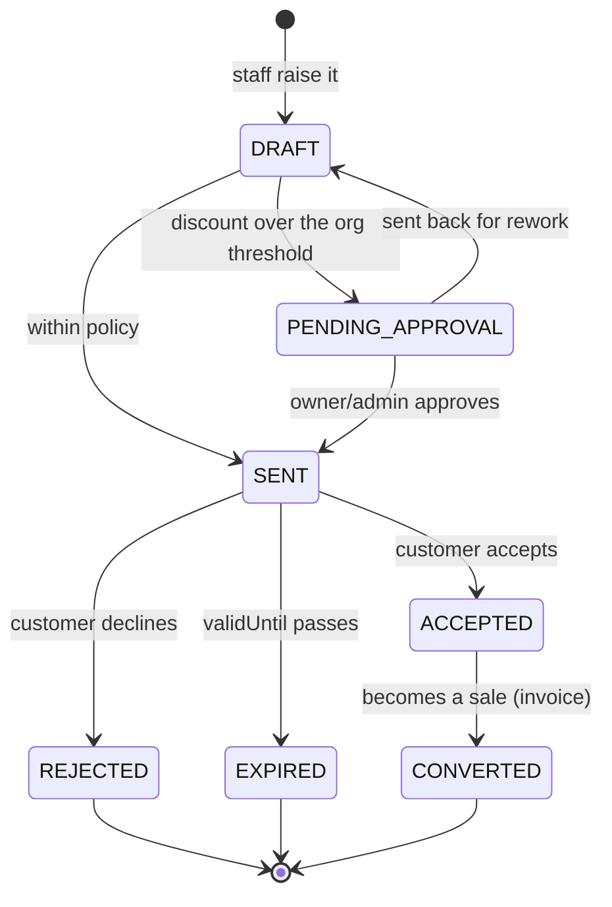

# Phase 4b — SalesQuote → approval → order

**Status:** ✅ **COMPLETE & GATED 2026-08-06** — `b2b-quote-to-order.cy.js` **6/6**, `SalesQuoteTransitionTest`
**15/15** (pure logic, runs on `mvn test`). Regression: 27/27 across quote + ledger + cancel + hierarchy +
trade-invoice. Flyway **V37** applied. **Branch:** `feature/b2b-b2c`.
**Cadence:** Document → Design → Implement → headed Cypress gate ✅.
**Builds on:** [4a account hierarchy](b2b-P4a-account-hierarchy.md) (shared-pool credit) ·
[P2 pricing](b2b-P3-documents-reports.md) (`commerce-pricing`) · [3g documents](b2b-P3g-trade-invoice-designer.md).

**Decisions settled by the owner 2026-08-06:**
- **D-4 — trade discount posts to a CONTRA-REVENUE discount account**, not as reduced revenue. Gross revenue
  keeps matching the invoice face value, the discount becomes separately reportable, and the tax register stays
  reconcilable. Netting it into revenue silently destroys the number.
- **Counter-entered, no trade portal.** Staff raise and convert quotes. §6's portal question stays closed for
  this phase; 4a was deliberately built neutral to it, so a portal later adds a front end, not a rebuild.

---

## 1. Document

**The gap.** A trade buyer asks "what would 200 of these cost?" Today there is no answer that survives the
phone call: staff either price it in their head or ring up a sale they then have to void. There is no quoted
price with a shelf life, no record of what was promised, no approval when someone discounts too far, and no
customer PO number anywhere — so the buyer's own accounts payable cannot match our invoice to their order.

**Two `quote` concepts — do not conflate them.** `commerce-pricing` already answers "what does this basket cost
*right now*" (`/price/calculate`, one quote per sale, rules never stack). That is a **calculation**. This slice
adds **`SalesQuote`** — a *document* with a number, a validity date, an approval state and an audit trail. The
new one is named `SalesQuote` from the start, as the programme plan's risk list requires.

## 2. Design

### 2.1 The two approvals are different things

"quote → approval → order" hides two distinct gates, and modelling them as one is the classic mistake:

| Gate | Who | Question | When |
|---|---|---|---|
| **Internal approval** | owner/admin | "may we offer this discount?" | before the quote leaves the building |
| **Customer acceptance** | the buyer | "do you accept this price?" | after they receive it |

Only the first is a permission check; the second is a commercial fact we record. A quote whose discount is
within policy skips the first gate entirely.

### 2.2 State machine



`EXPIRED` is derived from `validUntil` on read, **not** by a scheduled job — a quote nobody looked at does not
need a background thread, and a job that silently expires documents is a support call waiting to happen.

Transitions are guarded server-side in one place (a `SalesQuoteService.transition`), the same shape as
`PartyService.setAccountParent` in 4a: one write path, every invariant on it.

### 2.3 The flow

```mermaid
sequenceDiagram
    autonumber
    actor Staff
    participant UI as Quotes screen
    participant QS as business SalesQuoteService
    participant PRICE as commerce-pricing
    participant CREDIT as CreditLimitPolicy (4a shared pool)
    participant SAGA as SagaSellService.addSell
    participant GL as finance (GL outbox)

    Staff->>UI: New quote (customer, lines, customer PO)
    UI->>QS: draft
    QS->>PRICE: resolve contract/tier prices (ONE call, existing path)
    PRICE-->>QS: unit prices + priceReason per line
    QS->>QS: totals + trade discount; snapshot on the quote
    alt discount over org threshold
        QS-->>UI: PENDING_APPROVAL (owner/admin must approve)
        Staff->>QS: approve (owner/admin only)
    end
    QS-->>UI: SENT (quoteNo, validUntil)

    Note over Staff,UI: customer decides — recorded, not enforced
    Staff->>QS: accept
    QS-->>UI: ACCEPTED

    Staff->>QS: convert to order
    QS->>CREDIT: group exposure vs the account's limit (4a)
    alt over limit
        CREDIT-->>QS: breached
        QS-->>UI: warn (take confirmation) / refuse, per org policy
    end
    QS->>SAGA: addSell(CustomerHistoryDTO) — the SAME single revenue path
    SAGA->>GL: revenue + tax + COGS + DISCOUNT leg (D-4)
    SAGA-->>QS: invoiceNo
    QS->>QS: quote → CONVERTED, stamp invoiceNo
    QS-->>UI: invoice created
```

**The conversion reuses the existing sale path — no new revenue authoring.** Same rule O1 is enforcing for the
storefront: one invoice, one revenue path. 4b is inside business-service, so it calls `SagaSellService.addSell`
directly rather than over HTTP — but it is the same method, so quotes inherit idempotency, FEFO reservation,
tax, COGS, period lock, audit and the GL outbox for free.

### 2.4 D-4 — where the discount lands

```
Dr  Accounts Receivable        gross − discount + tax
Dr  Sales Discount (contra)    discount            ← D-4: its own account, NOT netted off revenue
    Cr  Sales Revenue                 gross
    Cr  Tax Payable                   tax
```

Revenue is credited at the **face value of the invoice**; the discount is a debit to a contra-revenue account.
A "discount given" report is then a single account balance, and gross revenue reconciles to the printed
invoices. `common-subledger` gains the account mapping; `PostingEventRequest` gains a `discountTotal`.

**This changes existing behaviour**: today `trade_discount` (3g) is captured on the sale but never posted, so it
appears on the printed invoice and nowhere in the books. After 4b it posts. Old sales are not back-posted —
they predate the account.

### 2.5 Customer PO number

The buyer's own reference. Captured on the quote, carried onto the sale, and printed. It must reach the invoice
document or it is useless to the buyer's AP clerk — 3g made the layout data, so this is a new field in the
`FIELD_WHITELIST` + a `docCustomerPo` label, **not** a template rewrite.

### 2.6 Model (business-service)

| Table | Key columns |
|---|---|
| `sales_quote` | `quote_no` (per-org series, like CRN-/DBN-), `customer_id`, `status`, `valid_until`, `customer_po_number`, `trade_discount`, snapshot totals, `approved_by`/`approved_at`, `converted_invoice_no`, `organization_id`, `store_id`, `@Version` |
| `sales_quote_line` | `product_id`, `quantity`, `unit_price`, `price_reason`, `discount` |

`@Version` from the start — two staff converting the same quote must not produce two invoices. (O2 adds the
same to orders; this slice does not wait for it.)

Org settings: `sales.quote.validityDays` (default 30), `sales.quote.discountApprovalThreshold` (percent;
default off = no internal gate), both through the existing `common-settings` catalog.

## 3. What 4b deliberately does NOT do

- **No trade portal** — counter-entered, per the decision above.
- **No order lifecycle** (picking, partial delivery, backorder) — that is OMS O2/O5. A converted quote becomes
  an invoice immediately, exactly as a counter sale does. **Known gap:** B2B usually wants order → delivery →
  invoice. Recorded here so it is a choice, not an oversight; it needs the OMS order entity to exist first.
- **No quote e-mail/PDF delivery** — the document renderer can already print it; sending is the notification
  slice (education N1 needs the same outbox).

## 4. Test

**Java (`mvn test`):** `SalesQuoteTransitionTest` — every illegal transition refused, expiry derived from
`validUntil`, threshold gate fires only over the limit. `QuoteToSaleMappingTest` — quote lines → the same DTO a
till sale builds. `DiscountPostingTest` — the GL event carries `discountTotal` and revenue stays gross (D-4).

**Cypress (headed):** `b2b-quote-to-order.cy.js` — raise a quote → over-threshold discount blocks at
`PENDING_APPROVAL` for a non-owner → owner approves → accept → convert → **one** invoice with the customer PO on
it → converting twice yields one invoice → a quote past `validUntil` reads EXPIRED and cannot convert → a
conversion that breaches the **group** limit (4a shared pool) takes confirmation.

## 5. Checklist

- [x] Design reviewed
- [x] `sales_quote` + `sales_quote_line` + Flyway `V37`; `@Version`; per-org `QTE-` series
- [x] `SalesQuoteService.transition` — one guarded write path
- [x] Convert → `SagaSellService.addSell` + 4a shared-pool credit check
- [x] D-4: `discountTotal` on `PostingEventRequest` → **Dr 4200 Sales Discount** (contra-revenue)
- [x] Customer PO: quote → sale → `customer_history` → `/getReceipt`
- [x] Quotes screen + i18n × 6
- [x] `SalesQuoteTransitionTest` 15/15 + `b2b-quote-to-order.cy.js` 6/6

## 6. Three bugs the build surfaced — all silent, all now fixed

- **`effectiveStatus()` never reached the client.** Jackson serialises `getX()`, not `x()`, so the DERIVED status
  was absent from every response. An expired quote would have rendered as `SENT` while the server refused every
  action on it. Renamed `getEffectiveStatus()`.
- **The bidirectional `lines ↔ quote` relation recursed.** A ONE-line quote produced a **151,816-byte** reply
  (684 after the fix) and the monolith proxy failed on it. Jackson's cycle detection does not catch this — each
  level is a fresh object, so it just nests. Fixed with `@JsonIgnore` on the back-reference, plus Lombok
  `@EqualsAndHashCode(exclude)`/`@ToString(exclude)` so the same loop cannot resurface inside a log statement.
- **`trade_discount` was captured but never posted** (since 3g): it printed on invoices and appeared nowhere in
  the books. D-4 now posts it.

## 7. Deviations from the design, and what is still open

- **Pricing is not re-derived through `commerce-pricing` at quote time.** The design said to reuse
  `/price/calculate`; the implementation takes the unit price the operator enters and SNAPSHOTS it. That is the
  more important property — the customer holds a document with those numbers, so conversion must bill exactly
  what was accepted. Wiring the pricing call into the quote FORM (to pre-fill contract prices) is a UI follow-up,
  not a correctness gap.
- **Tax is applied at conversion, not on the quote.** The quote shows goods value; the sale path owns the tax
  engine. Duplicating tax rules on the quote is how two systems end up disagreeing about one invoice. A quote
  therefore under-states the final total for a tax-registered org — worth a UI note before customer-facing use.
- **No PDF/e-mail delivery.** The document renderer can print a quote; sending needs the notification outbox.
