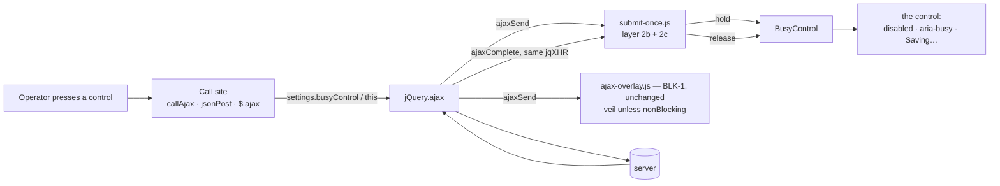
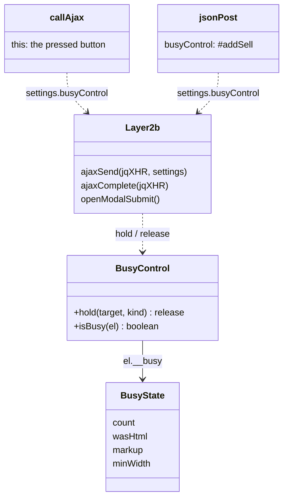
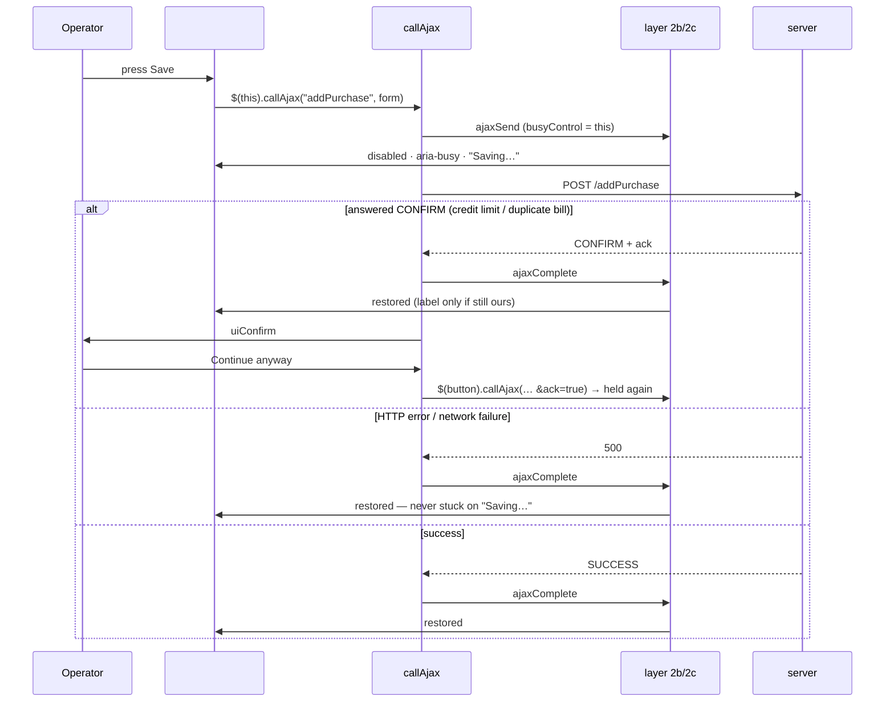

# BLK-2 — the clicked control says what it is doing

**Status:** ✅ **GATED GREEN 21/21, headed (2026-09-14, run by the user)** · committed in `cfa8a761` · the
served `submit-once.js` == src. Manual walk (Test Book §18) not yet done. Parent design: `blocking-ui-and-backend-guards-design.md`
§4.1, §4.3.1, §5. Gate: `cypress/e2e/business/busy-controls.cy.js` (written before the code).
Boundary agreed with session myplus-5f (BLK-1 owner): `ajax-overlay.js` and `non-blocking-ui.cy.js` are NOT
touched; the global "a write raises the veil" rule is NOT changed; a form leaves the veil only at its own call
site (`nonBlocking: true`), and only once it has a server-enforced key.

---

## 1. Document

> *Block the risky action, not the whole user interface.* — the ruling. BLK-1 stopped READS freezing the screen.
> BLK-2 makes the WRITE's own control carry the waiting state, so the veil can come off the writes that are safe
> without it.

### What the review found (measured 2026-09-14)

| | count / fact |
|---|---|
| shared busy helper | **0** |
| "Saving…" / "Posting…" labels, and i18n keys for them | **0** |
| hand-rolled in-flight disables | **7**: submit-once layer 2b (open modal's submit), `#addSell` (jsonPost `beforeSend`), `#srSubmit`, `#obPost`, `_rcvBusy`/`_pvBusy` flags, the stock `+`/`−` row buttons, `#paBtn` |
| ⚠ writes with **no lock at all** | the generic **non-modal** saves — `#addFc` above all (no veil: `callAjax` is `nonBlocking`; no disable: `#FcDiv` is not a `crud-overlay`; no server key); `#permSave`; the permission-set `<select>`; the purchase-return confirm; the void-sale / void-bill buttons (veil only) |
| code that rewrites these buttons' labels | **0** (grep) — restoring a saved label cannot clobber someone else's |
| Cypress specs that depend on their text or state | **1** — `duplicate-submit-guard.cy.js:387` asserts `#addProduct` is disabled in flight; still true |

⚠ **Why the label and the veil are one slice.** After BLK-1 a write still raises the full-screen veil after
220 ms, and a label under a blurred veil cannot be read. So a label only helps where the veil is off — and
§4.3.1 allows a form off the veil only where the server already de-duplicates it. BLK-2 therefore does both,
form by form, and keeps the veil wherever that condition is not met.

---

## 1b. Standards this slice is built to

| Dimension | What applies here | Where |
|---|---|---|
| **Business / domain** | §0c: *block the risky action, not the whole UI*; §0b: *never show a result you have not been given* — the label says "Posting…", never a number or "done". | all |
| **UI / accessibility** | WAI-ARIA `aria-busy="true"` on the control doing the work; the control keeps its width (no layout jump under the pointer); spinner static under `prefers-reduced-motion`; compact (`btn-xs`) buttons get a spinner plus a screen-reader-only label, not text that would widen a table row. | 2.1 |
| **SaaS / live-modules** | Additive: a request with no busy target behaves exactly as before; labels are i18n in all 6 locales, with an English fallback. | 2.1 |
| **Microservice boundaries** | Front-end only. No endpoint, entity or migration. | — |
| **Design patterns** | **Decorator over the global AJAX lifecycle** (the layer-2b hook, extended) · **Resource acquisition with a release token**: `hold()` returns its own release, ref-counted, so two holders cannot release each other early · **explicit over inferred** target — see 2.2. | 2.1, 2.2 |
| **SOLID / DRY** | ONE helper replaces the seven hand-rolled disables; call sites state a target, they do not re-implement disable/restore. | 2.3 |
| **Testing standard** | No JS unit runner exists on `mvn test` (`package.json` has only Cypress), so the gate carries it. It RECORDS state inside the page every 25 ms while each request is held open — the BLK-1 lesson: an assertion after `cy.wait` races the command queue. Regressions asserted: DUP-1 coalescing, a failed or refused request restores the control, an app relabel is never overwritten, a disabled control is never touched, the veil is KEPT where there is no key. | 5 |

---

## 2. Design

### 2.1 `BusyControl` — `submit-once.js`, layer 2c

| | |
|---|---|
| API | `BusyControl.hold(target, kind) → release()` · `BusyControl.isBusy(el)` |
| target | an element, a jQuery object or a selector; nothing resolvable → a no-op release |
| kind | `'post'` → `ui.js.busyPosting` "Posting…" (money, stock, documents) · `'save'` (default) → `ui.js.busySaving` "Saving…" |
| on hold | `disabled = true` · `aria-busy="true"` · class `is-busy` · a BUTTON also gets `min-width` = its current width and its content replaced by spinner + label; a `btn-xs` / `data-busy-compact` button gets the spinner + an `sr-only` label |
| ⚠ already disabled | **never touched** — nobody clicked it, and re-enabling it on release would unlock what someone else locked (layer 2b's existing rule) |
| nested hold | ref-counted; only the last release restores |
| on release | content restored **only if it is still ours** (an app relabel wins) · `min-width`, class, `aria-busy` removed · re-enabled |
| failure mode | never throws — it runs inside `ajaxSend`, where a throw strands `jQuery.active` (layer 2b's note) |

Wired into the existing layer-2b `ajaxSend` / `ajaxComplete` pair: held at send, released **on the same jqXHR** at
complete — success, error, abort and a `CONFIRM` answer all pass through complete. A coalesced duplicate (layer 2)
never reaches `ajaxSend`, so it cannot hold twice.

### 2.2 Where the target comes from — explicit, never guessed

1. `settings.busyControl` (+ `settings.busyKind`) on the request — jQuery carries unknown settings through.
2. `$(button).callAjax(...)` — the generic save is already invoked ON the clicked button (`main.js` generic
   `#add<Entity>` handler), so `callAjax` passes `this`. `$(document).callAjax(...)` (bulk delete) labels nothing.
3. The open modal's submit (layer 2b, unchanged in selection) — labelled when no explicit target was given,
   **disabled only** when a different control was, so "Save" and "Save & Add Another" cannot both say "Saving…".

❌ **Rejected: a global "last clicked button" listener.** A background write within the window would label the
wrong control, and a confirm dialog's OK button is already detached by the time its request is sent.

### 2.3 Per form

| Form | Control | Label | Veil after BLK-2 | Why |
|---|---|---|---|---|
| Save product (create / update) | `#addProduct` or `#addProductAnother` (whichever was pressed; the modal's other submit disabled) | Saving… | **OFF** (`nonBlocking`) | create carries the DUP-1 key (V16 + replay); update is addressed by id |
| POS sale / sale edit | `#addSell` | Posting… | off already (PERF-13) | SF-3 key |
| Receive payment | `#submitReceivePayment` | Posting… | **OFF** | Audit #5 key + server replay |
| Pay vendor | `#submitPayVendor` | Posting… | **OFF** | same |
| Every generic save via `callAjax` (**`#addFc`**, purchase, customer, vendor, education/agri forms…) | the pressed `#add<Entity>` | Saving… | off already | ⭐ closes `#addFc`'s no-lock gap |
| Sale return | `#srSubmit` | Posting… | ON | no server de-duplication (BLK-13) |
| Purchase return | `#prSubmit` (id added) | Posting… | ON | no server de-duplication |
| Opening balance | `#obPost` | Posting… | ON | the screen sends no key (BLK-13) |
| Void sale / void bill | the row's Void button | Posting… | ON | status guard only, no key |
| Stock add / correct | the row `+` / `−` (compact) | spinner | ON | no key (BLK-5) |
| Permission set save | `#permSave` | Saving… | ON | create is not idempotent; version check is BLK-7 |
| Permission set assign | the member's set `<select>` | (disabled, `aria-busy`) | ON | — |

**Out of scope, stated:** stock-count's bulk apply (many parallel posts, no single control); welfare's own
`$.fn.callAjax` override (its two modals are labelled through layer 2b); `#addPurchaseAnother` routes through a
programmatic `#addPurchase` click, so the purchase **Save** button is the one labelled — known limit.

⚠ **Known trade:** `jsonPost`'s success handler prints the receipt BEFORE `ajaxComplete`, so `#addSell` reads
"Posting…" until a print dialog is dismissed. Releasing earlier would mean releasing outside `complete`, which is
exactly how a failed request strands a label.

---

## 3. Architecture & UML

### Architecture

### Class diagram

### Sequence — a save that is refused, then confirmed

---

## 4. Implement

- [x] Gate written first — `busy-controls.cy.js`
- [x] `submit-once.js` layer 2c `BusyControl` + layer 2b wired to it (`__submitOnceBtn` replaced; no other reader)
- [x] `main.js` — `callAjax` passes `this`; its CONFIRM resubmit goes through the same control; `jsonPost` →
      `busyControl: '#addSell'` (hand-rolled `beforeSend`/`complete` removed)
- [x] `catalog-products.js` — `saveProduct` (`nonBlocking` + pressed control); stock `+`/`−` (hand-rolled removed)
- [x] `business.js` — receive / pay (`nonBlocking`), sale return, purchase return (`#prSubmit`), void sale / bill,
      opening balance (hand-rolled removed)
- [x] `permissions.js` `#permSave`; `team.js` set `<select>`
- [x] `ui.js.busySaving` / `ui.js.busyPosting` in 6 locales
- [x] **Run-1 fixes (user go-ahead 2026-09-14):** submit-once.js last-resort sweep (`BusyControl.heldCount`);
      `submitSaleReturn` treats ONLY `status === 'SUCCESS'` as a return; spec cases 7/9/12 corrected; cases 14–20 added
- [x] gate green, headed, SOLO — user: **21/21** (2026-09-14, run 4)
- [x] committed — `cfa8a761` (the user's commit, 21:50)
- [ ] manual walk — Test Book §18

## 6. Gate run 1 (2026-09-14 10:53–10:56) — 10 / 14, and what the 4 reds were

⚠ Probably overlapped a full-suite run started 10:47:51 as the same owner (`maximumSessions(1)`).

| Case | Red because | Verdict | Change |
|---|---|---|---|
| 7 POS sale | watcher got 2 samples in 1.2 s — the page's main thread was busy | the gate could not see; nothing learned about the product | `waitForAppReady` after `visitSaleScreen`, 2.5 s hold, watcher now records LONG TASKS and prints them |
| 8 product | `waitForAppReady` timed out: 2 reads in flight 30 s, `jQuery.active` 8 at start | the shared-login stall signature | none — re-run solo |
| 9 receive payment | `#ReceivePaymentModal` lives inside `#CustomerDiv`, which the case never opened | spec defect | open the section first |
| 12 sale return | ⭐ **two real defects** — see below | real | fixed |

**12a — a refusal shown as a success (pre-existing, STANDARDS §0b).** `submitSaleReturn` treated
`status === 'SUCCESS' || data.message` as success; every server refusal carries a message
(`SellController` 1633 / 1635 / 1644 / 1853 / 1856) and so does a proxy failure. The dialog closed, a green
toast showed the refusal, the grid refreshed — the operator was told a refund happened that the server refused.
Only `status === 'SUCCESS'` (1849, the one success reply) now counts. Pinned by case 12's last two assertions.

**12b — a throwing success handler strands the control (introduced by BLK-2).** jQuery 3.3.1 runs success
callbacks with no try/catch and triggers `ajaxComplete` only after them (`jquery-3.3.1.js` 9244 readyState=4 →
9305 resolveWith → 9323 ajaxComplete → 9326 `--jQuery.active`). A throw skips the release, so `#srSubmit` stayed
disabled on "Posting…" — where the old code had re-enabled it first. Fixed by a once-a-second sweep that releases
any held request whose promise is no longer pending. Independent of `jQuery.active`, which a throw also leaves
raised. Pinned by case 14. The same throw strands the VEIL (its sweep needs `$.active === 0`) — that is
`ajax-overlay.js`, owned by myplus-5f, who has a matching fix awaiting consent.

### Gate run 2 (myplus-5f, 13:21, the OLD 14-case spec on the 10:47 build, solo)

✅ 0, 1, 2, 13 — the core holds on the real build: label + restore on success and on HTTP failure, and the fee
form's lock. ❓ 3–12 SKIPPED: case 3's `beforeEach` timed out because the dashboard's own load READS took ~34 s
to drain. BusyControl acts on writes only, so this is not BLK-2. ⚠ **Cause UNKNOWN** — an earlier note here
blamed the BLK-4 catalog redeploy; that is FALSE: `myplus-catalog` was recreated at 13:29, after both slow runs
(BLK-3 13:15–13:20 showed the same ~60 s/case), both solo, catalog and monolith steady throughout. The only request
seen starting during the wait was `/serialConditionCounts`. To check after the next deploy: instance ages and a
per-endpoint timing of the dashboard's first load, BEFORE any gate runs.

### Gate run 3 (user, 22:02, the 21-case spec) — stopped at case 3: the dialog never drew

✅ 0, 1, 2. Case 3 red at spec:179 — `.uiC-card` not visible, its backdrop at `opacity: 0`. The dialog HAD opened
(still attached; `close()` would have removed it after 160 ms) but `is-open`, which `confirm-dialog.js:199` adds in a
`requestAnimationFrame`, was never applied: no frame was drawn in 5 s. The picker pass was excluded (a probe reply
dirties no picker). Leading cause: the Cypress window minimised or hidden — Chrome stops drawing frames while
timers, which Cypress un-throttles, keep running, and cases 0–2 use only timers. Cypress 13.17 does not disable
`CalculateNativeWinOcclusion`.

### Gate run 4 (user, 2026-09-14) — ✅ 21 / 21

No code or spec change between runs 3 and 4 (tree clean, HEAD still `cfa8a761`), so run 3's red was the run's
environment, not the product. ⚠ Any spec asserting `.uiC-card` visible or clicking `[data-ui-confirm]` needs the
browser window drawing frames — keep it visible for the whole run.

### ~~⚠ The committed HEAD holds a PARTIAL BLK-2~~ — resolved: `cfa8a761` committed the whole slice (no `$btn` left)

Commit `e3582e27` ("BLK-1 passed end to end", 10:31, not made by this slice's session) captured these files
mid-edit. Its `catalog-products.js` `addProductStock` still has `complete: … $btn.prop(…)` after `var $btn` was
removed — a **ReferenceError after every stock add**, which (see 12b) also strands the veil. The working tree is
correct and is what the deploys build; **the next commit must include it.**

## 5. Test

`npx cypress run --headed --browser chrome --spec cypress/e2e/business/busy-controls.cy.js`

Needs a monolith rebuild (static JS + messages). Every request is answered by `cy.intercept` — a refusal or a
probe reply — so no case writes data.

| # | Case | Red before? |
|---|---|---|
| 0 | the served build has `BusyControl` | ✅ |
| 1 | ⭐⭐ a generic save labels the PRESSED control, keeps its width, no veil; restores exactly | ✅ |
| 2 | ⭐⭐ an HTTP failure restores the control — never stuck on "Saving…" | ✅ |
| 3 | ⭐ CONFIRM: released while the dialog is open; the resubmit holds the same control again | ✅ |
| 4 | REGRESSION `$(document).callAjax` labels nothing and throws nothing | — |
| 5 | REGRESSION DUP-1: a double invoke is one request, and the control ends enabled | — |
| 6 | REGRESSION an app relabel mid-request survives; an already-disabled control is untouched | ✅ (API absent) |
| 7 | ⭐⭐ POS sale: `#addSell` "Posting…", no veil | ✅ |
| 8 | ⭐⭐ product: "Save & Add Another" labelled, `#addProduct` disabled but unlabelled, **no veil** | ✅ |
| 9 | ⭐⭐ receive payment: "Posting…", **no veil** | ✅ |
| 10 | ⭐ stock correction: compact spinner, width stable, **veil KEPT** (no key) | ✅ |
| 11 | ⭐ permission set save is LOCKED (it had no lock), veil kept | ✅ |
| 12 | ⭐ sale return: `#srSubmit` "Posting…", veil kept, **and a refusal stays a refusal** (dialog open, error shown) | ✅ |
| 13 | ⭐⭐ education `#addFc` — the form with no guard at all — is locked and labelled | ✅ |
| 14 | ⭐⭐ a success handler that THROWS still releases the control (sweep) | ✅ |
| 15 | ⭐⭐ pay vendor: "Posting…", **no veil** | ✅ |
| 16 | ⭐ stock add: row `+` spinner, veil kept | ✅ |
| 17 | ⭐ a member's permission-set picker is locked while it posts (it had no lock) | ✅ |
| 18 | ⭐ purchase return: `#prSubmit` (it had no lock) "Posting…", veil kept, refusal shown | ✅ |
| 19 | ⭐ void sale: the row's Void button (it had no lock), spinner, veil kept | ✅ |
| 20 | ⭐ opening balance: `#obPost` "Posting…", veil kept | ✅ |

**21 cases (0–20), every screen in §2.3 exercised.** Only void BILL and welfare's own `callAjax` are not in the
gate: void bill shares void sale's shape; welfare is covered by layer 2b's modal path.
