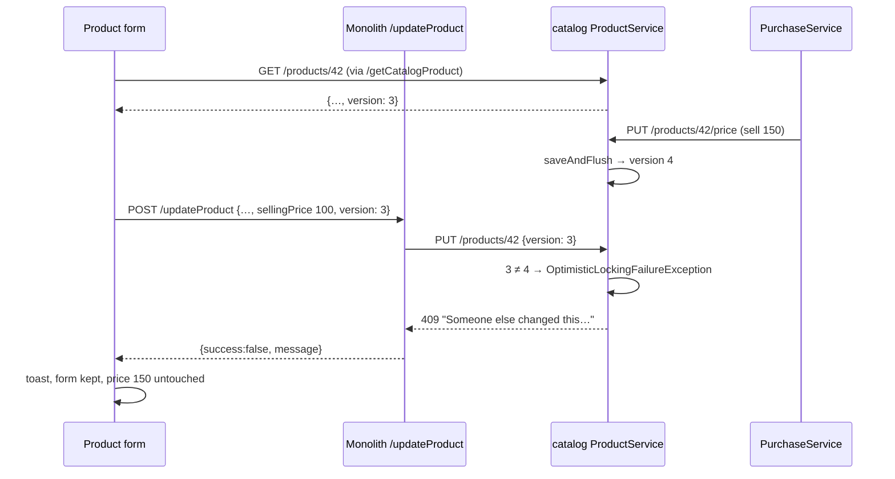

# BLK-4 — optimistic lock on the Product master

**Status 2026-09-14: GATED GREEN.** Deployed: catalog 13:29 (V17 applied to `myplusdb_catalog`), monolith 14:59.
Unit tests **10/10**, 0 skipped (`ProductOptimisticLockTest` 5 + catalog `FlywayMigrationTest` 5). Gate
**`product-concurrent-edit.cy.js` 7/7 in 29s**, including case 6 (the real product form sends its version) in 10.5s.
The earlier 6/7 run (13:36) failed case 6 before any BLK-4 assertion, on a ~39s dashboard main-thread freeze. The
cause was `searchable-selects.js`'s ajaxComplete hook refreshing every picker on every response (39.8s of 52.6s CPU,
profiled by myplus-5f); the fix shipped in the 14:59 build, and the spec was NOT changed. Not yet walked by hand.
Parent design: `docs/blocking-ui-and-backend-guards-design.md` §4.1.2 and the §5 slice table.
Gate: `cypress/e2e/business/product-concurrent-edit.cy.js`. Unit test: `catalog-service/.../ProductOptimisticLockTest.java`.

## 1. The defect

`Product` had no `@Version`. Two concrete lost updates, both silent:

1. **Purchase vs. open form.** An operator opens a product; a purchase is received and re-prices it through
   `PUT /products/{id}/price`; the operator saves, and `fromDto` writes the OLD `sellingPrice` back.
2. **Two editors.** The second save overwrites the first, field for field.

## 2. End-to-end trace (counted)

**Writers of `products` in catalog — 8 sites:**

| # | Writer | Called by | Loads the row… | Needs the client's version? |
|---|---|---|---|---|
| 1 | `create` (`saveAndFlush`) | `/addProduct` | new row | no, nothing to be stale against |
| 2 | **`update`** (`PUT /products/{id}`) | monolith `/updateProduct` ← `catalog-products.js saveProduct` | **from a form loaded earlier** | **YES, the only one** |
| 3 | `setActive` | activate / deactivate | fresh, in its tx | no (bumps the version) |
| 4 | `updatePrice` | `PurchaseService.stampRatesOnProduct` (2 calls: receive `:503`, edit `:689`) | fresh | no (bumps it: this IS the change a form must not overwrite) |
| 5 | `updateClinicalFlags` | pharma via `CatalogClient`; monolith | fresh | no (bumps it) |
| 6 | `updateTrackingFlags` | product form, right after a save (`saveProductTracking`) | fresh | no (bumps it) |
| 7 | `delete` | `/products/{id}` DELETE | fresh | no |
| 8 | CSV import `saveAll` | I1/I2 | new rows only (existing names skipped) | no |

No `@Modifying`/native SQL touches `products` (grep: 0).

**The wire:** `editProduct` → `/getCatalogProduct` → `GET /products/{id}` → `toDto` (**now carries `version`**) →
`editingVersion = {id, version}` → `saveProduct` sends `version` when the id matches → `/updateProduct`
(passes the Map through) → `PUT /products/{id}` binds `ProductDTO` (**field added**, or it is dropped silently).

**The refusal path:** `ObjectOptimisticLockingFailureException` → common-web `GlobalExceptionHandler` → 409
"Someone else changed this while you were working on it. Reload and try again." → `ProxyErrors.failure` keeps
`message` → `{success:false, message}` → `saveProduct`'s else-branch → `showFormError` → toast over the modal.
The form is not reset. BLK-2's `busyControl` releases on any outcome.

**Column vs entity:** `version BIGINT NOT NULL DEFAULT 0` (V17, idempotent) ↔ `@Version Long version`,
`nullable=false`. `FlywayMigrationTest` validates them against each other.

## 3. Decisions, and the traps they avoid

- **Explicit version comparison in `update`, not the DTO's version copied onto the entity.** The entity is
  MANAGED (loaded in the same transaction); Hibernate checks the version it loaded, so a copied value would
  check nothing. `@Version` still catches a writer that commits between the read and the flush.
- **`saveAndFlush` in `update`, `setActive`, `updatePrice`.** The version moves at flush; with `save()` the
  response is built first and carries the OLD version, which would make the caller's next save conflict with
  itself. Unit case 1 and gate case 1 pin it.
- **A missing version falls back to last-write-wins** (V62's rule): a cached tab from before the deploy keeps saving.
- **`fromDto` never reads `version`,** so a create cannot be misclassified as an update by Spring Data.
- **No `@Builder.Default` on the field:** a new product must reach persist with a null version.
- **Self-conflict ruled out:** the form re-reads the product on every open, and closes after an edit, so the
  tracking-flag write that follows a save cannot make the operator's next edit look stale.

## 4. Out of scope (recorded, not done)

`Vender`, `Company`, `CustomerHistory`, `Purchase` have no `@Version` either (checked: 0 each) — design §9.4,
"BLK-4+". Each needs its own writer trace; Purchase and CustomerHistory are money documents with recompute
writers, which is exactly where a version check can refuse a legitimate system write.

## 5. Deploy and gate

- **Build:** catalog-service (V17 runs on start) + the monolith (static JS). Both, or the form sends a
  version the old catalog drops (harmless) / the new catalog never receives one (unprotected, not broken).
- **Rollback:** V17 is additive and defaulted; an old jar ignores the column.
- **Tests:** `ProductOptimisticLockTest` (5 cases, Testcontainers, runs on `mvn test` with Docker);
  `product-concurrent-edit.cy.js` (7 cases, solo as `owner.business@`; case 7 also uses `admin.business@` and
  `user.business@` through the gateway).
- **Manual:** MyPlus Test Book §17 "Two people editing one product".

## 6. The privilege ladder, and a gap it found

> **Update 2026-09-14 (monolith build 14:59):**
>
> **1. product.edit enforcement — HELD, not shipped.** Coded (interceptor rules for `/updateProduct`,
> `/addProductBarcode`, `/removeProductBarcode`; `data-row-edit-flag` on `#tableProduct`; panel-link gate) and
> pulled back out before the build, because the trace found a live cross-module defect:
> **pharmacy tenants are org type PHARMA, and `AuthService` mints PERM-1 codes for BUSINESS tenants only**
> (`AuthService.java` ~941, `businessTenant`). Every non-owner pharmacy member therefore holds NO permission
> codes, and the interceptor already refuses them every mapped action. Verified live with a correct CSRF
> header: `admin.pharma@` and `user.pharma@` get "You are not allowed to add products" on `POST /addProduct`.
> The same `holds()` path refuses `/addSell`, but that wasn't probed, so it's inferred. Mapping `product.edit` now
> would take product editing from all of them too. Re-add it once PHARMA members carry codes.
> `cypress/e2e/business/product-edit-permission.cy.js` is `describe.skip` until then. Shipped parts that change
> no one's access: `window.canEditProduct`, the generic `data-row-edit-flag` hook in `main.js` (inert without the
> attribute), and `saveProduct`'s error branch showing the interceptor's sentence via `apiFailMessage`.
> Counted impact when it does ship (set holders): 3 members lose editing (2 on org 50 "Storekeeper custom",
> `user.business@`'s leftover test set), plus every non-owner PHARMA member unless the minting is fixed first.
>
> **2. Adding stock checks the right permission — FIXED and live.** `Rule("POST", "/addProductStock",
> "stock.create")` sits ABOVE `/addProduct`, whose prefix used to catch it. Counted before changing: no set
> member holds one of `product.create` / `stock.create` without the other, and PHARMA staff are refused both
> before and after, so nobody gained or lost it. Verified live: `user.business@` gets "You are not allowed to add
> stock. Ask the shop owner." `/adjustProductStock` stays unmapped on purpose. Unit tests
> `PermissionInterceptorTest` 5/5.
>
> **3. "Delete a product" still governs nothing on the Product screen — HELD for a ruling.** The screen's delete
> posts `/deactivateProduct` (unmapped); the `/deleteProduct` rule guards a path this screen never calls.
> Mapping it to `product.delete` would take deactivation from **19 members, including all 16 on the built-in
> Standard set**, which lacks `product.delete` by design. That breaks V12's contract that PERM-1 changed nothing
> for existing staff, so it needs a decision (for example, map deactivate to `product.edit` instead, or grant
> Standard `product.delete`).

### As first found (kept for the record)

**Ladder (GATE-RUNBOOK §4):** `admin.` and `user.` are members of the owner's org, and product visibility is
org-wide (`ProductRepository.SCOPE` = `organizationId = :orgId OR (NULL org AND own user)`), so all three
tiers see the same product. Gate case 7: the admin saves first, and the owner's stale form and a plain user's
stale save are both refused. The lock is not a privilege, and seniority does not win a race.

**⚠ Gap: `product.edit` governs nothing.** Auth V12 seeds `product.edit` ("Edit a product") into the
permission matrix, and the Standard sets include it. But:

- `PermissionInterceptor` (monolith) maps `POST /addProduct` → `product.create` and `/deleteProduct` →
  `product.delete`, and has **no rule for `POST /updateProduct`**. Unmapped paths are allowed by design (the
  phase-2 hole, logged as `perm.unmapped`).
- catalog `PUT /api/catalog/products/{id}` carries no `@PreAuthorize`.
- the product grid's Edit button has no `sec:authorize`.

So a member whose permission set withholds "Edit a product" can still edit every product, on screen and by API.
Pre-existing (PERM-1 phase 2), not introduced by BLK-4. **Not fixed:** mapping it changes who can do their job
on deploy (the same reason PERM-1 left unmapped paths open), so it is a product decision. The natural fix is one
`Rule("POST", "/updateProduct", "product.edit")` plus `sec:authorize` on the Edit button, and the gateway
path needs a matching check if API edits should also be governed.
