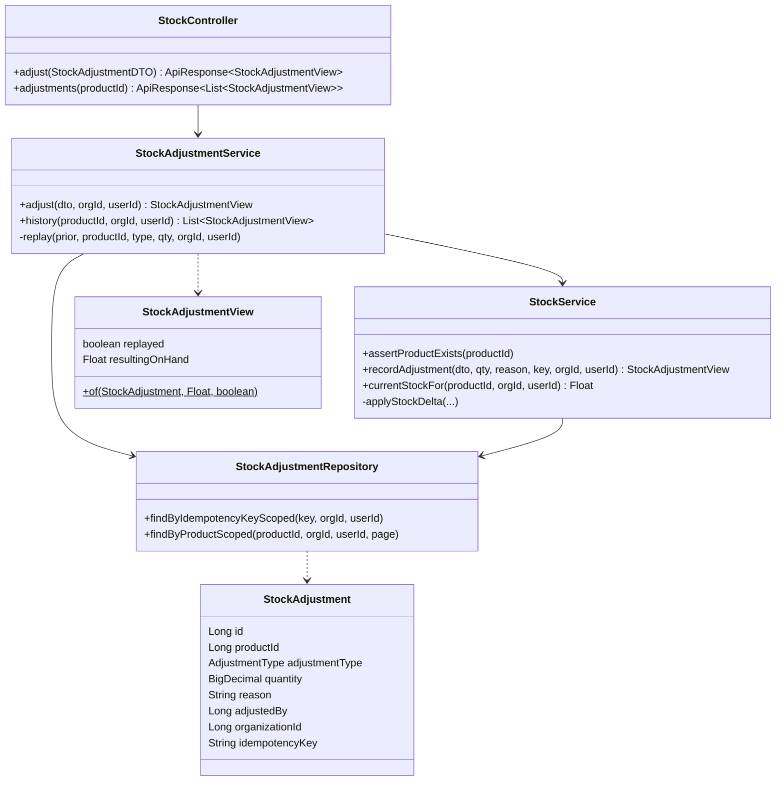
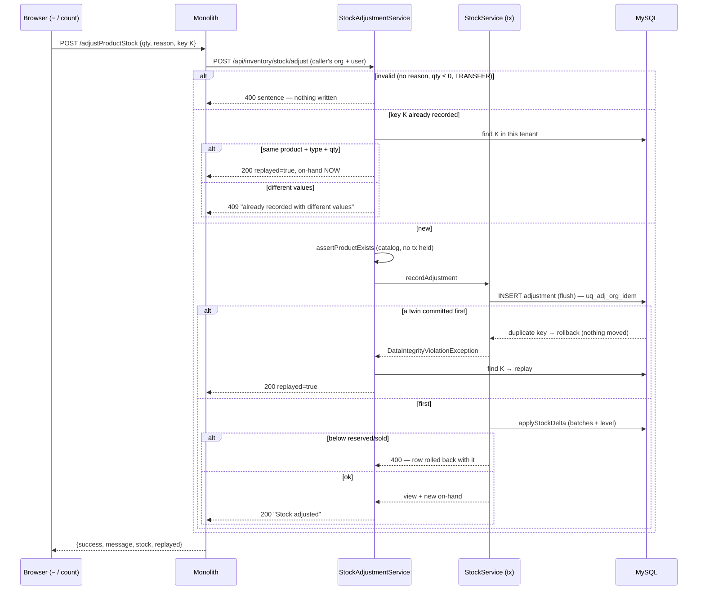

# BLK-5 — a stock correction is recorded once, and says who, which shop and why

**Status 2026-09-15: ✅ GATED GREEN — `stock-adjust-guard.cy.js` 11/11, headed, solo (12:18:50–12:19:42, run by
myplus-f9 at the user's request) on the BLK-5 build (monolith 11:54, inventory 11:55, V11 applied).** Inventory `mvn
test` 55/0/0/0. Regressions green (see §5). Manual cases → Test Book; then ask to commit. Not yet walked by hand.
Parent: `blocking-ui-and-backend-guards-design.md` §5 (BLK-5 row) and §9.1 row 16. Review that scoped it: the
BLK-5 row's review note (2026-09-15), memory `blk-e2e-review`.

---

## 1. Document

A shop corrects its on-hand in two places, both through ONE server path:

| Screen | Call site | Direction | Reason sent today |
|---|---|---|---|
| Product grid row **−** | `catalog-products.js` `adjustProductStock` | DECREASE | hard-coded `"Manual stock correction"` |
| Stock count sheet (U11) | `stock-count.js` `applyAll` | INCREASE / DECREASE per row | `"Stock count <date>"` |

Both → monolith `POST /adjustProductStock` → inventory `POST /api/inventory/stock/adjust` → `StockService` →
`stock_adjustments` + `applyStockDelta` (batches + level).

**What was wrong — every line measured on 2026-09-15 (Docker `myplus-mysql`):**

| # | Finding | Evidence | Consequence |
|---|---|---|---|
| 1 | **No duplicate protection.** No screen sends a key; the proxy forwards 4 fields; the DTO and the table have no key | code + schema | a retry after a timeout, a second tab, or an API client removes the stock **twice** (§0c's exact cases) |
| 2 | **The reason is never ASKED.** Both screens hard-code it, the proxy defaults it, the column is nullable | code + schema | "why did 12 units vanish?" has no answer a person gave |
| 3 | **The record does not say WHO.** `adjusted_by` is NULL on **34 / 34** live rows — nothing sends it, the service copies it from the body | `select … where adjusted_by is null` | an adjustment is not attributable |
| 4 | **The record does not say WHICH SHOP.** `stock_adjustments` has **no `organization_id` column** — V2's tenancy pass never reached this table | `information_schema.columns` | the table cannot be scoped; any read of it would cross tenants |
| 5 | **Nothing reads the record.** Only `save`; `findByProductId` (unscoped) has no caller | grep | "audited (reason/who/when)" in `CatalogController:1104` and `stock-count.js:9` is not true |
| 6 | **An adjustment is not checked against the catalog.** `addStock` calls `assertProductExists`; `adjustStock` does not | code | any product id — another tenant's, or none — gets a stock level in the caller's tenant |
| 7 | **Quantity and TRANSFER are not validated.** A negative quantity with DECREASE *adds*; TRANSFER records a row that moves nothing | code | silent wrong records |
| 8 | **The − button's own code shadowed the translate function.** `var t = type \|\| 'DECREASE'` (hoisted) made `t` a string for the whole body | `catalog-products.js` | pressing − with no quantity threw "t is not a function" and showed nothing; so did the error handler on any network failure |

**User value.** A correction happens once however it is sent, the shop can see who made it and why, and a
correction for a product outside the shop is refused.

## 1b. Standards

| Dimension | Rule this slice is built to |
|---|---|
| **Business / domain** | Inventory control: a stock adjustment is a controlled record — **who, when, why, which location** — and "reason for adjustment" is mandatory in every mainstream POS/ERP (Odoo inventory adjustments, SAP movement-type + reason, Square/Lightspeed "reason for adjustment"). Shrinkage (damaged, expired, lost) is reported BY reason, so the reason must come from the person, not a default. |
| **SaaS multi-tenancy** | Tenant stamped at write from the authenticated caller, never the body. Reads use inventory's standard SCOPE. The key is unique **per tenant** — a replay returns a whole row, so an unscoped key would let a guesser read another shop's correction (anti-IDOR, same as DUP-1). The catalog check makes "this product is mine" a server rule. |
| **Live-modules rule** | V11 is additive (two nullable columns, two indexes, guarded). The key is **optional**: a page cached from before the deploy still saves, un-deduplicated, exactly as today. Both screens already send a reason, so requiring one breaks no screen. Legacy rows are untouched. |
| **Microservice boundaries** | inventory owns `stock_adjustments`; no new service. The monolith stays a pass-through proxy. No backfill across schemas: a row's tenant is knowable only via catalog's DB, and a migration reaching into another service's schema is the coupling the split exists to prevent. |
| **Design patterns** | **Idempotency Key / Idempotent Receiver** (EIP) with the **database unique index as the arbiter** + **Replay** — a pre-check alone cannot separate concurrent twins (DUP-1's lesson). **Facade** (non-transactional `StockAdjustmentService`) over a **Unit of Work** writer (`StockService.recordAdjustment`, one transaction) — the duplicate-key catch must live OUTSIDE the transaction, because a violation marks it rollback-only (DUP-1, SF-3). **Guard clauses** for validation. **DTO/View** on the wire, never the entity (its `warehouse` is LAZY). |
| **SOLID / DRY** | One shared key helper (`FormKeys`, + `retirePrefix`); the confirm dialog gains ONE generic option (`suggestions`) instead of a bespoke reason picker; the scope clause lives once in the repository; BLK-2's `BusyControl` is reused unchanged. |
| **Testing standard** | `mvn test`: `StockAdjustmentServiceTest` (Testcontainers MySQL — replay, mismatch, **racers on the real unique index**, tenant, refusal) + inventory `FlywayMigrationTest` (V11 on a virgin DB). One headed Cypress gate `stock-adjust-guard.cy.js`, whose REGRESSION assertion is case 5 (*the record names who and which shop* — the 34/34 finding) and whose concurrency case uses `dedupe:false` so the client coalescer cannot mask the server (DUP-1 trap 2). |

## 2. Design

### 2.1 Data model — `V11__stock_adjustment_attribution.sql` (inventory)

| Column / index | Type | Why |
|---|---|---|
| `organization_id` | `BIGINT NULL` | which shop; stamped from the caller |
| `idempotency_key` | `VARCHAR(191) NULL` | one intended correction; 191 because utf8mb4 × 255 = 1020 B exceeds the 1000 B index key (catalog V16) |
| `uq_adj_org_idem` | `UNIQUE (organization_id, idempotency_key)` | the arbiter between racers; per tenant |
| `idx_adj_org_product` | `INDEX (organization_id, product_id)` | the scoped history read |
| `adjusted_by` (exists) | `BIGINT NULL` | now stamped from the caller (was copied from the body, and never sent) |

Entity ↔ column contract: `Long organizationId` ↔ `bigint`; `String idempotencyKey` `length=191` ↔ `varchar(191)`.
`quantity` is **not touched** — its dev-DB drift (`decimal(38,2)` vs V8's `DECIMAL(19,4)`) is its own slice.

### 2.2 Endpoint contract

**`POST /api/inventory/stock/adjust`** (gateway-routed; the monolith's `/adjustProductStock` proxies it)

| Field | Rule |
|---|---|
| `productId` | required; must exist **in the caller's catalog** (else 400 "Product not found in catalog") |
| `adjustmentType` | `INCREASE` \| `DECREASE`; `TRANSFER` refused (400 — use a transfer) |
| `quantity` | required, > 0 |
| `reason` | **required**, trimmed, ≤ 255 (400 "Give a reason for the stock correction.") |
| `idempotencyKey` | optional, trimmed, ≤ 191; blank = none |
| `adjustedBy` | **ignored** — the server stamps the caller |

Answers: **200** `ApiResponse{success, message: "Stock adjusted" | "Already recorded", data: StockAdjustmentView}` ·
**400** validation / insufficient stock / unknown product · **409** the key was already used with different values.

**`GET /api/inventory/stock/adjustments?productId=`** → `ApiResponse<List<StockAdjustmentView>>`, newest first,
at most 50, tenant-scoped.

**Monolith:** `POST /adjustProductStock` forwards `productId`, `adjustmentType` (default DECREASE), `quantity`,
`reason` (**no default any more**), `idempotencyKey`; answers `{success, message, stock, replayed}`.
`GET /productStockAdjustments?productId=` → pass-through.

### 2.3 Who does what — the ordering is the design

`StockAdjustmentService.adjust` (**no transaction**):
1. **Validate** (guard clauses) — nothing written on a refusal.
2. **Pre-check** the key → a prior row → **replay** (same product + type + quantity) or **409** (different).
3. **Catalog check** (`assertProductExists`) — a remote call, deliberately outside any transaction.
4. **Write** via `StockService.recordAdjustment` (one transaction): **insert + flush the row FIRST**, then move the
   stock. Two racers meet at `uq_adj_org_idem` before either touches the shelf.
5. On `DataIntegrityViolationException` with a key → re-read the key → **replay**; no row → rethrow (a real fault).

A refusal inside the write (`"Cannot reduce below stock already reserved/sold"`) rolls the row back with it, so a
refused correction leaves nothing under its key and a corrected retry proceeds normally.

**Quantity comparison for the replay is at 2 decimal places.** The request arrives as a `Float`; the stored value
is whatever the column holds (`decimal(38,2)` on the drifted dev DB, `(19,4)` elsewhere). Comparing exactly would
turn a genuine retry of `0.3333` packs into a false 409 on the dev DB. A real "different quantity" differs by far
more than a cent.

### 2.4 The key's lifecycle (client) — the whole risk

| Moment | What happens | Why |
|---|---|---|
| reason dialog confirmed | `FormKeys.get('stockAdjust:<productId>')` / `('stockCount:<productId>')` | minted per intent, per product |
| answer `success` | **retire** at the top of the handler | the next correction is a new intent (SF-3b: retire before anything can throw) |
| answer `success:false` | keep | a refusal stored nothing under the key, so keeping it is harmless — a changed body gets a fresh write |
| transport error / timeout | **keep** | the outcome is unknown; a retry must replay, not repeat |
| Product grid redraws its stock cells · count sheet loads | **retire all** `stockAdjust:` / `stockCount:` | the screen has just re-read the truth, so any earlier unknown outcome is now visible |
| dialog cancelled | nothing minted, nothing sent | |

A key reused after an unknown outcome surfaces as the distinct *"Already recorded"* answer, never silently.

### 2.5 UI contract

- **−** opens `uiPromptConfirm`: title *"Remove {qty} from stock?"*, one line saying corrections are recorded with
  who and why, a **required** reason field with 5 translated suggestions (Damaged · Expired · Lost or stolen ·
  Counting error · Entered by mistake — free text allowed), confirm *"Remove from stock"* (danger tone).
- Empty reason → the dialog's own required message, **no request**.
- The request is `nonBlocking` + `busyControl` on the row button: **the veil is off** — BLK-2's rule ("veil off only
  where a server key exists") now applies. The count sheet's rows likewise.
- A replay answers *"This correction was already recorded — nothing was changed twice."*
- The suggestions are buttons that FILL the field (never submit), so the keyboard-first till stays safe: Enter on a
  suggestion picks it, Enter in the field confirms.
- i18n: 13 `ui.js.stockAdj*` keys × 6 locales.

### 2.6 Security

Who may adjust is **unchanged** — `/adjustProductStock` stays unmapped and `/adjust` carries no `@PreAuthorize`.
That is BLK-11's ruling to make, not this slice's. Identity (who, which shop) comes from the token, never the body.

## 3. Architecture & UML

```mermaid
flowchart LR
    subgraph Browser
      A["Product grid −<br/>catalog-products.js"] -->|reason dialog| K["FormKeys<br/>stockAdjust:&lt;id&gt;"]
      C["Stock count sheet<br/>stock-count.js"] --> K
    end
    K -->|POST /adjustProductStock<br/>{productId,type,qty,reason,key}| M["Monolith<br/>CatalogController"]
    M -->|POST /api/inventory/stock/adjust<br/>identity forwarded| I["inventory<br/>StockController"]
    I --> F["StockAdjustmentService<br/>(facade, no tx)"]
    F -->|assertProductExists| CAT[("catalog-service")]
    F -->|recordAdjustment (tx)| W["StockService"]
    W --> DB[("myplusdb_inventory<br/>stock_adjustments · stock_levels · stock_entries")]
    F -->|replay read| DB
    M -->|GET /productStockAdjustments| I
```





## 4. Implement

- [x] V11 — `organization_id`, `idempotency_key`, `uq_adj_org_idem`, `idx_adj_org_product` (guarded)
- [x] `StockAdjustment` — the two fields + the unique constraint; the unused transient removed
- [x] `StockDTOs` — `idempotencyKey` on the request; `StockAdjustmentView` for answers and history
- [x] `StockAdjustmentRepository` — scoped key + product reads; the unscoped `findByProductId` removed
- [x] `StockService.recordAdjustment` (insert-first writer) + `currentStockFor`; `assertProductExists` public
- [x] `StockAdjustmentService` — validate, replay/409, catalog check, write, racer catch, history
- [x] `StockController` — `/adjust` through the facade; `GET /adjustments`
- [x] `StockAdjustmentServiceTest`, inventory `FlywayMigrationTest`
- [x] monolith `CatalogController` — forward the key, no reason default, `replayed`; `/productStockAdjustments`
- [x] `confirm-dialog.js` — `input.suggestions`, rendered as BUTTONS that fill the field (not a `<datalist>`: the
      dialog accepts on Enter from a document-level capture listener, so picking a datalist option by keyboard
      would submit a half-typed reason). Enter/Space on a suggestion picks it; Tab cycles through them.
- [x] `submit-once.js` — `FormKeys.retirePrefix`
- [x] `catalog-products.js` — reason dialog, key lifecycle, veil off; retire on stock-cell fill; finding 8 fixed
- [x] `stock-count.js` — key per row, veil off; retire on sheet load
- [x] `messages*.properties` — 13 keys × 6 (counted: 13 in each, no duplicates)
- [x] `busy-controls.cy.js` case 10 — answer the dialog; the veil now OFF (the BLK-5 regression flips)
- [x] JS syntax (`node --check`): the 4 product files + 2 specs
- [ ] compile + `mvn test` (inventory) — user
- [ ] build: inventory `clean package` (V11) + monolith; restart both — user
- [ ] gate green, headed, SOLO — user
- [ ] regressions: `product-crud.cy.js`, `stock-count.cy.js`, `busy-controls.cy.js` — user
- [ ] Test Book manual cases, then ask to commit

## 5. Test

**Gate `cypress/e2e/business/stock-adjust-guard.cy.js`** — owner.business@ (POS, the domain that corrects shelves);
admin./user. through the gateway; owner.pharma@ as the second tenant. Run SOLO.

| # | Case | What the defect would break |
|---|---|---|
| 0 | the served build is BLK-5 (JS markers + the history read answers) | a stale monolith/inventory passing for the wrong reason |
| 1 ⭐⭐ | one key twice → stock moved ONCE, second answer `replayed`, ONE row carrying the key | finding 1 |
| 2 ⭐⭐ | 6 racers, one key, `dedupe:false` → all succeed, stock moved once, one row | the pre-check-only fix |
| 3 ⭐ | no / blank / spaces reason → refused, nothing moved, no row | finding 2 |
| 4 ⭐ | same key, different quantity → refused (409 sentence), nothing moved | a silent wrong replay |
| 5 ⭐⭐ | **REGRESSION** — the row names who (`adjustedBy`) and which shop (`organizationId`), reason and key as sent | findings 3–4 (34/34) |
| 6 ⭐⭐ | ladder: admin. and user. adjust the owner's product → allowed (BLK-11 pending); three rows, three people, one shop | tier attribution |
| 7 ⭐⭐ | cross-tenant: pharma reusing the business key on its own product → a NEW pharma row; pharma cannot read the business history nor adjust the business product | anti-IDOR + finding 6 |
| 8 ⭐⭐ | the SCREEN: − asks for a reason (suggestions), empty is refused with no request, a chosen reason posts key + reason, no veil, the cell updates, the key rotates | a server guard the screen never uses (§9.7) |
| 9 ⭐ | Cancel sends nothing and mints no key | |
| 10 ⭐ | the stock-count sheet applies with a key and a reason, and the row is attributable | the second call site |

**Runs.** Build verified live 2026-09-15 (monolith 11:54, inventory 11:55, served JS == src, V11 success).
Run 1 (user): cases 8 and 9 red, "subject detached" typing into `#addstk_` — a race in the spec's `openProduct`, not
the product: the grid is newest-first and searches server-side after `searchDelay: 400`, so the helper's waits passed
on the UNFILTERED draw and the search answer then redrew the row mid-type. Fixed with the user's go-ahead (spec only):
wait for the filtered one-row draw, the stock cell, and a quiet app; split `clear()`/`type()`. Re-run pending.
Regressions on the BLK-5 build (headed, solo, run by myplus-f9 at the user's request): ✅ `busy-controls` 21/21 (incl.
the changed case 10) · ✅ `duplicate-submit-guard` 10/10 · ✅ `pos-shortcuts` 20/20 (the shared confirm dialog and
submit-once changes regress nothing) · ✅ `grid-loading` 12/12 · ✅ `dashboard-no-freeze` 5/5 · ✅ `sale-nonblocking-load`
5/5 · ✅ `picker-prefetch` 4/4 — **batch 1: 7 specs, 77 tests, 0 failing / 0 pending / 0 skipped (12:00–12:13).**
Batch 2: ✅ `stock-count` 7/7 · ⚠ `product-crud` 13 passing / 1 failing — the failure is NOT BLK-5: "bulk Delete deactivates
the product" expects `/deactivateProduct`, but PROD-DEL (committed `cfa8a761`, 09-14) made Delete post `/removeProducts`
and never updated this spec (last touched 08-16). Its stock-adjust case — reason, no key: the legacy path — PASSED, and
the logged "Cannot reduce below stock already reserved/sold" at 07:15:10Z is that case's intended refusal. The runner
stops at the first red, so the `stock-adjust-guard` re-run waited for the user's go-ahead — then ✅
`stock-adjust-guard` **11/11** (12:18–12:19) and ✅ `product-crud` **14/14** with myplus-f9's `/removeProducts` spec fix.
**Manual cases:** MyPlus Test Book §19 "Correcting stock by hand" (published 2026-09-15; §16/§18 corrected — stock
correction no longer veils). Not yet walked.

**`mvn test` (inventory):** ✅ 55 run, 0 failures, 0 errors, 0 skipped (2026-09-15 11:56) —
`StockAdjustmentServiceTest` 10/10, `FlywayMigrationTest` 5/5. `StockAdjustmentServiceTest` — replay moves once · mismatch 409 · reason/qty/TRANSFER
refused, nothing written · who/shop from the caller, not the body · **6 racers on the real unique index** · same key
in another tenant is new · a refused correction leaves no record · unknown product refused · history scoped.
`FlywayMigrationTest` — V11 columns + the unique index on a virgin DB; stock quantities are `decimal(19,4)` on a
Flyway-built DB (so the dev drift is the dev DB's, not the migrations'). ⚠ Testcontainers: read the SKIPPED count.

**Regressions:** `product-crud.cy.js` (API adjust with a reason, no key — the legacy path), `stock-count.cy.js` (U11),
`busy-controls.cy.js` (case 10 flipped), `pos-shortcuts.cy.js` (its F9 cases open the shared confirm dialog, which this
slice changed), `duplicate-submit-guard.cy.js` (`submit-once.js` gained `retirePrefix`). Both shared-file changes are
additive: suggestions render only when a caller passes them, and with none the dialog's Tab list and Enter path are
exactly as before. Run AFTER myplus-f9's Esc regressions finish on the 08:10 build, so the results do not mix.

**Manual:** Test Book section after green.

## 6. Known limits (recorded, not hidden)

- **Who may adjust** is unchanged — BLK-11's ruling.
- **A NULL-org caller** gets no racer protection: MySQL UNIQUE treats NULLs as distinct (same limit as DUP-1).
- **The 34 legacy rows** keep NULL org and author — visible to no scoped read.
- **Keys live per page**: a reload after an unknown outcome mints a new key (the re-read stock shows what happened).
- **Racers of a REFUSED correction** can meet InnoDB's duplicate-key deadlock when the first rolls back; one of them
  answers 500 instead of 400. All of them were refusals anyway.
- **Stock ADD** (`/addProductStock` → `/stock/import`) is not in scope — BLK-12/13.
- **`quantity` precision** on the dev DB — its own slice (`inventory-decimal-drift`).

## 7. Deploy and rollback

Build order: **inventory** (V11 runs on start) and the **monolith**. Either order is safe: an old monolith sends a
reason and no key (accepted, un-deduplicated, as today); an old inventory ignores the key the new monolith sends
(unprotected, not broken). Gate case 0 names which half is stale. Rollback: V11 is additive; an old jar ignores the
columns.
