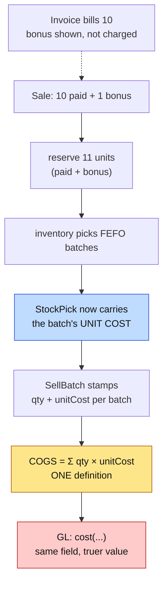

# P3 — customer bonus, and COGS from the goods that actually left

**Status:** SHIPPED AND GREEN (2026-09-01) — bonus-schemes-p3.cy.js 14/14 (9 API + 5 added after the manual walk).
**Parent:** `bonus-schemes.md` (P1 + P2 shipped green 2026-08-31).
**Books risk:** HIGH — this changes reported margin on **every** sale, not only bonus ones.

> **Money follows the invoice. Stock follows physical movement. Cost follows the goods.**
> P1 and P2 delivered the first two. P3 delivers the third.

---

## 1. Decisions taken

| # | Decision | Who |
|---|---|---|
| **P3-D1** | **COGS is derived from the batches actually consumed**, not from a per-line rate snapshot. | user, overruling the smaller option |
| **P3-D2** | **Same-SKU bonus only.** A different reward SKU needs its own sale line and becomes **P3b**. | default, flagged |
| **P3-D3** | **Build behind the `bonusSchemes` capability now**; the U11 stock-count cutover is a per-tenant enablement step, not a blocker on the code. | default, flagged |

### Why P3-D1 is the better choice, on inspection

It was recommended against as too broad. It is broader — and it is also **simpler**, which only became clear once the call sites were counted.

COGS is currently `costPrice × quantity`, written out **five times**:

```
SagaSellService:253    new sale
SagaSellService:360    (second path)
SellController:1298    edit repost
SellController:1574    sale return
RepossessionService:247 repossession
```

`quantity` excludes bonus, so the smaller option meant editing a money formula in five places and keeping them in step forever. Deriving COGS from consumed batches instead means **the bonus needs no special case at all**: the reservation covers paid + bonus, the batches record what left, and the cost follows. Zero edits to five formulas, because there is one formula.

`SagaLine.costPrice` is documented as *"unit COGS snapshot (latest purchase rate)"* — an approximation that P2 has now made unnecessary, since a batch knows exactly what was paid for it.

---

## 2. Standards this slice is built to

| Standard | How it applies |
|---|---|
| **Accounting** | COGS is the cost of the goods that left, taken from the batches FEFO actually consumed — not a proxy rate. A bonus unit has zero revenue and a real cost. |
| **Money allocation** | `paidTotal × consumed / batchQuantity`. The total is **ALLOCATED, never derived by rounding a proportion** — the rule P2 already follows, applied on the way out. |
| **Stamp at write** | The batch cost is stamped onto the sale when it is written, from the reservation that picked it. Never re-derived on read: a later purchase must not change last month's margin. |
| **DRY / SOLID** | ONE COGS definition, extracted. Five copies of a money formula is the defect this slice removes, not a shape it should preserve. |
| **Microservice boundaries** | Inventory owns batch cost and reports it on the reservation it already returns. No new call, no cross-service lookup on the sale path. |
| **Multi-tenancy** | Unchanged — the reservation is already tenant-scoped. |
| **GL** | No new `PostingEventRequest` field. `cost` exists; only its value changes. The trial balance is gated because that value moving is the point. |
| **Testing** | Cypress cases written **before** implementation. Each names the regression it guards. |

---

## 3. Design



Blue is the new data on an existing message. Amber is the extraction. Red moves the books.

### 3.1 The reservation reports what it picked, and what it cost

`ReservationService:336` already builds `StockPick(productId, batchNo, quantity, expiryDate)` from the batch
it reserved. That batch knows its cost. Adding `unitCost` to the pick is the same move P2 made with
`paidTotal`: **the side that knows the number says it, once, at the moment it is true.**

`unitCost` = `paidTotal / quantity` where the batch has a paid total (post-P2 batches), else `purchasePrice`
(pre-P2 batches, where that identity holds because no bonus was involved).

### 3.2 The sale stamps it

`SellBatch` gains `unit_cost`. `SagaSaleWriter.recordBatches` already persists the picks; it now persists the
cost with them. **Stamped, never re-derived** — a purchase next week must not change last week's margin.

### 3.3 One COGS definition

A single `SaleCosting.cogsFor(...)` replaces the five inline copies. Falls back to
`costPrice × quantity` when a sale has no recorded batches — every sale written before this slice — so
historical reposts and edits keep producing the number they always produced.

### 3.4 Bonus needs no special case

The reservation covers paid + bonus, so the batches cover paid + bonus, so COGS covers paid + bonus. The only
bonus-specific change on the sale path is **including the bonus in the reservation** (`SagaSellService:155`).

---

## 4. What changes for a shop, in numbers

A 10 + 1 sale of goods bought at 5,000 for 11 units:

| | Before P3 | After P3 |
|---|---|---|
| Units reserved | 10 | **11** |
| Stock decremented | 10 | **11** |
| COGS | 10 × latest purchase rate | **11 × allocated batch cost** |
| Revenue | 10 units' price | unchanged |
| Reported margin | overstated | **true** |

Margin falls. That is the correction, not a regression — and it is why this ships behind a capability with a
recorded cutover date.

---

## 5. Rollout

Unchanged from the parent §6: before enabling for a tenant, run the **U11 stock count**, post the variance as
an adjustment reasoned *"historical bonus-sale stock variance correction"*, record the cutover date, then
switch the capability on. A tenant with no prior bonus activity needs no remediation but still sees the COGS
basis change — so finance sign-off is per tenant, not per feature.

---

## 6. Cypress cases (written first)

`cypress/e2e/business/bonus-schemes-p3.cy.js`

1. **A bonus sale reserves paid + bonus** — 11 held, not 10.
2. **Stock falls by 11** — the phantom-stock defect, closed.
3. **COGS covers all 11 units** — asserted on the posting, not on a screen.
4. **COGS uses the BATCH cost, not the latest purchase rate** — buy at two different rates, sell across both,
   and assert the blended figure. This is the case that distinguishes P3-D1 from the option not taken.
5. **A sale with no bonus still prices and posts as before** — the no-regression case that matters most,
   because P3 touches every sale.
6. **A sale whose batches predate the change falls back cleanly** — historical edits and returns must keep
   producing their original numbers.
7. **Short stock reduces the bonus, never blocks the paid line** (D11, and the #23 interaction).
8. **The trial balance still balances** after a bonus sale.
9. **Without the capability, no bonus is added** — asserted on the envelope.

---

## 7. What implementation changed about the design

### 7.1 Cost from the PICKS, not from a read-back

§3.2 said the sale stamps the batch cost and COGS reads it back from `sell_batch`. **That failed in practice**:
the GL enqueue ran before those rows were visible to it, so `SaleCosting` silently fell back to the line
snapshot and posted a cost that disagreed with the sale's own record — 5,000 against a recorded 12,222.22.

The fix removed the read entirely. The reservation picks are already in memory and are the same data that was
just written, so the sale costs from `reservation.getPicks()`. Faster (one query fewer on the sale path), and
it cannot have a visibility problem.

**The rule: do not write-then-read-back. Cost the goods from the same data that decided which goods left.**

`sell_batch.unit_cost` is still stamped — it is what edits, returns and repossessions cost from later, and it
is what the receipt shows.

### 7.2 The silent fallback is now loud

`SaleCosting` logs a WARN whenever it falls back to the snapshot. Correct for a pre-P3 sale; on a new sale it
means the costs never arrived. **That warning is what diagnosed 7.1** — two prior attempts to infer the cause
from the money figure both turned out to be measuring FEFO instead. It stays.

### 7.3 D11 was designed and not built until the gate caught it

Reserving paid + bonus made a FREE unit able to refuse a sale: *"only 280 sellable, 281 requested"* on a
customer buying 280. That is the counter defect (#23) by another route. Now: on OUT_OF_STOCK the reservation
retries with the paid quantities only, the bonus is stripped from the lines so nothing downstream claims goods
that never left, and the cashier is warned. A genuinely short PAID quantity still fails.

### 7.4 "Five inline COGS copies" was three

Two of the five are margin POLICY checks that run before anything is reserved — no batches exist yet, so the
snapshot is the correct answer there. They share `snapshotCogs`. Changing all five would have broken the
margin guard.

### 7.5 On a shared fixture, never predict a money total

Three cases failed asserting arithmetic the system was free to contradict, because **FEFO decides which stock
leaves** and earlier cases in the same file change what is on the shelf:

| Case | Expected | Why it was wrong |
|---|---|---|
| 3 | 11 × 500 | FEFO consumed older batches |
| 4 | 6 × 500 + 5 × 600 | earlier cases had left 500-rate stock |
| 5 | 10 × 500 | same again; 5,555.56 was a correct blend |

The assertions that survive are about RELATIONSHIPS — the units are 10 or 11, and the GL equals what the sale
recorded consuming. They hold whatever FEFO picks, and they are stronger: the earlier versions could have
passed while the GL and the batch records disagreed.

### 7.6 A gate that can skip is not a gate

Two cases carried `if (!invoiceNo) return`, which would have made every assertion below them vacuous. Replaced
with an assertion that the invoice number came back. The same anti-pattern this session has now produced three
times — in the tests, not the product.

---

## 8. What the MANUAL walk found that 12 automated cases did not

The gate was green at twelve cases. Walking the feature by hand then found **six** further problems, two of
them unrelated to bonus. This section exists because the pattern matters more than the individual fixes.

| # | Found | Kind |
|---|---|---|
| 1 | `#sellBonus` was INVISIBLE — inside `.pos-more`, which `pos-rowentry.css` sets to `display:none` | product |
| 2 | The bonus was not printed on the retail slip — only the two A4 presets carry a `Bon.` column | product |
| 3 | The manual step pointed at the Sale Detail Report for batch traceability it has never shown | my error |
| 4 | A same-day date range returned NOTHING — the picker sends midnight, so `1 Sep → 1 Sep` matched only 00:00:00 | product, pre-existing |
| 5 | "Current month" excluded the morning — `firstDateTimeOfMonth()` kept the CURRENT TIME OF DAY | product, pre-existing |
| 6 | The sale grid (`getUserSell`) showed 10 for a sale that issued 11 | product |

### Why the suite could not have found any of them

Every one of the twelve cases asserted **stock, ledger or API state**. Not one asserted *what a person sees*.
And the helper those cases used hand-built the request body:

```js
if (bonus) line.bonusQuantity = bonus
```

A test that constructs the payload a working UI would send has **replaced** the UI, so it cannot detect a
broken one. It proves the server and silently vouches for a screen it never used.

### The two date bugs are the important ones

They have nothing to do with bonus, they are long-standing, and **they also drive the dashboard**:
`firstDateTimeOfMonth()` / `lastDateTimeOfMonth()` feed `getBusinessDashboardStats` monthly revenue, the
monthly sales count and the six-month trend. All three under-reported — on the 1st they omitted the morning,
on the last day they omitted the evening.

Nobody would ever notice, because a number that is slightly low still looks like a number. It took someone
setting a filter and reading the result.

### The standing questions this produces

For any slice that changes what a record MEANS:

1. **Which screens display this data?** Change every one, or they will disagree. Free goods needed the till,
   the grid, the report and the document — four render paths, each deciding for itself what a quantity is.
   They now share one `bonusSuffix()`.
2. **Can a person reach the control?** Not "does the element exist" — `should('be.visible')` plus a real
   `.type()`.
3. **What does the customer end up holding?** The document was the one surface nobody checked.
