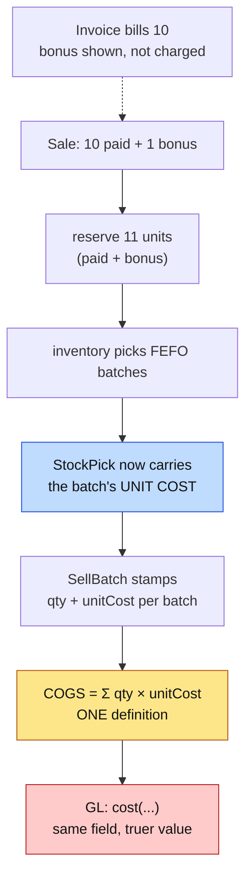

# P3 — customer bonus, and COGS from the goods that actually left

**Status:** DESIGN + CYPRESS CASES — implementation not started.
**Parent:** `bonus-schemes.md` (P1 + P2 shipped green 2026-08-31).
**Books risk:** HIGH — this changes reported margin on **every** sale, not only bonus ones.

> **Money follows the invoice. Stock follows physical movement. Cost follows the goods.**
> P1 and P2 delivered the first two. P3 delivers the third.

---

## 1. Decisions taken

| # | Decision | Who |
|---|---|---|
| **P3-D1** | **COGS is derived from the batches actually consumed**, not from a per-line rate snapshot. | user, overruling the smaller option |
| **P3-D2** | **Same-SKU bonus only.** A different reward SKU needs its own sale line and becomes **P3b**. | default, flagged |
| **P3-D3** | **Build behind the `bonusSchemes` capability now**; the U11 stock-count cutover is a per-tenant enablement step, not a blocker on the code. | default, flagged |

### Why P3-D1 is the better choice, on inspection

It was recommended against as too broad. It is broader — and it is also **simpler**, which only became clear once the call sites were counted.

COGS is currently `costPrice × quantity`, written out **five times**:

```
SagaSellService:253    new sale
SagaSellService:360    (second path)
SellController:1298    edit repost
SellController:1574    sale return
RepossessionService:247 repossession
```

`quantity` excludes bonus, so the smaller option meant editing a money formula in five places and keeping them in step forever. Deriving COGS from consumed batches instead means **the bonus needs no special case at all**: the reservation covers paid + bonus, the batches record what left, and the cost follows. Zero edits to five formulas, because there is one formula.

`SagaLine.costPrice` is documented as *"unit COGS snapshot (latest purchase rate)"* — an approximation that P2 has now made unnecessary, since a batch knows exactly what was paid for it.

---

## 2. Standards this slice is built to

| Standard | How it applies |
|---|---|
| **Accounting** | COGS is the cost of the goods that left, taken from the batches FEFO actually consumed — not a proxy rate. A bonus unit has zero revenue and a real cost. |
| **Money allocation** | `paidTotal × consumed / batchQuantity`. The total is **ALLOCATED, never derived by rounding a proportion** — the rule P2 already follows, applied on the way out. |
| **Stamp at write** | The batch cost is stamped onto the sale when it is written, from the reservation that picked it. Never re-derived on read: a later purchase must not change last month's margin. |
| **DRY / SOLID** | ONE COGS definition, extracted. Five copies of a money formula is the defect this slice removes, not a shape it should preserve. |
| **Microservice boundaries** | Inventory owns batch cost and reports it on the reservation it already returns. No new call, no cross-service lookup on the sale path. |
| **Multi-tenancy** | Unchanged — the reservation is already tenant-scoped. |
| **GL** | No new `PostingEventRequest` field. `cost` exists; only its value changes. The trial balance is gated because that value moving is the point. |
| **Testing** | Cypress cases written **before** implementation. Each names the regression it guards. |

---

## 3. Design



Blue is the new data on an existing message. Amber is the extraction. Red moves the books.

### 3.1 The reservation reports what it picked, and what it cost

`ReservationService:336` already builds `StockPick(productId, batchNo, quantity, expiryDate)` from the batch
it reserved. That batch knows its cost. Adding `unitCost` to the pick is the same move P2 made with
`paidTotal`: **the side that knows the number says it, once, at the moment it is true.**

`unitCost` = `paidTotal / quantity` where the batch has a paid total (post-P2 batches), else `purchasePrice`
(pre-P2 batches, where that identity holds because no bonus was involved).

### 3.2 The sale stamps it

`SellBatch` gains `unit_cost`. `SagaSaleWriter.recordBatches` already persists the picks; it now persists the
cost with them. **Stamped, never re-derived** — a purchase next week must not change last week's margin.

### 3.3 One COGS definition

A single `SaleCosting.cogsFor(...)` replaces the five inline copies. Falls back to
`costPrice × quantity` when a sale has no recorded batches — every sale written before this slice — so
historical reposts and edits keep producing the number they always produced.

### 3.4 Bonus needs no special case

The reservation covers paid + bonus, so the batches cover paid + bonus, so COGS covers paid + bonus. The only
bonus-specific change on the sale path is **including the bonus in the reservation** (`SagaSellService:155`).

---

## 4. What changes for a shop, in numbers

A 10 + 1 sale of goods bought at 5,000 for 11 units:

| | Before P3 | After P3 |
|---|---|---|
| Units reserved | 10 | **11** |
| Stock decremented | 10 | **11** |
| COGS | 10 × latest purchase rate | **11 × allocated batch cost** |
| Revenue | 10 units' price | unchanged |
| Reported margin | overstated | **true** |

Margin falls. That is the correction, not a regression — and it is why this ships behind a capability with a
recorded cutover date.

---

## 5. Rollout

Unchanged from the parent §6: before enabling for a tenant, run the **U11 stock count**, post the variance as
an adjustment reasoned *"historical bonus-sale stock variance correction"*, record the cutover date, then
switch the capability on. A tenant with no prior bonus activity needs no remediation but still sees the COGS
basis change — so finance sign-off is per tenant, not per feature.

---

## 6. Cypress cases (written first)

`cypress/e2e/business/bonus-schemes-p3.cy.js`

1. **A bonus sale reserves paid + bonus** — 11 held, not 10.
2. **Stock falls by 11** — the phantom-stock defect, closed.
3. **COGS covers all 11 units** — asserted on the posting, not on a screen.
4. **COGS uses the BATCH cost, not the latest purchase rate** — buy at two different rates, sell across both,
   and assert the blended figure. This is the case that distinguishes P3-D1 from the option not taken.
5. **A sale with no bonus still prices and posts as before** — the no-regression case that matters most,
   because P3 touches every sale.
6. **A sale whose batches predate the change falls back cleanly** — historical edits and returns must keep
   producing their original numbers.
7. **Short stock reduces the bonus, never blocks the paid line** (D11, and the #23 interaction).
8. **The trial balance still balances** after a bonus sale.
9. **Without the capability, no bonus is added** — asserted on the envelope.
