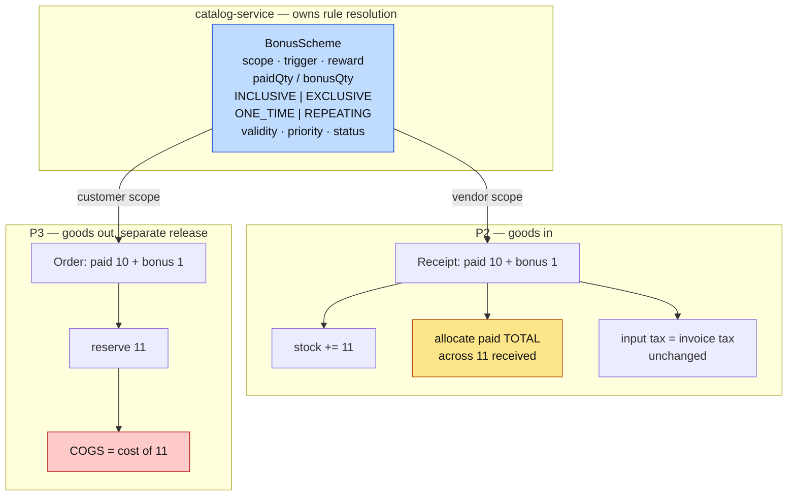

# Bonus / free-goods schemes (task #17)

**Status:** **P1 + P2 SHIPPED AND GREEN** (2026-08-31) — `bonus-schemes-p1.cy.js` 9/9, `bonus-schemes-p2.cy.js` 7/7. P3/P4 not started.
**Scope of this document:** P1 (scheme master) and P2 (supplier bonus at goods-in). P3/P4 outlined only.
**Branch:** `feature/pack-loose-selling`.

> **The principle everything below follows:**
> **Money follows the invoice. Stock follows physical movement. Cost follows the goods.**

---

## 1. Problem

Three asks, one mechanism: bonus offers **from suppliers**, bonus offers **to customers**, and capturing the
bonus **actually received** on a purchase.

### 1a. The defect this uncovered

`SagaSellService:155` builds the stock reservation from `l.quantity()` alone; `Sell.bonusQuantity` never
reaches it. Bonus goods leaving the shop are **never decremented from stock**.

That was a documented decision (`b2b-P3g` **D-2**: bonus ships "presentation-only"), but its consequence was
not followed through. A distributor billing 1,000 units/month under a 10+1 scheme ships 1,100 and decrements
1,000: **100 phantom units per month**, compounding, feeding the #20 stock-value tile and causing false
"insufficient stock" refusals.

**D-2 is superseded for physical bonus goods.** Correcting it is P3, separated because it changes COGS.

### 1b. Standards this slice is built to

| Standard | How it applies here |
|---|---|
| **Business/domain** | Free goods are **inclusive** or **exclusive** (SAP's distinction, and how FMCG/pharma distribution actually trades). Without the flag, "10+1" cannot be interpreted for stock, invoice, cost or tax. |
| **Accounting (IAS 2)** | Inventory cost is the cost of bringing goods into stock, spread over the units **received**. 11 received for 5,000 means the 5,000 is allocated across 11, not 10. |
| **Money allocation** | A total is **ALLOCATED, never derived by rounding a proportion** (the installments rule). See §4 — the most error-prone part of this slice. |
| **Multi-tenancy** | Scheme reads use `findScoped` with the NULL-org fallback; anti-IDOR on every by-id read; tenant A's scheme can never resolve for tenant B. |
| **Microservice boundaries** | No new service. Schemes extend the **existing price-rule engine** in catalog-service, which already owns rule resolution. `vendorId` is stored as an opaque id — the precedent `customerId` already sets there, while `Customer` lives in business-service. |
| **Design patterns** | **Specification** (a scheme is a predicate over a line) + **Strategy** (inclusive / exclusive / different-SKU) + **resolution by specificity and priority**, exactly as `PriceResolver` resolves prices today. |
| **DRY / SOLID** | One engine, three scopes. Not three features. |
| **Capability** | `bonusSchemes` — camelCase like `batchTracking` / `dealerPricing` / `installments`. One capability for one engine. |
| **Testing** | Cypress cases written **before** implementation (cadence, 2026-08-30). Each case names the regression it guards. |

---

## 2. Decisions (user-approved)

| # | Decision |
|---|---|
| D1 | **One engine**, extending the price-rule model. Not separate supplier/customer features. |
| D2 | **Inclusive vs exclusive is mandatory** on every scheme. |
| D3 | **Reward SKU supported** — the reward may be a different product, so a bare `bonusQuantity` number is insufficient. |
| D4 | **Purchase:** add paid + bonus to stock; allocate the paid total across all received units. |
| D5 | **Sale (P3):** deduct every physically issued unit; COGS covers them all. |
| D6 | **Tax default = the product's normal tax rule**, tenant-overridable. "No tax" must be an explicit choice, never an unreviewed assumption. |
| D7 | **Partial return: claw back the bonus proportionally.** Entitlement is recomputed from the retained paid quantity. If the bonus cannot be physically returned, the normal return is BLOCKED and only an authorised recovery adjustment may proceed, with a mandatory reason and an audit record. |
| D8 | **Goods-in tax: take the supplier invoice tax exactly as invoiced.** A zero-price bonus unit generates no additional input tax. Never compute tax the supplier's document does not show. |
| D9 | **Qualification mode is a field from P1**: `ONE_TIME` threshold vs `REPEATING` blocks — otherwise partial-return entitlement is ambiguous. |
| D10 | **Auto-apply, visibly, with authorised override.** Removing an applied bonus requires a reason and is audited. |
| D11 | **Short stock reduces the BONUS, never blocks the PAID line** — see §5. |

---

## 3. Model

Blue is the new master. Amber is the arithmetic to get exactly right. Red moves the books (P3).

---

## 4. Cost allocation — the schema cannot store what the obvious design assumes

`StockImportLine` carries `quantity`, `purchasePrice`, `costPrice` — **all per-unit**. `StockEntry` stores
`purchasePrice` per batch; `StockLevel` stores one `costPrice` per product. **There is no per-unit cost
anywhere**, so "first 10 units at 454.54, the last at 454.60" is not representable.

That is fortunate, because pre-rounding is wrong anyway:

| Method | COGS on consuming 6 of an 11-unit batch costing 5,000 |
|---|---|
| Pre-rounded unit cost × 6 | 6 × 454.54 = **2,727.24** |
| Allocated from the total | 5,000 × 6/11 = **2,727.27** |

Consume the other 5 and the pre-rounded batch closes having expensed **4,999.94 of a 5,000 purchase** — six
paisa belonging to nothing. Trivial in size, unreconcilable in kind.

**Design:** carry the **paid total** and the **received quantity** into inventory, derive per-unit only for
display, and allocate at the moment of consumption.

**Warning:** this needs `paidTotal` added to `StockImportLine` **and** persisted on `StockEntry`. Like the GL
outbox, a new contract field that is not populated AND read at every hop simply vanishes — the write, the
contract, the entity, the migration and the consumer all belong in the same change.

---

## 5. Short stock: reduce the bonus, never block the paid line

Required stock for an exclusive scheme is `paid + bonus`. When that cannot be met:

> **The bonus is reduced or omitted. The paid line always proceeds.**

The paid units are physically on the counter; refusing them is the #23 defect again. The bonus is a
system-generated addition and may be withheld — but the screen must say so, never silently drop it.

---

## 6. Historical variance — a rollout control, not a code change

Tenants who used the `Bon.` column already carry a stock overstatement (§1a). Enabling P3 surfaces it, and
users will believe the feature caused it.

**Before P3 is enabled for a tenant:** run the existing **U11 stock count**, post the approved variance as a
stock adjustment with reason "historical bonus-sale stock variance correction", record a cutover date, and
only then switch the capability on. A tenant with no prior bonus activity needs no remediation.

---

## 7. Phases

| Phase | Scope | Books risk |
|---|---|---|
| **P1** | Scheme master + management screen + capability. **Ships with its screen** — a master nothing applies would be the eighth unreachable feature in this codebase. | none |
| **P2** | Supplier bonus at goods-in: received quantity, exact allocation, invoice tax as-is | none (values unchanged) |
| **P3** | Customer bonus: reservation, COGS, invoice line, the D-2 correction | **changes the books** — separate release plus finance sign-off |
| **P4** | Tax policy configuration + bonus reporting | reporting |

P1 + P2 is the first releasable unit.

---

## 8. Cypress cases — written BEFORE implementation

`cypress/e2e/business/bonus-schemes-p1.cy.js` and `bonus-schemes-p2.cy.js`. Each case names the regression it
guards; every refusal is asserted on the **envelope**, never the HTTP status, because this stack answers a
refusal with HTTP 200 and `success:false` / `status:"ERROR"`.

Run as the **distribution tenant** (`owner.marketplace@`, GATE-RUNBOOK rule 1) with the privilege ladder, and
with a cross-tenant case proving a scheme never leaks.
