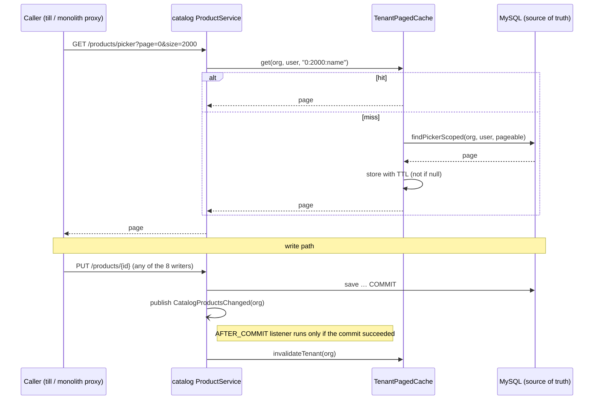
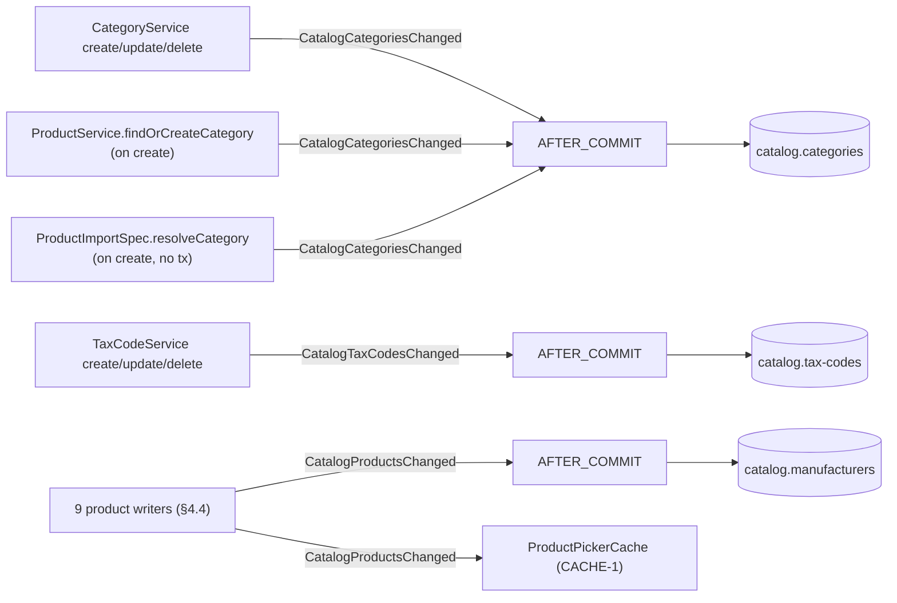

# CACHE-1 — tenant-scoped, paginated cache-aside for safe read data

**Status 2026-09-15:** ✅ consented (build CACHE-1; in-process Caffeine now, Redis later; TTL 300 s; add the
standard — done as SAAS-BUILD-STANDARDS §1d). **Implemented; unit tests GREEN 38/38** (`mvn -pl
common-web,catalog-service -am test`: TenantPagedCacheTest 9, ProductPickerCacheTest 7, ProductPickerWritersTest 14,
ProductNameCheckTest 8). **✅ GATED GREEN 7/7 — `catalog-cache-aside.cy.js`, headed, solo, 2026-09-15 14:31-14:32**
on the user's rebuild (catalog 14:22:55, monolith 14:22:59; the `cache.gets{cache=catalog.picker}` metric verified live
first). First run was 6/7: case 6's `cy.exec` could not start — Git Bash's `$SHELL` is a path with a space
(`C:\Program Files\Git\…`, exit 127) — a harness fault, fixed by running Cypress with SHELL unset (header note added).
Same build: `picker-prefetch` 4/4, `sale-picker-chain` 4/4, `sale-picker-speed` 8/8. Not committed.
Deviation from §4.2 as first written: the key also carries a per-tenant **generation**, so a read that loaded old
rows just before a write committed cannot store them after that write's eviction (TenantPagedCacheTest "THE RACE").

## 1. The rule (the user, 2026-09-15)

> Use lazy, tenant-scoped, paginated cache-aside caching for safe read data. Keep MySQL as the source of truth.
> On update, commit to MySQL first, then invalidate or refresh the affected cache only after a successful commit.

- **Read:** check the cache → on a miss read MySQL → put the result in the cache **with a TTL** → return it.
- **Write:** commit to MySQL → **after a successful commit** invalidate the affected entries. On a rollback, nothing.
- MySQL is the only source of truth. The cache is disposable: flushing it loses nothing.

## 2. What already exists (reviewed 2026-09-15, counts checked)

| Thing | State | Keep / change |
|---|---|---|
| `common-web` `TenantCache<V>` | Caffeine, `org → V` (ONE value per tenant), TTL + size bound; used by `PeriodLockGuard`, `CheckoutService.taxPolicy` | keep; its key cannot hold a page, so a paged sibling is added beside it |
| `SettingsService` (common-settings) | per-org override map, evicted on write, TTL backstop `app.settings.cache-ttl-seconds` | keep — the model this follows |
| `JpaEntitlementSource` (auth) | per-org, 60 s | keep |
| Spring `@Cacheable` | 1 use; **deliberately rejected** — proxy-based, a self-call bypasses it, "present, reviewed, and inert" | stays rejected |
| Hibernate 2nd-level cache | off — tenant-blind by default | stays off |
| Redis | api-gateway only (JWT checks, demo reset); local start-all runs **without** Redis | not used by this slice (see §7) |
| After-commit work | **9** `@TransactionalEventListener(AFTER_COMMIT)` (GL outbox, party bridge, audit, notify) | **reused** for eviction |
| Replicas | Terraform `desired_count = 1` for every service | in-process cache is consistent today |

## 3. What is SAFE to cache — and what is not

| Safe (master / reference data) | NOT cached (live, or money) |
|---|---|
| product picker pages `GET /api/catalog/products/picker` (id, name, sellingPrice, requiresSerial) | stock on hand, `productStock`, `productStockLevels` (inventory — live) |
| categories, tax codes, manufacturers (later slice) | `customerOptions` — carries **dueAmount / creditLimit** (money) |
| product refs for other services (later slice) | sales, purchases, payments, ledgers, dues, reports |

`/getUserSell` and `/getUserProduct` stay uncached on purpose (performance analysis §"What I would NOT add"): they
are slow for reasons a cache would only hide.

## 4. Design

### 4.1 The key — tenant AND user, then the page

Every catalog read is scoped `organizationId = :orgId OR (organizationId IS NULL AND userId = :userId)`
(`ProductRepository.SCOPE`, same in `CategoryRepository`, `TaxCodeRepository`). A key of org alone would let user A's
legacy no-org rows answer for user B. **Verified 2026-09-15: 0 no-org rows** in every `myplusdb_catalog` table
(products 5,889 · categories 99 · tax_code 20 · 4 others) — but production is not verified, so the key carries the
user too and is correct whatever the data holds:

```
(orgId, userId, page, size, sort)        null orgId → never cached (same rule as TenantCache)
```

### 4.2 The component — `TenantPagedCache<V>` in common-web, beside `TenantCache`

- Caffeine, `expireAfterWrite(ttl)` + `maximumSize` (W-TinyLFU, so one big tenant cannot evict every small one),
  `recordStats()` exposed through Micrometer (catalog already has actuator) — the proof that it **fires**.
- `get(org, user, pageKey, loader)` — a null result is not cached (a failed read is retried, not remembered).
- `invalidateTenant(org)` — drops every page of that org, every user. Exact, not TTL-based.
- TTL = **backstop only** (`app.cache.catalog-picker.ttl-seconds`, default 300, constructor-injected; `0` = off
  for diagnosis, negative = default — the `SettingsService` rules).

### 4.3 Eviction — only after a successful commit

Writers publish `CatalogProductsChanged(orgId)`; one listener evicts:

```java
@TransactionalEventListener(phase = TransactionPhase.AFTER_COMMIT, fallbackExecution = true)
void evict(CatalogProductsChanged e) { pickerCache.invalidateTenant(e.orgId()); }
```

- In a transaction → runs **after commit**; on rollback it never runs.
- `fallbackExecution = true` covers the one writer with no surrounding transaction: CSV import
  (`ImportEngine.commit` → `ProductImportSpec.persist` → `saveAll`, which commits itself) — the event is published
  after `saveAll` returned, i.e. after its commit. Same pattern as `AuditEmitter:161`.



### 4.4 Every WRITER of the cached data (RULE 0 — 9 write sites in 4 classes, found by the repository's TYPE)

⚠ The first pass searched by field name and listed 8; `ProductPolicyAdminController` names its repository `products`,
and its bulk `clearTrackingFlags` (row 9) clears `requiresSerial` — a field the cached picker rows carry. Caught by the
peer session's BLK-4 writer recount.

| # | Writer | Transaction | Trigger |
|---|---|---|---|
| 1 | `ProductService.create` | `@Transactional` | New product, PUR-INLINE |
| 2 | `ProductService.update` | `@Transactional` | Edit product |
| 3 | `ProductService.setActive` | `@Transactional` | Activate / deactivate (PROD-DEL's deactivate) |
| 4 | `ProductService.updatePrice` | `@Transactional` | **purchase** — business `PurchaseService:570` → `PUT /products/{id}/price` |
| 5 | `ProductService.updateClinicalFlags` | `@Transactional` | pharma flags |
| 6 | `ProductService.updateTrackingFlags` | `@Transactional` | serial / batch flags |
| 7 | `ProductDeletionWriter.delete` | `@Transactional` (own bean) | PROD-DEL permanent delete |
| 8 | `ProductImportSpec.persist` | none — `saveAll` commits | CSV import |
| 9 | `ProductPolicyAdminController.clearTrackingFlags` | `@Transactional` | bulk clear of `requiresSerial` / `tracksBatch` (ONB-3); may be an operator acting on ANOTHER tenant — evicts THAT org |

A **sale does not write** a catalog product (verified: the only price/rate setter is `updatePrice`, called only by
the purchase path), so a busy till does not churn the cache.

## 5. Slices

| Slice | Scope | Gate |
|---|---|---|
| **CACHE-1** (this) | `TenantPagedCache` + after-commit eviction; catalog **product picker** only | unit + Cypress below |
| CACHE-2 | categories, tax codes, manufacturers — `CatalogRefsCache`, 9 publish-or-covered write sites + the 9 product writers (§8) | §8.3 — unit written; Cypress pending the catalog rebuild |
| CACHE-3 | `GET /products/refs` for other services (cached in catalog, the owner) | own gate |
| later | Redis broadcast of evictions — only when a service runs > 1 replica | — |

## 6. Gate for CACHE-1

**Unit (`mvn test`):** `TenantPagedCacheTest` — two orgs never share a page; two users of one org do not share;
`invalidateTenant(A)` leaves B intact; null org not cached; null loader result not cached; size bound real.
Catalog: each of the 8 writers publishes the event; the listener evicts after commit and **not on rollback**.

> ⚠ **Correction (2026-09-15, found during CACHE-2).** The "38/38" recorded for this gate was CACHE-1's OWN new tests,
> not the module's — catalog-service then held 86. The module was NOT green: `ProductImportSpecTest` (in the tree since
> `fb6bde1e`, 08-20) was **8/17 in ERROR** from an NPE on the `events` field this slice added to `ProductImportSpec`
> (`25304ae2`, 09-15) — it builds the spec by reflection and never set the new field. So CACHE-1 was committed with that
> class red, and stayed red until CACHE-2's first full run. Fixed in the test (a mocked publisher): the module is now
> **112/112**. A slice is green when `mvn -pl <service> -am test` is green, and THAT is the count to record.

**Cypress (headed, solo) `catalog-cache-aside.cy.js`:**
1. A product created by org A is in A's **next** picker read, never in org B's.
2. A purchase that changes the price → the next picker read shows the new price.
3. Deactivate → gone from the next picker read; reactivate → back.
4. CSV import of a new product → in the next picker read (the no-transaction writer).
5. The cache **fires**: `cache.gets{result=hit}` for the picker cache rises on a repeat read (actuator metric).

**Regressions:** product-picker, picker-prefetch, product-crud, product-permanent-delete, purchase, csv import,
pos-keyboard, pos-enter-chain.

## 7. Decisions for the user

1. **In-process now, Redis later?** Correct today at `desired_count = 1`; a second replica would serve stale pages
   for up to the TTL. Recommended: in-process now + Redis eviction broadcast when a service scales out (Redis is in
   compose already; local start-all has none, so it must stay optional).
2. **TTL backstop:** 300 s proposed.
3. **Standard:** add §"Caching" to `SAAS-BUILD-STANDARDS.md` stating the rule and §3's safe / not-safe table.

Deploy: `mvn install` common-web, then build catalog-service (a stale `~/.m2` common-web jar would run the old code).

## 8. CACHE-2 — categories, tax codes, manufacturers (chosen by the user 2026-09-15)

### 8.1 Review (RULE 0 — reviewed at HEAD `ae4be750`, counts checked)

**Readers — the endpoints (5 GETs):**

| Endpoint | Service → query | Callers (verified by grep) | Cached |
|---|---|---|---|
| `GET /api/catalog/categories` | `CategoryService.getAll` → `findScoped` | monolith `/getUserCategories` ← `catalog-products.js` `loadCategories` (Product form open, edit, and **after an inline quick-add**), `business.js:1418` (price-rule form) | ✅ |
| `GET /api/catalog/tax-codes` | `TaxCodeService.list` → `findScoped` | monolith `/catalogTaxCodes` ← `catalog-products.js` `loadTaxCodes` (Product form), `business.js` `loadTaxCodesAdmin` (Tax Codes screen) | ✅ |
| `GET /api/catalog/products/manufacturers` | `ProductService.manufacturers` → `findDistinctManufacturersScoped` (DISTINCT TRIM over the tenant's products — 6,017 products, 285 distinct) | monolith `/manufacturers` ← `catalog-products.js` | ✅ |
| `GET /api/catalog/categories/{id}` | `getById` | **0** callers outside catalog | no |
| `GET /api/catalog/categories/tree` | `getTree` — recursive, 1 + N queries | **0** callers | no — nothing reads it |

**Other readers of the same tables — NOT cached here, on purpose:**
- `TaxCodeRepository.findByOrganizationId` in `ProductService.orgCodeRates` — feeds `/products/refs` and
  `/products/lookup`, i.e. the SALE path's tax rate. That is CACHE-3's decision, not this slice's.
- `TaxCodeService.ratesByOrg` — **0 callers** (dead; left alone).
- `GET /products/category-counts` (the dashboard card) — a count, report-shaped (K5), and not in the chosen scope.
- `findByIdScoped` / `findByNameScoped` — write-path lookups.
- The CACHE-1 picker projection is `(id, name, sellingPrice, requiresSerial)` — no category or tax column, so category
  and tax-code writes need not evict the picker.

**Writers (K4 — by the repository's TYPE, any field name):**

| # | Writer | Field | Transaction | Publishes |
|---|---|---|---|---|
| C1 | `CategoryService.create` | `categoryRepository` | `@Transactional` | `CatalogCategoriesChanged` |
| C2 | `CategoryService.update` | 〃 | `@Transactional` | 〃 |
| C3 | `CategoryService.delete` | 〃 | `@Transactional` | 〃 — a category still on a product fails the FK (`products.category_id`, RESTRICT) at commit → rollback → no eviction |
| C4 | `ProductService.findOrCreateCategory` (Product form's free-text category, inside create/update) | 〃 | the product's | 〃, **only when it creates** |
| C5 | `ProductImportSpec.resolveCategory` (CSV import) | 〃 | **none** — `ImportController.commit` / `ImportEngine.commit` have none; `save` commits itself | 〃, only when it creates; `fallbackExecution` evicts at once |
| T1 | `TaxCodeService.create` | `repo` | `@Transactional` | `CatalogTaxCodesChanged` |
| T2 | `TaxCodeService.update` | 〃 | `@Transactional` | 〃 |
| T3 | `TaxCodeService.delete` | 〃 | `@Transactional` | 〃 |
| T4 | `TaxCodeService.apply` — clears `isDefault` on this org's other codes | 〃 | inside T1/T2 | covered by T1/T2 (same transaction, same org) |
| M | the 9 product writers (§4.4) — manufacturers have no table | `productRepository` etc. | — | `CatalogProductsChanged` (already, CACHE-1) |

`TaxCodeRepository`'s other field (`ProductService.taxCodeRepository`) only reads. Also checked: no `@Modifying`, native or
JDBC write to either table in catalog-service; no SQL write to `categories` / `tax_code` anywhere else in the repo
(the `myplusdb_inventory.categories` table is a different service's); no demo-reset path in catalog.

### 8.2 Design

One component, `CatalogRefsCache`, holding **three** `TenantPagedCache`s — `catalog.categories`, `catalog.tax-codes`,
`catalog.manufacturers` — each keyed `(org, user, "all")` (the lists are read whole). Three rather than one keyed by
kind, so a product save — every purchase stamps a price — empties only the manufacturers list.



- TTL backstop `app.cache.catalog-refs.ttl-seconds` (default 300; `0` = off; negative = default), 2,000 entries per
  cache, `recordStats()` bound to Micrometer under the three names.
- The cached lists are shared between requests: loaders return unmodifiable lists (`toList()`, `List.copyOf`); the
  DTOs inside are Lombok `@Data`, and today's only callers (the three controllers) just serialise them.

**Benefit — stated honestly, unmeasured.** Categories (99 rows, 10 orgs) and tax codes (20 rows, 1 org) are one indexed
query each; the saving per read is small. What it buys is the Product form, which fires all three on every open, and
the manufacturers DISTINCT, the heaviest of the three.

### 8.3 Gate for CACHE-2

**Unit (`mvn test`):** `CatalogRefsCacheTest` (11) — after commit only, not on rollback, no-tx evicts at once, each event
empties ONLY its own list, per tenant, user in the key, null org uncached, TTL 0 off, hits counted per name.
`CatalogRefsWritersTest` (15) — C1–C5 and T1–T4 publish (and the refusals and find-existing paths do not); the three
reads go through the cache with the caller's tenant and user.

**Cypress (headed, solo) `catalog-refs-cache.cy.js`** — every invalidation case WARMS first (K6):
1. Category quick-add, rename and delete each show in the next `/getUserCategories`.
2. A product saved with a new free-text category → that category is in the next read (C4).
3. A CSV import naming a new category → in the next read (C5).
4. Tax code create, rate edit and delete each show in the next `/catalogTaxCodes` (leaves no row).
5. A product with a new manufacturer → in the next `/manufacturers`; permanently deleted → gone.
6. Org B (owner.pharma, gateway) never sees org A's new category, tax code or manufacturer — read twice.
7. All three caches FIRE (`cache.gets{result=hit}` rises on a repeat read).
8. REAL UI: an inline quick-add on the Product form selects the new category — the exact path a stale list would
   break silently (`.val(id)` on a missing option selects nothing, and the product saves uncategorised).

Cleanup: tax codes through the monolith; products through `/removeProducts` twice (deactivate, then permanent);
categories through the gateway as `admin.business@` (org A, ADMIN, has `DELETE_PRIVILEGE` — never a second
owner session).

**Regressions** (the specs that read or write these lists): `catalog-cache-aside`, `product-crud`, `product-import`,
`product-manufacturer`, `multi-rate-tax`, `price-rules-screen`.

**Found while testing (2026-09-15):** the first full `mvn -pl catalog-service -am test` showed `ProductImportSpecTest`
8/17 in ERROR — an NPE on `events`. 7 of the 8 came from CACHE-1's publish in `persist()`: the test dates from 08-20
(`fb6bde1e`), builds the spec by reflection and never set the field CACHE-1 added (`25304ae2`, 09-15) — so CACHE-1 was
committed with it red. CACHE-1's recorded unit run was 38/38, fewer than the 86 tests the module then held, so it did not
cover the whole module. Fixed in the test (a mocked publisher); the full module is now 112/112. **Lesson: a slice's unit
gate is the whole module's `mvn test`, not the classes it added.**
