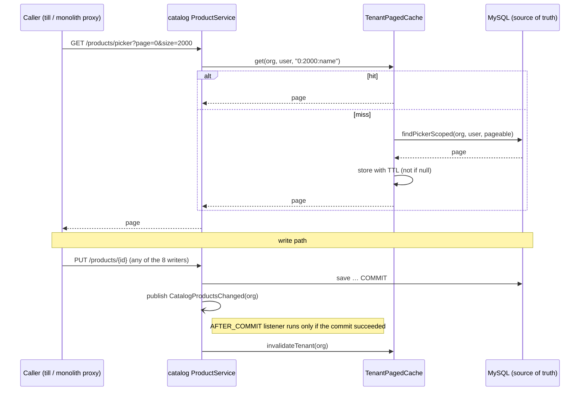

# CACHE-1 — tenant-scoped, paginated cache-aside for safe read data

**Status 2026-09-15:** ✅ consented (build CACHE-1; in-process Caffeine now, Redis later; TTL 300 s; add the
standard — done as SAAS-BUILD-STANDARDS §1d). **Implemented; unit tests GREEN 38/38** (`mvn -pl
common-web,catalog-service -am test`: TenantPagedCacheTest 9, ProductPickerCacheTest 7, ProductPickerWritersTest 14,
ProductNameCheckTest 8). **✅ GATED GREEN 7/7 — `catalog-cache-aside.cy.js`, headed, solo, 2026-09-15 14:31-14:32**
on the user's rebuild (catalog 14:22:55, monolith 14:22:59; the `cache.gets{cache=catalog.picker}` metric verified live
first). First run was 6/7: case 6's `cy.exec` could not start — Git Bash's `$SHELL` is a path with a space
(`C:\Program Files\Git\…`, exit 127) — a harness fault, fixed by running Cypress with SHELL unset (header note added).
Same build: `picker-prefetch` 4/4, `sale-picker-chain` 4/4, `sale-picker-speed` 8/8. Not committed.
Deviation from §4.2 as first written: the key also carries a per-tenant **generation**, so a read that loaded old
rows just before a write committed cannot store them after that write's eviction (TenantPagedCacheTest "THE RACE").

## 1. The rule (the user, 2026-09-15)

> Use lazy, tenant-scoped, paginated cache-aside caching for safe read data. Keep MySQL as the source of truth.
> On update, commit to MySQL first, then invalidate or refresh the affected cache only after a successful commit.

- **Read:** check the cache → on a miss read MySQL → put the result in the cache **with a TTL** → return it.
- **Write:** commit to MySQL → **after a successful commit** invalidate the affected entries. On a rollback, nothing.
- MySQL is the only source of truth. The cache is disposable: flushing it loses nothing.

## 2. What already exists (reviewed 2026-09-15, counts checked)

| Thing | State | Keep / change |
|---|---|---|
| `common-web` `TenantCache<V>` | Caffeine, `org → V` (ONE value per tenant), TTL + size bound; used by `PeriodLockGuard`, `CheckoutService.taxPolicy` | keep; its key cannot hold a page, so a paged sibling is added beside it |
| `SettingsService` (common-settings) | per-org override map, evicted on write, TTL backstop `app.settings.cache-ttl-seconds` | keep — the model this follows |
| `JpaEntitlementSource` (auth) | per-org, 60 s | keep |
| Spring `@Cacheable` | 1 use; **deliberately rejected** — proxy-based, a self-call bypasses it, "present, reviewed, and inert" | stays rejected |
| Hibernate 2nd-level cache | off — tenant-blind by default | stays off |
| Redis | api-gateway only (JWT checks, demo reset); local start-all runs **without** Redis | not used by this slice (see §7) |
| After-commit work | **9** `@TransactionalEventListener(AFTER_COMMIT)` (GL outbox, party bridge, audit, notify) | **reused** for eviction |
| Replicas | Terraform `desired_count = 1` for every service | in-process cache is consistent today |

## 3. What is SAFE to cache — and what is not

| Safe (master / reference data) | NOT cached (live, or money) |
|---|---|
| product picker pages `GET /api/catalog/products/picker` (id, name, sellingPrice, requiresSerial) | stock on hand, `productStock`, `productStockLevels` (inventory — live) |
| categories, tax codes, manufacturers (later slice) | `customerOptions` — carries **dueAmount / creditLimit** (money) |
| product refs for other services (later slice) | sales, purchases, payments, ledgers, dues, reports |

`/getUserSell` and `/getUserProduct` stay uncached on purpose (performance analysis §"What I would NOT add"): they
are slow for reasons a cache would only hide.

## 4. Design

### 4.1 The key — tenant AND user, then the page

Every catalog read is scoped `organizationId = :orgId OR (organizationId IS NULL AND userId = :userId)`
(`ProductRepository.SCOPE`, same in `CategoryRepository`, `TaxCodeRepository`). A key of org alone would let user A's
legacy no-org rows answer for user B. **Verified 2026-09-15: 0 no-org rows** in every `myplusdb_catalog` table
(products 5,889 · categories 99 · tax_code 20 · 4 others) — but production is not verified, so the key carries the
user too and is correct whatever the data holds:

```
(orgId, userId, page, size, sort)        null orgId → never cached (same rule as TenantCache)
```

### 4.2 The component — `TenantPagedCache<V>` in common-web, beside `TenantCache`

- Caffeine, `expireAfterWrite(ttl)` + `maximumSize` (W-TinyLFU, so one big tenant cannot evict every small one),
  `recordStats()` exposed through Micrometer (catalog already has actuator) — the proof that it **fires**.
- `get(org, user, pageKey, loader)` — a null result is not cached (a failed read is retried, not remembered).
- `invalidateTenant(org)` — drops every page of that org, every user. Exact, not TTL-based.
- TTL = **backstop only** (`app.cache.catalog-picker.ttl-seconds`, default 300, constructor-injected; `0` = off
  for diagnosis, negative = default — the `SettingsService` rules).

### 4.3 Eviction — only after a successful commit

Writers publish `CatalogProductsChanged(orgId)`; one listener evicts:

```java
@TransactionalEventListener(phase = TransactionPhase.AFTER_COMMIT, fallbackExecution = true)
void evict(CatalogProductsChanged e) { pickerCache.invalidateTenant(e.orgId()); }
```

- In a transaction → runs **after commit**; on rollback it never runs.
- `fallbackExecution = true` covers the one writer with no surrounding transaction: CSV import
  (`ImportEngine.commit` → `ProductImportSpec.persist` → `saveAll`, which commits itself) — the event is published
  after `saveAll` returned, i.e. after its commit. Same pattern as `AuditEmitter:161`.



### 4.4 Every WRITER of the cached data (RULE 0 — 9 write sites in 4 classes, found by the repository's TYPE)

⚠ The first pass searched by field name and listed 8; `ProductPolicyAdminController` names its repository `products`,
and its bulk `clearTrackingFlags` (row 9) clears `requiresSerial` — a field the cached picker rows carry. Caught by the
peer session's BLK-4 writer recount.

| # | Writer | Transaction | Trigger |
|---|---|---|---|
| 1 | `ProductService.create` | `@Transactional` | New product, PUR-INLINE |
| 2 | `ProductService.update` | `@Transactional` | Edit product |
| 3 | `ProductService.setActive` | `@Transactional` | Activate / deactivate (PROD-DEL's deactivate) |
| 4 | `ProductService.updatePrice` | `@Transactional` | **purchase** — business `PurchaseService:570` → `PUT /products/{id}/price` |
| 5 | `ProductService.updateClinicalFlags` | `@Transactional` | pharma flags |
| 6 | `ProductService.updateTrackingFlags` | `@Transactional` | serial / batch flags |
| 7 | `ProductDeletionWriter.delete` | `@Transactional` (own bean) | PROD-DEL permanent delete |
| 8 | `ProductImportSpec.persist` | none — `saveAll` commits | CSV import |
| 9 | `ProductPolicyAdminController.clearTrackingFlags` | `@Transactional` | bulk clear of `requiresSerial` / `tracksBatch` (ONB-3); may be an operator acting on ANOTHER tenant — evicts THAT org |

A **sale does not write** a catalog product (verified: the only price/rate setter is `updatePrice`, called only by
the purchase path), so a busy till does not churn the cache.

## 5. Slices

| Slice | Scope | Gate |
|---|---|---|
| **CACHE-1** (this) | `TenantPagedCache` + after-commit eviction; catalog **product picker** only | unit + Cypress below |
| CACHE-2 | categories, tax codes, manufacturers (same component; category auto-create in `ProductService:561` + import is a writer) | own gate |
| CACHE-3 | `GET /products/refs` for other services (cached in catalog, the owner) | own gate |
| later | Redis broadcast of evictions — only when a service runs > 1 replica | — |

## 6. Gate for CACHE-1

**Unit (`mvn test`):** `TenantPagedCacheTest` — two orgs never share a page; two users of one org do not share;
`invalidateTenant(A)` leaves B intact; null org not cached; null loader result not cached; size bound real.
Catalog: each of the 8 writers publishes the event; the listener evicts after commit and **not on rollback**.

**Cypress (headed, solo) `catalog-cache-aside.cy.js`:**
1. A product created by org A is in A's **next** picker read, never in org B's.
2. A purchase that changes the price → the next picker read shows the new price.
3. Deactivate → gone from the next picker read; reactivate → back.
4. CSV import of a new product → in the next picker read (the no-transaction writer).
5. The cache **fires**: `cache.gets{result=hit}` for the picker cache rises on a repeat read (actuator metric).

**Regressions:** product-picker, picker-prefetch, product-crud, product-permanent-delete, purchase, csv import,
pos-keyboard, pos-enter-chain.

## 7. Decisions for the user

1. **In-process now, Redis later?** Correct today at `desired_count = 1`; a second replica would serve stale pages
   for up to the TTL. Recommended: in-process now + Redis eviction broadcast when a service scales out (Redis is in
   compose already; local start-all has none, so it must stay optional).
2. **TTL backstop:** 300 s proposed.
3. **Standard:** add §"Caching" to `SAAS-BUILD-STANDARDS.md` stating the rule and §3's safe / not-safe table.

Deploy: `mvn install` common-web, then build catalog-service (a stale `~/.m2` common-web jar would run the old code).
