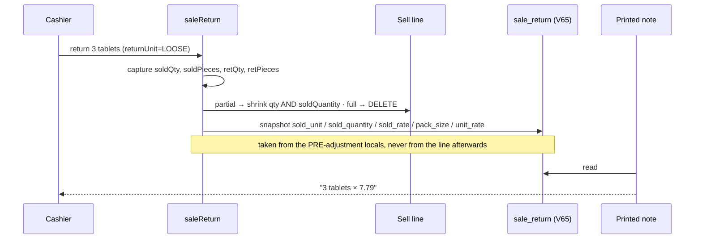

# CN-1 — the credit note prints what the customer bought, and still prints after a full return

**Status 2026-09-21: CN-1 DEPLOYED and GATED GREEN 4/4. ⚠ CN-1b (§2b) written and compiling, NOT deployed —
needs business-service rebuilt, and its gate case (2b) cannot pass until then.**

**Status 2026-09-17: BUILT, unit-green, NOT deployed and NOT gated.** Written under the build freeze while the
production survey runs. `CreditNoteSnapshotTest` 6/6 · `LooseReturnQuantityTest` 6/6 unaffected · business-service
compiles. Gate `cypress/e2e/business/credit-note-loose-units.cy.js` **written, deliberately not run** — V65 is not
applied to any database yet, so it cannot pass until business-service is rebuilt.

Raised by myplus-f9's pack/loose flow review (finding #1); the user asked for it directly.

## 1. What a customer was handed

A pharmacy sold 10 tablets from a box of 40 and took 3 back. The credit note printed:

```
0.075 × 311.60
```

Three tablets, described as seventy-five thousandths of a box at the price of a whole box. U13 converted the return
DIALOG and the sale GRID; the printed document — the only part the customer keeps — was never converted. Live in
dev: **CRN-000038, quantity 0.075**.

## 2. The second defect, found while tracing the first

`SellController.creditNote` resolves the line's rate as `sold != null ? sold.getSellRate() : null`, and a **full
return deletes the sell row** (`sellService.deleteById(dto.getSellId())`).

> **Every fully-returned credit note prints with no rate at all — pack sales included, not just loose ones.**

It is the commoner case of the two, and it was invisible because the register and the note share one mapper, so both
were wrong in the same way and agreed with each other.

## 2b. ⚠ CN-1b — the SAME defect had a third victim: the PARTY

Found 2026-09-21 by the survey, after CN-1 was already deployed and gated. `return-documents` and `returns-list`
failed with *"the note names a party: .empty was passed non-string primitive null"* and *"the party column carries a
NAME, not an id or a dash: expected '—'"*.

Same root cause, one step further: the party is resolved from the **Sell line** (`customerBySellId`, built from
`sellService.findAllById`), and a full return deletes that line. So a fully returned note had **no rate AND no
party**. V65 fixed the rate and stopped there — the review found one victim of the deleted row and missed the other
sitting beside it in the same method.

⚠ **This spec's own fixtures made it worse:** case 2 performs a full return, so the newest register row is often
one of ours, and both failing specs read the FIRST row.

**Fix:** resolve the party from the **invoice header**, which outlives its lines and already holds the customer —
batched in the register (one query per page, only for rows that need it), a single lookup for the printed note.
Resolved rather than snapshotted: the invoice number is already recorded on the return row, and adding a second
frozen copy of a name the invoice already owns buys nothing.

## 3. Why a snapshot, not a lookup

The customer's view (`soldUnit`, `soldQuantity`, `soldRate`, `packSizeSnapshot`) lives on the **Sell line**, and a
full return deletes that line. A print-time lookup therefore has nothing to read. A document must be reproducible
from its own row years later — the same reason `Sell.packSizeSnapshot` exists, and the same reason
`CustomerHistory.issuedTotal` is captured before a return re-settles the invoice.



## 4. What changed

| File | Change |
|---|---|
| `V65__sale_return_loose_snapshot.sql` | 5 nullable columns on `sale_return`, guarded ADD COLUMNs (the V35/V54 pattern), **no back-fill** |
| `SaleReturn.java` | the five fields |
| `SellController.saleReturn` | writes the snapshot **from the pre-adjustment locals** |
| `SellController.piecesReturned` | new package-private static — the inverse of U13's `packsForLooseReturn` |
| `SellController.toCreditNoteDto` | snapshot wins; the passed-in rate is the fallback; loose view + unit noun added |
| `ReturnDocumentDTO.Line` | `soldUnit`, `soldQuantity`, `soldRate`, `packSize`, `looseUnit`, `looseUnitPlural` |
| `receipt.js` `toInvoiceShape` | prints pieces and the per-piece rate |

**Three decisions worth keeping:**

1. **The snapshot is taken from local variables, not from `existingSell`.** By the time the return row is written, a
   partial return has already shrunk `soldQuantity` to what the customer KEEPS (U13) and a full return has deleted
   the row. Reading the line there would record the wrong pieces, or none.
2. **`receipt.js` receives pieces NUMERICALLY, not `looseQtyText`.** That column feeds `lineMath`
   (`quantity × sellRate`); a string like `"3 tablets"` does not throw — it silently produces `NaN` or concatenates,
   and the renderer prints whatever falls out. The loose fields ride alongside for any cell that wants the noun.
3. **The unit noun is NOT snapshotted.** `packSizeSnapshot` is frozen because it changes the arithmetic; the word
   "tablets" is not, so a shop correcting "tabs" → "tablets" sees the correction on a reprint while every number
   stays exactly as issued.

## 5. Checked, not assumed

- **A void writes no credit-note row.** `SaleVoidService` only *reads* `sale_return`, to refuse voiding an invoice
  that already has returns. So voided loose lines need no snapshot (f9's point 6).
- **`piecesReturned` round-trips against U13's `packsForLooseReturn`**, including the awkward pack: a box of 3, one
  tablet, stored as 0.3333 — a full return records 1 piece, not 0 and not 0.999.
- **Pre-V65 rows fall back to today's behaviour** — the shelf quantity and whatever rate the sell row can still
  supply. Never blank, never invented.

## 6. Gate (written, not run)

| # | Case | What the defect would break |
|---|---|---|
| 1 ⭐⭐ | 3 tablets returned → `soldQuantity 3`, per-piece rate, pack 40; shelf figure still 0.075 | the document a customer keeps |
| 2 ⭐⭐ | a **fully returned PACK** note still carries its rate | the commoner half, which is not about loose selling |
| 3 ⭐⭐ | the register and the single note agree field for field | one mapper serves both; a later edit could fix one |
| 4 ⭐ | a pre-V65 note still prints its shelf quantity, with no invented loose view | legacy rows rendering blank |

⚠ Case 4 calls `this.skip()` when no pre-V65 note exists (a fresh database), so it reports **pending**, not green —
a case that passes on a missing fixture proves nothing.

## 7. Not in this slice

- **`saleReport.csv`** writes `getQuantity()/getSellRate()` while the same report on screen shows tablets (f9's
  finding #2). Same root cause — a document that never adopted loose-format — and small. Held for the user's call.
- Sale report **Qty KPI** (#3) and **loose quotes** (#4) are myplus-f9's, U14.

## 8. Deploy

business-service (V65 applies on start) **and** the monolith (`receipt.js` is a static asset in the monolith jar).
Both, or the note gains its snapshot and keeps printing the old way.
