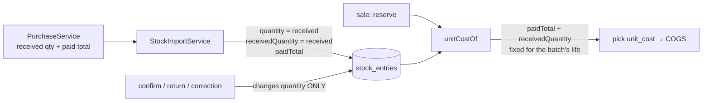

# COGS-1 — a batch costs the same per unit on every sale

**Status: BUILT, unit tests written — awaiting the inventory-service rebuild and the gate.** Raised 2026-09-16.
Scope and fix shape chosen by the user: *store the quantity a batch was received with*.

## 1. How it was found

The user asked for an end-to-end check that product registration (pack/loose), purchase and sale work "along with
finance update 100%". The gate `cypress/e2e/business/e2e-pack-purchase-sell-finance.cy.js` passed 5/5 twice —
Sales +300, Cash +300, Σdebit = Σcredit. Reading `myplusdb_finance.journal_lines` directly showed the cost side wrong:

| Journal | Posted | Correct |
|---|---|---|
| purchase, 10 packs | Dr Inventory 800 / Cr Cash 800 | ✓ |
| sale 1, 2 packs | Dr COGS **160** / Cr Inventory 160 | ✓ (2 × 80) |
| sale 2, 5 tablets (0.5 pack) | Dr COGS **50** / Cr Inventory 50 | **40** (0.5 × 80) |

⚠ **A balanced trial balance said nothing.** Both wrong legs sat in the same journal, so the books balanced to the
paisa while cost of goods was overstated and Inventory understated by the same amount. The gate had no COGS case.

## 2. The defect (verified in code and data)

`inventory-service` `ReservationService.unitCostOf`:

```java
return e.getPaidTotal().divide(e.getQuantity(), 6, HALF_UP);   // quantity = what is LEFT
```

`paidTotal` is what the whole batch cost and never changes; `quantity` is the batch's remaining stock and falls on
every confirmed sale. So each sale after the first was costed higher than the last. `StockEntry.paidTotal`'s own
comment always said the divisor was the batch's size ("`paidTotal x consumed / quantity`" at receipt).

Batch `E2EB…120`: `purchase_price` 80, `paid_total` 800 → pick 1 (10 left) **80.00**, pick 2 (8 left) **100.00**.

**Systemic, not a fixture artefact** — `reservation_picks` grouped by batch on the dev data:
`P3-1788277116463-189` 14 picks, 500 → **10,000** (20×); another 1,000 → 50,000.

**Not affected:** Sales, Cash, stock quantities. Only cost of goods, Inventory valuation and every margin read from them
(GL P&L, the margin guard, profit reports).

## 3. Review (RULE 0 — by type, counts stated)

| What | Found | Note |
|---|---|---|
| Readers of `paidTotal` | **2** in inventory | `unitCostOf` (the defect); `getFefoBatches` returns it on `StockBatch.paidTotal` — **0 consumers** read that field anywhere (grep `.getPaidTotal()` across all services) |
| Writers of `paidTotal` | **1** | `StockImportService` — the purchase stock-in (`PurchaseService:946-962` sends the RECEIVED quantity, bonus included, and the paid total on one line) |
| `StockEntry` creators | **4** | `StockImportService` (receipt, has paid total → sets the new column) · `StockService.addStock` and `applyStockDelta` new-batch (no paid total → cost from `purchasePrice`, unaffected) · `ReservationService.createReturnEntry` (a return, not a receipt) |
| Quantity writers | **5** | confirm (−), return (+), `applyStockDelta` ×3 (±). None may touch the received quantity |
| Batches carrying `paid_total` | **672 of 5,442** | the other 4,770 cost from `purchase_price` and never hit the defect |

## 4. Design



- **`stock_entries.received_quantity DECIMAL(19,4)`** (V12), set once at receipt, never changed.
- **`unitCostOf` = `paidTotal ÷ receivedQuantity`.** No paid total → `purchasePrice` (unchanged). A paid total with no
  received quantity → `purchasePrice`, **never** the remaining quantity (the one divisor known to be wrong).
- **Backfill** (V12, only rows with a paid total and no received quantity):
  `received = quantity now + Σ(CONFIRMED picks − returned)`. Only a confirm decrements a batch; a return restores it
  and increments `returned_quantity`, so the two cancel.
  **Verified on all 672 before writing it:** 398 never sold (received = current); 274 sold from, and for every one the
  rebuild equals `paid_total ÷ unit cost of the batch's FIRST pick` — a second, independent derivation from the one
  pick the defect could not touch. **0 disagreements.**
  ⚠ It cannot see a +/− stock correction aimed at a specific batch (not recorded per batch). No disagreement above
  says no sold-from batch had one; an unsold batch that did carries its corrected figure — never worse than before.

### Before and after a PRODUCTION deploy — verify the backfill there, read-only

The 672 / 398 / 274 / 0 figures are the **dev** database. Production has different data, and the backfill's one blind
spot (a correction aimed at a specific batch) can only be checked where the data is. V12 is idempotent — the column
add is information_schema-guarded and the UPDATE only fills rows still `NULL` — so it is safe to apply, but run this
**read-only** query against production (inventory schema) to know what it did:

```sql
-- After V12: every paid-total batch should have a received quantity, and every sold-from batch's received quantity
-- should equal paid_total ÷ the unit cost of its FIRST pick (the one pick the defect could not have touched).
WITH first_pick AS (
  SELECT rp.stock_entry_id, rp.unit_cost FROM reservation_picks rp
  JOIN (SELECT stock_entry_id, MIN(id) mid FROM reservation_picks WHERE unit_cost > 0 GROUP BY stock_entry_id) f
    ON f.mid = rp.id)
SELECT COUNT(*)                                                            AS paid_total_batches,
       SUM(e.received_quantity IS NULL)                                    AS still_null,          -- expect 0
       SUM(fp.unit_cost IS NULL)                                           AS never_sold,
       SUM(fp.unit_cost > 0 AND ABS(e.received_quantity - e.paid_total / fp.unit_cost) <  0.01) AS agree,
       SUM(fp.unit_cost > 0 AND ABS(e.received_quantity - e.paid_total / fp.unit_cost) >= 0.01) AS disagree -- expect 0
FROM stock_entries e LEFT JOIN first_pick fp ON fp.stock_entry_id = e.id
WHERE e.paid_total IS NOT NULL;
```

A non-zero `disagree` names batches whose quantity was corrected after receipt; list them
(`... AND ABS(...) >= 0.01`) and decide per batch before trusting their future cost.

### Not in scope, stated
- **Historical journals stay as posted.** Past COGS/Inventory entries were computed with the wrong cost. Correcting
  them is a restatement of the books — a separate decision (an adjusting journal per period, or a documented known
  error), not something a migration should do silently.
- **Past `reservation_picks.unit_cost`** keep their recorded values for the same reason; only future picks change.
- `StockBatch.paidTotal` from `getFefoBatches` is left as it is — nothing reads it.

## 5. Gate

**Unit (`mvn -pl inventory-service -am test`, whole module):**
- `BatchUnitCostTest` (new, pure) — 800 for 10 costs 80 with 10, 8 or 0.5 left; a bonus (5,000 for 11) stays
  454.545455; legacy batch uses purchase price; ⚠ a missing received quantity never falls back to the remaining stock.
- `ReservationServiceTest.a_batch_costs_the_same_per_unit_on_every_sale` — real MySQL: reserve 2 → 80, confirm,
  reserve 0.5 → **80** (the defect answered 100), received quantity unchanged by selling.
- `FlywayMigrationTest` — V12 applies on an empty database; `received_quantity` is `decimal(19,4)`.

**Cypress (headed):** `e2e-pack-purchase-sell-finance.cy.js` case 5 now also asserts **COGS +200.00** and
**Inventory +600.00** across the flow. Run once BEFORE the rebuild to prove it fails (210 / 590), then after.

**Regressions:** `sell-loose`, `gl-posting`, `purchase-in-boxes`, `bonus-schemes-p3` (supplier bonus → effective
cost), `sell`, `pos-checkout-chain`.

**Rebuild:** `inventory-service` only (V12 runs on start).
