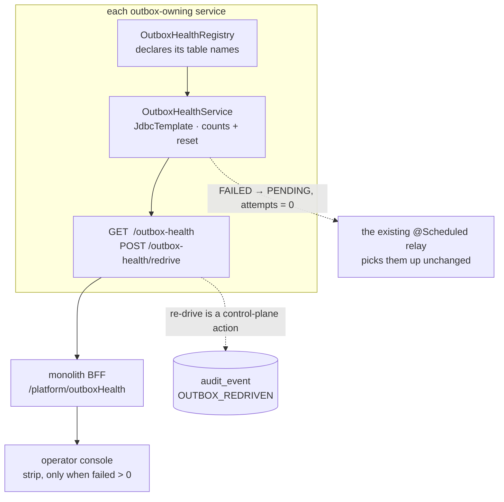

# D-6 — design: nothing may fail silently seven times over

**Status:** BUILT — awaiting the headed Cypress gate. Designed and implemented 2026-09-05.
**Gate:** `cypress/e2e/platform/undelivered-outbox.cy.js` (10 cases), written before the code.
**Analysis:** [`d6-undelivered-outbox-analysis.md`](d6-undelivered-outbox-analysis.md) — read that first; it
holds the measurements and is not repeated here.
**Programme:** [`saas-control-plane-review.md`](../saas-control-plane-review.md) §4b. **Branch:** `feature/pack-loose-selling`.

---

## 1. Rulings taken

From the analysis' §6 recommendations.

| | Question | Ruling |
|---|---|---|
| **D6-1** | Replay the 57? | **Diagnose first** — replay ONE, read the live exception, fix, then replay the rest, all through the control this slice builds so every step is recorded |
| **D6-2** | Count per service or aggregated? | **Per service**, aggregated for display by the console BFF — no service gains a dependency on another |
| **D6-3** | Does the tenant see it? | **Not yet** — a count nobody can act on is noise, and only an operator can re-drive |

### What the trace changed about D6-1

The analysis said the cause of the 29 was unknown. Two further checks, both non-destructive:

* **`GlobalExceptionHandler` stopped echoing `ex.getMessage()`** (common-web, "the detail belongs in the log").
  So the 27 rows of 7 Aug carry a real message and the 29 of 16 Aug carry the generic one **because the
  handler changed, not necessarily because the cause did.** They may be the same `NonUniqueResultException`,
  masked. May — the finance container has restarted since and the logs are gone.
* **No fee has been collected since 16 Aug** (`max(payment_date)` = 2026-08-16, 0 rows after). So the path has
  not been exercised since `V5` removed the duplicates. **Education's GL integration has never once succeeded,
  and has also never been tried since the thing that broke it was fixed.**

That is the strongest possible argument for building the re-drive before deciding anything else: **it is the
diagnostic instrument.** One replay answers a question three rounds of reading the source could not.

---

## 2. The shape, and why it is one component rather than seven

All seven tables share the column contract — verified against `information_schema`, not assumed:

```
status · attempts · last_error · created_at · updated_at · organization_id
```

That is `OutboxEntry`'s contract expressed in SQL, and it is true of every one:

```
myplusdb.audit_outbox            myplusdb_education.audit_outbox
myplusdb.gl_outbox               myplusdb_education.gl_outbox
myplusdb_auth.audit_outbox       myplusdb_education.notify_outbox
myplusdb_catalog.audit_outbox
```

So a single component in `common-outbox` can count and re-drive **any** outbox from a registered table name,
with no per-service repository, no entity change, and no new SPI method on the four existing channels.



**The relay is not touched.** `OutboxRelay.deliver` already skips `POSTED`/`FAILED` and drives `PENDING`; a
re-drive only has to put a row back into the state the relay already understands. Changing the relay to
understand a third state would put retry policy in two places.

---

## 3. What each service exposes

```java
/** Every outbox this service owns. One line per table; the shared service does the rest. */
public interface OutboxHealthRegistry {
    List<String> outboxTables();     // e.g. List.of("audit_outbox", "gl_outbox")
}
```

`GET /api/<svc>/outbox-health` → per table:

```json
{ "table": "gl_outbox", "pending": 0, "failed": 56,
  "oldestFailed": "2026-08-07T15:58:19",
  "reasons": [ { "count": 29, "message": "Something went wrong. Please try again." },
               { "count": 27, "message": "Query did not return a unique result: 2 results were returned" } ] }
```

⭐ **`reasons` is the field that turns a number into a diagnosis.** Fifty-seven failures sharing two distinct
messages is exactly the shape where one fix clears everything — and a bare count of 57 says none of that. The
message is truncated to 200 characters and grouped, so a stack trace cannot flood the payload.

`POST /api/<svc>/outbox-health/redrive` — body `{table, ids?|all:true, reason}`:

* resets `status='PENDING', attempts=0, last_error=NULL` for the named rows;
* **requires a reason**, by the API and not merely by the form (E2's rule);
* is `ROLE_ADMIN`, never `ADMIN_PRIVILEGE` — every tenant owner holds the privilege inside their own org;
* emits `OUTBOX_REDRIVEN` through the audit trail E4 built, against the **subject tenant** where the rows
  carry one.

⚠ **`ids` is bounded and `all` is explicit.** A re-drive with neither is refused rather than defaulting to
everything: the difference between replaying one event to read its exception and replaying 56 into a ledger is
one word, and it must be a word somebody typed.

---

## 4. What the operator sees

A strip on the console's tenant **list** — platform-wide, because an undelivered row is the platform's problem
before it is any one tenant's. Rendered **only when a count is non-zero**; a permanent banner is one people
stop reading.

```
┌──────────────────────────────────────────────────────────────────────────────┐
│ ⚠  65 records have not been delivered.                          [ Details ]  │
│    education · gl_outbox        56   oldest 7 Sept                           │
│    auth · audit_outbox           8                                           │
│    business · gl_outbox          1                                           │
└──────────────────────────────────────────────────────────────────────────────┘
```

Opening **Details** lists the reasons and offers **Re-send** per table, asking for a reason through
`uiPromptConfirm` — never `window.confirm` (the shared-dialog rule).

⭐ **The strip says "records", not "audit records".** The whole finding of the analysis is that this mechanism
drops general-ledger events too; a label naming only audit would have hidden 57 lost postings behind a word.

Amber, not red: these are recoverable, and the platform has one red already (a suspended tenant). Reuses
`.plat-card`, `.plat-badge`, `.plat-seg` — no new visual language, ~30 lines of CSS, ~10 `ui.js.*` keys × 6
bundles.

---

## 5. Files

| File | Change |
|---|---|
| `common-outbox/OutboxHealthRegistry.java` | new — the SPI a service implements with one line |
| `common-outbox/OutboxHealthService.java` | new — `JdbcTemplate` counts + reset over registered tables |
| `common-outbox/OutboxHealthController.java` | new — `GET`/`POST`, `ROLE_ADMIN` |
| `common-outbox/CommonOutboxAutoConfiguration.java` | ⚠ `@Import` the three above, or they register **nothing** |
| `common-outbox/pom.xml` | + `spring-jdbc`, `spring-web`, `common-security` (all `provided`) |
| business / education / auth / catalog | one `OutboxHealthRegistry` bean each, naming its tables |
| monolith `PlatformAdminController` | BFF fan-out across the four services, aggregating |
| monolith `platform.js` / `platform.css` / `messages_*` ×6 | the strip |
| `cypress/e2e/platform/undelivered-outbox.cy.js` | the gate |

⚠ **`common-outbox` currently has no web or JDBC dependency** — it is deliberately tiny (`spring-context`,
`spring-boot-autoconfigure`, `slf4j`, all `provided`). Adding a controller changes that. The alternative is a
per-service controller, which is four copies of one endpoint. **I would add the dependencies**, all `provided`,
since every consumer is a Boot service that already ships them — but it is a real change in that module's
character and worth a word.

⚠ **auth-service and api-gateway extend the ROOT aggregator, not `service-parent`**, so they inherit no
`provided` scopes. auth needs the new deps supplied explicitly — the trap that broke the `common-settings`
addition three times.

---

## 6. Gate — `cypress/e2e/platform/undelivered-outbox.cy.js`

| # | Case | Guards |
|---|---|---|
| 1 | ⭐ A non-zero failed count appears on the console | the whole slice — what was missing on 16 Aug |
| 2 | The strip is **absent** when everything is delivered | a permanent banner is one people stop seeing |
| 3 | ⭐ Re-drive moves a seeded FAILED row to delivered, and the count falls | the round trip, not just the warning |
| 4 | Re-drive **without a reason** is refused | E2's rule, asserted on the envelope |
| 5 | ⭐ Re-drive with neither `ids` nor `all` is refused | §3 — replaying everything must be deliberate |
| 6 | ⭐ The re-drive appears in the audit trail as `PLATFORM_OPERATOR` with the reason | reuses E4 |
| 7 | A tenant owner is refused | `ROLE_ADMIN`, never `ADMIN_PRIVILEGE` |
| 8 | The reasons list groups by message | §3 — the field that makes it a diagnosis |

⚠ **Case 3 SEEDS its own failed row** — it must never operate on the 57. They are real lost accounting, and a
spec that replays them has done the operator's job without the operator (`feedback_fixture_eligibility`:
existence is not eligibility).

⚠ Assert the **envelope**, not the HTTP status, on the proxied writes.

---

## 7. Then, and only then: the 57

With the instrument built, D6-1 executes in order — **as a separate, consented step, not part of this slice**:

1. Re-drive **one** education `FEE_CHARGE`, reason *"diagnosing the 16 Aug failures"*.
2. Read the exception from finance's log — the handler logs it even though it no longer returns it.
3. If it is the masked `NonUniqueResultException`, `V5` has already fixed the cause and the rest will replay
   clean. If it is something else, that is a new defect and gets its own analysis.
4. Re-drive the remainder, and reconcile: 40 `FEE_CHARGE` + 12 `FEE_CREDIT_ISSUED` + 4 `FEE_CREDIT_APPLIED`
   should appear in `journal_entries`, and org 14's AR and 4100 should move by **PKR 137,510** in total.

⚠ Step 4 changes a real ledger. It needs its own go-ahead even after this slice is green.

---

## 8. What could go wrong

* **A re-drive of 56 rows hammers finance.** The relay drives up to 100 pending per pass at a fixed delay, so
  this is bounded already — but a re-drive of *everything* across seven tables at once is worth a size cap.
* **The same rows fail again and dead-letter a second time.** That is the correct outcome, and the reasons
  list is what makes it visible rather than silent. It is also why step 1 above replays exactly one.
* **`OutboxHealthService` writes raw SQL against a table name.** The name comes from a registry bean in the
  service's own code, never from a request — but the endpoint takes a `table` parameter, so it must be
  **validated against the registry** rather than interpolated. A re-drive endpoint that accepts an arbitrary
  table name is an arbitrary `UPDATE`.


---

## 9. What the end-to-end review changed during implementation

### 9.1 ⚠ No single mapping could serve all four services

The design said `/api/<svc>/outbox-health`. Checked against `api-gateway/application.yml` rather than assumed,
and the gateway does **not** treat the four the same:

```
business-service   Path=/api/business/**    StripPrefix=2   → the controller sees  /outbox-health
education-service  Path=/api/education/**   StripPrefix=2   → the controller sees  /outbox-health
catalog-service    Path=/api/catalog/**     no strip        → it sees  /api/catalog/outbox-health
auth-service       Path=/api/auth/**        no strip        → it sees  /api/auth/outbox-health
```

A hard-coded mapping would have 404'd on two of the four — **and a 404 here reads exactly like a bean that
was never registered**, which is the failure this module family has already produced twice. The base path is
now `outbox.health.base-path`, defaulting to empty (right for the stripped majority) with the other two set in
their own config.

### 9.2 The seeder can only serve audit outboxes, and says so

The seven outboxes share their DELIVERY columns but not their payload ones — `audit_outbox` requires `action`,
`gl_outbox` requires `event_type`. There is no insert that satisfies all three, so a "generic" seeder would
compile and fail at runtime on whichever table nobody tried. It refuses non-audit tables explicitly instead,
which is also the right answer for a gate: an audit fixture row moves no money when it is delivered.

### 9.3 The health beans are conditional on the registry

Twelve services carry `common-outbox`; four own an outbox. Registering the endpoint everywhere would put an
`/outbox-health` on the other eight answering an empty list — **which reads exactly like "nothing is failing
here"**, the one sentence this slice exists to stop being said wrongly. `@ConditionalOnBean(OutboxHealthRegistry)`.

### 9.4 Checks that came back clean, and are worth recording

* **`@PreAuthorize` will actually be enforced** — all four services declare `@EnableMethodSecurity`. Without
  it the annotation is silently inert, which is this codebase's signature failure.
* **The C3c classpath trap does not apply.** `common-outbox`'s new deps are `provided` and therefore not
  transitive, so each consumer must supply them itself — business, education and catalog all carry
  `starter-web`, `starter-data-jpa` and `starter-security`, and auth (which extends the root aggregator, not
  `service-parent`) declares all three explicitly.
* **`education.service.url` is 8084**, not the 8082 I first wrote as the BFF default. The property exists so
  the default would never have been used — but a wrong default is a latent bug, and it is now right.

### 9.5 A bug in my own UI code, caught before it shipped

The strip's renderer shadowed the translate function `t` with the table loop variable, so `t('ui.js.oldest')`
would have called a plain object and thrown. Renamed to `tbl`.

### 9.6 Not mine, and not touched: OB-1 is in flight in the same tree

`finance-service/PostingService.java` carries 47 added lines adding `OPENING_AR` / `OPENING_AP` — the opening
balances slice, from another session. It is additive and does not touch the fee path this analysis diagnosed,
so there is no collision. **It also does not fix the 29 undiagnosed failures.**

---

## 10. Still to do

* **The gate has never been run**, and nothing has been compiled.
* **`business-service` and `education-service` have no `OutboxRedriveAudit`** — only auth and catalog got one,
  because they are the two with an audit producer whose API I had already verified. Business has
  `AuditService`, so it can have one; education's `EduAuditService` has a different shape. Until then a
  re-drive on those two services works and is **not** recorded, which is a gap in the same accountability
  argument this slice is built on.
* **The 57 real events are untouched**, deliberately (§7).


---

## 11. First gate run — 6 of 10, and the failure was mine but not the code's

`business-service` answered correctly on the first run:

```json
{"table":"gl_outbox","pending":0,"failed":1,"posted":2928,
 "oldestFailed":"2026-08-16 17:32:56",
 "reasons":[{"count":1,"message":"500 : Something went wrong. Please try again."}]}
```

— the shared component, the registry, the `reasons` grouping and the `ROLE_ADMIN` gate all working, on the
service the spec did not even target.

**catalog and auth returned 500 on every call.** The exception the generic handler logged said it plainly:

```
NoResourceFoundException: No static resource api/catalog/outbox-health
```

No handler registered — so the request fell through to static-resource handling. Not the `@Import` trap, not
`@ConditionalOnBean`, not the classpath: **`config-server` had been running since 14:45 and I edited its
configs at 03:03.** It serves them from its own jar, so `outbox.health.base-path` did not exist for the two
services that need it, and they mapped at the default. Confirmed by asking config-server directly, rather
than inferred.

### ⚠ The fix is not "rebuild config-server"

That would have made the gate pass and left the design wrong. **The base path is a fact about how the service
is ROUTED, not about the environment it runs in** — the same category as `server.port`, which already lives in
each service's own `application.yml`. Centralising it created a deployment coupling where a service could not
start correctly until a *different* artifact was rebuilt, and the symptom was a 404 indistinguishable from an
unregistered bean.

Moved into `catalog-service` and `auth-service`'s own `application.yml`, and **removed from config-server** —
remote config wins over local under Spring Cloud Config, so leaving it in both would have been a silent drift
waiting to happen.

### What this run proved before it failed

* The shared component registers, maps, counts and groups reasons correctly (business).
* `@ConditionalOnBean(OutboxHealthRegistry)` works — business and education have the endpoint.
* The `ROLE_ADMIN` gate is enforced: an unauthenticated probe got 403, an authenticated operator got the data.
* `business.gl_outbox` really does hold **1 dead-lettered SALE** with its reason, exactly as the analysis
  measured from the database.
