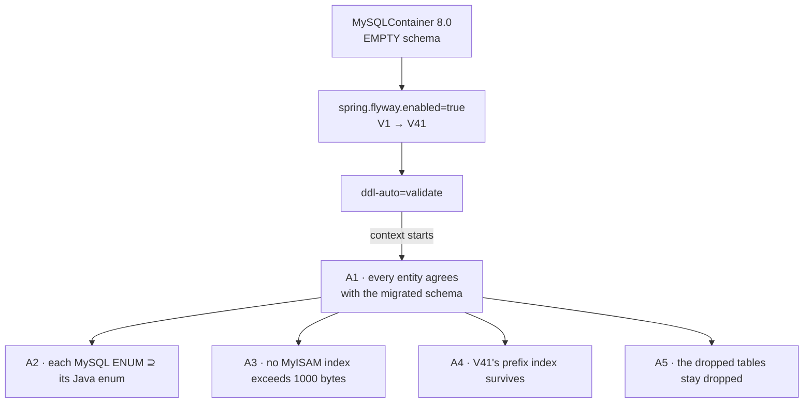

# DB-D2 — business-service: make the migrations run in `mvn test`

*Design gate — no code until this is approved.*

Written 2026-08-20. Governing standard: [SAAS-BUILD-STANDARDS.md](../SAAS-BUILD-STANDARDS.md) **§1b D2**.
Precedents: `marketplace-service/FlywayMigrationTest` · `pharma-service/FlywayMigrationTest`.

---

## 1. Why now

Standard **D2** requires at least one test per service to boot with `flyway.enabled=true` and
`ddl-auto=validate` against an **empty** database:

> *Testing against a Hibernate-invented schema proves the code and nothing about the deploy.*

business-service does not meet it, and slice I1 paid for that on 2026-08-19. **V41 shipped with an index MySQL
refuses to create** — `(organization_id, contact)` is 1028 bytes against MyISAM's 1000-byte limit. The failure
surfaced as:

```
Cypress:        "downstream token still valid (GenericResponse)"   ← reads like an auth bug
monolith:       200 {"status":"ERROR"}                             ← proxy swallowing a downstream failure
business-svc:   crash-looping
actual cause:   V41 → ERROR 1071, max key length is 1000 bytes
```

Four layers, in a headed browser, on a gate run. This test would have produced *"Script V41 failed: ERROR
1071"* in the build, in seconds, next to the line that caused it.

**This is the third service to learn it the same way.** pharma's V2 rebase and V3 rename had never run in CI;
marketplace's three `fulfilment_status` widenings had never run in CI; now business-service's V41.

---

## 2. Verified state (read 2026-08-20, measured not assumed)

The question that decides whether this is a one-file slice or a month is: **would the migrations actually
produce a schema every entity agrees with?** Four checks, all run against the live database and the source.

| Check | Method | Result |
|---|---|---|
| **Column drift** — anything `ddl-auto: update` created that no migration creates | 350 columns across the 25 entity-mapped tables, each looked up in the full migration corpus | ✅ **ZERO missing** |
| **Entities the drift scan could have missed** | every `@Entity` without an explicit `@Table` | ✅ none — all 25 mapped explicitly, so the scan was complete |
| **Cross-database references** — would break on a fresh container where no sibling schema exists | grep for `myplusdb_*.` / `catalog.` / `inventory.` in all 41 migrations | ✅ none |
| **Native MySQL `ENUM` vs its Java enum** — the `ALTER … MODIFY` trap | 4 enum columns compared constant-by-constant | ✅ all four match **today** |

```
cash_movement.type   enum('DROP','PAY_IN','PAY_OUT')                    == MovementType
cashier_shift.status enum('CLOSED','OPEN')                              == ShiftStatus
payment.method       enum('BANK_TRANSFER','CARD','CASH','CREDIT',
                          'INSURANCE','REFUND','STORE_CREDIT','WALLET') == PaymentMethod
tax_setting.tax_mode enum('EXCLUSIVE','INCLUSIVE')                      == TaxMode
```

**So this slice is low-risk and finds no bug today.** Said plainly rather than oversold: it is a **tripwire**,
not a repair. The value is entirely in what it stops arriving next.

### 2.1 D2 is unmet, confirmed

18 test classes in business-service. **Only 3 touch a database, and all 3 disable Flyway** (`flyway.enabled=false`
+ `ddl-auto=create-drop`). So all 41 migrations are unexercised by `mvn test` — exactly the marketplace finding,
one service over.

### 2.2 The fresh-install path is the one nobody runs

```yaml
flyway:
  baseline-on-migrate: true
  baseline-version: 1
```

`baselineOnMigrate` fires only against a **non-empty** schema with no history table — the adoption case, where
it marks V1 as already-applied and skips it. Against an **empty** schema Flyway baselines nothing and runs
**V1 → V41 in order**.

That asymmetry is the point. Every existing database took the adoption path; **a customer's first install
takes the other one**, and nothing on this platform has ever executed it. V1 is a 67-table `mysqldump`
baseline that has, as far as `mvn test` is concerned, never been run.

### 2.3 Testcontainers is already a dependency

`org.testcontainers:mysql` and `:junit-jupiter` are already on business-service's pom. **No pom change.**

---

## 3. Design — what it asserts, and why each one earns its place

A test that only proves "migrate did not throw" is worth having, but it is worth more if it pins the specific
things this service has actually got wrong.



| # | Assertion | Why it is here rather than assumed |
|---|---|---|
| **A1** | **The context starts at all**, with `flyway.enabled=true` and `ddl-auto=validate` | The load-bearing one, and it is free: `validate` makes Hibernate check all 25 entities against the migrated schema. A migration that fails, or a column a migration forgot, fails the build. This alone would have caught V41 |
| **A2** | Each native `ENUM` column covers **every constant of its Java enum**, derived FROM the Java enum by reflection | A new constant with no `ALTER … MODIFY` behind it fails at runtime with *"Data truncated"*, never at compile time. Derived from the enum so it cannot go stale — writing the values out by hand would need editing at exactly the moment someone forgets to |
| **A3** | **No index on a MyISAM table exceeds 1000 bytes**, computed from `information_schema` | Earned directly by V41. Generalised deliberately: it guards **every future index on any of the 67 MyISAM tables**, not just the one that bit. This is the assertion I most want, because it turns a defect into a rule |
| **A4** | `idx_customer_org_contact` exists **with `sub_part = 64`** | The prefix is load-bearing and looks like an accident. A later reader "tidying" it away gets a red build instead of a crash-looping service |
| **A5** | `item`, `item_catalog_map` and `stock` do **not** exist | V7/V8 dropped them. Proves the drop chain ran, and catches a future entity quietly resurrecting a table the Item→Product convergence removed |

### 3.1 What it deliberately does NOT do

* **No assertion per migration.** 41 restatements of the SQL would be a second copy of the schema to keep in
  step, and would fail for edits that are perfectly correct. `validate` covers the general case; A2–A5 cover
  the four specific ways this service has been bitten.
* **No data assertions.** V5/V6/V29/V36 are backfills, and on an empty database they correctly touch nothing.
  Asserting on rows would mean seeding rows, which tests the seed rather than the migration.
* **It does not convert anything to InnoDB.** MyISAM remains a real problem — no transactions on `customer`,
  `sell`, `purchase` — and A3 makes its sharpest edge safe without pretending to fix it. §9.3 of the I1 doc
  still stands: that conversion is its own slice.

---

## 4. Cost, honestly

The test starts a MySQL container and runs 41 migrations, so it adds **roughly 30–60 s** to
`mvn -pl business-service test`. Mitigated the same way marketplace does it:
`@Testcontainers(disabledWithoutDocker = true)` — it skips where Docker is absent rather than reddening the
build.

**One consequence to accept:** this is the first time V1's 67-table baseline will execute anywhere. If it has
a latent defect, this test is where it surfaces — and the honest framing is that finding it is the point, not
a setback. The four checks in §2 say the odds are low.

---

## 5. Test plan

The test **is** the deliverable, so the plan is its gate:

```
mvn -pl business-service test          # must include FlywayMigrationTest, and it must RUN (not skip)
```

⚠ Confirm it did not silently skip. `disabledWithoutDocker` means an absent Docker daemon turns this into a
green no-op — a skipped tripwire is indistinguishable from a passing one in the summary line. Docker is
currently up on this machine, so it should run.

**Then a deliberate red, to prove the tripwire is live** — the D2 lesson that *an absence assertion is not
evidence until the mechanism is shown to work*: temporarily add a constant to `MovementType` without touching
the migration, confirm A2 fails, and revert. Recommended once, by hand, not committed.

No Cypress. This slice adds no behaviour and no endpoint.

---

## 6. BUILT 2026-08-20 — one file, no pom change

`business-service/src/test/java/com/myplus/business_service/FlywayMigrationTest.java` — 6 cases implementing
A1–A5. Nothing else changed: Testcontainers was already a dependency, and the test overrides Flyway/ddl-auto
through `@DynamicPropertySource` rather than touching any config file.

### 6.1 A1 departs from the marketplace precedent — no exact version list

marketplace asserts `containsExactly("1"…"17")`. **Not copied**, deliberately. At 41 migrations and growing,
a hardcoded list is a second copy of the migration directory that whoever adds a migration must edit — so it
fails for the *correct* change exactly as readily as the incorrect one, and its failure message says nothing
about what is wrong. Replaced by two assertions that hold for any count: **no row has `success = 0`**, and at
least 41 applied.

### 6.2 A3's byte count is an ESTIMATE, and it errs high — verified against the live schema

Run without its `HAVING` against `myplusdb`, the query reports:

```
idx_customer_org_contact          275        ← 19 + 64×4
idx_customer_org_type              83
idx_customer_org_credit_account    38
PRIMARY                            19
```

275, not the 264 the arithmetic in V41's own comment gives. The difference is that `information_schema` has no
storage width for a numeric column, so `NUMERIC_PRECISION` stands in — and that counts **digits**: a `bigint`
scores 19 where it occupies 8. Character columns are exact.

**Erring high is the right direction** — the guard can warn early but cannot miss a real violation. The
overstatement is ~11 bytes per numeric column against a 1000-byte budget, so it only bites an index already
within a hair of the limit, which wants reconsidering regardless. Written into the test's javadoc so a future
failure is diagnosable rather than mysterious.

*Why this was checked at all:* an assertion of the form "this list is empty" passes just as cheerfully when
the query is broken as when the schema is clean. Running it without the `HAVING` first is the positive control
that proves the mechanism is live — the rule this programme adopted after a D2 anti-IDOR case went green
against a 404.

---

## 7. After this

`⬜` **10 services still have no Flyway test** (only pharma, marketplace, and — with this — business). The other
nine are the same file with a different set of A2–A5 assertions, and are worth doing as one sweep rather than
one at a time.

---

## 8. RUN 1 — the test "passed" and executed NOTHING. And so do the other two.

`mvn -pl business-service test` reported success. The surefire report says:

```
Tests run: 6, Failures: 0, Errors: 0, Skipped: 6
<skipped message="disabledWithoutDocker is true and Docker is not available"/>
```

**All six skipped.** Exactly the failure mode §5 warned about — `disabledWithoutDocker` turns an unreachable
daemon into a green no-op, and the summary line is indistinguishable from a real pass. The warning was
written and the trap was still walked into, which is the honest record: *a skipped tripwire and a passing one
look identical unless you read the count.*

### 8.1 It is not my test — all three Flyway tests skip on this machine

| Service | Local result |
|---|---|
| business-service | `Tests run: 6 … Skipped: 6` |
| marketplace-service | `Tests run: 6 … Skipped: 6` |
| pharma-service | `Tests run: 6 … Skipped: 6` |

**Three services satisfy D2 on paper and none of them executes locally.** The tests written in response to
*"pharma's V2 rebase had never run in CI"* have themselves never run here.

### 8.2 Root cause — a Docker context mismatch, nothing to do with the code

```
$ docker context ls
default           npipe:////./pipe/docker_engine
desktop-linux *   npipe:////./pipe/dockerDesktopLinuxEngine     ← active

$ cat ~/.testcontainers.properties
docker.client.strategy=org.testcontainers.dockerclient.NpipeSocketClientProviderStrategy
```

Testcontainers is **pinned** to the npipe strategy, which probes the *default* pipe
`//./pipe/docker_engine`. Docker Desktop serves `//./pipe/dockerDesktopLinuxEngine`. The CLI works because it
follows the active context; Testcontainers does not, finds nothing, and reports "Docker is not available".

`DOCKER_HOST` is unset, so nothing overrides the wrong guess.

### 8.3 CI is not affected — which is why this survived unnoticed

`.github/workflows/microservice-tests.yml` runs `mvn -B test` on **`ubuntu-latest`**, whose runners ship
Docker, and its own header says *"the @Testcontainers tests execute here"*. So **D2 is genuinely met in CI**
and has been all along.

The gap is local, and it matters because this platform's working habit is to gate locally before pushing: a
developer running `mvn test` on Windows gets a green summary that proves nothing about any migration. That is
how V41 reached a headed browser.

### 8.4 The fix is one line of MACHINE config, not repo code

Either of:

```properties
# ~/.testcontainers.properties   (add; the pinned strategy line may also simply be deleted)
docker.host=npipe:////./pipe/dockerDesktopLinuxEngine
```

```bash
# or, per shell
export DOCKER_HOST=npipe:////./pipe/dockerDesktopLinuxEngine
```

Deliberately **not applied**: `~/.testcontainers.properties` is the developer's home directory, not this
repository, and changing a machine's Docker wiring is the owner's call.

### 8.5 What this does NOT change

`disabledWithoutDocker = true` **stays**. Removing it would redden the build on any machine without Docker,
which is worse than skipping. The lesson is not to drop the guard but to **read the skip count** — the same
shape as this programme's standing rule that an absence assertion proves nothing until the mechanism is shown
live.

**Status: the test is written and committed-ready, but UNPROVEN.** Until it runs once — locally with the
config above, or on the next CI push — the assertions in §3 are untested code.

---

## 9. FIXED 2026-08-20 — Testcontainers now points at the right pipe

### 9.1 The skip was wider than the Flyway test

A full `mvn -pl business-service test` gave `Tests run: 134, Failures: 0, Skipped: 13`, and **all 13 carried
the identical message**. Every Testcontainers test in the module:

| Class | Skipped | What was not being verified |
|---|---|---|
| `FlywayMigrationTest` | 6 | the 41 migrations on an empty DB |
| `SellInvoiceMoneyRepoTest` | 5 | **invoice money arithmetic** |
| `AddSellAtomicityTest` | 1 | **atomicity of the sale write** |
| `CustomerRepoScopingTest` | 1 | **multi-tenant scoping** |

121 of 134 tests were real. The 13 covering the riskiest ground were the ones that vanished — and had been
vanishing long before this slice existed.

### 9.2 The fix, and why the obvious version of it would not have worked

`~/.testcontainers.properties` previously held **only** a pinned strategy:

```properties
docker.client.strategy=org.testcontainers.dockerclient.NpipeSocketClientProviderStrategy
```

The tempting fix is to add `docker.host` beside it. **That would have changed nothing**: Testcontainers uses a
pinned strategy *exclusively*, and `NpipeSocketClientProviderStrategy` hardcodes `//./pipe/docker_engine`, so
`docker.host` is never consulted. The pin had to be **removed**, not supplemented.

Now:

```properties
docker.host=npipe:////./pipe/dockerDesktopLinuxEngine
```

which matches `docker context ls` exactly (`desktop-linux *`). The previous file is backed up alongside it.

### 9.3 Written into the governing standard as **D2a**

`SAAS-BUILD-STANDARDS.md` §1b now carries the rule and the incident, next to the D2 it undermines: *a skipped
Testcontainers test is indistinguishable from a passing one — read the Skipped count.* Recorded there rather
than only here, because the failure is platform-wide and the next person to meet it will not be reading this
slice.

### 9.4 Still unproven

The config is corrected but **the test has still never executed**. Until a run reports `Skipped: 0`, every
assertion in §3 remains untested code, and §4's warning stands: this will be the first time V1's 67-table
baseline has run anywhere.

---

## 10. CORRECTION 2026-08-20 — the root cause was the API VERSION, not the pipe

§8.2 and §9.2 blamed a named-pipe / Docker-context mismatch. **That was wrong.** Recorded rather than quietly
edited, because the wrong explanation was persuasive and someone will otherwise re-derive it.

**What the second run showed.** After the strategy pin was removed, `EnvironmentAndSystemPropertyClientProviderStrategy`
was tried for the first time — progress — and *both* strategies then failed identically:

```
BadRequestException (Status 400: {"ID":"","Containers":0,…,"ServerVersion":"",
   "Labels":["com.docker.desktop.address=npipe://\.\pipe\docker_cli"]})
```

Two different pipes, one identical stub response. That symmetry was the tell: the transport was fine and the
*request* was being rejected.

**Measured, not reasoned:**

| Probe | Result |
|---|---|
| `DOCKER_HOST=npipe:////./pipe/docker_engine docker version` | ✓ 29.7.2, api 1.55 |
| `…/dockerDesktopLinuxEngine` | ✓ 29.7.2 |
| `…/docker_engine_linux` | ✓ 29.7.2 |
| `…/docker_cli` | ✗ |
| `DOCKER_API_VERSION=1.32 docker version` | **✗ FAILS** |
| `DOCKER_API_VERSION=1.40` (and 1.41/1.43/1.44/1.47) | ✓ |

**The default pipe worked all along.** Docker Engine 29.7.2 advertises *"API version 1.55 (minimum version
1.40)"*, and docker-java as bundled in Testcontainers 1.21.0 falls back to **1.32** — below the minimum — so
the daemon returns 400 and Testcontainers declares the environment unavailable.

**Fix:** `api.version=1.41` in `~/.testcontainers.properties`.

### 10.1 Two lessons worth more than the fix

**`docker ps` working proves nothing about Testcontainers.** The CLI negotiates its API version; docker-java
did not. Every earlier check in §8 confirmed the daemon was up and healthy, and all of them were beside the
point.

**Upgrading the Docker engine can silently disable every container test on a machine.** No configuration
changed and no test changed — the engine's minimum API rose past the client's fallback, and 13 tests began
reporting as skipped inside a green build. Written into the standard as **D2a** so the next person meets it as
a documented failure rather than a mystery.

### 10.2 Also from this run — the unit half of I1 is confirmed

`CustomerImportSpecTest` **19 tests, 0 failures**, and `CsvWriterTest` 7 — so the slice's unit tests compile
and pass, closing the open item from I1 §14.1. 121 of the 134 tests are genuinely executing; the 13 are the
Testcontainers set the fix above targets.

*(The stack trace visible in that run under `a_failing_party_bridge_does_not_fail_the_import` is the test
working: it injects a failing bridge and asserts the import still commits. `CustomerImportSpec` logs the
failure at WARN with its stack, deliberately — a real party-service outage should be diagnosable.)*

---

## 11. STATUS — built, config fixed, **verification deferred by decision (2026-08-20)**

The `api.version=1.41` fix is applied but the re-run was **skipped by the user's call**, so:

* `FlywayMigrationTest` has **still never executed**. Its five assertion groups remain untested code.
* The same is true of `SellInvoiceMoneyRepoTest` (5), `AddSellAtomicityTest` (1) and
  `CustomerRepoScopingTest` (1) — all pre-existing, none of them this slice's doing.
* **CI will run them on the next push** (`ubuntu-latest`, Docker present), which is where D2 was already
  being met. So this is a deferred local verification, not an unguarded gap.

**The one thing to expect:** the first CI run after this lands is the first time V1's 67-table baseline has
executed anywhere. A failure there is the tripwire working, not a regression.
