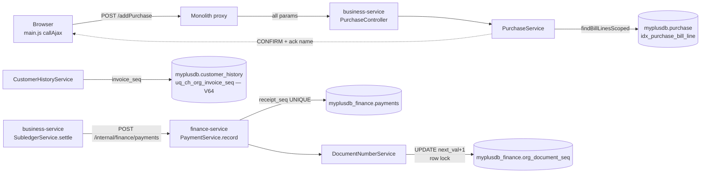
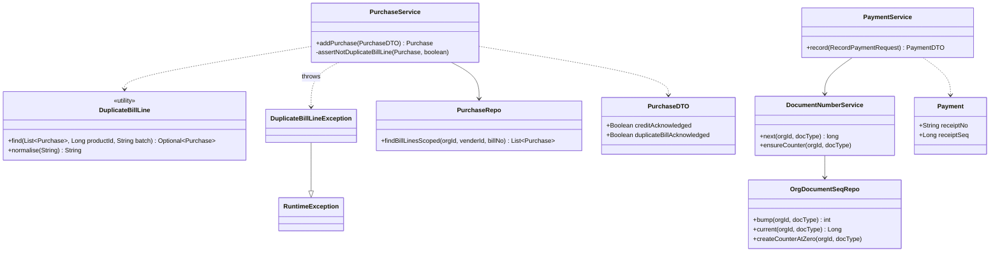
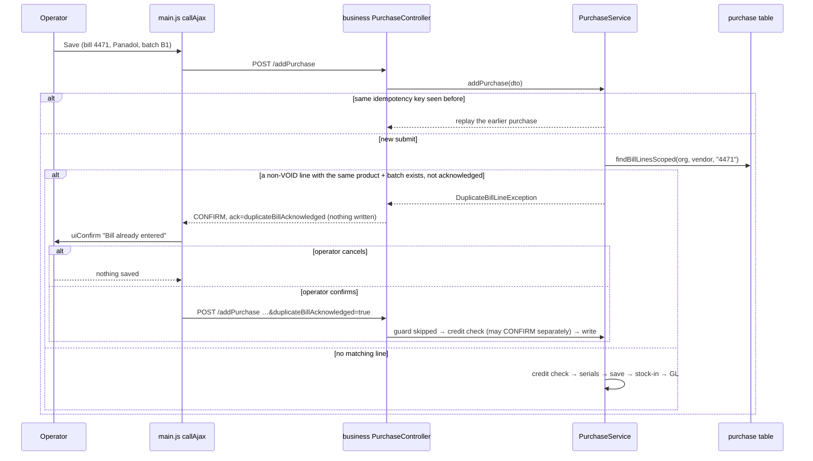

# DOC-INT — document-number integrity: invoice series, receipt numbers, duplicate supplier bill lines

**Status:** design + implementation in progress (2026-09-14). Origin: `blocking-ui-and-backend-guards-design.md`
§9.5, "Smaller items". User ruling on C (2026-09-14): *same product → refuse with confirm*.
Gate: `cypress/e2e/business/document-number-integrity.cy.js` (written BEFORE the code).

---

## 1. Document

Four items were raised. Tracing them end to end changed two of them.

| # | Raised as | What the trace found | Verdict |
|---|---|---|---|
| A | invoice-number UNIQUE is not in any migration | ✅ true. `uq_ch_org_invoice_seq` exists only through `@Table` on `CustomerHistory` + `ddl-auto: update`. No Flyway migration creates it; `FlywayMigrationTest` runs `ddl-auto: validate`, so **a fresh install has no arbiter**. `DocumentNumberService` / `SequenceRetry` both rely on it to refuse a second invoice with the same number. Local DB: the index exists (Hibernate-made), **0** duplicate groups. | fix |
| B | finance receipt numbers are `count + 1`, no UNIQUE | ✅ true, and **already observed**: local `myplusdb_finance.payments` holds **2 duplicate (org, receipt_no) groups — 4 rows of 314**, across 5 orgs. Also 2 DISBURSEMENT rows carry a legacy `RCPT-` prefix (from before `PV-` existed). | fix |
| C | one supplier bill can be entered twice → UNIQUE(vendor, bill no) | ⚠ **the proposed fix was wrong.** A bill is SEVERAL `purchase` rows — "Add another" keeps vendor + bill # + date and clears only the line (`business.js` `afterSavePurchase`). Local data has real multi-line bills (3 multi-row bills: 1 multi-product, 1 same product repeated). A UNIQUE on (vendor, bill no) would refuse every second line. | redesigned — ruling above |
| D | welfare delete uses a native `confirm()` | ❌ **false.** `welfare.js:48` sits inside a `/* … */` block (lines 15–57) — dead code. The live delete is `main.js` `performBulkDelete` behind `uiConfirm`, and `fragments/header.html:123` loads `confirm-dialog.js` on the welfare dashboard. | withdrawn |

### The C refinement — batch

The ruling is "same vendor + bill # + product". One refinement, stated so it can be challenged: **a line
with a different BATCH is not a duplicate.** A pharmacy routinely receives one product in two lots on one
bill (different expiry), and inventory keys stock on batch + expiry. So the match is
vendor + bill # + product + batch, where blank batch equals blank batch.

### Found while tracing, NOT fixed here

- ⚠ **`customer_history` and `purchase` are MyISAM** in the local `myplusdb` (verified via
  `information_schema.TABLES`). MyISAM has no transactions: a `@Transactional` rollback does not undo a
  write to either table. That undercuts every "rolls back atomically" claim on the sale and purchase paths,
  including `IdempotencyService`'s concurrent-racer javadoc. Unverified for production. Its own slice.

---

## 1b. Standards this slice is built to

| Dimension | What applies here | Where it shows up |
|---|---|---|
| **Business / domain** | **A document number is unique within its series per tenant** — a tax receipt or invoice number issued twice cannot be reconciled or audited. **Duplicate supplier-invoice detection** is a standard AP control (SAP "duplicate invoice check", QuickBooks/Xero warn on a reused vendor bill number): warn and let a person decide, because the rare legitimate repeat exists. | A, B · C |
| **SaaS multi-tenancy** | Every key and counter is per organisation. The bill-line lookup is scoped by org + vendor; nothing reads across tenants. Finance refuses a missing org (BLK-0a), and the allocator refuses one too. | A, B, C |
| **Live-modules rule** | Additive only. Legacy receipts keep their printed numbers (`receipt_seq` stays NULL on them); counters are seeded from the highest number issued and **raise, never lower** (the V63 rule). The bill guard runs only on NEW lines, never on edits; a blank bill # is not checked. | B, C |
| **Microservice boundaries** | Database per service: finance gets its OWN `org_document_seq` table in `myplusdb_finance`; nothing reads business's counter. No new service — numbering owns no lifecycle or external integration. | B |
| **Design patterns** | **Number range / counter table with a pessimistic row lock** (SAP number ranges, Odoo `ir.sequence`) — the shape business V45 already uses. **Two-phase submit with an explicit acknowledgement** (the B2B-P1 credit-limit `CONFIRM` envelope) for C. **Narrow query, decide in code** for C: the DB finds the bill's lines, pure Java decides "same line", so the rule is unit-testable without a database. | B, C |
| **SOLID / DRY** | ONE `CONFIRM` branch in `main.js`, made generic (the server names the flag to acknowledge) instead of a second branch for a second prompt. ⚠ The finance allocator is a deliberate COPY of business's `DocumentNumberService` (≈40 lines of lock ordering): extracting it to a library means changing business's gated allocator in a slice about finance. Recorded as a follow-up, not hidden. | C · B |
| **Testing standard** | `mvn test`: Flyway test in `validate` mode asserts both business indexes after a migrate-from-nothing (**red today** — Hibernate cannot supply the index under validate); finance migration test seeds legacy duplicates at V6 then migrates V7; allocator concurrency test on real MySQL; guard matcher unit tests. Cypress gate asserts the regressions: a multi-line bill still saves, a different batch saves, a blank bill # saves, and a duplicate-bill confirm does **not** acknowledge a credit-limit breach. | all |

---

## 2. Design

### A — invoice series UNIQUE, owned by Flyway

`business-service` `V64__document_integrity_indexes.sql`, section 1:

- Create `uq_ch_org_invoice_seq UNIQUE (organization_id, invoice_seq)` **unless a UNIQUE index already
  covers exactly those two columns** (checked by columns, not name — V2 notes index names vary per env).
- **Fails loudly on duplicate data.** If an environment holds two invoices with one number, the `CREATE`
  stops with `Duplicate entry '<org>-<seq>'`, naming the tenant and number. A silent skip would leave the
  arbiter missing exactly where it is needed. Runbook in `docs/migrations.md` #10.
- MyISAM key: 8 + 8 bytes — far under the 1000-byte limit.
- `@Table` on `CustomerHistory` is unchanged (same name, so Hibernate `update` sees it as present).

### B — finance receipt numbers from a counter

`finance-service` `V7__receipt_number_series.sql`:

1. `org_document_seq (organization_id, doc_type, next_val, updated)` — same shape as business V45, in
   finance's own database.
2. `payments.receipt_seq BIGINT NULL` + `UNIQUE uq_pay_org_dir_seq (organization_id, direction, receipt_seq)`.
   Legacy rows stay NULL (MySQL NULLs are distinct), so the UNIQUE applies from the first new receipt on.
   **Why not UNIQUE on `receipt_no`:** 2 duplicate groups already exist; making it unique means renumbering
   receipts already printed and handed to customers.
3. Seed the counters from what was actually issued, per org:
   - `RECEIPT` ← MAX number of `RCPT-######` over **every** direction (the 2 legacy disbursements share the
     `RCPT-` string space, so a new `RCPT-` number must clear them too)
   - `DISBURSEMENT` ← MAX number of `PV-######`
   - `INSERT … ON DUPLICATE KEY UPDATE next_val = GREATEST(next_val, VALUES(next_val))` — re-runnable, never
     lowers.

Code:

- `OrgDocumentSeq` / `OrgDocumentSeqId` / `OrgDocumentSeqRepo` / `DocumentNumberService` in finance — the
  business allocator's shape: non-locking existence read → `ensureCounter` in its own committed transaction
  → `UPDATE … next_val + 1` (the row lock) → read back. `MANDATORY` propagation: the bump joins
  `record()`'s transaction, so a failed receipt gives its number back (gapless).
- `Payment.receiptSeq`. `PaymentService.record` allocates **late** — immediately before the insert, after
  the request is validated — and formats `RCPT-%06d` / `PV-%06d` from it. The lock is held through the
  local GL post, never across a network call.
- `PaymentRepository.countByDirectionScoped` is removed (its only caller was `nextReceiptNo`).

⚠ **Deploy:** a single finance instance must stop before the new one starts. An OLD instance still
numbering by `count + 1` alongside a new one could issue a string that collides with a counter number.

### C — duplicate supplier bill line: refuse, with confirm

| | |
|---|---|
| Endpoint | `POST /addPurchase` (monolith → business). **Create only.** `updatePurchase` edits an existing row and is not checked. |
| Match | same org + vendor + bill # (trimmed; DB collation is case-insensitive) + product + batch (trimmed, case-insensitive, blank = blank), existing row **not VOID** |
| Skipped when | bill # blank · vendor or product missing · `duplicateBillAcknowledged=true` |
| Refusal | `200 {"status":"CONFIRM","message":"Bill 4471 from ACME already has this product (batch B1) — saved 12-09-2026, qty 10. Save this line again?","object":{"ack":"duplicateBillAcknowledged"}}`. **Nothing written, no stock in.** |
| Order in `addPurchase` | idempotency replay (a same-key retry replays, never prompts) → **bill-line guard** → credit-limit guard → serial check → write |
| Stored bill # | trimmed on the new row, so `" 4471"` and `"4471"` are one bill |

Client — `main.js` `callAjax`, `status === "CONFIRM"` branch only (no change to the ajax settings BLK-1
depends on):

```js
var ack = (data.object && data.object.ack) || 'creditAcknowledged';   // server names the flag
uiConfirm({ title: ack === 'duplicateBillAcknowledged' ? t('ui.js.duplicateBillTitle') : t('ui.js.creditLimitTitle'), … })
  → callAjax(method, dataSent + '&' + ack + '=true')
```

⚠ Why the server names the flag: reusing `creditAcknowledged` for the bill prompt would make confirming a
duplicate bill **silently acknowledge a credit-limit breach** on the resubmit. Separate flags keep each
decision separate; the second prompt still appears after the first is accepted.

Callers checked (RULE 0): `addPurchase` has one server caller (business `PurchaseController`) and one proxy
(monolith `PurchaseController`, forwards every parameter, so the flag survives the hop). Opening-balance
supplier rows are written by `OpeningBalanceService` directly, not through `addPurchase`. Business CSV import
has no purchase entity. Cypress specs scanned for a repeated bill + product + batch on `addPurchase`: none
(`product-crud` re-uses a bill only through `updatePurchase`; `purchase-rapid-entry` bills three different
products).

Index: `V64` section 2, `idx_purchase_bill_line (organization_id, vender_id, purchase_invoice_no(64))` —
non-unique; 8 + 8 + 64×4 = 272 bytes, under MyISAM's 1000.

---

## 3. Architecture & UML

### Architecture



### Class diagram



### Sequence — C, a re-keyed bill line



---

## 4. Implement

**Coded 2026-09-14.** This session does not build; the user runs `mvn test` and the gate.

**Verification status (re-checked 2026-09-14, after the 09:48–09:49 build this session did not run):**
- ✅ **Main code compiles** — the 09:49 business, finance and monolith jars contain `DuplicateBillLine*`,
  `OrgDocumentSeq*`, `DocumentNumberService`, V64, V7, the new `main.js` branch and `ui.js.duplicateBillTitle`.
- ❌ **No test has run** — neither service has a `target/surefire-reports` directory, so that build skipped tests.
  Test sources are therefore not even proven to compile.
- ✅ **LIVE on the Docker stack** (verified read-only from container logs by peer session myplus-e6; deploy not
  run by this session): images rebuilt 10:04–10:05 and containers recreated (old finance never ran beside the
  new one). finance Flyway 6 → **V7 applied** (0.32 s); business 63 → **V64 applied** (0.19 s); all three
  healthy, 0 restarts, no `FlywayException` / `Duplicate entry` / `APPLICATION FAILED`. ⇒ **V64's UNIQUE created
  cleanly, so the live `customer_history` holds no duplicate invoice numbers.**
- ⚠ **The V7 rollback rule now applies:** do not roll back only the finance jar (`docs/migrations.md` #10).
- ❓ Still unverified: `mvn test`, the Cypress gate, the live counter seed values and whether the live ledger has
  duplicate receipt numbers (the Docker DB is not reachable from the host — see below).
- ⚠ **Caveat on every "local DB" figure in §1** (the 2 duplicate receipt groups, 0 duplicate invoices, MyISAM,
  multi-row bills): host port 3306 is the **Windows MySQL service** (`C:\ProgramData\MySQL\MySQL Server 8.0`,
  listening on 0.0.0.0:3306), an old development database at business **V37** / finance **V4** — **not** the
  Docker `myplus-mysql` (also published on 127.0.0.1:3306, but shadowed by the Windows service). Those figures
  are evidence from that dev database, not measurements of the running system.
- The working tree is one cosmetic line ahead of the deployed monolith: a redundant second argument to `t()`
  removed (it fills `{0}`, it is not a fallback; the title has no placeholder, so behaviour is identical).

- [x] Cypress gate written first — `document-number-integrity.cy.js`
- [x] A — `V64__document_integrity_indexes.sql` §1 (invoice UNIQUE)
- [x] A — `FlywayMigrationTest`: invoice UNIQUE exists after migrate-from-nothing
- [x] C — `V64` §2 `idx_purchase_bill_line` + Flyway test assertion
- [x] C — `PurchaseDTO.duplicateBillAcknowledged`
- [x] C — `PurchaseRepo.findBillLinesScoped`
- [x] C — `DuplicateBillLine` matcher + `DuplicateBillLineException`
- [x] C — `PurchaseService` guard + trimmed bill #; `PurchaseController` → `CONFIRM` with `ack`
- [x] C — `main.js` CONFIRM branch reads `ack`; `ui.js.duplicateBillTitle` in 6 locales
- [x] C — unit tests `DuplicateBillLineTest`
- [x] B — `V7__receipt_number_series.sql` (written after the peer finance rebuild finished, V1–V6 only)
- [x] B — `OrgDocumentSeq`, `OrgDocumentSeqId`, `OrgDocumentSeqRepo`, `DocumentNumberService` in finance
- [x] B — `Payment.receiptSeq`; `PaymentService.record` allocates late; `countByDirectionScoped` removed
- [x] B — tests: `PaymentServiceNumberingTest`, `ReceiptSeqMigrationTest`, `ReceiptNumberConcurrencyTest`;
      `PaymentServiceReliabilityTest` updated for the new constructor
- [x] `docs/migrations.md` #10; design doc §9.5 status
- [x] Found on the way, fixed in the same block: both `main.js` CONFIRM prompts passed `okText`, which
      `confirm-dialog.js` never reads — the button said "Confirm" and "Continue anyway" never showed
- [ ] `mvn test` green (business + finance) — user
- [ ] Cypress gate green, headed — user
- [ ] Manual cases (after green), then commit — ask first

## 5. Test

`mvn test` (Testcontainers cases skip without Docker — read the SKIP count):

| Test | Asserts | Red before the fix? |
|---|---|---|
| business `FlywayMigrationTest` — invoice series | UNIQUE on exactly (organization_id, invoice_seq) after migrate-from-nothing under `validate` | ✅ red — no migration creates it |
| business `FlywayMigrationTest` — bill-line index | `idx_purchase_bill_line` exists | ✅ red |
| `DuplicateBillLineTest` | same product+batch → match; different batch → none; blank = blank; case/space-insensitive batch; VOID ignored; different product → none | ✅ (class absent) |
| finance `PaymentServiceNumberingTest` | RECEIPT → `RCPT-%06d` from the allocator; DISBURSEMENT → `PV-`; `receiptSeq` stamped | ✅ |
| finance `ReceiptSeqMigrationTest` | migrate to V6, insert legacy `RCPT-000007` ×2 + a `RCPT-` disbursement + `PV-000003`, migrate V7 → RECEIPT counter 7, DISBURSEMENT 3; legacy rows untouched | ✅ |
| finance `ReceiptNumberConcurrencyTest` | 12 threads × 1 receipt, one org → 12 DISTINCT numbers | ✅ (`count + 1` races) |

Cypress (headed): `npx cypress run --headed --browser chrome --spec cypress/e2e/business/document-number-integrity.cy.js`

1. ⭐ the same bill + product posted twice → second answers `CONFIRM` naming the bill; still **one** row
2. ⭐ resubmitted with `duplicateBillAcknowledged=true` → saved; **two** rows
3. REGRESSION — same bill, different product → `SUCCESS` without a prompt (multi-line bills)
4. REGRESSION — same bill + product, different batch → `SUCCESS` without a prompt
5. REGRESSION — blank bill # twice → both `SUCCESS`
6. REGRESSION — a same-key retry replays (`SUCCESS`, one row), it does not prompt
7. ⭐ UI — the purchase form shows the "Bill already entered" dialog; confirming posts
   `duplicateBillAcknowledged=true` and **not** `creditAcknowledged`
8. ⭐ concurrent receipts — 6 parallel `receivePayment` (`dedupe:false`) → 6 DISTINCT receipt numbers
